# R 中的混合模型介绍

> 原文：<https://medium.com/mlearning-ai/introduction-to-mixed-models-in-r-9c017fd83a63?source=collection_archive---------0----------------------->

## 让变化为你服务。

下面这篇文章是对 R 中混合模型的一个简单介绍，使用了一个小猪体重发展的数据集。每只小猪在四个时间点被测量——0、7、14 和 21。

[混合模型](https://en.wikipedia.org/wiki/Mixed_model)是传统回归模型的扩展，能够通过使用方差分量对模型中已解释和未解释的[随机部分](/@marc.jacobs012/randomness-in-mixed-models-8b7affd8a7c4)进行建模。因此，它们是处理相关和不平衡数据的极好工具。混合模型的传统出路是包含重复测量的数据集，如果时间是重复的关键原因，则该数据集通常被称为纵向数据。重复数据的另一个例子是制造数据或过程控制数据，其中从机器中取出多个样本来评估(嵌套)方差。

这是因为在(相关观测值)内部和观测值之间存在差异。在这些模型中，观察发生的级别是关键。在这个例子中，感兴趣的级别是小猪，它包含多个观察值。这样的数据集被标记为“嵌套的”。

在本例中，我将使用上述纵向数据集来构建几个模型:

1.  **无条件均值模型** —仅包括截距(整体均值)。
2.  无条件增长模型或**随机截距模型**。该模型允许仔猪水平的特定截距，但只有一个全局单一斜率系数。
3.  条件增长或**随机截距随机斜率模型**。每只小猪都被建模为一个独立的实体和更大数据集的一员。因此，对于每只小猪，模拟随机截距和随机斜率，但是估计全局截距和全局斜率。

混合模型通过查看模型的全局部分来确定特定级别(这里是动物)系数的能力导致了[收缩](/@marc.jacobs012/blups-and-shrinkage-in-mixed-models-sas-3fbc6662fa6b)。这意味着来自混合模型的预测被拉向更大的平均值，这防止了过度拟合。

让我们开始吧。

Environment is cleared and several packages are loaded. The backbone of a Mixed Model in R is the lme4 package.

Data is loaded and transformed into long format. This means that multiple rows contain data belonging to the same ID. Mixed Models need this long-format in order to model longitudinal data.

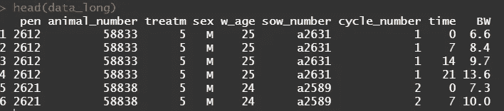

The data clearly shows that we have four observations per animal. For simplicity sake, we focus only on treatment as a covariate.

Code to summarize data across time, and across treatment and time. In addition, we will already take a peak at the overall correlation and covariance of time-points. Remember, observations in time are nested, especially when they take place in the same individual. This will affect standard error estimates.

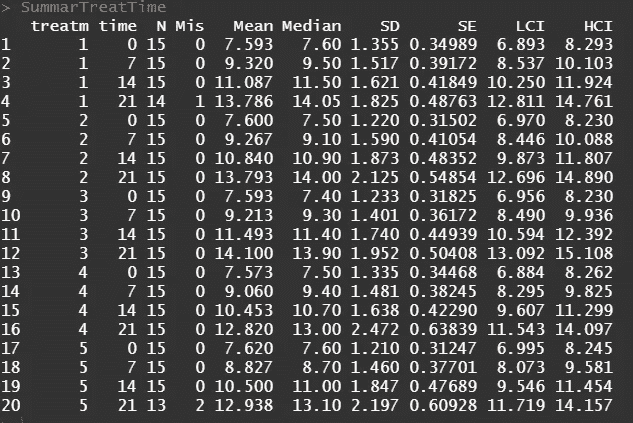

Enough variance, per treatment and per timepoint.

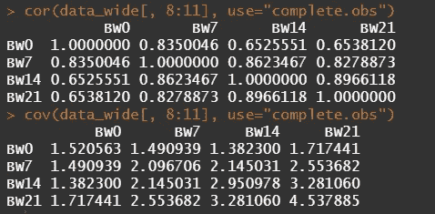

Clear correlation across time.

Code to plot data across time to get some idea what it is that we are dealing with.

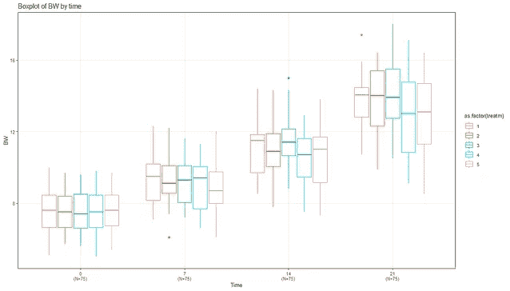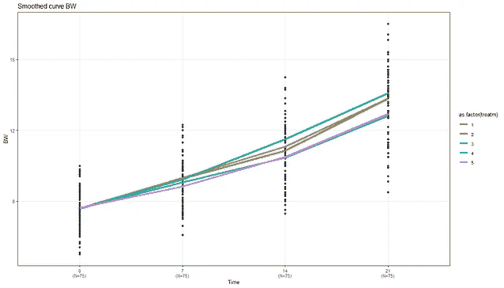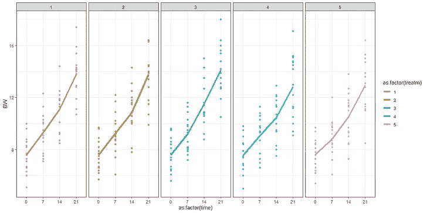

Graphs show a clear difference between treatments, in mean and variance, across time.

下面的代码是一个旁门左道，引入纵向 K-means 聚类来评估数据是否可以划分到不同的聚类中。下面的代码做这个练习，寻找 2 到 5 个集群。这是一个探索性的工具，包括展示，但结果确实暗示数据不属于五个治疗。或许连四个都不到。此外，很明显，数据在截距上有所不同，尽管在斜率上差别不大。因此，我们有一个随机截距模型的提示。

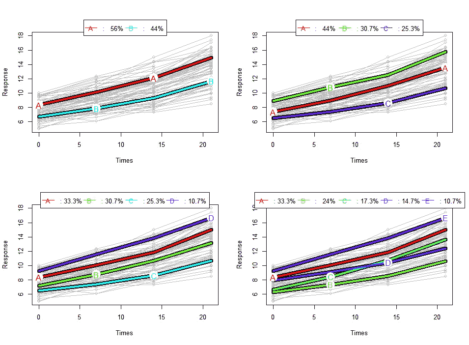

Plots show that partitioning the data in 2 to 3 factors makes sense, and that the data clearly shows difference in intercept. Not so much in slope.

A simple linear regression model to see if time, treatment, and time*treatment make sense.

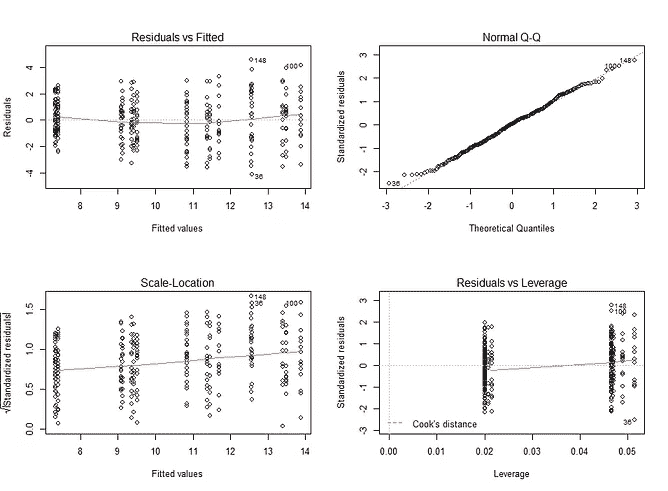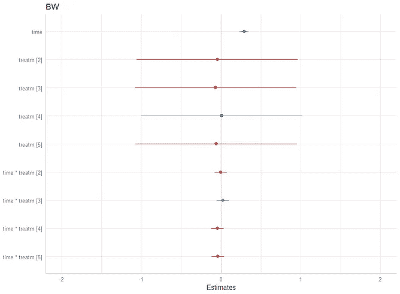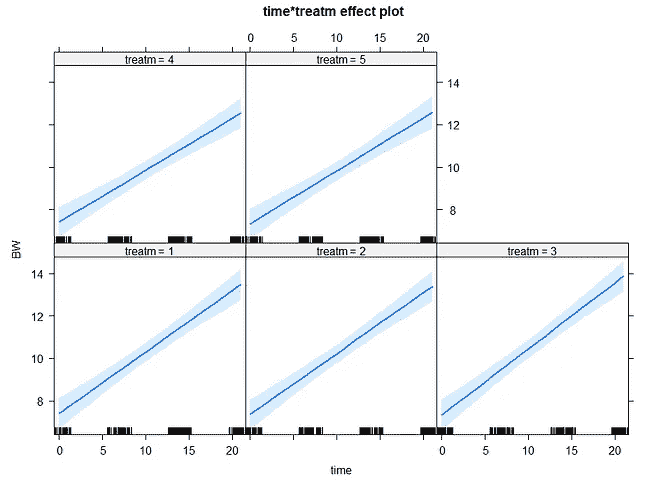

Residuals look good. Time makes sense. Time by treatment does not make sense. The K-Means clustering already hinted at that — time and treatment have a main effect. Not an interaction effect.

我们的第一个模型，无条件手段模型。其实挺简单的。它有单次拦截，随机效果*(1 |动物)*。代码*(1 |动物)*告诉模型，对于每只动物，我们要分别估计它的截距。因此，一个随机截距模型。

尽管我们将包括随机截距，但为了估计[群内相关系数](https://www.ncbi.nlm.nih.gov/pmc/articles/PMC1466680/) (ICC)，我们将避免使用除了大平均值之外的任何其他预测值。ICC 是解释方差/总方差的简单比率。实际上，无条件均值模型的 ICC 是一个筛选工具，用于查看混合模型是否有意义。

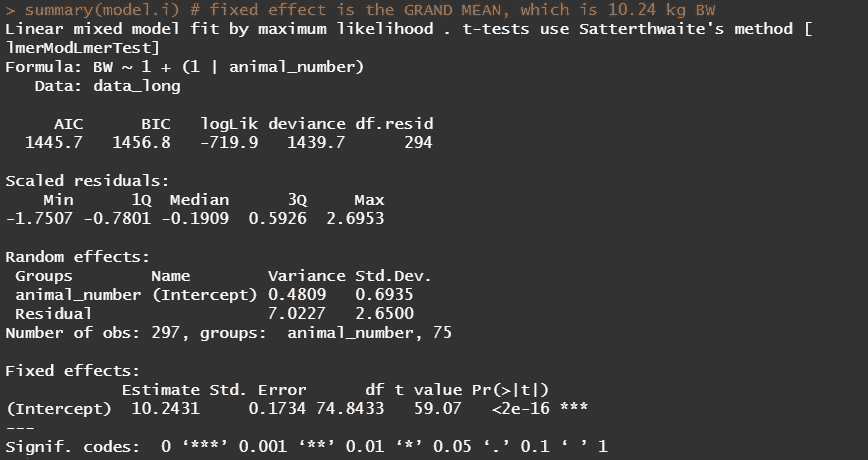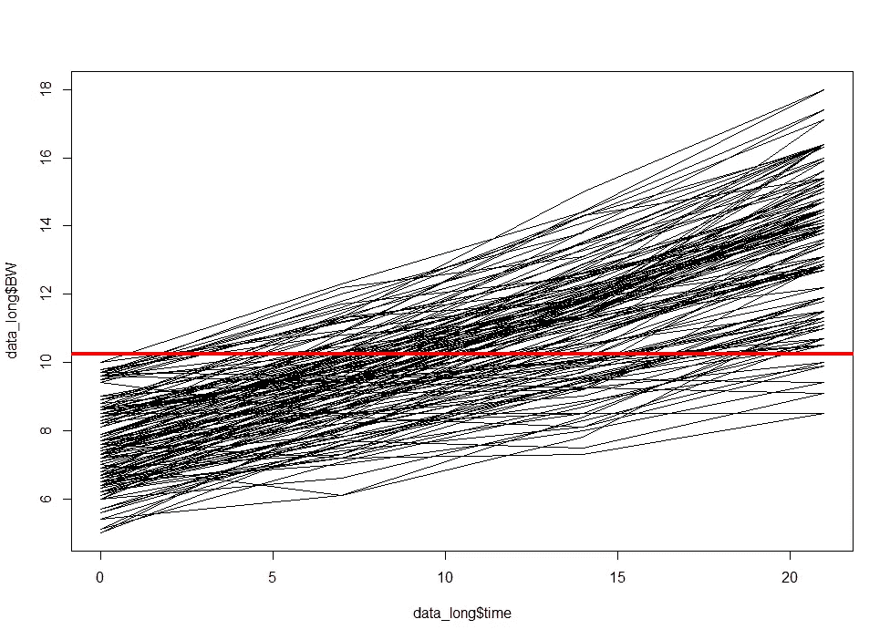

The grand-mean (intercept) is not a great predictor for the data.

上面和下面的输出显示了总数据集中 6.4%的差异，这可归因于动物之间的差异。这是国际刑事法院。这并不算多，而且说实话，在应用混合模型时，这并不能真正预示大量的成功。但无论如何让我们试试。

```
> icc(model.i)
# Intraclass Correlation CoefficientAdjusted ICC: 0.064
Conditional ICC: 0.064
```

以下模型是无条件增长模型。有截距，有时间的固定效应，也有随机截距。

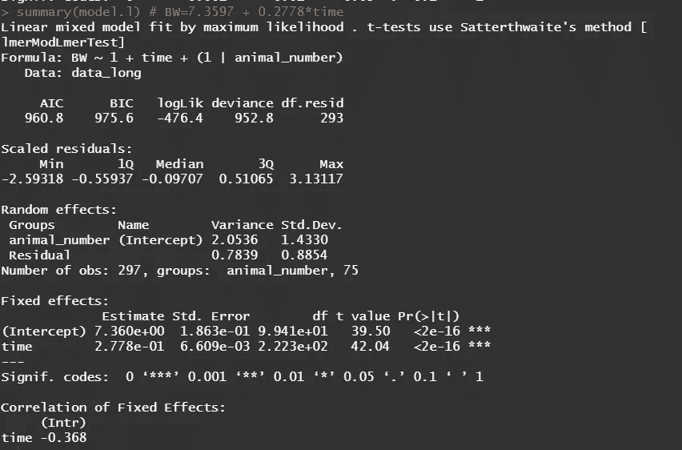

The output shows much less residual variance in this model by including the fixed effect of time.

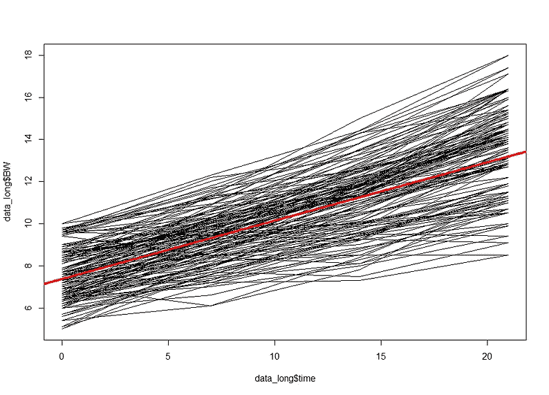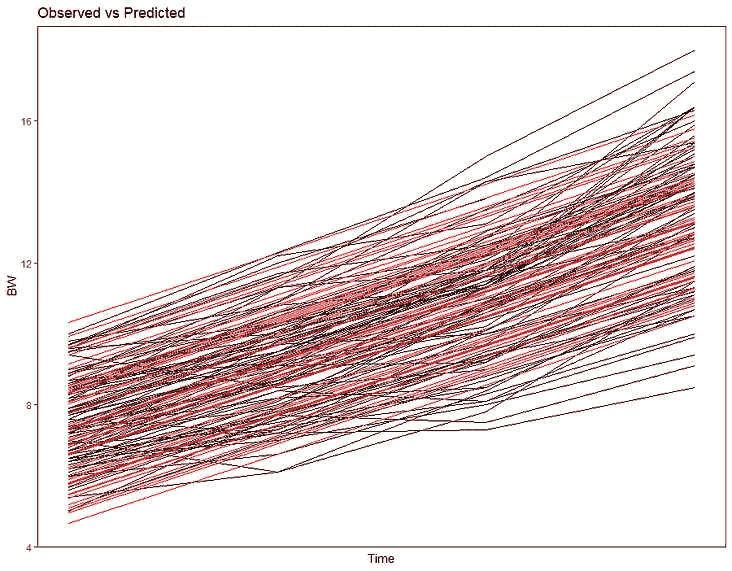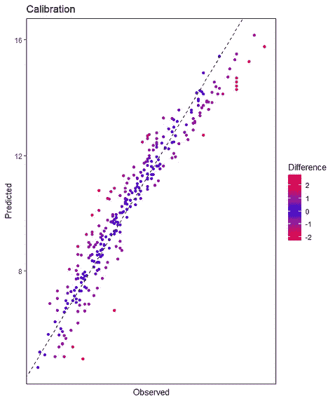

The plots show the marginal prediction (averaged across all data points), the conditional prediction (per animal based on fixed and random intercepts), and the calibration of the model.

接下来是无条件多项式增长模型。和上一个模型一样，除了现在我们加入了时间的二次效应。

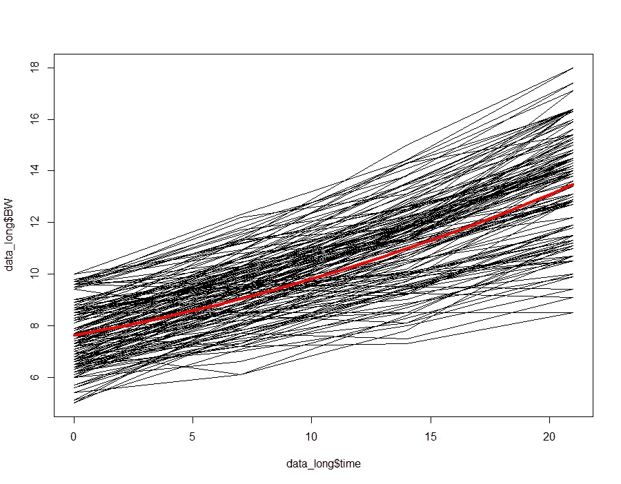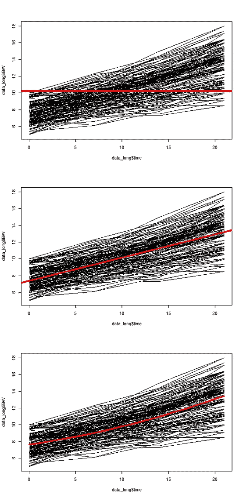

Adding a quadratic effect does not really add anything to the model. To the right, you can see the intercept only, linear, and quadratic effect models.

Code to assess which model is best — intercept, linear, quadratic.

结果有利于二次，但不是压倒性的力量。此外，如果你看看上面的图，我不会那么想使用二次模型。尤其是，因为治疗还没有包括在内。

```
 Model K      AICc Delta_AICc AICcWt Cum.Wt        eratio
3     Q 5  932.5382     0.0000      1      1  1.000000e+00
2     L 4  960.9260    28.3878      0      1  1.459925e+06
1     I 3 1445.8183   513.2801      0      1 2.866517e+111
```

下面的代码将在动物层面上查看哪个模型是首选的。压倒性地，它是二次模型，这可以通过缺少更重要的变量来解释。

```
> head(results)
  Animal   Rsq_lin  Rsq_quad         Diff  Bestfit
1  58833 0.9401456 0.9818319 -0.041686360 Rsq_quad
2  58838 0.9933775 0.9988962 -0.005518764 Rsq_quad
3  58842 0.9441755 0.9562784 -0.012102874 Rsq_quad
4  58844 0.9948570 0.9996546 -0.004797544 Rsq_quad
5  58855 0.9592769 0.9644571 -0.005180252 Rsq_quad
6  58857 0.9952800 0.9954673 -0.000187301 Rsq_quad
```

让我们转到条件增长模型——随机截距随机斜率。此外，我们现在包括治疗。顺便说一下，*(时间|动物编号)*最好读作*(1+时间|动物编号)*，但不需要额外的注释。因此，*(时间|动物数量)*是请求随机截距随机斜率模型所必需的代码。

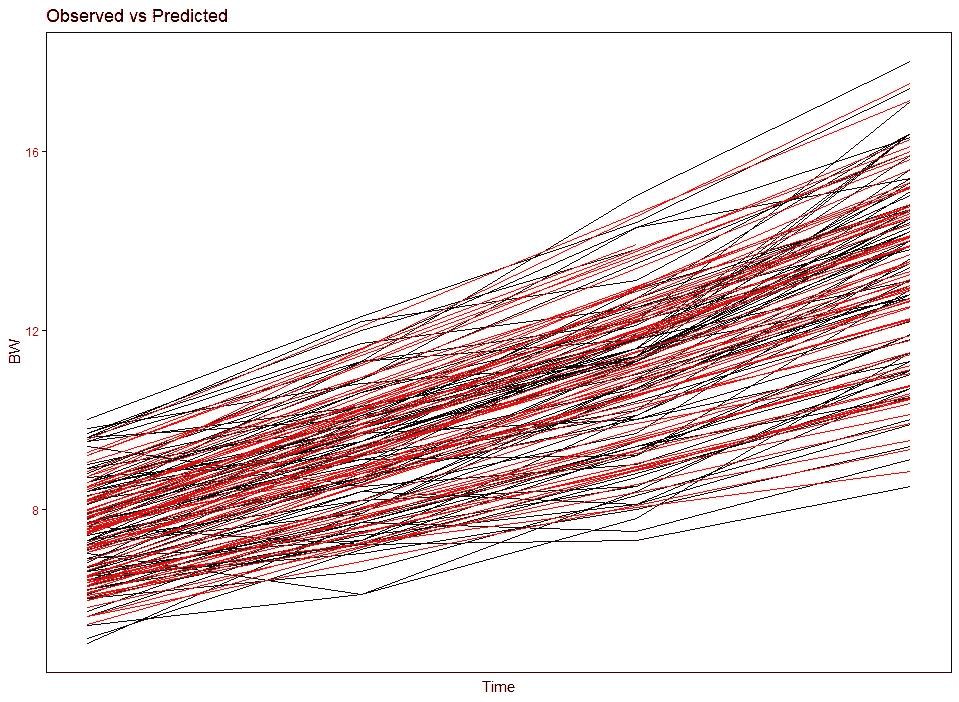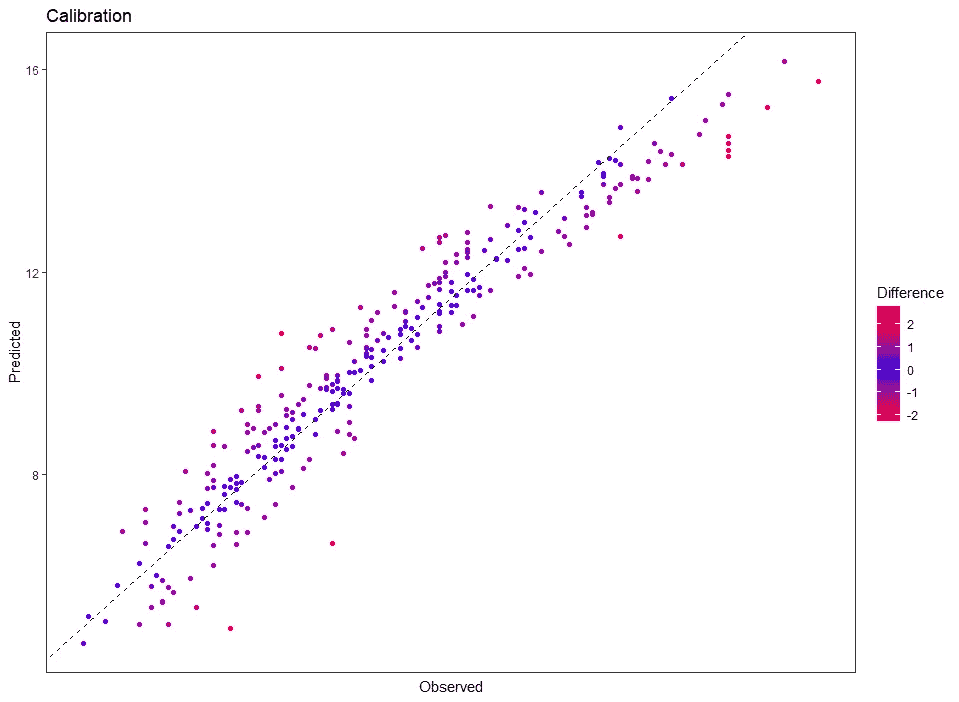

To the left, if you squeeze your eyes, you can see a random slope somewhat, but it is surely not as clear as the random intercept. To the right the calibration plot. Predictions become more off as the weight increases which makes sense. The larger the mean, the more variance you will find. Especially in growth models.

下面的代码显示了许多额外的模型，在固定和随机效果方面都有变化。然后我们将它们进行比较，选出一个获胜者。

```
> data.frame(Model=myaicc[,1],round(myaicc[, 2:7],4))
  Model  K      AICc Delta_AICc AICcWt Cum.Wt        eratio
5    QT 11  845.2731     0.0000 0.9815 0.9815  1.000000e+00
7   QxT 19  853.2190     7.9459 0.0185 1.0000  5.314210e+01
4    LT 10  904.5280    59.2549 0.0000 1.0000  7.362806e+12
6   LxT 14  905.3122    60.0391 0.0000 1.0000  1.089747e+13
3     Q  5  932.5382    87.2652 0.0000 1.0000  8.900052e+18
2     L  4  960.9260   115.6530 0.0000 1.0000  1.299341e+25
1     I  3 1445.8183   600.5453 0.0000 1.0000 2.551215e+130
```

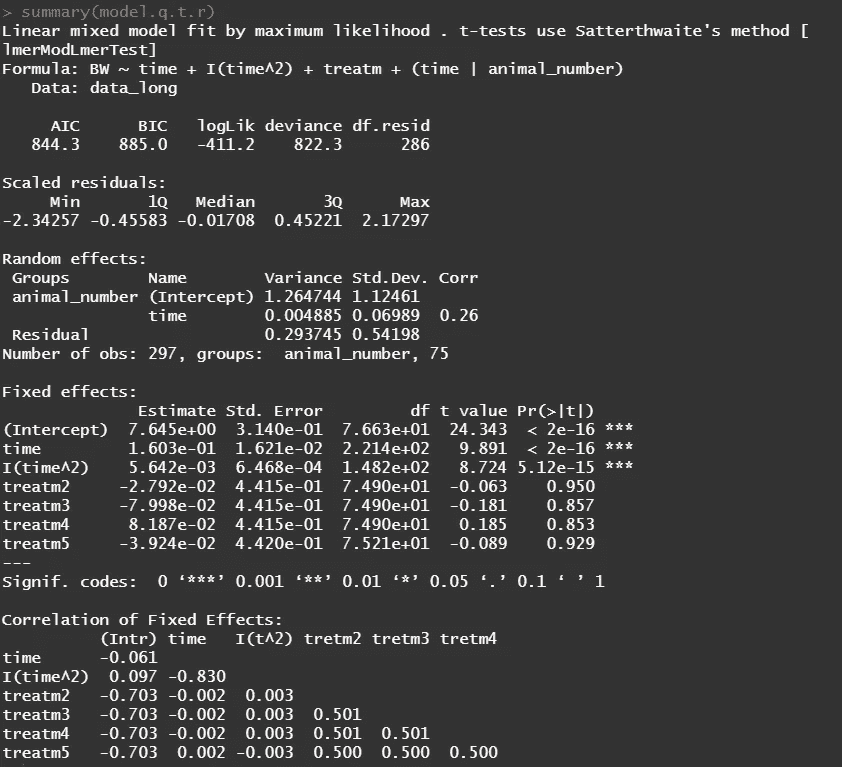

Clear to see the variance attributed by the random intercept and random slope at the animal-level. Their correlation is not very high. Below are the fixed effects and their correlation. Treatment does not seem to have any additional explanatory power.

Code to extract random and fixed effects from the best model, as well as the variance-covariance matrix. Last piece of code looks a bit deeper in the q.t.r model.

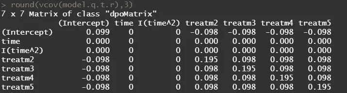

下面你可以看到，我们要求模型指定动物特定的截距和坡度影响。然后跟着固定效果走。这意味着预测动物 58833 在治疗 2 的时间点 21 的体重的公式如下:

**截距** → 7.644-0.8421= 6.802 +

**时间**→0.160+0.021 = 0.181 * 21 = 10.603+

**时间**→0.0056 = 0.0056 * 21 * 21 = 13.072+

**处理** →-0.0279 =13.045

```
> head(ranef(model.q.t.r))
$animal_number
      (Intercept)         time
58833 -0.84215052  0.020826408
58838  0.14472475  0.116202118
58842  0.72890016 -0.032279547
58844 -0.27168740 -0.040408184
58855  1.99977032  0.042297651
58857  0.36337948 -0.030983612
58859  0.57012609  0.046758630
58861 -1.16268046 -0.025436646
58877 -0.62441343 -0.189737239
58879  0.63046959  0.036521097
58894 -1.88534651 -0.102504893
58895  1.30106656 -0.024664555
58905 -0.60900735  0.022391597
58919 -1.30348657 -0.031411944
58938  1.22407165  0.071694004
58939 -0.86975057 -0.111685843> head(fixef(model.q.t.r))
 (Intercept)         time    I(time^2)      treatm2      treatm3      
 7.644750106  0.160296158  0.005642406 -0.027922237 -0.079978283 treatm4
0.081867461
```

Code to check via ANOVA and permuted Likelihood Ratio Testing if adding treatment makes the model better.

下面的输出表明，更复杂的模型不会添加相关信息。这意味着整个变化可以通过时间和两个随机因素来解释。

```
> anova(model.q.t.r, model.q.r) # treatment does not provide a better model
Data: data_long
Models:
model.q.r: BW ~ time + I(time^2) + (time | animal_number)
model.q.t.r: BW ~ time + I(time^2) + treatm + (time | animal_number)
            npar    AIC    BIC  logLik deviance  Chisq Df Pr(>Chisq)
model.q.r      7 836.49 862.34 -411.24   822.49                     
model.q.t.r   11 844.35 884.98 -411.17   822.35 0.1414  4     0.9976PBmodcomp(model.q.t.r, model.q.r, nsim=500, cl=cl)
Bootstrap test; time: 17.55 sec; samples: 500; extremes: 497;
large : BW ~ time + I(time^2) + treatm + (time | animal_number)
BW ~ time + I(time^2) + (time | animal_number)
         stat df p.value
LRT    0.1414  4  0.9976
PBtest 0.1414     0.9940
```

下面你可以看到代码的结果，以评估混合模型是否满足[独立同分布随机变量](https://en.wikipedia.org/wiki/Independent_and_identically_distributed_random_variables)的假设。显而易见，添加随机截距是有意义的，但对于随机斜率却不是这样。还有，治疗的效果几乎没有。最后但同样重要的是，一张漂亮的桌子可以给朋友和同事留下深刻印象，展示你在混合模型中付出的努力。

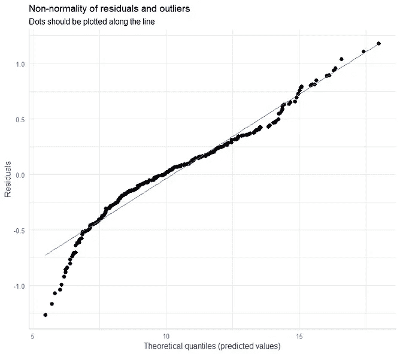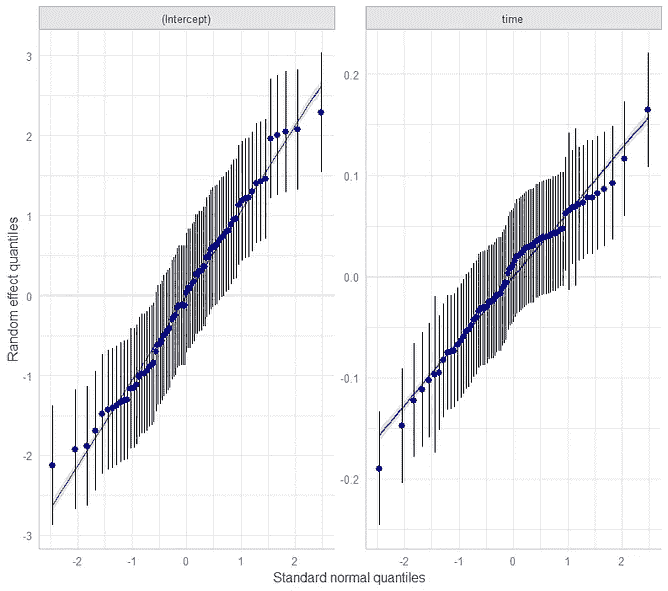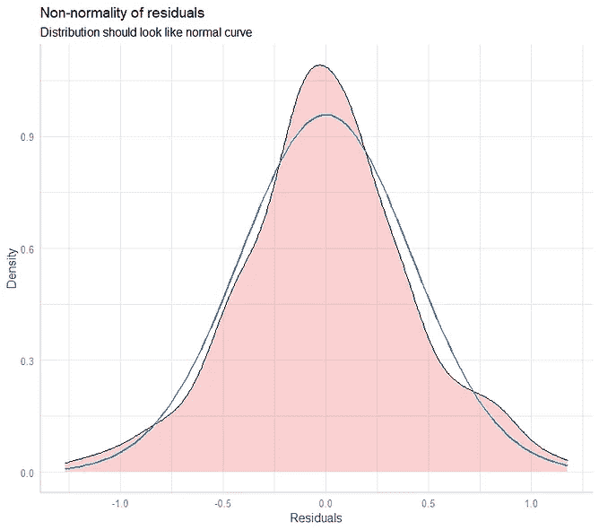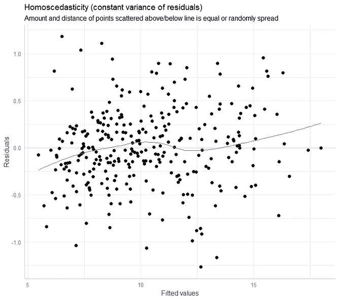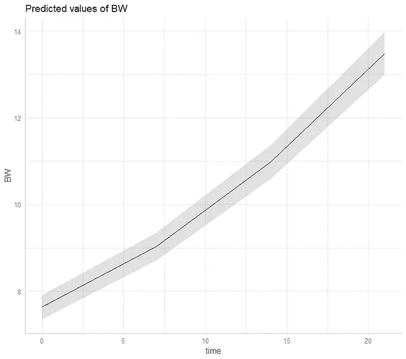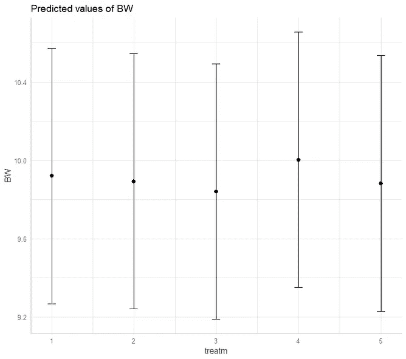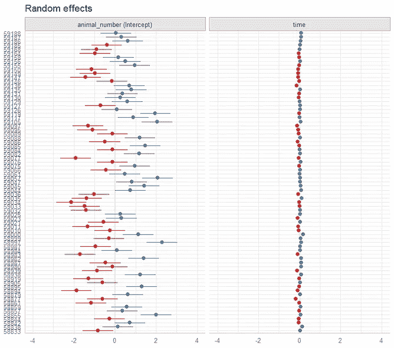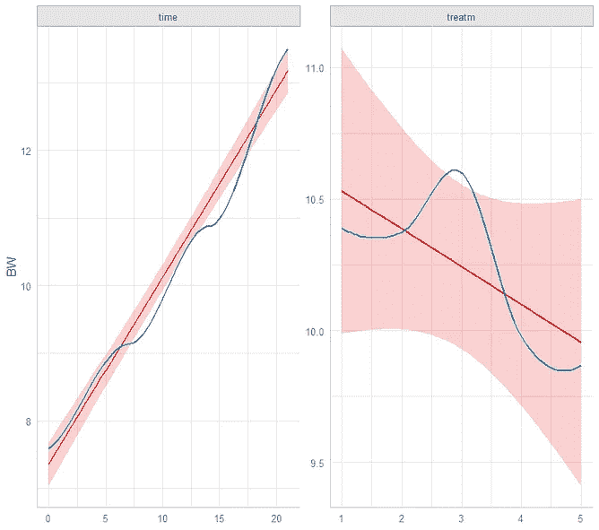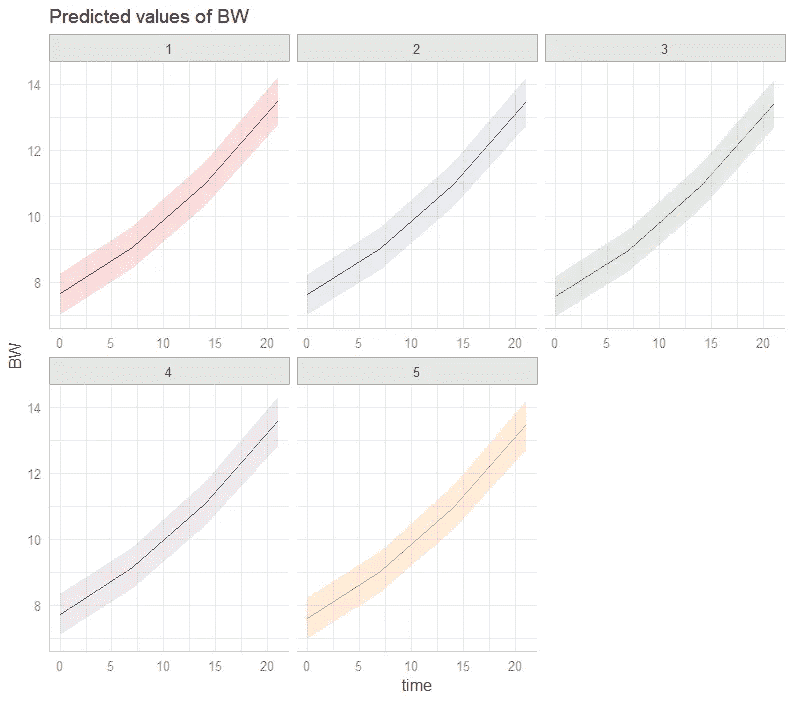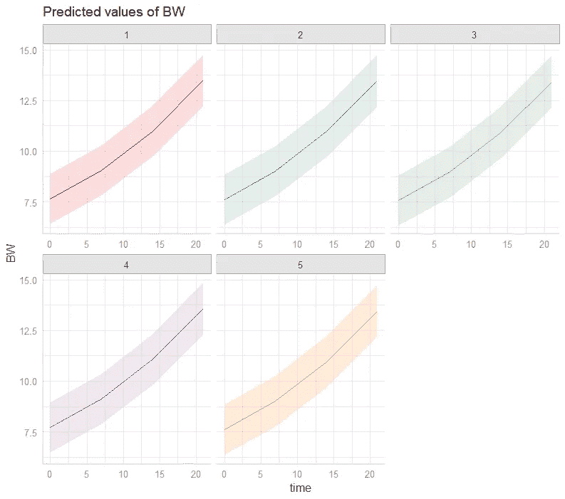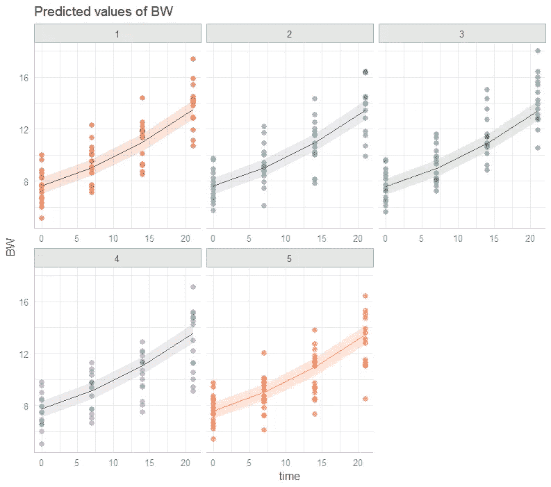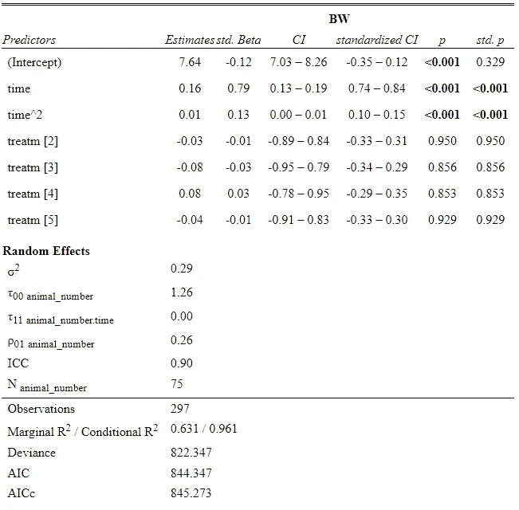[](/mlearning-ai/mlearning-ai-submission-suggestions-b51e2b130bfb) [## Mlearning.ai 提交建议

### 如何成为 Mlearning.ai 上的作家

medium.com](/mlearning-ai/mlearning-ai-submission-suggestions-b51e2b130bfb)