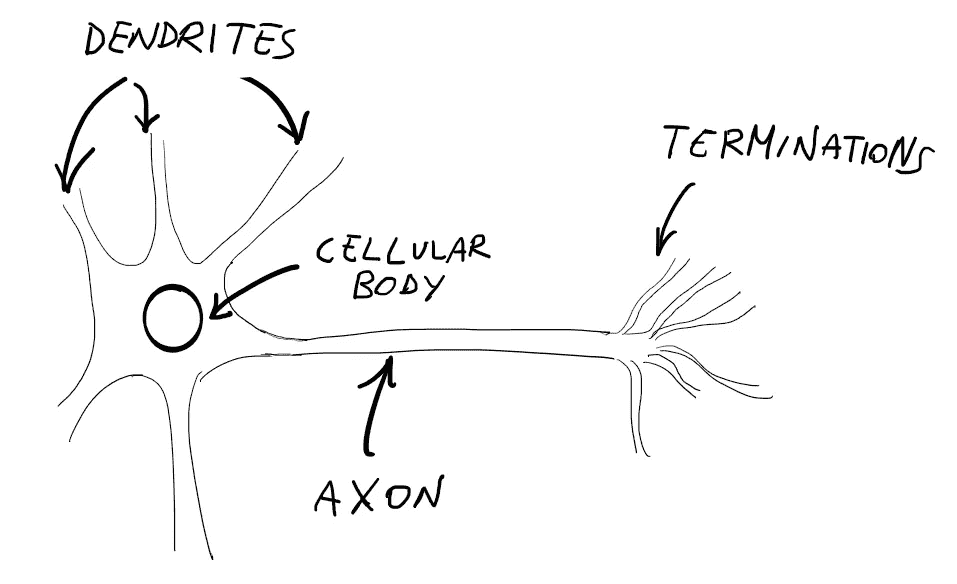
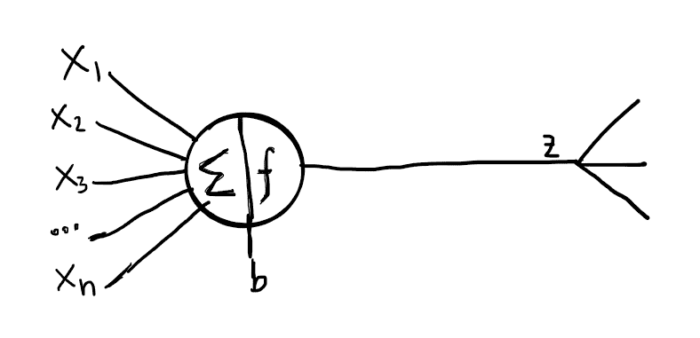
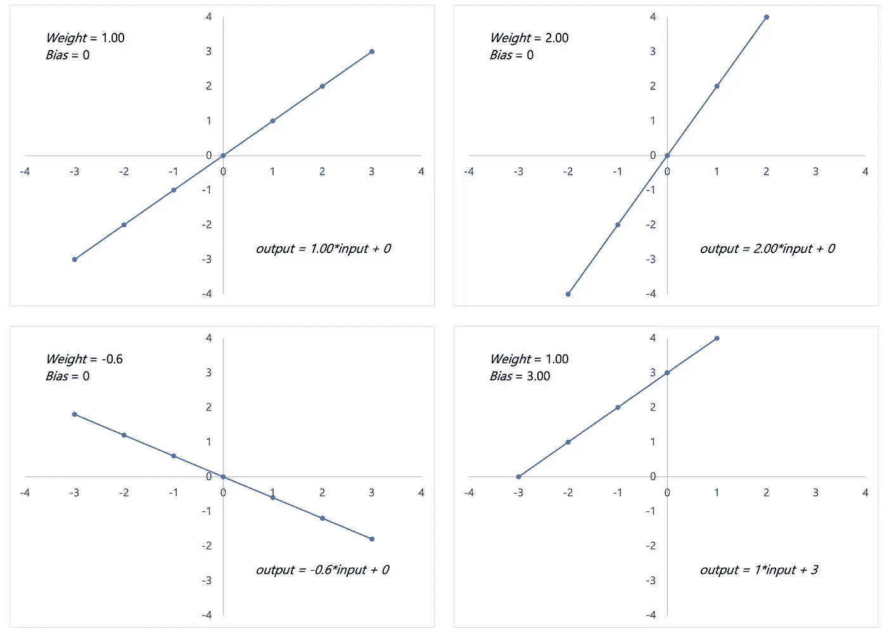
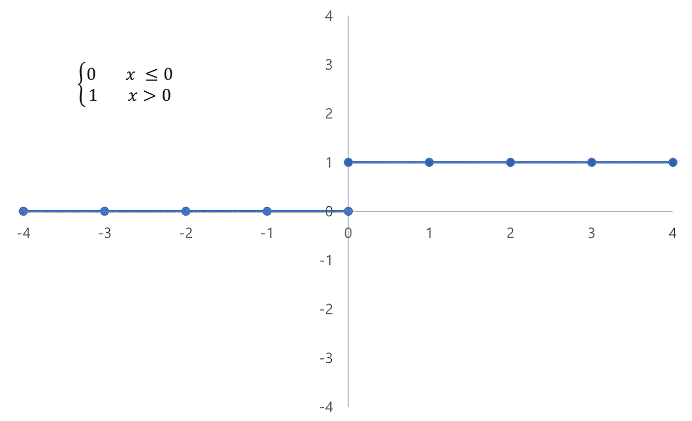
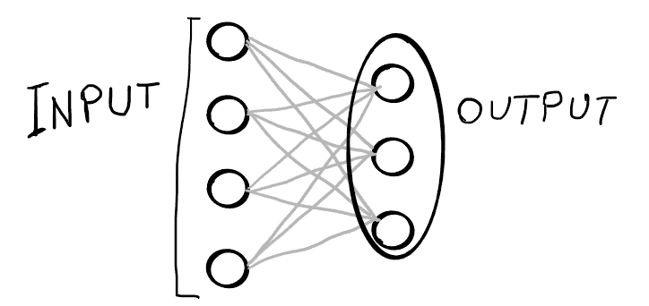

# 神经网络导论——权重、偏差和激活

> 原文：<https://medium.com/mlearning-ai/introduction-to-neural-networks-weights-biases-and-activation-270ebf2545aa?source=collection_archive---------1----------------------->

*神经网络如何通过权重、偏差和激活函数进行学习*

Photo by [Robina Weermeijer](https://unsplash.com/@averey?utm_source=unsplash&utm_medium=referral&utm_content=creditCopyText) on [Unsplash](https://unsplash.com/s/visual/3754bafb-d598-455a-93f2-5c2173086884?utm_source=unsplash&utm_medium=referral&utm_content=creditCopyText)

我们经常听说人工神经网络是人脑神经元在计算机中的表现。这些神经元形成了相互连接的网络，**，但它们触发事件和激活的过程与真正的大脑截然不同。**

一个神经元，单独来看，相对无用，但当与数百或数千个其他神经元结合在一起时，它们形成了一个相互连接的网络，往往优于任何其他机器学习算法。

# 简要历史背景

神经网络的概念非常古老——从人脑中获取灵感的建模软件的第一个想法可以追溯到 20 世纪 40 年代早期由唐纳德·赫布、麦卡洛克和皮茨在[提出的。20 多年来，这个概念一直停留在理论层面。只有通过更强大的计算能力和由](https://en.wikipedia.org/wiki/Neural_network#History) [Paul Werbos](https://en.wikipedia.org/wiki/Paul_Werbos) 创建的*反向传播*算法，神经网络的训练才成为可能，这是一种有效的机制，允许网络通过将神经元的反馈传播到其之前的神经元来学习。

杰弗里·辛顿、吴恩达、杰夫·迪恩和其他研究人员的工作使神经网络范式在一系列问题上变得流行和有效。

今天，由于神经网络能够解决以前认为不可能解决的问题，如语言翻译、视频和音频合成以及自动驾驶，神经网络被用于无数的任务中。

# 天然和人工神经元——有什么区别？

虽然神经网络确实是受天然神经元的启发，但这种比较几乎是误导，因为它们的解剖结构和行为是不同的。我不会深入研究神经科学方面，但**天然神经元似乎更喜欢基于“开关”的激活，即激活的*开或关*状态。**在活动期之后，天然神经元表现出不应期，即它们再次激活的能力受到抑制。这种行为在[动作电位](https://it.wikipedia.org/wiki/Potenziale_d%27azione)的概念中有所描述。

General view of the anatomy of a neuron. Image by Author.

Anatomy of an artificial neuron. Image by Author.

# 作为“黑箱”的神经网络

神经网络被认为是*黑盒*——我们不知道*为什么*它们能实现这种性能，但我们知道*它们是如何做到的*。

所谓的密集层是神经网络中最常见的层，它在网络的不同层之间创建互连。**每个神经元都连接到下一层的所有其他神经元，这意味着它的输出值成为下一个神经元的输入**。神经元之间的每个连接都有一个权重，该权重是在训练期间改变的因素之一。连接的权重影响神经元之间传递的输入量。此行为遵循公式*输入*权重。*

一旦一个神经元接收到来自与其相连的所有其他神经元的输入，就会添加一个**偏差**，一个变化的常数值会被添加到之前涉及权重的计算中。偏差也是一个在训练过程中被调整的因素。由于不断调整权重和偏差，神经网络能够对现实世界中的问题(只不过是一个数学函数)进行归纳和建模，这些权重和偏差会调节每个单个神经元的输出和输入，直到网络无法接近可接受的解决方案。

神经元的输出由公式
*表示:输出=输入*权重+偏差*

权重和偏差的调整在隐藏层中完成，隐藏层是输入层和输出层之间的层。**它们被称为“隐藏的”，因为我们看不到权重和偏差的调整行为**。这就是为什么神经网络是黑盒。

# 神经网络如何学习

神经网络之所以如此复杂，是因为在网络和单个神经元层面都有大量的计算。除了权重和偏差之外，还有**激活函数**，其增加了进一步的数学复杂性，但是极大地影响了神经网络的性能。

## 权重和偏差

权重和偏差可以被解释为一个旋钮系统，我们可以操纵它来优化我们的模型——就像我们试图通过旋转旋钮找到想要的频率来调谐收音机一样。**主要区别在于，在一个神经网络中，我们有数百个(如果不是数千个)旋钮来实现最终结果。**

由于权重和偏差是网络的参数，因此它们会受到虚拟旋钮旋转所产生的变化的影响。由于权重与输入相乘，**它们影响后者的大小**。另一方面，由于偏差被添加到整个表达式中，**将在维度平面上移动函数**。让我们看一些例子。

回想一下，公式是*输出=输入*权重+偏差*

How the output of a neuron changes based on weight and bias. Image by Author.

正如你所看到的，权重和偏差会影响每个人工神经元的行为，但它们分别以不同的方式影响。**权重通常在偏差为 0 时随机初始化。**

神经元的‍The 行为也受其激活函数的影响，该激活函数与自然神经元的动作电位平行，定义了最终输出的激活条件和相对值。

## 激活功能

激活函数的主题值得单独写一篇文章，但是在这里我将给出一个概述。如果你还记得，我提到过自然神经元是如何激活开关的。在计算机/数学术语中，我们称这个函数为**阶跃函数**。

Behavior of a step function. Image by Author.

遵循公式

*1 如果 x>0；如果 x ≤ 0 则为 0*

如果输入大于 0，阶跃函数允许神经元返回 1，如果输入小于或等于 0，则返回 0。此行为模拟自然神经元的行为，并遵循以下公式

*输出=总和(输入*权重)+偏差*

阶跃函数是一个非常简单的函数，在 AI 领域有使用更复杂激活函数的趋势，比如整流线性单元( **ReLU** )和 **SoftMax** )。

# 如何用 Python 编写一个小型神经网络

让我们创建一个具有 4 个输入和 3 个神经元的小型神经网络，以了解权重和偏差的计算是如何工作的。

Small network architecture we’re going to write in Python. Image by Author.

出于示例目的，让我们从手动定义这些参数开始

现在让我们创建一个循环，这个循环将创建我们的小型神经网络

这是最终输出

The result of our small neural network. Image by Author.

# 密码

 [## Mlearning.ai 提交建议

### 如何成为 Mlearning.ai 上的作家

medium.com](/mlearning-ai/mlearning-ai-submission-suggestions-b51e2b130bfb)