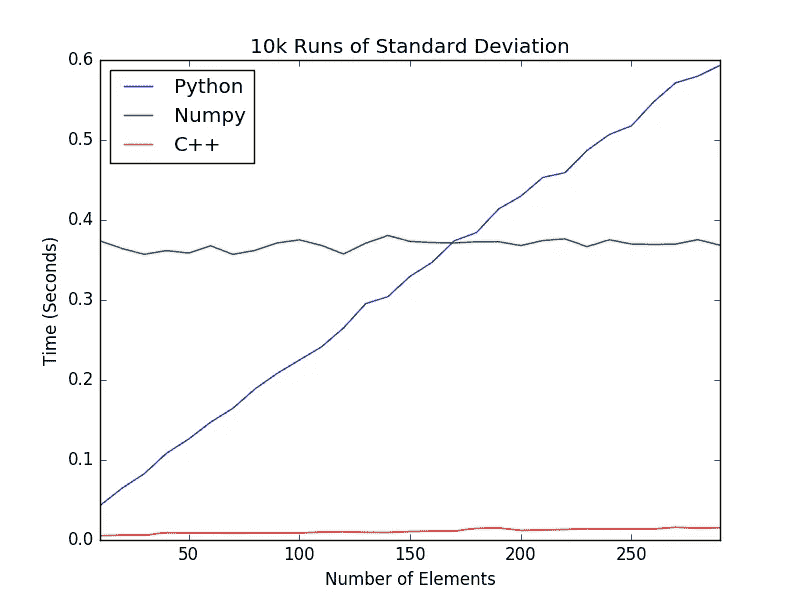

# NumPy 简介:5 个非常有用的函数

> 原文：<https://medium.com/mlearning-ai/introduction-to-numpy-5-extremely-useful-functions-798a65368df?source=collection_archive---------2----------------------->

## 纠结数字？让 NumPy 解决问题。


Photo by [wu yi](https://unsplash.com/@takeshi2?utm_source=medium&utm_medium=referral) on [Unsplash](https://unsplash.com?utm_source=medium&utm_medium=referral)

# 介绍

NumPy 是为科学计算开发的 python 包。它使用各种数学公式，涉及数学的子领域，如线性代数，统计等。关于 NumPy，有两个基本事实是大多数数据科学和机器学习社区的人不知道的；

1.  NumPy 让 **Python** 极速**。**
2.  **如果你是数据科学家或者机器学习科学家，大多数时候你**不会直接和 NumPy 一起工作。****

**嗯，你可能会问“为什么？”**

****NumPy 数组比 Python 列表快，因为:****

*   **首先，数组是存储在连续内存块中的同类数据类型的集合。相反，Python 中的列表是存储在非连续内存块中的*异构*数据类型的集合。**
*   **第二，NumPy 包将一个任务分解成多个片段，然后并行处理所有的片段*。***
*   ***最后但同样重要的是，NumPy 包集成了 Python 中的 *C、C++和 Fortran* 代码。因为这些编程语言是低级的*(它们没有自动内存管理)，*与 Python 相比，它们的执行时间非常少。***

***请参见下面的示例，我在其中展示了 Python list 和 NumPy array 之间的执行时间比较；***

******

***NumPy — C++ — Python Comparison***

******“我们为什么要和 NumPy 间接合作？”******

***除非你是在练习应用数学或统计学，否则你需要将表格可视化并用[***Pandas***](https://pandas.pydata.org)软件包处理你的数据。为了执行必要的数据预处理，这是您必须遵循的程序。 ***Pandas*** 定义为在 Python 中提供高性能数据操作的开源库。***

> ***它建立在 **NumPy** 包之上，这意味着 **Numpy 是操作熊猫**所必需的。熊猫的名字来源于 Panel Data 这个词，意思是来自多维数据的一种计量经济学。***

# ***有用的数字函数***

```
*import numpy as np*
```

# ******1。np.argmax()******

***返回轴上最大值的索引。当您键入 ***np.argmax()*** 时，按 SHIFT+TAB 查看 docstring。***

***示例:***

***我们正在创建一个 2D 数组，首先找到数组的 ***argmax()*** 。***

```
*a = np.arange(6).reshape(2,3) + 10
a*
```

***输出如下所示:***

```
*array([[10, 11, 12],
       [13, 14, 15]])*
```

***如果我们将数组 *a* 作为参数传入 ***np.argmax()*** ，我们将得到这个输出:***

```
*np.argmax(a)
Output: 5*
```

# ***2.np.tensordot()***

***计算沿指定轴的张量点积。如果您打开 docstring，您可以看到这个例子；***

> ***给定两个张量 a 和 b，以及一个包含两个 array _ objects 的 array _ objects，`(a _ axes，b _ axes)`，将
> a 和 b 元素(成分)在
> ` a _ axis '和` b _ axes '指定的轴上的乘积相加。第三个参数可以是一个非负的
> 整数类标量“n ”;如果是这样，那么“a”的最后“n”个维度
> 和“b”的第一个“n”个维度相加。***

```
*a = np.arange(60.).reshape(3,4,5)
>>> b = np.arange(24.).reshape(4,3,2)
>>> c = np.tensordot(a,b, axes=([1,0],[0,1]))
>>> c.shape
(5, 2)
>>> c
array([[4400., 4730.],
       [4532., 4874.],
       [4664., 5018.],
       [4796., 5162.],
       [4928., 5306.]])
>>> # A slower but equivalent way of computing the same...
>>> d = np.zeros((5,2))
>>> for i in range(5):
...   for j in range(2):
...     for k in range(3):
...       for n in range(4):
...         d[i,j] += a[k,n,i] * b[n,k,j]
>>> c == d
Output: array([[ True,  True],
       [ True,  True],
       [ True,  True],
       [ True,  True],
       [ True,  True]])

An extended example taking advantage of the overloading of + and \*:

>>> a = np.array(range(1, 9))
>>> a.shape = (2, 2, 2)
>>> A = np.array(('a', 'b', 'c', 'd'), dtype=object)
>>> A.shape = (2, 2)
>>> a; A
Output: array([[[1, 2],
        [3, 4]],
       [[5, 6],
        [7, 8]]])
array([['a', 'b'],
       ['c', 'd']], dtype=object)

>>> np.tensordot(a, A) # third argument default is 2 for double-contraction
Output: array(['abbcccdddd', 'aaaaabbbbbbcccccccdddddddd'], dtype=object)

>>> np.tensordot(a, A, 1)
Output: array([[['acc', 'bdd'],
        ['aaacccc', 'bbbdddd']],
       [['aaaaacccccc', 'bbbbbdddddd'],
        ['aaaaaaacccccccc', 'bbbbbbbdddddddd']]], dtype=object)

>>> np.tensordot(a, A, 0) # tensor product (result too long to incl.)
Output: array([[[[['a', 'b'],
          ['c', 'd']],
          ...

>>> np.tensordot(a, A, (0, 1))
Output: array([[['abbbbb', 'cddddd'],
        ['aabbbbbb', 'ccdddddd']],
       [['aaabbbbbbb', 'cccddddddd'],
        ['aaaabbbbbbbb', 'ccccdddddddd']]], dtype=object)

>>> np.tensordot(a, A, (2, 1))
Output: array([[['abb', 'cdd'],
        ['aaabbbb', 'cccdddd']],
       [['aaaaabbbbbb', 'cccccdddddd'],
        ['aaaaaaabbbbbbbb', 'cccccccdddddddd']]], dtype=object)

>>> np.tensordot(a, A, ((0, 1), (0, 1)))Output: array(['abbbcccccddddddd', 'aabbbbccccccdddddddd'], dtype=object)

>>> np.tensordot(a, A, ((2, 1), (1, 0)))Output: array(['acccbbdddd', 'aaaaacccccccbbbbbbdddddddd'], dtype=object)*
```

# ***3.np .分位数()***

***沿着指定的轴计算数据的第 q 个分位数。***

```
*>>> a = np.array([[10, 7, 4], [3, 2, 1]])
>>> a
Output: array([[10,  7,  4],
       [ 3,  2,  1]])
>>> np.quantile(a, 0.5)
3.5
>>> np.quantile(a, 0.5, axis=0)
Output: array([6.5, 4.5, 2.5])
>>> np.quantile(a, 0.5, axis=1)
Output: array([7.,  2.])
>>> np.quantile(a, 0.5, axis=1, keepdims=True)
Output: array([[7.],
       [2.]])
>>> m = np.quantile(a, 0.5, axis=0)
>>> out = np.zeros_like(m)
>>> np.quantile(a, 0.5, axis=0, out=out)
Output: array([6.5, 4.5, 2.5])
>>> m
Output: array([6.5, 4.5, 2.5])
>>> b = a.copy()
>>> np.quantile(b, 0.5, axis=1, overwrite_input=True)
Output: array([7.,  2.])*
```

# ***4.np.std()***

***计算沿指定轴的标准偏差。返回数组元素的*标准偏差*，一种分布范围的度量。默认情况下，*标准差*是为
展平数组计算的，否则会超过指定的轴。***

***示例:***

```
*>>> a = np.array([[1, 2], [3, 4]])
>>> np.std(a)
Output: 1.1180339887498949 # may vary
>>> np.std(a, axis=0)
Output: array([1.,  1.])
>>> np.std(a, axis=1)
Output: array([0.5,  0.5])*
```

# ***5.np .中位值()***

***计算沿指定轴的中位值。返回数组元素的中值。***

```
*>>> a = np.array([[10, 7, 4], [3, 2, 1]])
>>> a
Output: array([[10,  7,  4],
       [ 3,  2,  1]])
>>> np.median(a)
3.5
>>> np.median(a, axis=0)
Output: array([6.5, 4.5, 2.5])
>>> np.median(a, axis=1)
Output: array([7.,  2.])
>>> m = np.median(a, axis=0)
>>> out = np.zeros_like(m)
>>> np.median(a, axis=0, out=m)
Output: array([6.5,  4.5,  2.5])
>>> m
Output: array([6.5,  4.5,  2.5])
>>> b = a.copy()
>>> np.median(b, axis=1, overwrite_input=True)
Output: array([7.,  2.])
>>> assert not np.all(a==b)
>>> b = a.copy()
>>> np.median(b, axis=None, overwrite_input=True)
3.5*
```

***[](/mlearning-ai/mlearning-ai-submission-suggestions-b51e2b130bfb) [## Mlearning.ai 提交建议

### 如何成为移动人工智能的作者

medium.com](/mlearning-ai/mlearning-ai-submission-suggestions-b51e2b130bfb)***