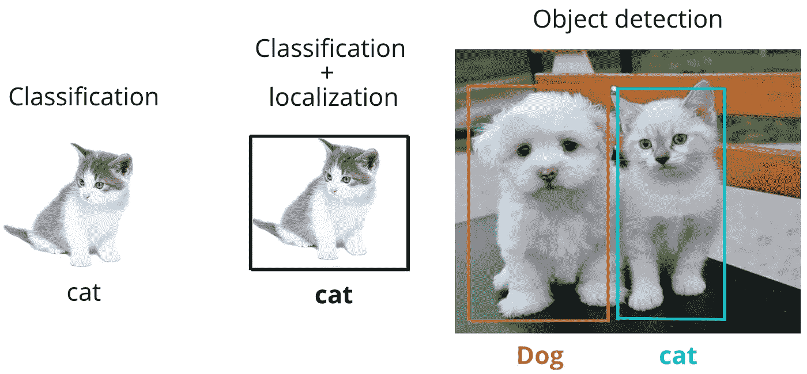
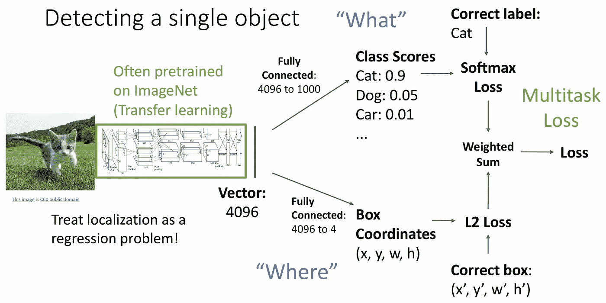
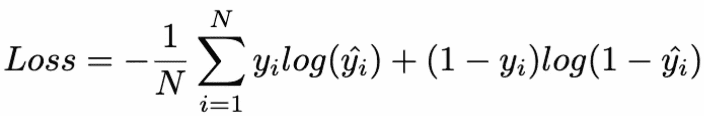
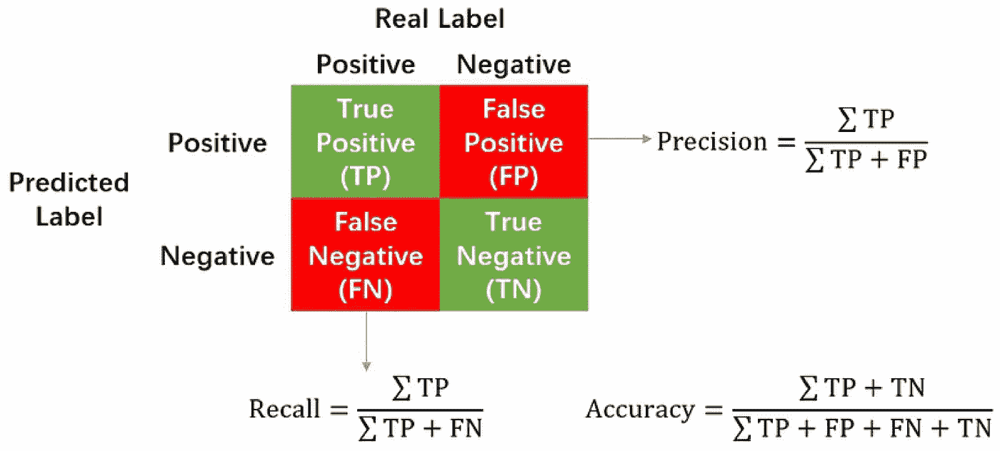
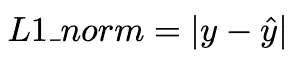
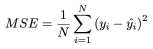
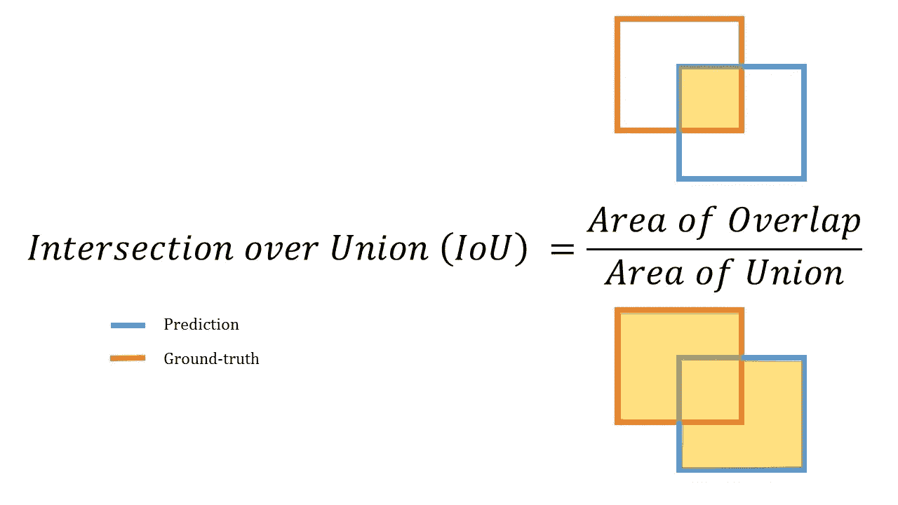

# 对象检测简介

> 原文：<https://medium.com/mlearning-ai/introduction-to-object-detection-8be574b82d5c?source=collection_archive---------2----------------------->

在机器学习中，得益于计算机视觉，计算机能够“识别”物体。但你有没有问过自己，在给定的场景中，计算机是如何识别和定位物体的？。在这篇文章中，我们旨在回答这个问题。我们走吧…！😎

## 什么是计算机视觉？

计算机视觉(CV)是人工智能的一个领域，试图让计算机从图像和视频中提取信息。在 CV 领域，有许多不同的任务，例如:图像分类、语义分割、对象检测、实例分割等。这里我们将介绍给定图像中单个目标的目标检测任务。

## 目标检测

一般来说，对象检测试图回答以下问题:

**【什么】**物体在一个图像中，“**它们在哪里？**

*   **“什么”意味着分类，即在给定图像中标记每个对象；**
*   **“其中”意味着边界框，指的是在给定图像中定位对象的位置。**

****

**Figure1: Made in canvas**

**因此，对于给定的输入(图像、视频)，对象检测器旨在预测每个对象的边界框和标签。**

**例如，考虑我们想要检测给定图像中的单个对象，如图 x 所示。**

****

**Figure2 : [Detecting a single object](https://project.inria.fr/bigvisdata/files/2020/01/cs231n_2019_lecture12_detection.pdf)**

*   **为了提取特征，输入图像将通过卷积神经网络(CNN)。这个特征提取器可以是一个相关的模型，如[亚历克斯网](https://papers.nips.cc/paper/2012/hash/c399862d3b9d6b76c8436e924a68c45b-Abstract.html)、 [VGG 网](https://arxiv.org/abs/1409.1556)等。**
*   **CNN 过程的输出馈入一个完全连接的层以获得我们的最终特征向量，从这里任务被分成两部分；第一部分是分类器(例如:带有 softmax、SVM、随机森林的线性图层),用于将这些向量分类为已知类别之一，第二部分是回归器，用于预测与分类对象相关联的边界框的坐标。在第二种情况下，模型的输出是图像中定位对象的 X，Y 坐标、宽度(W)和高度(H)。**
*   **现在我们可以看到，目标检测需要一个多任务损失来实现分类和定位。**

****a .分类损失****

**当处理分类任务时，我们使用交叉熵损失，如下式所定义。**

****

**一般来说，查看混淆矩阵也有助于了解我们的模型的行为以及该模型更擅长预测哪些类别，这些信息也可用于计算指标，即准确度、精确度和召回率。**

****

****b .回归损失****

**为了测量预测的边界框离它们的基本事实有多远，我们可以使用 L1 范数或 L2 范数(称为 MSE 损失)作为我们的损失函数。**

********

**其中 y_hat 是边界框的预测坐标，y 是地面真实坐标。**

**另一个在许多对象检测模型中广泛使用的回归损失函数是并集上的交集(IoU) [1]，也称为 Jaccard 指数，IoU 比较两个任意框之间的相似性。根据定义，它计算两个边界框的重叠部分，并将其除以它们的并集。**

****

**Figure4: [IoU](https://www.kaggle.com/c/3d-object-detection-for-autonomous-vehicles/overview/evaluation)**

**检测器的最终损失是分类损失和回归损失的**加权和**。执行加权求和的想法是控制每个损失的大小(一个损失可能比另一个损失的大小更大)，因此较大的损失不会在总损失中占主导地位。**

****图片可以有多个对象！在这种情况下，我们如何在单个图像中识别和定位多个对象？****

**迄今为止，已经使用了几种方法；其中有 [**滑动窗口**](https://ieeexplore.ieee.org/abstract/document/655647)[**R-CNN**](https://arxiv.org/abs/1311.2524)(使用选择性搜索) [**快速 R-CNN**](https://arxiv.org/abs/1504.08083)[**更快 R-CNN**](https://arxiv.org/abs/1506.01497) 。**

# **结论**

**在这篇文章的最后，我们简要介绍了对象检测模型的架构，以及它如何在给定的输入图像中处理单个对象。在我们的下一篇文章中，我们将简要介绍 Mask-RCNN 的工作原理，并使用 Detectron2 展示它的应用。**

**感谢阅读，并希望它是有见地的😉。**

****参考文献:****

**[1]:于，江，杨，王，曹，黄，2016 年 10 月。Unitbox:一种先进的目标探测网络。第 24 届 ACM 多媒体国际会议论文集(第 516-520 页)。**

** [## Mlearning.ai 提交建议

### 如何成为 Mlearning.ai 上的作家

medium.com](/mlearning-ai/mlearning-ai-submission-suggestions-b51e2b130bfb)**