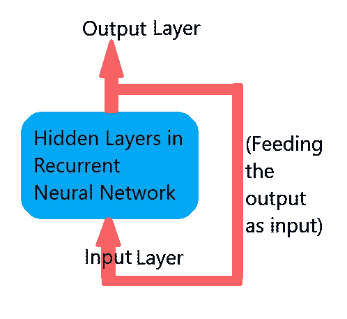

# 递归神经网络导论

> 原文：<https://medium.com/mlearning-ai/introduction-to-recurrent-neural-networks-f8615c113019?source=collection_archive---------5----------------------->

Image by [Gerd Altmann](https://pixabay.com/users/geralt-9301/?utm_source=link-attribution&utm_medium=referral&utm_campaign=image&utm_content=3699542) from [Pixabay](https://pixabay.com/?utm_source=link-attribution&utm_medium=referral&utm_campaign=image&utm_content=3699542)

“循环”这个词会让你想到什么？🙂你不觉得这像是某种递归或重复吗？？🙃是啊！！你说得对！😃

一、什么是神经网络？在我们的神经系统中，神经元是基本单位。神经元基本上是用来在我们体内发送电信号的。所以由这些单元组成的网络被称为神经网络！

人工神经网络(ANN)是计算领域的一个术语，其灵感来源于上述生物学背景。在这里，我们使用节点作为神经元，以编程方式构建上述结构！对于我们有相关数据但不知道具体过程如何发生的复杂情况，我们可以使用人工神经网络。我们将特定的场景训练到网络中，因此每个神经元都像脑细胞一样执行各自的任务！但是通常这个**没有记忆**。

简单地说，递归神经网络(RNN)的区别在于，它将以前的输出作为当前输入！换句话说，RNNs 将结果反馈给网络。😃因此 RNN 得到了先前计算的记忆**。因此，我们可以在需要以前的结果来获得下一个结果的情况下使用它！那么在哪里？？？**

Recurrent Neural Network (RNN) — Image by [Rusiri Illesinghe](/@rusirij)

只要想想大多数文字处理软件提供的文本提示功能。酷！🤩他们需要前一个单词来猜测下一个单词。它需要以前的记忆！例如，你能猜出下一首“我喜欢唱歌”是什么吗？只看最后一个单词(“歌唱”)，我们可以猜不同类型的单词。《唱歌》，唱的好，唱的好听，……等等。所以现在你可以看到你的文字处理软件是如何准确地向你建议“宋”这个词的，不仅仅是通过只看前面的词，而是通过看更多的词来抓住接下来的词！

所以你在日常生活中使用 RNNs，对吗？？？🙃

为什么不在‘语言翻译’呢！你知道，在某些情况下，语言是非常敏感的，语法上的微小变化会改变整个句子的意思。那么，如果特定的神经网络仅仅用单词的意思来训练，它会成功吗？？有些词有多重含义。它如何识别适合特定翻译的正确意义？🙃它需要有句子前面单词的计算！这也是 RNN 的另一个用例。

在 RNN 有更多的用法。大多数是在自然语言处理(NLP)领域！

当网络层数增加时，传统的 RNN 在传播信息方面存在一些局限性。但是有像长期短期记忆(LSTM)这样的架构解决方案，而且由于人工智能(AI)领域正在快速发展，还会有更多的解决方案出现！

还有一件事！是否使用 RNN 取决于您的应用需求！千万别想把它当金锤用！不恰当的使用会让你的应用程序变得一团糟！🙃

再见&干杯！！

 [## Mlearning.ai 提交建议

### 如何成为 Mlearning.ai 上的作家

medium.com](/mlearning-ai/mlearning-ai-submission-suggestions-b51e2b130bfb)