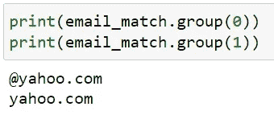
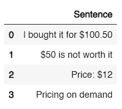
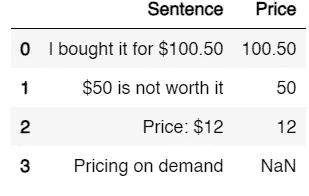

# 面向数据科学家的正则表达式介绍

> 原文：<https://medium.com/mlearning-ai/introduction-to-regex-for-data-scientists-6b4447687655?source=collection_archive---------6----------------------->

## 如何在 Python 和 Pandas 中使用正则表达式


Photo by [Chris Ried](https://unsplash.com/@cdr6934?utm_source=medium&utm_medium=referral) on [Unsplash](https://unsplash.com?utm_source=medium&utm_medium=referral)

# 什么是正则表达式

Regex 代表 ***正则表达式*** ，是用于在文本中搜索模式的表达式。简而言之，它将匹配每一个符合模式单词或词组。在 Python 中，你可以使用正则表达式来搜索单词、替换单词、匹配一个单词或一组单词。你可以使用正则表达式做任何事情，唯一阻止你的是你的想象力。

# 第一个例子

让我们举一个例子，通过查找电子邮件提供商，这是使用 [Randommer.io](https://randommer.io/random-email-address) 生成的虚假电子邮件列表；

```
email_list = ["rosanna_mayer78@yahoo.com",
"edmund_haley@hotmail.com",
"peyton31@gmail.com",
"garnet.ratke77@hotmail.com",
"shaun_heathcote@hotmail.com",
"andreane68@hotmail.com",
"rudolph9@gmail.com",
"oran43@gmail.com",
"leonel_ferry@gmail.com",
"virgie20@yahoo.com"]
```

第一步是从标准库导入 re 包

```
import re
```

然后我们写一些代码来循环遍历列表，并在每个字符串中找到一个电子邮件提供商

```
# For each email in our email list
for email in email_list: 

    # Searching for an email provider
    email_match = re.search('@(\S+)',email)

    # If there is a match, print it
    if email_match:
        print(email_match.group(1))
```

让我们解释这一部分；

```
re.search('@(\S+)',email)
```

re 包中的搜索函数扫描输入字符串(email ),查找与我们作为第一个参数提供的模式相匹配的子字符串 **('@(\S+)')** 。我们在这里提供的模式寻找一个基本符号 **(@ )** 并捕获一个组中后面的所有内容，直到遇到一个空格。括号意味着匹配左括号和右括号之间子模式的所有内容都是该组的一部分。这里我们的子模式是 **\S+** ，其中 **\S** 表示非空白字符，而 **+** 匹配这个标记一次或多次。

最后我们的输出是:

```
yahoo.com
hotmail.com
gmail.com
hotmail.com
hotmail.com
hotmail.com
gmail.com
gmail.com
gmail.com
yahoo.com
```

# **基本表征和模式**

在正则表达式的世界中，存在许多不同的记号和模式，但让我们保持简单。

*   所有基本的字母数字字符都是匹配的:“a”、“2”、“Z”
*   特殊元字符及其反义词

```
\s -> whitespace character
\S -> non whitespace character
\d -> digit character (0,1,2,3,4,5,6,7,8,9)
\D -> non digit character
\w -> any word
\W -> non word
. -> any character
\n -> new line
\r -> carriage return
```

*   量词

```
? -> zero or one of the token in front (eg: \d?)
* -> zero or more of the token in front (eg: z*)
+ -> one or more of the token in front (eg: \S+)
{x} -> match x number of times the token in front (eg: a{5} -> match aaaaa)
```

*   其他人

```
^ -> Start of a string
$ -> End of a string
| -> Boolean or condition  (eg: a|b)
[] -> defining a list of token that could be match 
(eg: [A-Za-z] for all letters in both lower and uppercase)
```

要像我们在示例中那样创建一个组，您需要使用括号并在它们之间编写子模式。

您可能已经注意到，在最后一行，我们打印了 id 为 1 的组。这是因为 re 不仅返回我们组的字符串的总匹配:



# 如何在熊猫身上使用正则表达式

现在让我们以熊猫为例，通过在句子列表中查找价格来使用正则表达式。

```
import pandas as pd

sentence_dict ={"Sentence" : ["I bought it for $100.50",
                              "$50 is not worth it",
                              "Price: $12",
                              "Pricing on demand"]}

df = pd.DataFrame(sentence_dict)
```

这给了我们这样的输出:



Dataframe output

现在我们来思考如何匹配一个价格？简单:我们需要一个团队来捕捉美元符号后的所有数字！但是我们如何做到呢？就在一条线上。

```
df['Price']=df['Sentence'].str.extract(r'\$([0-9.]+)')
```

这里我们匹配一个美元符号，注意前面有一个反斜杠，这意味着我们想要一个美元符号，而不是一个字符串的开头。然后我们有带括号的组。在里面我们说匹配任何数字(0 到 9)或点，一次或多次。

我们也可以这样编写正则表达式，其中 **\d** 是任意数字:

```
df['Price']=df['Sentence'].str.extract(r'\$([\d.]+)')
```

最后我们的输出是:



Final output

我们有一个 NaN，因为句子中没有价格。

# 额外资源

Regex 上有很多要说的，我们无法在一篇博客文章中涵盖所有内容，因此这里列出了一些有用的资源:

## Python Re 模块文档:

 [## 重新正则表达式操作- Python 3.11.1 文档

### 这个模块提供了类似于 Perl 中的正则表达式匹配操作。无论是图案还是字符串…

docs.python.org](https://docs.python.org/3/library/re.html) 

## Google 对 Regex 的介绍:

[](https://developers.google.com/edu/python/regular-expressions) [## Python 正则表达式| Python 教育| Google 开发者

### 正则表达式是匹配文本模式的强大语言。本页给出了常规…的基本介绍

developers.google.com](https://developers.google.com/edu/python/regular-expressions) 

## 令人敬畏的正则表达式:一个可以帮助你掌握正则表达式的知识库

[](https://github.com/aloisdg/awesome-regex) [## GitHub-aloisdg/awesome-Regex:awesome Regex 库、工具、框架的精选集合…

### 令人敬畏的正则表达式库、工具、框架和软件的精选集合。目标是建立一个分类的…

github.com](https://github.com/aloisdg/awesome-regex) 

## Regex101:一个强大的 Regex 编辑器，解释正则表达式术语，并让您编写一些测试用例:

[](https://regex101.com) [## regex101:构建、测试和调试 regex

### 正则表达式测试器，语法高亮，解释，PHP/PCRE，Python，GO，JavaScript 的备忘单…

regex101.com](https://regex101.com) 

最后，感谢阅读！让我知道它在这里是否有用👇

[](/mlearning-ai/mlearning-ai-submission-suggestions-b51e2b130bfb) [## Mlearning.ai 提交建议

### 如何成为 Mlearning.ai 上的作家

medium.com](/mlearning-ai/mlearning-ai-submission-suggestions-b51e2b130bfb)