# 支持向量机算法简介

> 原文：<https://medium.com/mlearning-ai/introduction-to-support-vector-machine-algorithm-3b412c4e25f4?source=collection_archive---------3----------------------->

解释经典机器学习算法中最健壮的分类器之一


Photo by [Kelly Sikkema](https://unsplash.com/@kellysikkema?utm_source=unsplash&utm_medium=referral&utm_content=creditCopyText) on [Unsplash](https://unsplash.com/s/photos/learning-algorithm?utm_source=unsplash&utm_medium=referral&utm_content=creditCopyText)

SVM——支持向量机——是一种监督机器学习分类器，它基于利用一个将两个类分开的超平面来工作。

## 超平面和边缘

超平面是一个比其周围空间的维数小一的子空间。例如，如果我们有 2 个特征(2-D)的数据集，那么超平面是一条线(1-D)，同时对于 3 个特征(3-D)，那么超平面是一个平面(2-D)，等等。

回忆直线方程(线性方程)

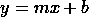

其中 m 是常数，称为斜率，b 是 y 轴的截距。这可以写成

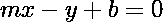

如果我们定义二维向量 **x** =(x，y)和 **w** =(m，-1)

我们可以把`mx-y+b=0` 写成

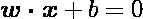

这样线性方程可以写成向量 w 和 x 的形式，上面的方程叫做超平面的**方程。**

我们得到了超平面的方程，利用它我们也可以得到线性方程。给定向量 **w=(w0，w1)** 和 **x=(x，y)**

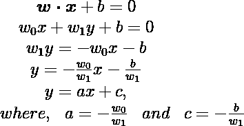

现在常数 a 是斜率，c 是 y 轴的截距。注意，向量形式的 b 不是线性方程的斜率。

现在我们将使用超平面的方程来对数据集中的一些特征进行分类。假设我们有这样的数据

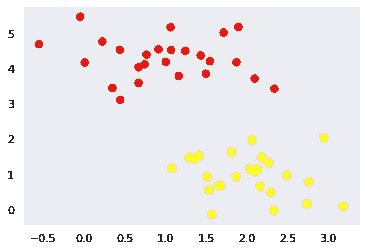

然后我们有了一个新的数据点‘X’，我们想分类 X 是红色类还是黄色类

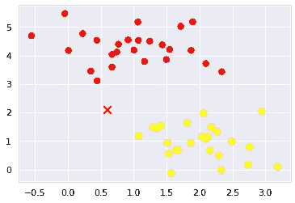

我们可以使用超平面来执行二元分类。例如，对于向量 **w=(-1，1)** 和 b=0.65，我们得到超平面

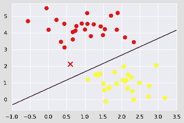

从这个结果，我们可以推断点“X”是红色类。但是我们看到了一个问题:有不止一个可能的超平面可以在两个类之间完美分离！

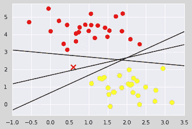

所以画超平面来分隔类是不够的。有许多可能的超平面可以画在图上，但我们需要最好的一个。为了确定最优超平面，我们需要理解边缘的概念。

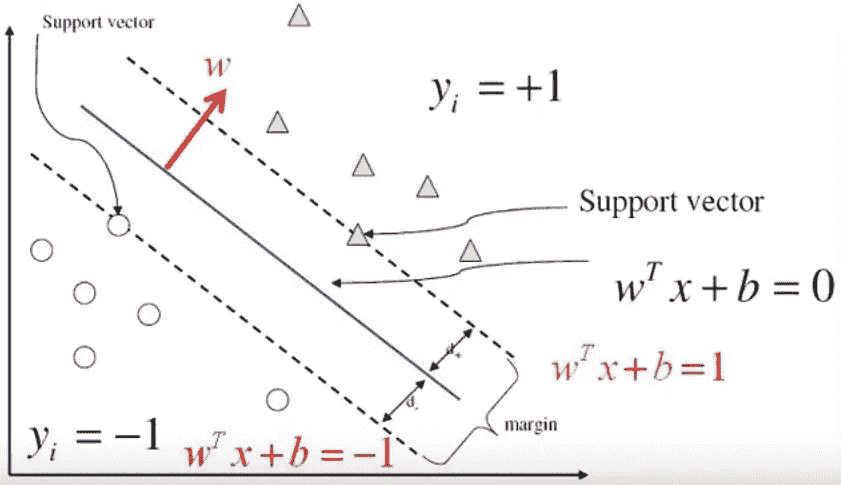

Figure 1: SVM graph — [Ireneli.eu](http://ireneli.eu/)

请看图 1。假设蓝线是分隔圆类和三角形类的最佳超平面。黑色虚线是通过最近的三角形点和最近的圆形点的一些超平面。那些超平面经过的最近的点被称为**支持向量**。这些超平面之间的距离称为**余量。**

现在你可能想知道，我们知道向量 **x** 与特征点相关联，但是向量 **w 的意义是什么？为了澄清这一点，我们需要确定一种计算利润的方法。**

首先，让我们以正式的方式定义 SVM 问题。你有数据集 *D* 并且你想对它进行分类。数据集由与 *n* 标签向量**y**相关联的 *n* 特征向量 **x** 组成。在二进制分类的情况下 **y** 具有两个可能的值，-1 和 1，并且特征 **x** 是 ***p*** 维向量。因此，数据集的定义可以写成

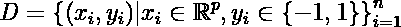

为了简单说明，我们只限制为 ***p*** =2 维。

第二步，选择超平面 **H₀** 分离数据集并满足超平面方程

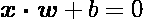

我们可以选择另一个超平面 **H₁** 和 **H₂** ，它们也分离数据并满足以下方程:

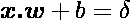

和

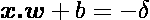

因此 **H₀** 与 **H₁** 和 **H₂** 的距离相同。变量δ可以是任意的，所以为了简单起见，我们定义δ=1，因此

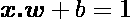

和

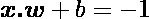

由于边缘充当分隔符，我们希望确保它们在这些超平面之间没有点。

现在我们要选择满足以下约束的超平面。

对于每个矢量 **x** ，ᵢ都满意

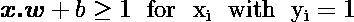

或者

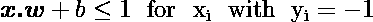

我们需要将这些约束组合成单一约束。对于产生 yᵢ=-1 类的 **x** ᵢ，如果我们用 yᵢ计算约束 x.w+b≥1，我们得到-1

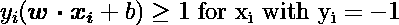

因为对于产生 yᵢ=1 的 **x** ᵢ，我们将得到相同的结果，因此约束变成

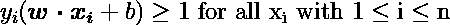

现在我们有了单一约束，保证超平面之间没有点。

最后一步是确定这些超平面之间的距离

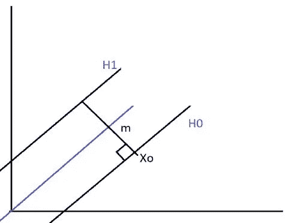

假设我们有向量 **x** ₀，其点位于超平面 **H₀** 中，并且满足 **w.x** ₀ + b=0。裕度 ***m*** 定义为从 **x** ₀到位于超平面 **H₁.中的向量的距离**所以，如果我们可以确定任何一个矢量的点位于 **H₁** 并且方向垂直于 **H₁** 的话，那么边距 *m* 这个标量值就有意义了。幸运的是，我们已经有了一个垂直于 **H₁的向量，**向量 **w，(**因为 **H₁=w.x+b=1)** ，

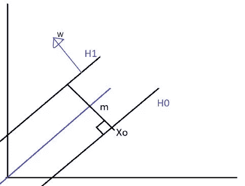

现在我们的任务是利用矢量 **w.** 的存在性找到 **H₁** 中的矢量 m

让我们将矢量 **u** 定义为 **w** 的单位矢量

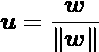

由于 **u** 是单位矢量，所以|| **u|| = 1** 并且与 **w** 方向相同，那么它也垂直于 **H₁.**现在，我们寻找的向量也有方向**u。**让我们定义这个向量为 **k**

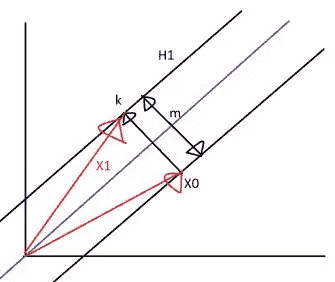

因此 **k** 具有大小 *m* 和方向 **u** ，记为

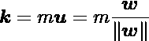

这也可以解释为从 **x** ₀指向 **H₁.的矢量**我们现在剩下的任务是确定利润率 *m.*

回想一下，对于**中的任意向量，H₁** 满足 **w.x + b =1，**对于**中的向量**x**₁**

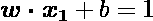

由于我们在 **H₁** 中将 **k** 构造为从 **x** ₀指向 **x** ₁的向量，我们可以应用向量加法 **x** ₁= **x** ₀+k，因此

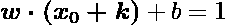

然后

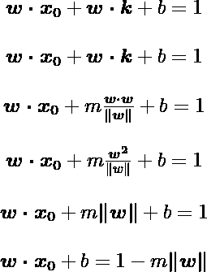

由于 **x** ₀在 **H₀，**那么 **H₀ = w** 。 **x** ₀ + 1 = -1

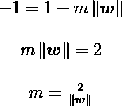

就这样，我们找到了一种计算余量*m*的方法，从这个结果我们知道，余量只取决于矢量 **w** 的大小。

根据我们的目标，找到最佳超平面等于最大化余量，这等于最小化向量的大小 **w.** 连同约束，让我们将我们的问题重写为

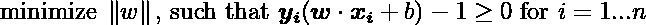

现在我们的问题变成了优化问题，这意味着我们需要找到某些参数来给出 **w** 的最小值。由于优化问题经常涉及导数，因此通常将我们的问题改写为

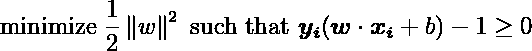

## 拉格朗日乘数

数学家约瑟夫·路易斯·拉格朗日发明的拉格朗日乘子是一种寻找受约束函数的局部最大值和最小值的技术。假设我们有一个优化问题

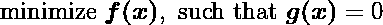

当 *f* 的斜率与 *g* 的斜率同向时，f 的最小值出现

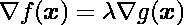

因此，为了找到约束条件 *g 下 *f* 的最小值，我们需要求解*

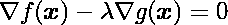

常数λ，称为**拉格朗日乘数。**

拉格朗日乘数法概括为三个步骤

1.  定义拉格朗日函数 *L*

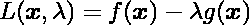

2.求拉格朗日函数的梯度

3.求解

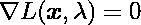

现在，对于支持向量机优化问题，我们已经定义了

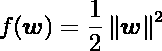

和 *n* 约束

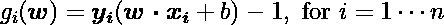

因此，SVM 优化的拉格朗日函数为

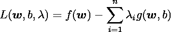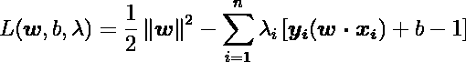

我们现在剩下的任务是找到 **w** ，b 和λ的值，它们反过来给我们提供了最佳超平面。

## 沃尔夫对偶问题

让我们继续解决 SVM 优化的步骤。计算拉格朗日函数的梯度

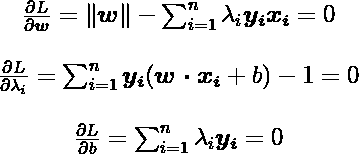

我们有

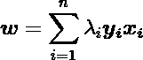

从上面的结果，我们只能找到最佳值的 **w** ，这是依赖于λ，所以我们需要找到λ的最佳值。而寻找 b 的最优值需要 **w** 和λ。

我们的工作结果对解决最优化问题仍然没有帮助，我们仍然需要找到所有的最优值。我们公式化的优化被称为**原始问题。**如果其没有给我们结果，我们应该转移到**沃尔夫**对偶问题，从而保证了结果。请记住，如果我们转移到对偶问题，我们改变公式从最小化到最大化的功能。现在我们优化问题被写成


用 **w** 是从脑瓜子问题中发现的。现在让我们重写对偶形式的拉格朗日函数

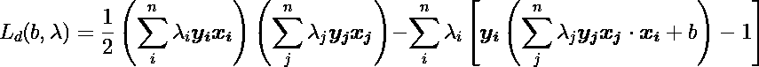

通过将大量代数应用于上述方程，我们得到

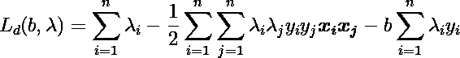

从最初的问题，我们得到

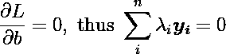

然后我们可以写作

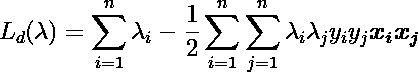

现在我们的优化问题是以仅依赖于λ的对偶拉格朗日函数的形式

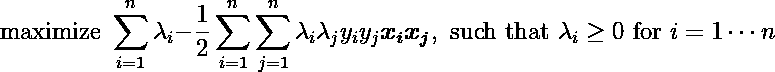

由此，我们可以使用任何可用的数值库来求解λ。

一旦最优λ被求解，我们将回到原始问题来寻找最优的 **w** 和 b

正如我们已经发现的 **w**


使用 **w** 和λ，我们计算 b 如下:

超平面方程

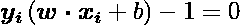

我们得到的替代物

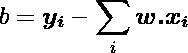

对于稳定的数值解，我们使用支持向量的平均数

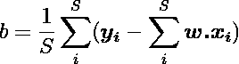

其中 S 是支持向量的数量。

至于现在有了 w 和 b**的值，从而构建了最优超平面。现在预测特征向量 xi 的类别由下式给出**

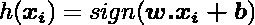

使用对偶公式，仅使用支持向量来计算


## 软利润

到目前为止，我们已经讨论了关于**硬边界** SVM，它假设数据集是线性可分的，在现实世界中，数据经常有噪声。为了克服这一点，我们需要修改 SVM 算法，所以它会犯一些错误，因为让我们通过添加一个变量来修改我们的约束


最优化问题现在的形式是


其中 C 是起控制ζ的重要性作用的参数，注意，当 C -> 0 时，优化问题又回到硬边界。软裕度的 Wolfe 对偶问题与硬裕度具有相同的形式，唯一不同的是我们将λ的值限制在 0≤λ≤C 的范围内。

## 内核技巧

在现实世界中，有时数据是不可分的，我们希望使用支持向量机对其进行分类。


从上图中我们可以看到，我们有一个不可分离的二维要素数据集，如果我们向数据集添加额外的维度，那么它将是可分离的，如下图所示


现在，数据是可分离的，这意味着我们可以绘制一个分离数据的超平面，在这种情况下是三维空间中的二维平面。

回忆一下 SVM 的沃尔夫对偶拉格朗日函数


我们注意到函数中 x 的点积，我们希望在三维空间中执行点积，因为在二维空间中数据集是不可分的。这种在另一个空间执行点积的技术被称为**内核技巧，**的定义为


现在，我们可以把沃尔夫对偶拉格朗日函数写成


也为假设函数预测类


内核有很多种。诸如

## 线性核

这是最基本的内核，写成


## 多项式核。

当数据的分布近似符合 *d* 次多项式时使用。


## 径向基函数(RBF)核

这是 SVM 最受欢迎的果仁之一。当没有关于数据的先验知识时使用它。


## 履行

我们将使用以下内容:

*   [Scikit-learn m](https://scikit-learn.org/stable/index.html) 模块，用于将数据拆分为[训练测试](https://scikit-learn.org/stable/modules/generated/sklearn.model_selection.train_test_split.html?highlight=train_test_split#sklearn.model_selection.train_test_split)样本，构建 SVM 模型，以及[模型评估](https://scikit-learn.org/stable/modules/generated/sklearn.metrics.classification_report.html?highlight=classification_report#sklearn.metrics.classification_report)
*   乳腺癌数据集，由 Scikit-learn 提供
*   [Numpy](https://numpy.org/) 用于数据操作

让我们导入所有的库

```
from sklearn.model_selection import train_test_splitfrom sklearn import datasetsfrom sklearn.svm import SVCfrom sklearn.metrics import accuracy_score
```

加载数据集

```
X,y = datasets.load_breast_cancer(return_X_y=True)
```

拆分为训练和测试数据集

```
X_train, X_test, y_train, y_test = train_test_split(
        X, y, test_size=0.2, random_state=1234
    )
```

创建 SVM 模式

```
clf = SVC(kernel = 'linear', random_state = 1234)
```

拟合和预测输出

```
clf.fit(X_train,y_train)
predictions=clf.predict(X_test)
```

让我们看看模型的准确性

```
from sklearn.model_selection import cross_val_scoreaccuracies = cross_val_score(estimator = clf, X = X_train, y = y_train, cv = 10)print("Accuracy: {:.2f} %".format(accuracies.mean()*100))
```

得分 96.94%。

让我们看看当使用混淆矩阵预测测试数据集时，模型有多好

```
from sklearn.metrics import confusion_matrix confusion_matrix(y_test,predictions)
```

混淆矩阵是

```
array([[39,  6],  
      [ 0, 69]])
```

这表明 39 个预测为真正的恶性，69 个预测为真正的良性。但是该模型未能预测 6 个恶性肿瘤为良性肿瘤

# 结论

在本文中，我们了解到:

1.  SVM 算法中超平面和边缘的概念
2.  使用 SVM 使用的拉格朗日定理的约束优化
3.  实现 SVM 算法。

[](/mlearning-ai/mlearning-ai-submission-suggestions-b51e2b130bfb) [## Mlearning.ai 提交建议

### 如何成为 Mlearning.ai 上的作家

medium.com](/mlearning-ai/mlearning-ai-submission-suggestions-b51e2b130bfb)