# 神经网络:一切都是关于嵌入

> 原文：<https://medium.com/mlearning-ai/intuition-to-neural-network-embeddings-986c6bcaa502?source=collection_archive---------1----------------------->

## 通过理解特征嵌入简化混合和复杂模型

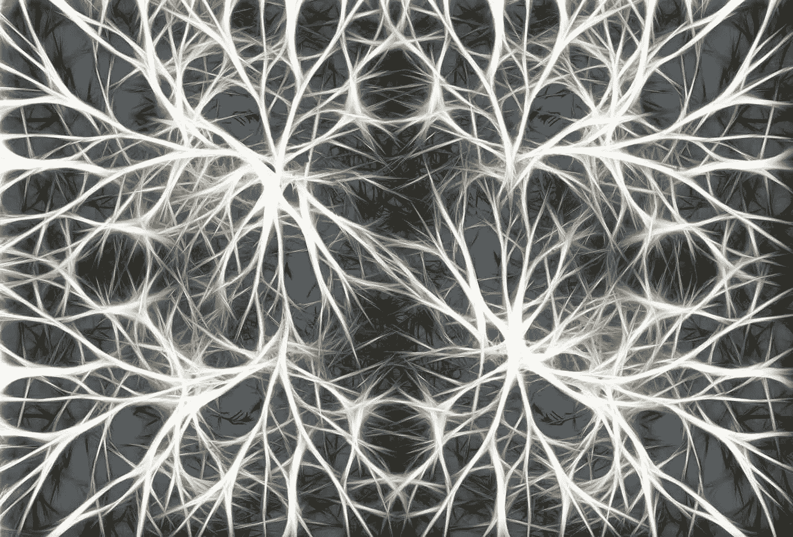

*Neurons. (source:* [*Pixabay*](https://pixabay.com/en/neurons-brain-cells-brain-structure-582054/)*)*

# 介绍

神经网络是人工智能的一种。理解神经网络*嵌入*使得从强化代理构建复杂模型来击败视频游戏或创建深度假货成为可能。

很多时候，神经网络被描述为难以理解的黑盒。这是因为它们通过多个图层自动提取自己的特征。我在这里告诉你，对他们如何学习，以及如何理解复杂和混合模型，发展一种直觉是可能的。

## 我是谁？

我是理科学士。计算机工程专业毕业，后来专攻机器学习和计算机视觉。目前从事计算机视觉研究。

而这篇文章反映了我在深度学习中用高级/混合模型的学习经验。

机器学习(尤其是计算机视觉)让我兴奋的是处理和解决现实世界场景的能力，如人脸识别、无人驾驶汽车等问题。相比之下，常规手工制作的功能(传统方法)只能在有限和狭窄的环境中工作，需要许多工程技巧，如仔细照明以及相机和物体的定位。

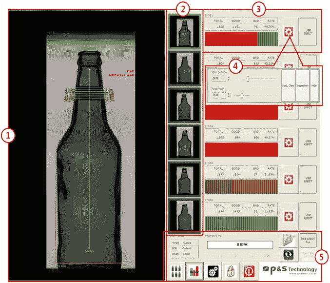

Example of classical image processing for bottle defects — taken from Parisa Tech

## 这篇文章是写给谁的？

我为任何在机器学习或深度学习方面具有**基础背景**的人写这篇文章，并且有兴趣扩展他们对 ImageNet 分类器之外的理解。

迁移学习，可能是一个理所当然的话题(我不怪你)，在线课程快速浏览它们，每次都神奇地工作，并且它可以用几行代码实现也没有帮助。因为在深度学习中，由于大多数概念对初学者来说都是新的，所以一开始会有大量的填鸭式学习。

我已经阅读了许多迁移学习文章，但我只是不断遇到相同的信息:

> 使用预训练的模型(如 Resnet 或 [VGG16](https://neurohive.io/en/popular-networks/vgg16/) )从类似的数据集中提取特征，然后针对我们的特定用例重新训练最后几层(分类器)。

我只是接受了这一点，并认为这是理所当然的，后来意识到我实际上并不理解我所读的内容，我没有足够地质疑它(我们在接受信息时都需要更具批判性)。
我遗漏了一些细节，比如数据需要多接近？为什么会这样？为什么只去掉最后几层？

我的结论是，所有这些问题都可以通过理解一件事来回答:那些特征究竟是提取出来的？数字是什么意思，代表什么？

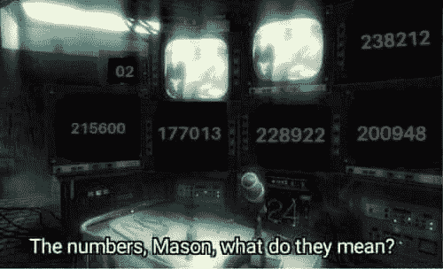

理解了数字，剩下的就来了。这些值通常是一个[特征嵌入向量](https://cloud.google.com/solutions/machine-learning/overview-extracting-and-serving-feature-embeddings-for-machine-learning)。

为了简单起见，大多数例子将集中在图像分类问题上，因为这对初学者来说是最熟悉的。

## 文章注释

为了保持这篇文章的简洁，我会尽可能地链接到其他文章，这样任何需要的额外阅读都可以单独完成。

本文将重点关注:

*   对这些提取的特征/嵌入意味着什么的直觉
*   一些示例应用

并将**而不是**集中在:

*   代码实现
*   重新解释迁移学习
*   网络是如何被训练的

在这篇文章的结尾，我希望复杂的模型看起来不那么神奇。

# 概述深度神经网络(DNNs)

Deep neural network forward pass — [source](https://towardsdatascience.com/how-to-build-your-own-neural-network-from-scratch-in-python-68998a08e4f6)

从根本上说，深度神经网络学习模式识别，我们将重点关注 CNN 分类器(卷积神经网络)的例子。它们可以自动提取图像中的特征。

中间层可以被解释为原始数据的经过处理的表示。

## 1.降维

给定原始的非结构化数据(例如来自图像的像素)，网络很难直接做出决定(对狗或猫进行分类)。

提取一个中间层作为图像的表示形式可以显著减少原始数据的大小，使其更有用，也更容易让更深的层最终决定输出

CNN 会降低维度，只提取重要的特征，然后做出决定。使用卷积图层提取重要要素后，数据会被传递到一个或多个完全连接的图层，这些完全连接的图层会接收高级别要素，从而更容易为最终输出做出决策。

与 224×224 = 50176 尺寸的原始输入图像相比，这些尺寸通常看起来像高级特征的尺寸 512。

> 这是浅层学习(常规机器学习)和深度学习之间的关键区别。我们可以对结构化数据/高级功能(如包含结构化数据的 CSV 文件)使用浅层学习，对原始非结构化数据(如音频、视频、图像、文本等)使用深度学习。

一旦数据成为高级特征，您可以使用浅层学习方法处理它，如逻辑回归或支持向量机更好地处理图像的小表示

您可以将网络末端的全连接层(fc_3、fc_4、…)视为逻辑回归层。

## 2.投射到更简单的空间

简单意味着问题更容易处理，简单可以是:*线性可分*，*与输出线性相关*，或者简单包含*可以直接用于决策的高级特征*

线性可分只是意味着更容易/可能画线。单个神经元可以画一条线，这就是为什么我们在一个 DNN 中需要许多神经元。

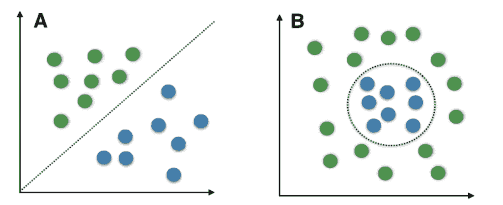

A: Linearly separable (can draw line), B: not linearly separable (can’t draw line)

如果起始特征(DNN 的输入)看起来像 **B** ，那么单个神经元不能将其分开，但如果需要，许多神经元可以画出接近圆形的东西。

> 仅供参考:事实证明，将网络做得更深更容易，而不是拥有一个有许多神经元的浅网络(因为那可能导致过度拟合)。

所发生的是，对于深度网络，输入空间( **B** )实际上得到*投影/变换*到另一个更容易处理(线性可分)的域( **A** )。所以神经网络只是让事情变得越来越简单，直到做出最终决定。如前所述，在最后一层，你甚至可以使用简单的机器学习方法，如逻辑回归或 SVM。

# 嵌入

嵌入/潜在向量/特征向量是表示关于我们的领域/任务的一些信息的向量，这些向量是网络的输出或网络中的中间值。

## 嵌入中的信息

嵌入包含的内容实际上归结于训练过程和损失函数。训练网络可以有许多目标，可以是使用 *softmax* 函数区分类别，使用对比学习度量、BERT 式训练将类别分开，或者只是让 GAN 鉴别器告诉我们图像是真是假。这些方法中的每一种(即使它们都具有相同的嵌入形状，但在这些嵌入中它们的值的意义完全不同。

考虑类数据也很重要。例如，一个面部识别网络被用来提取*有区别的*面部特征，这意味着它不应该关注面部毛发或眼镜，因为我们希望它识别同一个人，无论他们是否剃了胡子。

## 例子

本节将举例说明

如果你对编码器-解码器范例更熟悉，那么就把嵌入想象成编码

编码器-解码器将有效地将数据压缩到 z 潜在向量(您仍然可以称之为嵌入)。

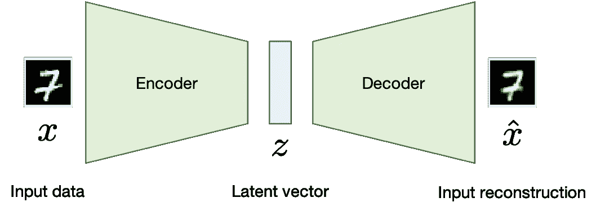

Encoder-decoder

如果你有任何自然语言处理的经验，那么你可能听说过单词嵌入。

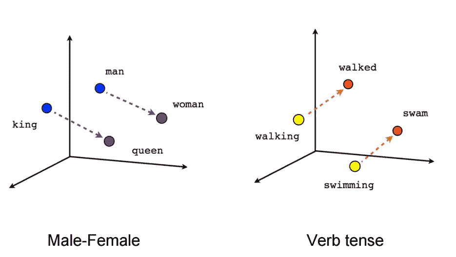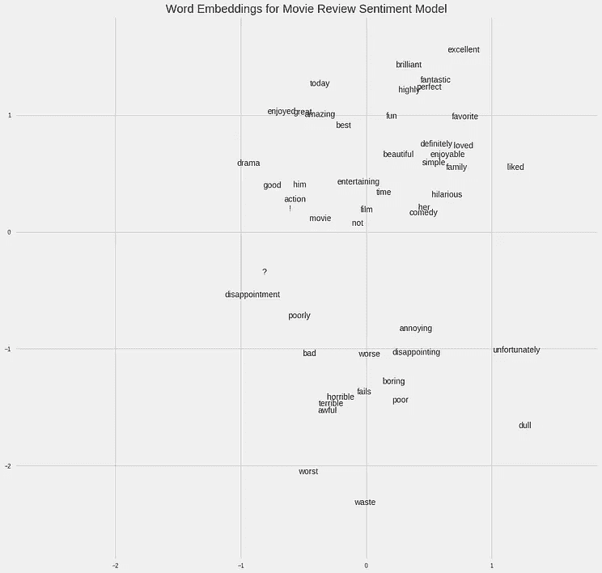

Word embedding space

嵌入是一种比一键向量更有意义的表示类的方式。一键嵌入是嵌入的子集。单词嵌入的想法是让单词的嵌入向量在意义上相似，非常接近，而远离其他单词。C *lose* 和 *far，*表示距离度量，这可以是任何距离度量，例如 L2 距离(欧几里德距离)或余弦距离。使用余弦距离的一个特性是它不依赖于嵌入向量的大小，而是依赖于方向。

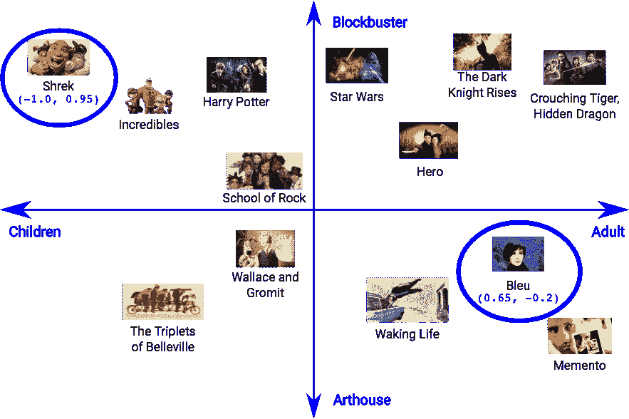

An example of movie embedding in two-dimensional space — taken from [here](https://cloud.google.com/solutions/machine-learning/overview-extracting-and-serving-feature-embeddings-for-machine-learning)

自动编码器的思想是用一个特定领域的编码器将输入压缩成最重要的特征。证明这一点的证据是，解码器可以以某种方式重建输入，这意味着——正如*信息论中所述——*固定大小的嵌入向量(或潜在向量)必须能够容纳重建压缩输入所需的信息。

关键点:嵌入向量中的数字并不总是[解开](https://arxiv.org/abs/1802.05312)；每一个都与上面的电影嵌入直接对应(尺寸*大片*和*成人*)。
它不一定是人类可读的，但它应该包含信息，只要嵌入后的神经网络层**能够理解它，那么它就应该工作。
有意义是什么意思？嗯，这取决于用例。如果任务是人脸识别，那么相似人脸的嵌入应该具有较短的距离，视觉上不同的人脸在嵌入空间中应该具有较大的距离。**

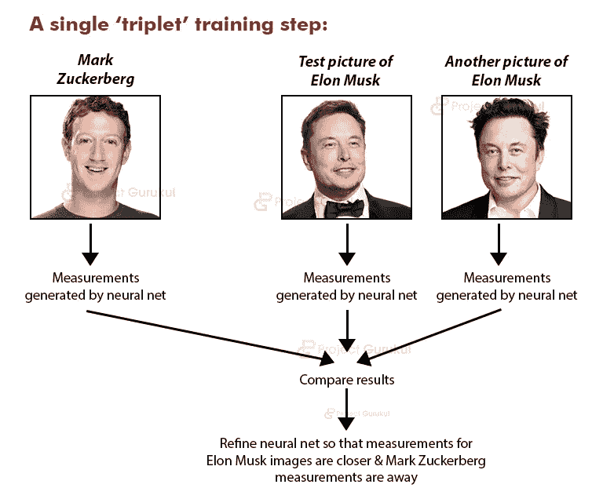

Face recognition objective using triplet loss

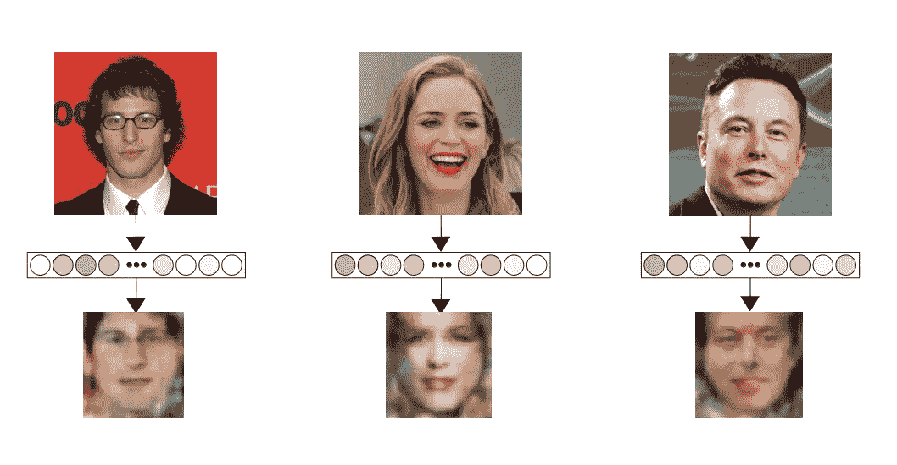

Extracting face embeddings

# 使用嵌入

乐趣开始的地方

我将查看一些稍微复杂一点的模型的例子，并展示拥有不同类型的嵌入的力量。

## **多扬声器** [**TextToSpeech 工具箱**](https://github.com/CorentinJ/Real-Time-Voice-Cloning)

它扩展了常规的 TextToSpeech，但以扬声器嵌入为条件，允许您选择声音。这是通过一个 SpeakerEncoder 网络来实现的，该网络经过训练，可以提取许多声音的风格嵌入，迫使它提取分离扬声器的特征，如音色和音高，并忽略内容。而另一个编码器只负责内容。拥有两个编码器的强大功能意味着内容和说话声音不再纠缠不清，允许你为同一个句子交换说话声音。

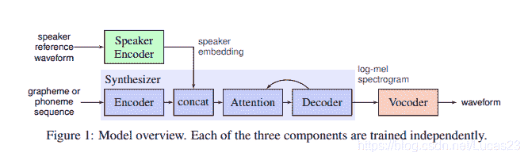

TextToSpeech toolbox architecture. [https://arxiv.org/pdf/1806.04558.pdf](https://arxiv.org/pdf/1806.04558.pdf)

## **图像翻译(**[**FUNIT**](https://nvlabs.github.io/FUNIT/)**paper)**

这种架构旨在从一幅图像中提取姿态，并将其应用到另一幅图像中。它通过使用 2 个编码器和 1 个解码器工作，每个编码器输出嵌入，然后一个解码器(蓝色)从这两个嵌入中重建图像回到像素。

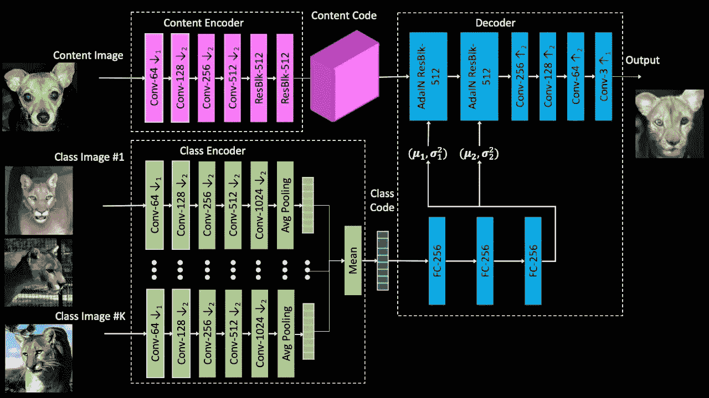

FUNIT architecture

一个*内容编码器*(粉色)负责动物的姿势，它接收左边的图像，并输出包含动物姿势的嵌入。
*类编码器*(绿色)负责动物的品种/风格，它拍摄一个或多个图像，并输出品种的平均嵌入，如果它们看起来足够相似，你甚至可以合并不同的动物。最后，*解码器*将这两种嵌入内容转换回图像。
你甚至可以在这里尝试互动演示[。](http://nvidia-research-mingyuliu.com/ganimal)

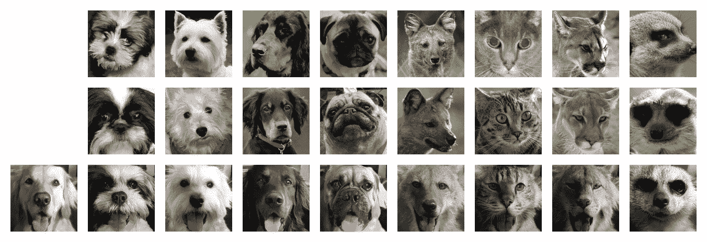

FUNIT example output

如果你对 GANs 感兴趣(比如 StyleGAN:生成真实人脸和深度假像的酷酷的人工智能),我强烈建议你阅读这篇文章:A- [看 GANs 的新方式](https://towardsdatascience.com/a-new-way-to-look-at-gans-7c6b6e6e9737)

# 将所有东西整合在一起

现在为了测试你的理解，考虑这个问题:如果我有许多图像，我想把相似的图像聚集在一起，会怎么样？假设这些图像是 512x512=262144 像素，逐像素比较既没有效果，也没有效率。

看看你是否能想出一个方法，花一分钟思考，然后继续阅读。

Photo by [Elijah Hiett](https://unsplash.com/@elijahdhiett?utm_source=medium&utm_medium=referral) on [Unsplash](https://unsplash.com?utm_source=medium&utm_medium=referral)

想好了吗？以下是我的看法:

一种可能的解决方案是使用预先训练的模型来提取特征，这些特征将具有固定长度的特征向量。因此，对于每幅图像，我们将其通过特征提取器网络，并输出固定长度的特征向量(例如 1024 个值)。例如，我们将图像从 512x512=262144 个值减少到 1024 个值。现在我们有了这 1024 个特征，我们可以使用简单的浅层学习(SVM，线性回归等..)或某种类型的聚类(k 均值、均值漂移等)。
毕竟原来的深度学习模型在特征提取器之后只有一个全连接层，基本上是一个逻辑回归分类器。

这样做会产生类似下图的图像:

Images mapped for similarity using t-SNE, based on Google ML

# 摘要

*   最后几层只是逻辑回归，你也可以使用支持向量机
*   嵌入的意义取决于训练过程和损失函数
*   你可以用创造性的方式使用这些嵌入，而不仅仅是分类，这在 GANs 中特别有用

# 资源

*   [**“为机器学习提取和提供特征嵌入**](https://cloud.google.com/solutions/machine-learning/overview-extracting-and-serving-feature-embeddings-for-machine-learning) **”:这本谷歌指南包含了本文的大部分观点**
*   **嵌入:** [**神经网络嵌入解释**](https://towardsdatascience.com/neural-network-embeddings-explained-4d028e6f0526)
*   **[**《迁移学习:初学者指南**](https://www.datacamp.com/community/tutorials/transfer-learning)**
*   ****表达自然功能的深层网络的力量:越深越容易****
*   ****[https://github.com/instillai/deep-learning-roadmap](https://github.com/instillai/deep-learning-roadmap)****

# ****代码资源****

*   ****[Colab 笔记本“迁移学习与微调”](https://www.tensorflow.org/tutorials/images/transfer_learning)****
*   ****[**用计算机视觉模型迁移 Keras 中的学习—机器学习掌握**](https://machinelearningmastery.com/how-to-use-transfer-learning-when-developing-convolutional-neural-network-models/)****
*   ******进行练习:**[**uda city/deep-learning-v2-py torch**](https://github.com/udacity/deep-learning-v2-pytorch/blob/master/transfer-learning/Transfer_Learning_Solution.ipynb)****

****这是我的第一篇文章，我希望你受益，并随时留下反馈和建设性的批评。祝你愉快。****

**** [## Mlearning.ai 提交建议

### 如何成为 Mlearning.ai 上的作家

medium.com](/mlearning-ai/mlearning-ai-submission-suggestions-b51e2b130bfb)****