# 直觉线性代数小抄

> 原文：<https://medium.com/mlearning-ai/intuitional-linear-algebra-cheatsheet-e6df994666c?source=collection_archive---------1----------------------->

这篇文章回顾了机器学习入门的基础线性代数。

**注**:会随着时间发展。欢迎建设性的意见。

# 介绍

线性代数是数学的一个分支，它提供了一种简洁地表示和操作线性方程组的方法。例如，考虑下面的一组等式:

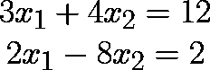

用线性代数表示法，它可以写成:

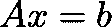

其中:

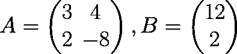

这些概念有几何意义。理解和想象他们的直觉有助于实践者对问题有一种感觉，并提出适当的解决方案，而不是仅仅遵循一套算术步骤。

# 线性代数基础

## 向量

故事从**载体**开始。作为计算机科学人员，我们将它们视为一系列值。例如，向量可以显示房子的不同特征的值，如面积、离市中心的距离、是否在主要街道之一、价格和其他特征。向量用一个箭头表示，箭头的终点是由这些元素的值决定的点。下图是 **2D** 空间中的矢量【T4【3，3】。我们考虑从原点**【0，…，0】**开始的所有向量。

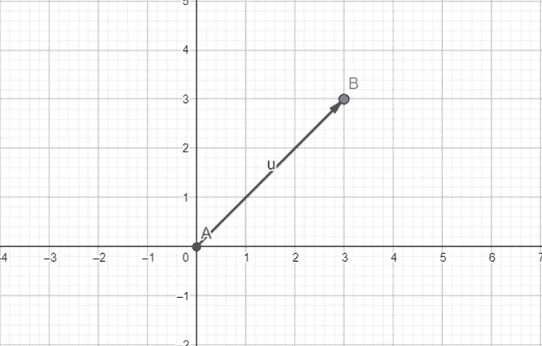

下面的例子展示了 **3D** 空间中的另一个向量 **[-1.01，5.51，1.67】**。红色、绿色和蓝色分别表示 **x** 、 **y** 和 **z** 轴。

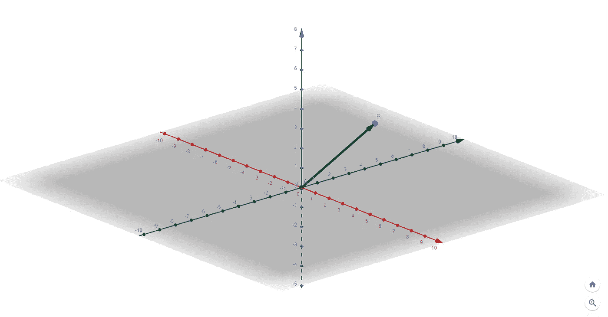

## 向量加法和乘积运算

**对于添加矢量**，它们必须具有**相同的尺寸**。**具有相同的维数意味着具有相同数量的元素(对于向量)**。这意味着它们应该在同一个空间。为了将它们相加，我们只是将它们相应的元素相加。请参见以下示例:

**例 1:**

> v1 = [1，3，5]
> 
> v2 = [-2，4，1]
> 
> v1 + v2 = [-1，7，6]

**例 2:**

> v1 = [3，4]
> 
> v2 = [4，1]
> 
> v1 + v2 = [7，5]

从几何角度来看，

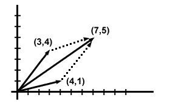

[https://www.sparknotes.com/physics/vectors/vectoraddition/section2/](https://www.sparknotes.com/physics/vectors/vectoraddition/section2/)

在减法中，只有第二个向量被认为是求反的(它的所有值都被求反)。

矢量的**长度**或**大小**是一个数字，显示它在其所在的空间中延伸了多少(或**矢量末端距原点**的距离)，计算如下:

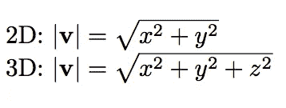

在**点积(标量积)**上，相应的元素相乘并求和，最终结果只是一个值。在几何视图中，它是两个向量的长度与它们之间的角度的余弦相乘的结果。正如我们所知，90 度的余弦是零，点积在寻找**正交**或**垂直**向量时变得很方便。下图演示了点积。

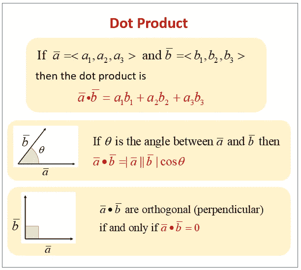

[https://www.onlinemathlearning.com/dot-product.html](https://www.onlinemathlearning.com/dot-product.html)

为了找到两个向量之间的角度，我们可以相信我们在点积中看到的，所以:

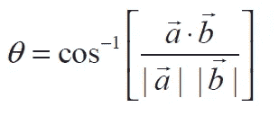

两个向量的点积的数量可以被解释为在源向量的一个方向上的向量的大小。当我们想理解本文后面将要谈到的投影时，这一点很重要。我想我们可以重新思考一下，为什么我们要将两个向量的点积结果除以我们想要投影的向量的大小。

## 线性组合

它是由一组项通过将每一项乘以一个**常数** ( **系数**)并将结果相加而构造的表达式。下图演示了这一概念:

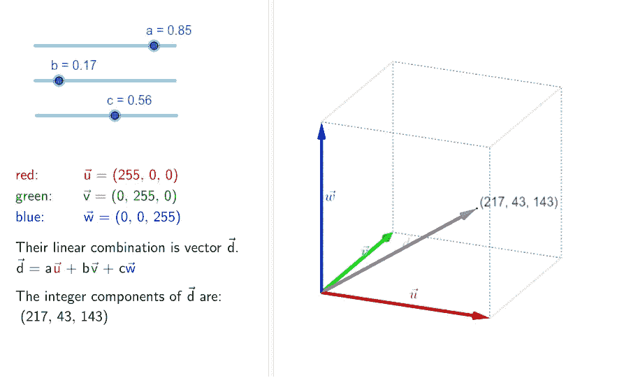

[https://www.bull2022mall.com/?category_id=2700937](https://www.bull2022mall.com/?category_id=2700937)

## 基本向量

它们是单位向量(长度为 1 ),空间中的每个向量都可以由它们的线性组合构成。在 **2D** 空间中， **i [1，0]** 和 **j[0，1]** 向量可以构建任意向量。在 **3D** 空间中， **i [1，0，0]** ， **j [0，1，0]** ， **k[0，0，1]** 可以在该空间中构建任意向量。下图显示了三维空间的基本向量，以及如何用它们的线性组合**生成一个向量。**

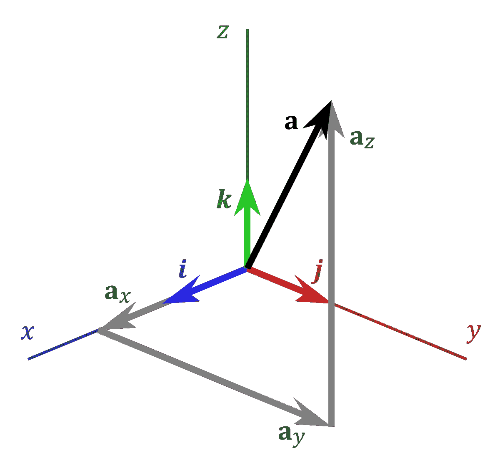

[https://en.wikipedia.org/wiki/Standard_basis](https://en.wikipedia.org/wiki/Standard_basis)

例如，在 3D 空间中，考虑可以如下构建的 **v1(5，-1，0.5)** 向量:

> v1 = [5，-1，0.5]= 5 ***I**+-1 ***j**+0.5 ***k**
> 
> = 5 * [ **1 【T37，0，0] + -1 * [0， **1 【T39，0】+0.5 *[0，0， **1******
> 
> = [5, 0, 0] + [0, -1, 0] + [0, 0, 0.5] = [5, -1, 0.5]

## 线性独立性

当两个向量不在同一直线上时，称为线性无关。换句话说，只有当系数为零时，它们的线性组合才等于零。当我们想要建造一个像我们的 3D 空间一样的空间时，这是需要的。这个空间可以用 I、j 和 k 来构建，它们是线性独立的。这样考虑，当我们在 2D 空间中有下列向量时:

> v1 = [1，2]
> 
> v2 = [2，4]

这些向量的每个组合都以 y = 2x 线上的向量结束。这些向量正好在一条线上结束。但是，下面的可以建立一个平面，因为他们是线性独立的。

> v1 = [1，2]
> 
> v2 = [-2，1]

让我们来检查一下:

> a*v1 + b*v2 = 0
> 
> [a，2a] + [-2b，b] = [a-2b，2a+b] = [0，0]
> 
> a-2b = 0 =>a = 2b ( **1** )
> 
> 2a+b = 0 = > 2a = b = > a =(1/2)b(**2**

从(1)和(2)中，我们将得到:(a = b = 0)

## 线性转换

线性变换是保持先前空间的线性结构的变换。观察这些变换的一个好方法是，先前空间中在一条线上的两个点，在新空间中也会在一条线上。数字的比例不会变。下图可以给出一个更好的想法:

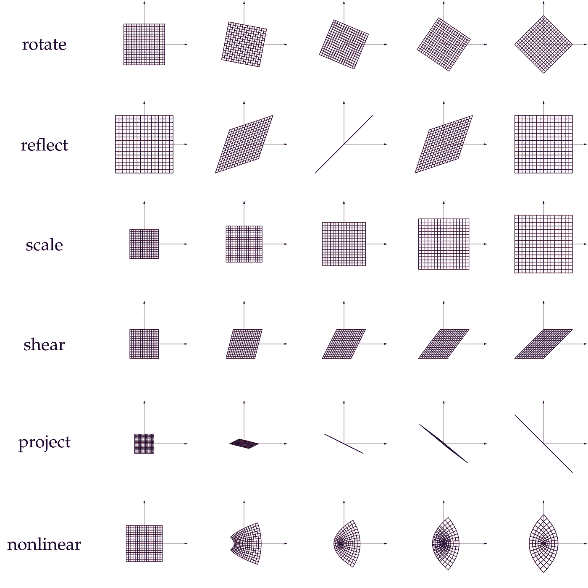

[https://ru.mathigon.org/course/linear-algebra/linear-transformations](https://ru.mathigon.org/course/linear-algebra/linear-transformations)

## 矩阵

直觉上，它们被认为是改变空间基本向量的变形金刚。矩阵是向量的列，每一列都可以被认为是新的对应基向量。下图显示了一个 3x3 矩阵:

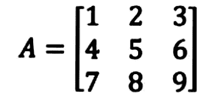

A 3x3 matrix

## 矩阵乘法

将一个或多个向量映射到矩阵变换到的空间中的相应向量。请注意，向量的维数必须对应于矩阵(转换器)的维数。下图显示了如何进行计算:

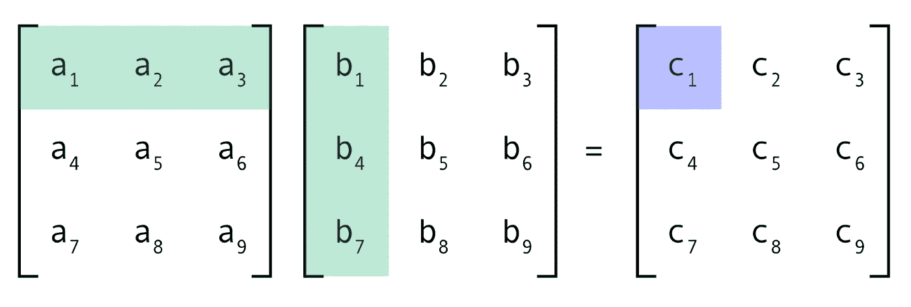

[https://charchithowitzer.medium.com/matrix-multiplication-why-is-it-a-big-deal-cc8ef7490008](https://charchithowitzer.medium.com/matrix-multiplication-why-is-it-a-big-deal-cc8ef7490008)

第一个矩阵中的每一列定义了新的坐标系基向量。在第二个矩阵中，每一列都是向量，而在结果矩阵中，每一列都是新坐标系中的变换向量。下图显示了矩阵乘法中发生的变换的直观性。

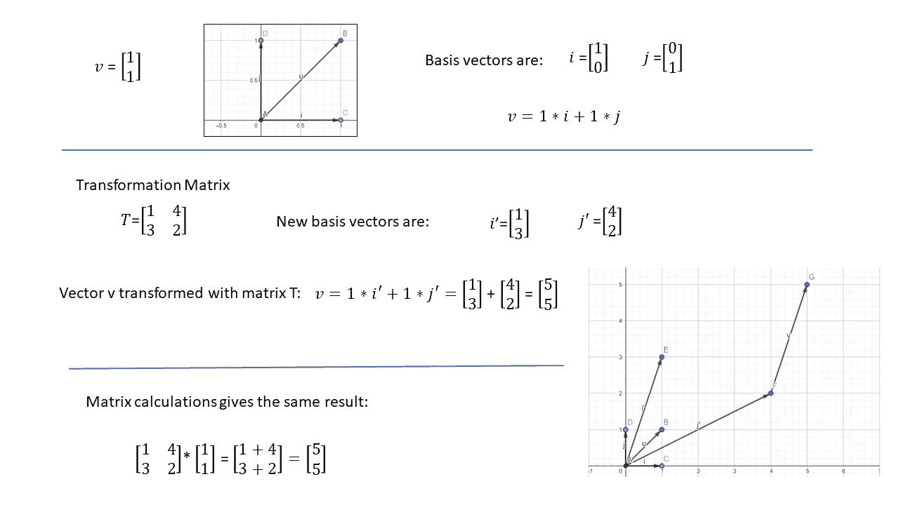

Matrix Multiplication intuition

矩阵乘法最重要的性质是:

**A*B！= B*A**

## 矩阵的转置

它是翻转对角线上的矩阵或将行转换为列，反之亦然。下面的例子展示了它是如何工作的。

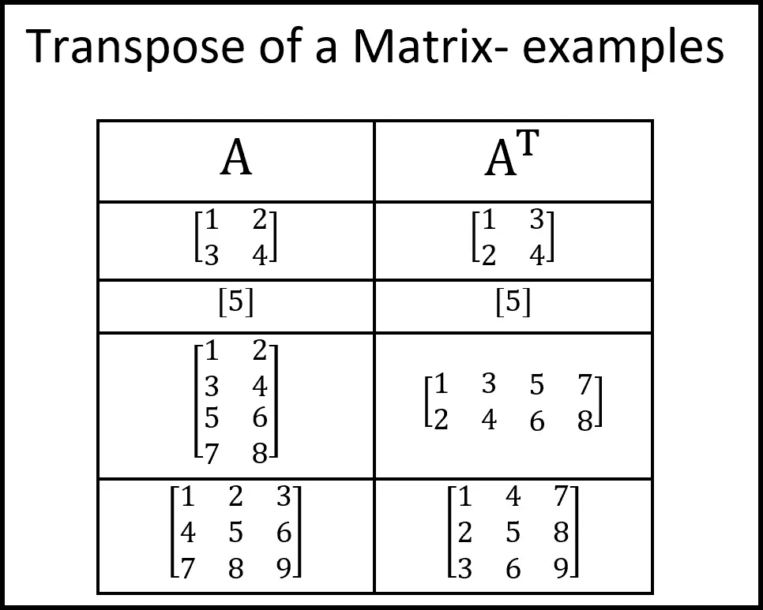

[https://andymath.com/transpose-matrix/](https://andymath.com/transpose-matrix/)

## 矩阵的行列式

我们知道矩阵背后的直觉是一种转换。当我们转型时，我们确实在改变形状。矩阵的行列式是单值，表示面积/体积/？在 2D/3D/nD 空间中，应用变换时应用的缩放器。记住当我们在有**I【1 0】**和**j【0 1】**基矢的基坐标系中，用 **i** 和 **j** 构建的单位正方形的面积是 1。下图很好地展示了它的直觉。行列式 1 表示面积不变，小于 1，大于 0 表示压扁。负数表示翻转发生在转移矩阵中。

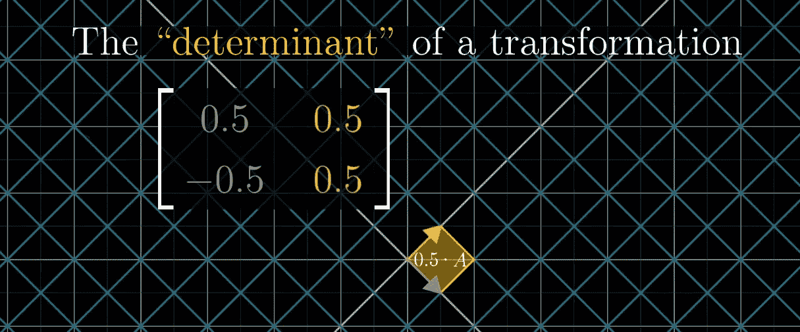

[https://www.youtube.com/watch?v=Ip3X9LOh2dk](https://www.youtube.com/watch?v=Ip3X9LOh2dk)

当它为零时，它将传递一条线上的所有向量，看下面的例子。行列式等于零的矩阵称为“**奇异矩阵**”

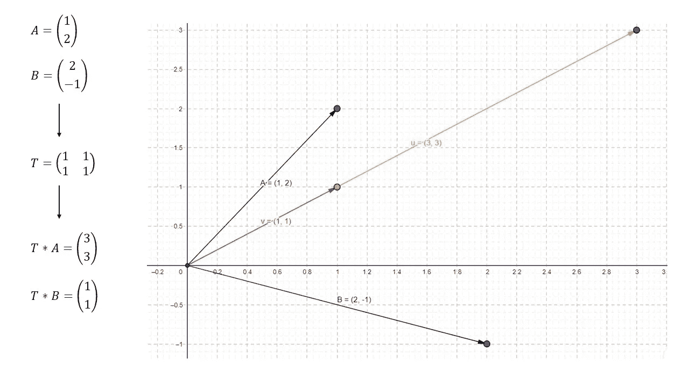

我们可以从不同的角度来看它。当矩阵的行列式不为零时，这个事实表明矩阵的列向量是线性无关的。

对于二维矩阵，行列式的计算如下:

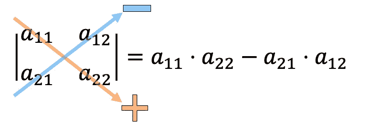

[https://www.algebrapracticeproblems.com/determinant-of-a-2x2-matrix/](https://www.algebrapracticeproblems.com/determinant-of-a-2x2-matrix/)

三维矩阵的行列式:

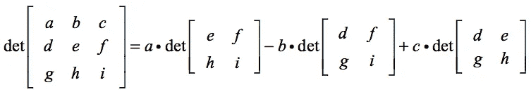

[https://www.chilimath.com/lessons/advanced-algebra/determinant-3x3-matrix/](https://www.chilimath.com/lessons/advanced-algebra/determinant-3x3-matrix/)

## 矩阵的逆矩阵

我们复习线性代数的第一件事是解线性方程组。矩阵的逆矩阵通常用于求解线性方程组。需要它的原因，考虑 A 是一个矩阵:

> A^-1 =我

矩阵与其逆矩阵相乘的结果是单位矩阵。还有，如果我们把每个向量都乘以一个单位矩阵，结果就是它本身。

考虑以下线性方程组:

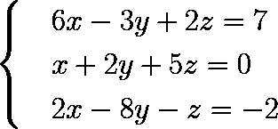

它可以表述为:

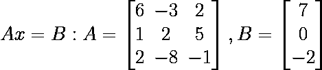

为了解这个方程，需要矩阵 A 的逆矩阵。这是为 2D 和 3D 矩阵计算的，如下所示:

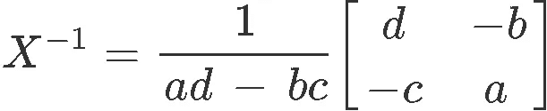

[https://www.studypug.com/algebra-help/the-inverse-of-a-2-x-2-matrix](https://www.studypug.com/algebra-help/the-inverse-of-a-2-x-2-matrix)

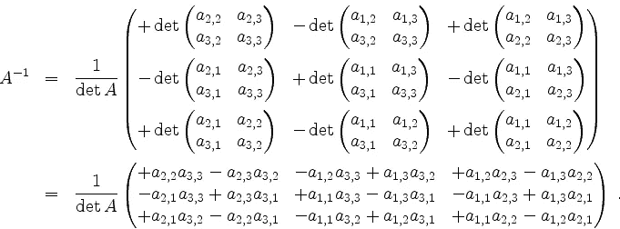

[https://mo.mathematik.uni-stuttgart.de/inhalt/beispiel/beispiel1113/](https://mo.mathematik.uni-stuttgart.de/inhalt/beispiel/beispiel1113/)

反正这些只是为了看，不然计算机给我们算这些。但是，知道引擎盖下发生了什么将是有见地的。

## 推断

投影依赖于我们之前提到的点积。我们看到这个值可以解释为每个向量方向上的向量大小。但是，在这个例子中，我们想把一个向量镜像到另一个向量上，所以镜像另一个向量的向量应该是一个单位向量，正因为如此，它的感恩被用于除法。下图显示了它的直觉。

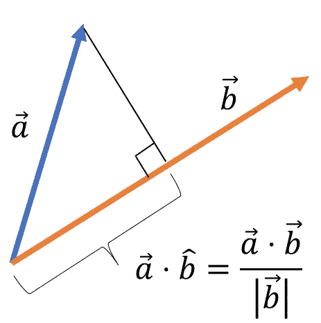

[https://emedia.rmit.edu.au/learninglab/content/v5-projection-vectors](https://emedia.rmit.edu.au/learninglab/content/v5-projection-vectors)

## 特征向量和特征值

以下等式显示了如何找到矩阵的特征向量和值:

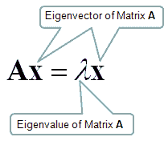

直觉是，对于矩阵 A，我们想找到向量 x，当 x 用那个矩阵变换时，它自己用一个值缩放。

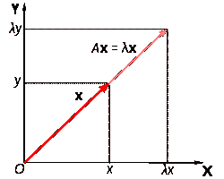

如图所示，这变得很重要，因为通过该变换，特征向量保持 x 和 y 之间的比率。当使用**主成分分析(PCA)** 进行特征约简时，这在数据科学中很重要，通过将这些特征向量用于数据协方差，可以选择最重要的特征，并且为了减少计算量，可以将具有可忽略影响的其他特征放在一边。直觉是，如下图所示，特征约简将保持我们可用于学习的数据的方差。因此，我们可以在 2D 工作，而不是三维空间。

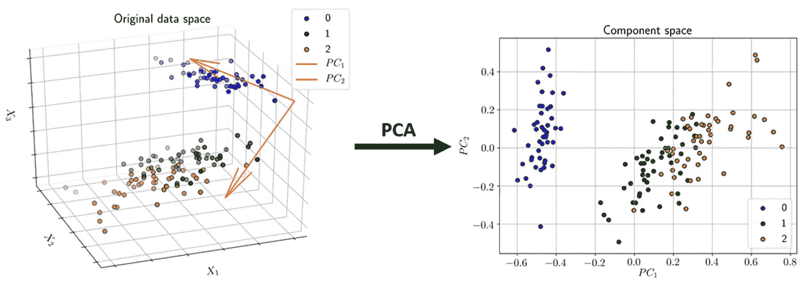

[https://www.mdpi.com/1424-8247/14/8/758/htm](https://www.mdpi.com/1424-8247/14/8/758/htm)

## 齐次坐标

在这个概念中，添加了一个坐标来简化有用转换的表示。它在**计算机图形学**中非常有用。此外，在用于图像数据集的**数据扩充**中，使用了这些技术。例如，对于 2D 向量，将 1 加到向量上，变换矩阵可以被认为如下:

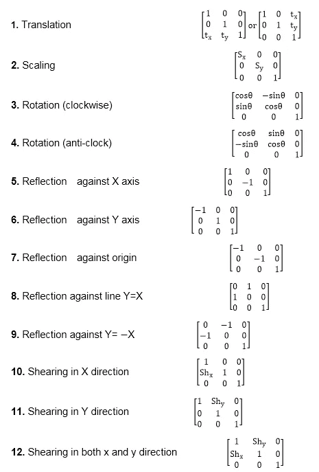

[https://www.javatpoint.com/computer-graphics-homogeneous-coordinates](https://www.javatpoint.com/computer-graphics-homogeneous-coordinates)

**数据扩充**意味着增加我们拥有的数据数量。如果我们没有足够的数据，我们将在**过度拟合**问题中结束，其中模型将准确地记住数据集，而不是学习数据中的模式。

# 结论

在这篇文章中，我们回顾了理解机器学习入门所需的直觉线性代数。在开始学习机器学习之前，要对线性代数有很好的了解。

 [## Mlearning.ai 提交建议

### 如何成为 Mlearning.ai 上的作家

medium.com](/mlearning-ai/mlearning-ai-submission-suggestions-b51e2b130bfb)