# 逆摆—深度强化学习

> 原文：<https://medium.com/mlearning-ai/inverse-pendulum-deep-reinforcement-learning-a22689e14e34?source=collection_archive---------2----------------------->

在这篇文章中，我将在 CartPole 环境中比较不同的深度强化学习方法。首先，我将通过基本方程和背景。然后我们将解释我们使用的方法——一个随机的方法作为这个项目的基线，深度 Q 学习，带记忆回放的深度 Q 学习，以及双重深度 Q 学习。我将比较每种方法，看看哪种方法的性能最好。
完整的代码可以在[这里](https://github.com/shirkozlovsky/Deep-Learning-Course.git)找到。

## 内容:

## 1.摘要

## 2.导言和背景

2.1.环境
2.2。q 学习
2.3。深度 Q 学习(DQN)
2.4。回放记忆
2.5。双重深度 Q 学习

## 3.代码和参数

3.1.基础搜索
3.2。q-学习
3.3。深度 Q 学习(DQN)
3.4。深度 Q 学习带回放记忆
3.5。双 Q 学习

## 4.结果

4.1.基本搜索
4.2。深度 Q 学习
4.3。带回放记忆的深度 Q 学习
4.4。具有重放记忆的双 Q 学习

## 5.结论

## 6.参考

# 2。简介和背景

## 2.1 环境

CartPole，也称为倒立摆，是一种游戏，你试图尽可能长时间地平衡杆子。据推测，在杆子的顶端，有一个物体使它不稳定，很可能摔倒。该任务旨在左右移动手推车，以便在可能的情况下使杆子能够站立(在一定角度内)。

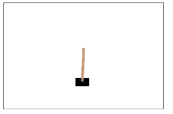

状态空间由四个值表示:小车位置、小车速度、磁极角度和磁极尖端的速度。动作空间由两个动作组成:向左移动或向右移动。杆保持直立的每个时间步长提供+1 的奖励。当柱子偏离垂直方向超过 15 度，或者手推车偏离中心超过 2.4 个单位时，该集结束。

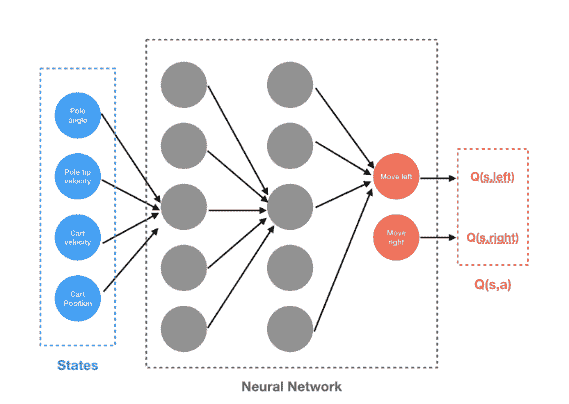

## 2.2.q 学习

强化学习是一种机器学习方法，它基于从环境中获得的奖励，而不是例子。代理和环境不断交互，如图 2 所示。在给定环境状态及其策略的情况下，代理决定执行哪些操作。代理人的行动改变了环境的状态，并导致了适当的回报。代理人的目标是学习一种策略，使其在长期内获得最大的回报。

Q 值 Q(s，a)是每个状态-动作对的预期回报。

国家-行动对的潜在未来回报描述为(贝尔曼方程):

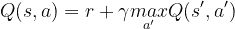

其中γ∈[0，1]是折扣因子。Q(s，a)是当我们处于状态并采取行动时的期望回报。在通过做出一个动作(a)获得一个奖励(r)之后，我们会到达另一个状态(s’)。然后，我们只需查找 Q 表，找到在状态(s’)下采取的最佳行动。因此，这里的想法是我们不需要考虑整个未来的行动，而只需要考虑下一个时间点的行动。

Q(s，a)的基本更新规则由下式给出:

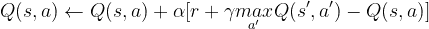

学习率在哪里。这个规则基于我们认为我们对 Q(s，a)的了解和当前事件告诉我们的 Q(s，a) *之间的差异。*

就我们的情况而言，当想要在给定的状态下采取任何行动时，使我们的回报最大化的政策:

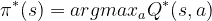

因为我们没有访问 Q*的权限，所以我们将创建一个并将其训练为类似 Q*的形式。

某些策略的每个 Q 函数都服从贝尔曼方程，因此训练更新规则:

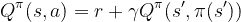

等式两边的差异称为时间差异误差:

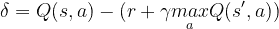

为了最小化这种误差，我们将使用 Huber 损失。当误差较小时，Huber 损失类似于均方误差，但当误差较大时，类似于平均绝对误差，这使得当 Q 的估计值非常嘈杂时，Huber 损失对异常值更加稳健。我们通过从重放存储器中采样的一批转换 B 来计算:

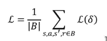

其中:

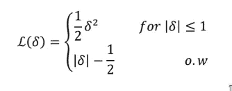

## 2.3.深度 Q 学习(DQN)

我们的环境是确定性的，所以为了简单起见，这里给出的所有方程也是确定性的。

我们的目标是制定一项政策，试图最大限度地提高折扣和累积奖励:

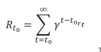

其中γ∈[0，1]*T3 是折扣因子。*

为了解决这个问题，我们需要一些东西来近似一个函数，该函数接受一个状态-动作对(s，a ),并返回该对的预期回报。这就是深度学习的用武之地。它以仅根据训练数据逼近函数而闻名。

在深度 Q 学习中，我们使用神经网络来逼近 Q 值函数。状态作为输入给出，所有可能动作的 Q 值作为输出产生。

使用深度 Q 学习网络(dqn)进行强化学习的步骤包括:

*   所有的体验都由用户存储在存储器中
*   下一个动作由 Q 网络的最大输出决定
*   这里，损失函数是预测 Q 值和目标 Q 值的均方误差— Q*。这基本上是一个回归问题。然而，我们不知道这里的目标或实际值，因为我们正在处理一个强化学习问题。(王等，2016)

## 2.4.重放记忆

DQN 的主要问题之一是稳定。当我们将观察结果输入我们的网络时，我们的网络会对过去的经验进行归纳。

回放记忆有助于我们了解观察到的情况下应该采取什么行动。这就是为什么重放缓冲器有助于稳定训练。(刘、邹，2019)

## 2.5.双重深度 Q 学习

该解决方案包括使用两个独立的 Q 值估计器(Q，Q’)，其中一个用于更新另一个。使用这些独立的估计，我们可以无偏 Q 值估计的行动选择使用相反的估计。因此，我们可以通过从有偏差的估计中分离出我们的更新来避免最大化偏差。

基本 Q 学习的更新过程是:

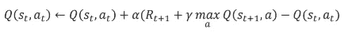

学习率在哪里。

对于双 Q 学习:

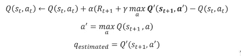

Q 函数用于选择具有下一状态的最大 Q 值的最佳动作 *a* ，而 Q’函数用于通过使用上面选择的动作 a*T3 来计算期望的 Q 值。(哈瑟尔特、古埃兹和西尔弗，2016 年)*

# 3.代码和参数

如前所述，状态数为 4(小车位置、小车速度、极角和极尖速度)，动作数为 2(左、右)。

我们选择 100 集，DQN 50 个隐藏节点，学习率 0.001

## 3.1.基本搜索

这部分我们是这个项目的基线。

## 3.2.q 学习

这是所有方法的基类。它包含了撑杆跳的环境，我们想玩的游戏的数量(集)。

该函数获取:

*   env——钢管混凝土柱的开放式人工智能健身环境
*   模型—我们想要运行的模型
*   γ—γ= 0.9
*   ε——代表随机行为相对于由行为者在事件中积累的现有“知识”所告知的行为的比例。在玩游戏之前，代理没有任何经验，因此通常会将 epsilon 设置为较高的值，然后逐渐降低其值。
*   eps_decay —当代理学习时，ε减小的速度。
*   重放—我们是否要使用重放内存。
*   replay_size —我们需要的内存大小。
*   双——如果我们想不想使用双 DQN。
*   标题—图表的标题
*   n _ update 参数指定更新目标网络的时间间隔。

## 3.3.深度 Q 学习(DQN)

DQN 类实现是一个在 PyTorch 中实现的神经网络，它有两个主要方法，预测和更新。网络将代理的状态作为输入，并返回每个动作的 Q 值。代理选择最大 Q 值来执行下一个操作。

该函数获取:

*   state _ dim 状态维度
*   action _ dim 操作维度
*   hidden _ dim 隐藏层的尺寸
*   α—学习率(0.001)

这个 NN 的架构是一个线性层(state_dim，hidden_dim)，然后是 LeakyReLU，然后是另一个线性层(hidden_dim，2∙ hidden_dim)，LEakyRelu，linear (2∙ hidden_dim，action_dim)

我们使用优化的亚当。

## 3.4.具有重放记忆的深度 Q 学习

体验回放将代理的体验存储在内存中。成批的经验是从记忆中随机抽取的，并用于训练神经网络。这种学习包括两个阶段——获得经验和更新模型。重放的大小控制了用于网络更新的体验的数量。内存是一个数组，存储代理的状态、奖励和动作，以及动作是否完成游戏和下一个状态。

## 3.5.双 Q 学习

Q 值将取自这个新网络，这意味着反映主 DQN 的状态。然而，它没有相同的权重，因为它只在一定数量的集后更新。

# 4.结果

## 4.1.基本搜索

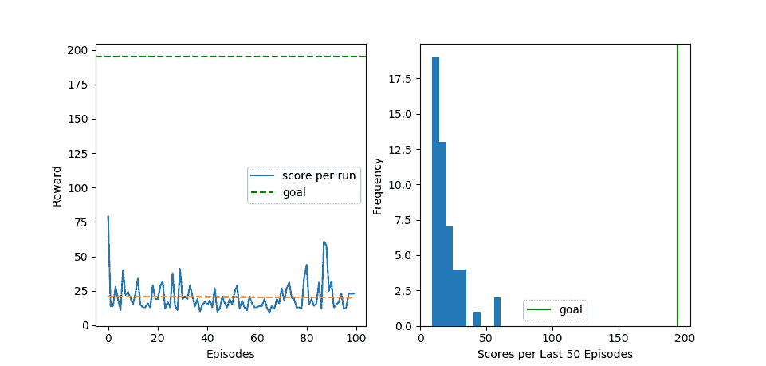

正如我们所见，因为这个策略是随机的，所以不可能解决这个问题。代理没有从他的经验中学习。平均性能低于 10 级。

## 4.2.深度 Q 学习

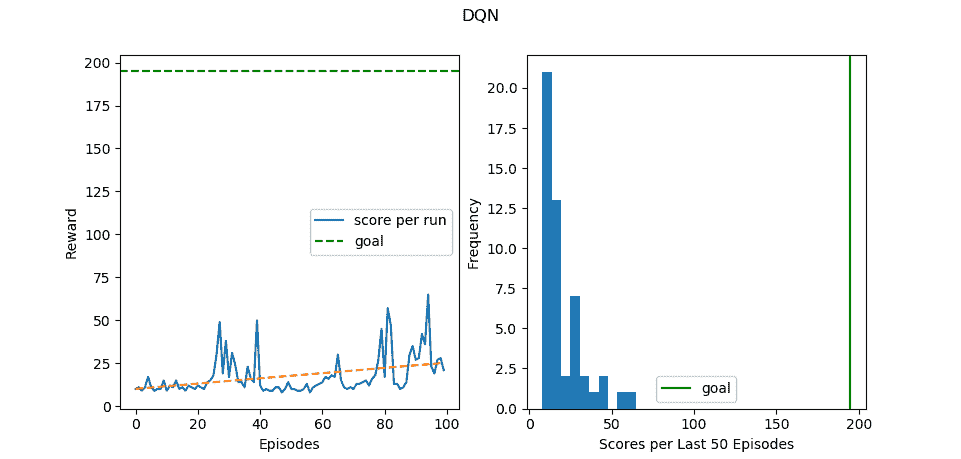

正如我们所看到的，代理的性能提高了。我们走了将近 100 步。我们可以看到，性能随着时间的推移而提高，趋势线为正。但是，代理仍然没有能力达到目标。

## 4.3.具有重放记忆的深度 Q 学习

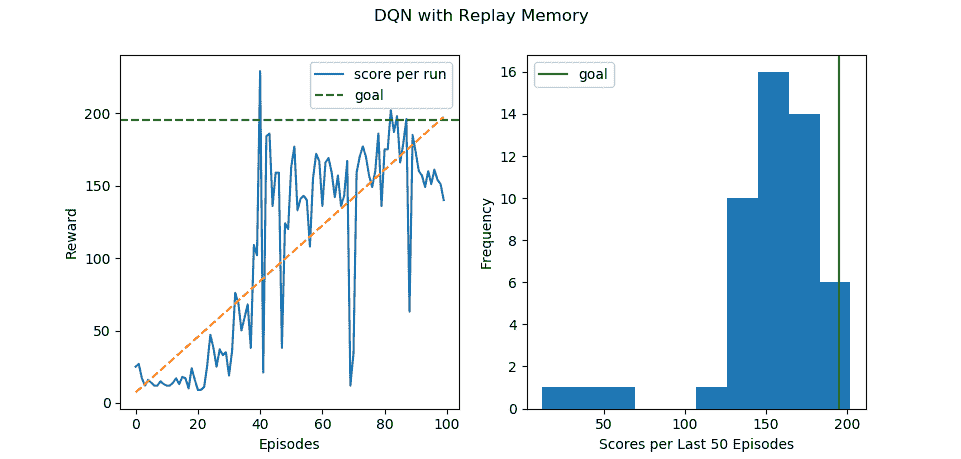

与只记住最后一个动作的神经网络相比，具有重放功能的神经网络更加健壮。我们可以看到代理的性能显著提高。业绩随着时间的推移而增加，趋势线是正的。代理达到目标，但看起来不稳定。

## 4.4.具有重放记忆的双 Q 学习

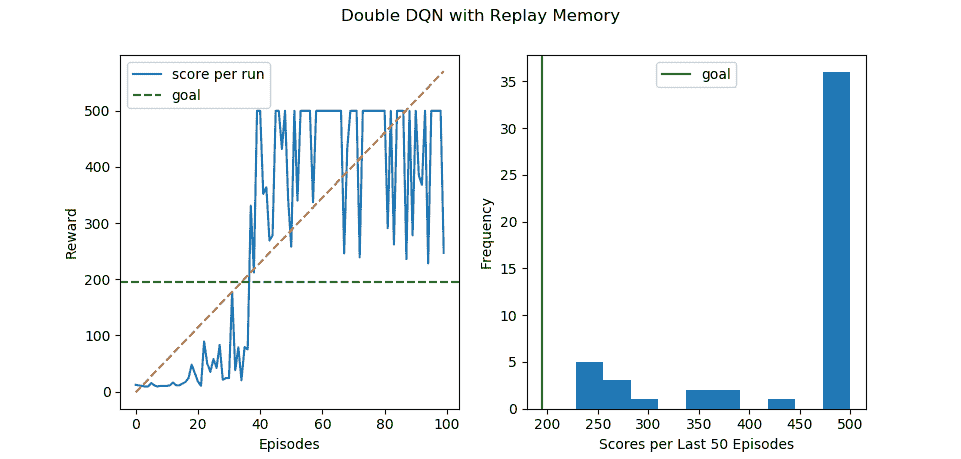

这里我们可以看到，代理仅在 40 集之后就实现了目标，它是稳定且健壮的。代理人得到 500 英镑的高额报酬。

# 5.结论

随着我们改进方法，我们看到了更好的结果。从我们实现的方法来看，给出最健壮、稳定和最高回报的方法是具有重放记忆的双 Q 学习。我们检查的最低效的方法是随机方法。当然，我们可以通过添加更多功能或尝试另一种方法(例如，软更新)来改善我们的结果。

# 6.参考

1.  用于深度强化学习的决斗网络结构。*2016 年第 33 届 ICML 国际会议马赫学会*。2016;4(9):2939–2947.
2.  记忆回放在强化学习中的作用。 *2018 年第 56 届年度通信控制计算机会议。2019:478–485.多伊:10.1109/阿勒顿。36800.68668686661*
3.  哈塞尔特 H 范，格斯 A，银 d。双 DQN.pdf。*第 30 届 AAAI 会议纪要。2016:2094–2100.*