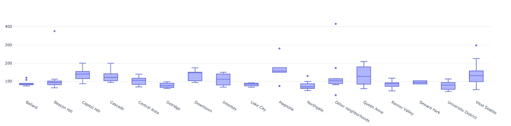
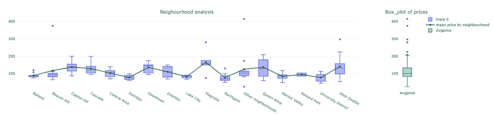
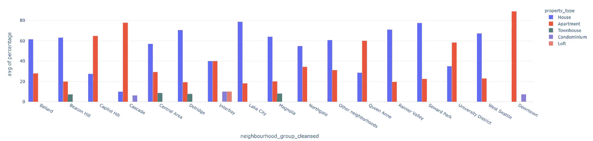
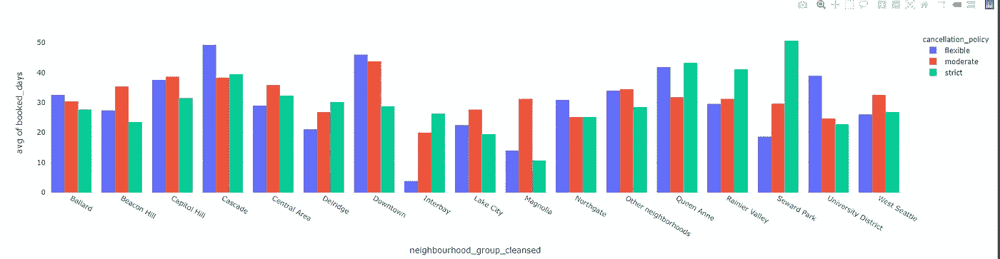
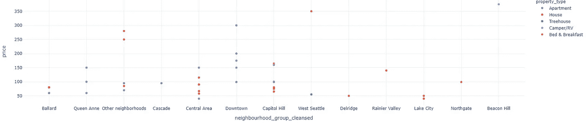
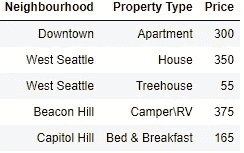

# 调查西雅图 Airbnb 数据集

> 原文：<https://medium.com/mlearning-ai/investigating-the-seattle-airbnb-dataset-dd564fa30ab8?source=collection_archive---------1----------------------->

Photo by [Chris Barton](https://unsplash.com/@cjbarton?utm_source=medium&utm_medium=referral) on [Unsplash](https://unsplash.com?utm_source=medium&utm_medium=referral)

在这篇文章中，我将最终写一个项目，这是我已经计划了很长时间的事情。在这篇文章中，我将探索西雅图 Airbnb 数据集，同时尝试回答我在这个过程中得到的几个问题。

# 关于数据集

该数据是 Airbnb Inside 计划的一部分，它描述了西雅图寄宿家庭的列表活动。该数据包含三个不同的 CSV 文件，

*   关于列表的信息，
*   对每个列表的评论，
*   一个日历文件，包含一年中每天的列表价格和可用性。

理解这些数据非常容易，因为大部分数据都很简单，我们可以在这个[链接](http://insideairbnb.com/seattle/)很好地利用 Airbnb 提供的可视化效果。

在看了 Airbnb 提供的可视化后，我脑海中出现了几个问题，我必须使用数据集来探索这些问题。那些是，

1.  根据邻近地区，一个房间的大概价格是多少？
2.  每个小区里有哪些常见的物业类型，在一个小区里能找到哪些物业，比其他的更容易？
3.  选择“严格”的取消政策对预订频率有什么影响？人们会根据我们的直觉选择其他上市公司，还是我们会看到一些变化？
4.  什么样的社区尽管提供了最基本的便利设施，但价格仍然很高？

和他们一起，我建立了一个简单的线性回归模型，它可以根据多个参数预测房源的价格。因为我的问题与主机细节和其他小细节无关，所以我将它们排除在分析之外。

邻域值需要进行大量的处理，幸运的是，数据集中提供了**‘neighborhood _ group _ cleaned’**列，其中包含按常用名称分组的邻域。

## **问:根据社区情况，一个房间的大概价格是多少？**

为此，首先，我想知道价格的实际分布，而不考虑邻近地区。

Boxplot of the prices irrespective of neighborhood.

从箱线图中，我们可以看到西雅图的大多数列表的价格在 84 美元到 133 美元之间。我们还可以观察到一些异常值，每天的价格非常高，例如，我们有一个每天价格为 415 美元的列表。

这提供了有用的信息，但我想要的是基于邻域的价格分布。这是我用下面的箱线图得到的。

Neighborhood wise distributions of the prices

我们可以看到，价格完全不同，取决于一个列表所在的社区组，其中**“Magnolia”**列表的整体价格高于其他组。使用 plotly 将整个分布添加到交互式图表中。

Complete Neighborhood wise analysis.

## 问:每个社区都有哪些常见的物业类型，哪些物业在社区中更容易找到？

在得到一个街区的价格分布后，我自动转到下一个问题，街区之间的财产分布是什么。这是我得到的，

Property-wise distribution of listings

在所有的小区里，**最** *最常见的*房源类型是**房子，公寓**，除了“**市区”**，那里的房源大部分都是公寓。继房屋和公寓列表之后，下一种更常见的是**“联排别墅”**列表，可以在**灯塔山、德尔里奇、中央区、木兰花**找到。

在 **Interbay** 中，“**Loft”**列表可以说比其余的邻域更频繁。

## 问:选择“严格”取消政策对预订频率有什么影响？人们会根据我们的直觉选择其他上市公司，还是我们会看到一些变化？

与前面的问题类似，我试图得到每个街区用颜色区分的条形分布。

Distributions of different cancellation policies for each neighborhood.

前几项观察显示，*灵活/适度*比*严格*取消政策的房源预订量相对更多。但是，在一些社区，情况正好相反，例如在**苏厄德公园**，严格取消政策的房源预订时间超过 6 个月，而灵活政策的房源预订时间为 2 到 3 个月。

这可能是可以接受的，因为取消政策并不只是负责预订住宿，但请随意评论您在这方面找到的任何理由。

## 问:什么样的社区尽管提供了最基本的便利设施，但价格仍然很高？

这很有趣，因为对于大多数的社区团体来说，有一些没有提供任何便利设施的列表。这些清单从公寓、船到简单的帐篷或树屋都有。信息显示在下面的可视化视图中，

Price vs neighborhood scatter plot, where the listings don’t provide any amenities.

由于我们只需要一个高价格，数据被提取并显示在下表中。

Table with highest prices offered by different property types

在上表中，没有提供帐篷，因为只列出了一顶价格为 25 美元的帐篷。

## 基于不同特征的价格预测模型。

在做了所有这些之后，剩下的唯一事情就是建立一个可以预测价格的模型。因为我们只需要在根据我们的特点预订房源之前进行粗略的估计，所以线性回归模型将适合这一目的。

Model performance estimated using a scatterplot.

对模型进行训练后，对预测进行评估，发现预测只是对价格范围(＄0，＄400)的粗略估计。但是当我们回到我们的第一个问题时，我们想知道价格分布，我们可以发现大多数价格在$83 到$133 的范围内，最大值在$204.50。这些都在我们模型的合理范围内，因此我们可以结束调整我们的模型。

这并不意味着我们不能得到更好的模型。可以对这个模型进行改进，因为一些功能被排除了，如主机作为超级主机的影响，或每月评论的影响，甚至微调每个可用列的离群值。

# 结论

在这一探索过程中，这些问题被多次重新审视和提炼，以达到它们有意义的状态。

在探索的过程中，我尝试着探索每一个观察的原因。我用于观察的完整细节和代码可以在我的 GitHub 库[这里](https://github.com/Akhil-Theerthala/Seattle-Airbnb-Analysis)找到。由于一些可视化是使用 Plotly 完成的，笔记本在这里[看起来更好。](https://nbviewer.org/github/Akhil-Theerthala/Seattle-Airbnb-Analysis/blob/main/analysis.ipynb)

 [## Mlearning.ai 提交建议

### 如何成为 Mlearning.ai 上的作家

medium.com](/mlearning-ai/mlearning-ai-submission-suggestions-b51e2b130bfb)