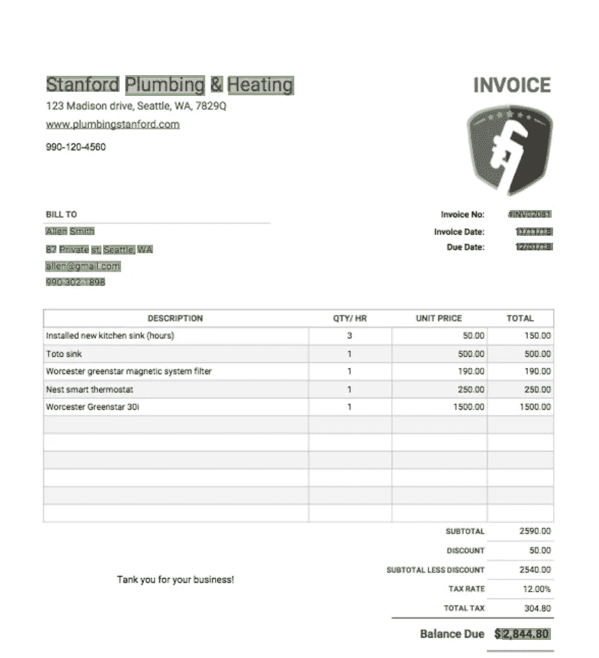

# 使用 LayoutLM 的发票自动标记

> 原文：<https://medium.com/mlearning-ai/invoice-auto-labeling-using-layoutlm-8b0e5cffc837?source=collection_archive---------1----------------------->

## 为了更有效的发票注释

Invoice Auto-labeling. Image by Author

尽管许多人工智能应用程序已成功应用于解决许多现实世界的问题，如自动驾驶、面部识别或机器翻译，但人工智能尚未完全抓住的一个领域是智能文档理解。文本形式的自然语言本质上是复杂的，但也可能是非常专门化的…