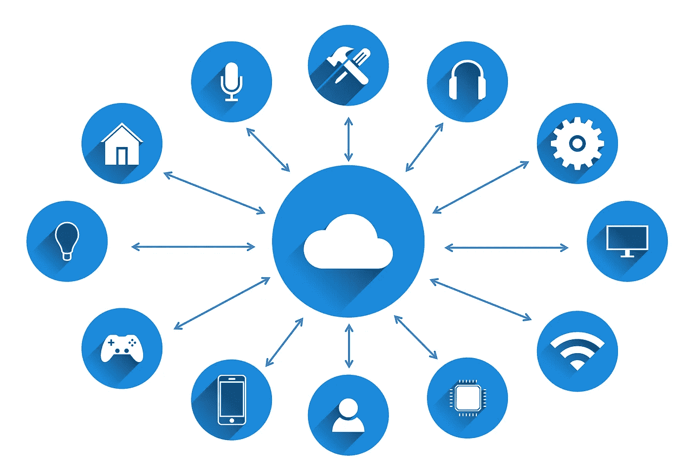
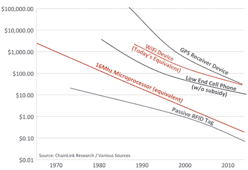
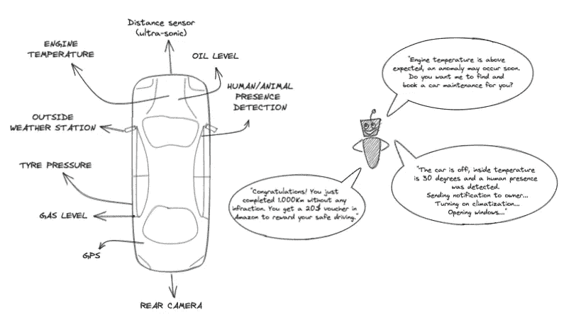
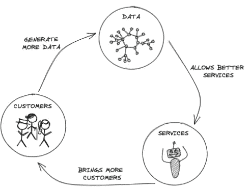

# 深入探讨物联网在保险行业的应用

> 原文：<https://medium.com/mlearning-ai/iot-in-the-insurance-industry-e062d71229f5?source=collection_archive---------2----------------------->

如何将传感器读数数据转化为有意义的见解，提高客户体验并开发新的服务来击败竞争对手。

Image by [Tumisu](https://pixabay.com/users/tumisu-148124/?utm_source=link-attribution&utm_medium=referral&utm_campaign=image&utm_content=3337536) from [Pixabay](https://pixabay.com/?utm_source=link-attribution&utm_medium=referral&utm_campaign=image&utm_content=3337536)

# 介绍

我们都知道保险公司通过向客户收取保险费用来赚钱。但是保险费的价格实际上是如何计算的呢？传统上，领域专家(承销商)会使用类似客户及其保单的历史数据来定义潜在风险的价格。随着数据科学的兴起，保险风险现在是使用机器学习定价模型来计算的，这些模型通过检测历史客户数据中的复杂模式来支持保险商的决策。

承销商的贡献至关重要。他们带来了知识和对客户的理解，但事情开始发生变化。保险公司正在重新思考如何改善:客户关系和每个客户的风险评估。

# 为什么是现在？

物联网从小型传感器收集读数。这显然会产生大量需要处理、汇总等的原始数据。这些操作通常计算量非常大，这是迄今为止最大的挑战之一。然而，随着最近的技术繁荣，一些关键方面现在不再是一个障碍。

其中一个发展是大数据工具和云计算的发展。这些工具允许企业实时处理从物联网传感器收集的大量数据。此外，由于对传感器和微控制器的高需求，正如我们在下图中看到的，物联网拥有成本已经降低，处理能力已经提高，因此它不再是物联网解决方案的瓶颈。

Source: ChainLink Research

我们可以在市场上看到廉价的微控制器，它们具有足够的能力来有效地执行边缘计算，并为机器学习算法运行推理。

# 优势

现在让我们进入重要部分:**保险公司如何从采用物联网解决方案中获益？**

## 新的收入来源

保险公司通过向客户收取保险费来换取保险范围，从而获得收入。考虑到这一点，n **可以开发电子战服务和产品** —通过分析客户数据，我们可以深入了解哪些新产品可能会有很高的市场需求，并提供预测性维护和服务推荐等附加服务。

物联网还可以帮助保险公司向客户交叉销售。随着关于客户及其行为的数据越来越多，可能有机会建议新的定制产品，为每个客户提供建议，并创建一个合作伙伴网络，如汽车维修中心或 MoT 专家，在那里可以很好地探索重复业务和佣金机会。

## 降低成本

物联网收集的数据还使保险公司能够开发更好的欺诈检测模型，利用传感器驱动程序决策通过分析传感器数据轻松检测欺诈索赔，让保险公司每年节省数十亿美元。

此外，更准确的风险评估是可能的，因为承销商将从每个客户那里获得更多数据来进行定制风险分析。动态保险单不仅会通过增加对客户不良行为的惩罚来保护保险公司，还会通过奖励良好行为来鼓励他们更加小心。

预测性维护和警告服务每年将节省数十亿美元，因为改变事故的潜在原因(例如管道泄漏)比修复事故造成的所有损害要便宜得多，而修复事故最终会导致更大的索赔。

## 改善客户体验和关系

保险公司和客户之间只有两个接触点；第一次是在条款达成一致时，第二次是在续订或取消过程中——除非有人提出索赔。保险公司很少与他们服务的人联系，这些通常是通过自动电子邮件或电话来完成的。随着时间的推移，有限的客户接触使保险公司难以建立积极的关系并吸引客户。

事实上，我们可以获得客户的实时信息，**使我们能够通过提供新的服务，如警告、推荐、创建忠诚度计划和良好行为奖励系统，经常与客户沟通**。这带来了全新水平的客户体验，很可能**降低客户流失率**，不仅通过降低溢价来提高竞争力。

# 挑战

物联网设备代表着机遇，也代表着挑战。一个主要的挑战是说服客户放弃他们的个人数据。根据德勤的一项调查，保单的价格折扣不足以吸引 75%的客户。更大的努力可能需要说服客户“选择”以这种方式使用他们的个人数据。

**传统 IT 系统**也可能带来问题。数据管理和仓库平台可能需要重新设计，以充分利用物联网实时数据的潜力。许多保险公司可能会担心引入某种程度上尚未测试的新技术。

业内人士也可能会提出挑战。对于物联网的使用是否会减少保险行业某些员工对专业技能的需求，业界也有一些争论。因此，一些团队可能会寻求挑战和质疑技术的好处和引入。

隐私和安全问题也是主要关注点。物联网技术处理关于客户的高度敏感和非常私人的信息，包括他们去哪里、何时以及如何去。关于个人的这种类型的细节伴随着无与伦比的个人敏感性水平，即企业可以利用它做什么，并且没有减弱的迹象。

最后，如果这些系统在防止索赔情况方面表现出良好的效果，风险暴露将是最小的，因此保单价格将不得不大幅下降，最终损害保险业务。

# 应用领域

保险行业有几十个应用领域，更多的应用领域还在后头。这些领域的几个例子以及物联网技术如何发挥作用。

## 汽车

利用远程信息处理技术跟踪司机的行为，保险公司可以通过简单的移动设备(甚至是手机应用程序)实时监控司机的路线、速度、加速度、方向盘转动等。最近的车辆已经嵌入了许多传感器；通过实时获取这些值，我们还能够跟踪发动机温度和压力、油位、刹车、安全带检测、人员存在检测、车内温度和湿度以及其他几十种测量值，然后这些测量值可以转化为有用的见解。这些数据可用于:

*   **通过分析传感器数据，使用机器学习算法**来衡量每个人的旅程有多安全，并在动态政策中使用这些比率来**奖励良好行为**，并在违规或危险行为的情况下增加处罚。
*   **预测性维护**使用异常检测机器学习模型来轻松检测刹车、发动机、机油等方面的维护需求……在某些东西崩溃并变成更高的修复损失索赔之前。
*   **减少欺诈索赔**通过分析事件时间段内收集的数据，了解驾驶员是否疏忽，如果传感器测量的影响和驾驶员行为与报告描述相符，是否是故意造成的。
*   如果**检测到有人或动物被遗忘在车内**时发出警告，并激活紧急计划，向客户发出警告、打开窗户、打开空调等..
*   一个摄像头**检测司机面部表情，检测头晕、嗜睡或酒精**并发出警告或自动安全停止旅程
*   驾驶的游戏化促进了防御行为、省油，以及衡量他们驾驶的“绿色”程度。

Image by the author

这只是我们可以向客户提供的服务的一小部分，不仅可以提高他们的安全性(从而降低风险)，还可以提供良好的服务，避免与我们的竞争对手发生冲突。

## 主页

智能家居是最有潜力的领域之一。智能门铃、烟雾报警器、警戒系统是现在很多家庭都有的东西。通过访问这些设备的数据，保险公司将能够提供服务以避免事故，并为客户提供更好的服务。以下是一些例子:

*   湿度传感器或热感相机可以**检测墙壁中的霉菌，并在损坏变得太严重之前警告水管泄漏的可能性**，并将小型维护工作变成高额索赔，以修复损坏，在维护期间接待客户，并为损坏的货物付款。
*   人们每个月为警戒服务支付很多钱。智能铃、窗/门传感器、人体探测摄像头可以很容易地**探测到抢劫并自动报警**，锁门、关灯、记录房子的几个分区。
*   智能烟雾和火灾报警器可以在无人在家时探测到短路引起的火灾，并自动呼叫消防队员。这将为这类事故中通常出现的高额损害和货物损失索赔节省大量资金。

## 健康

智能健康设备真的可以降低健康和人寿保险的风险。有售价不到 30 美元的手镯，可以实时测量我们的心率和睡眠质量，还有测量血糖的设备，等等。让我们的客户使用这些工具，可以轻松实现以下示例:

*   老年人寻求能让他们独立的智能设备。这些可穿戴设备可以在晕倒或摔倒的情况下自动启动应急计划。
*   手环和体重秤等健康设备来**监测心率、体重、脂肪、紧张程度等..推广良好的习惯和锻炼**以换取价格折扣、实现目标的奖励、忠诚度计划等。
*   袜子或鞋子可以**提醒糖尿病患者潜在的溃疡**以及其他可以防止未来高额医院索赔、医疗手术、残疾索赔等的物品。

同样，还有大量其他产品和服务可以提供，这将有利于双方的保险公司以及客户。

## 工业

对于保险产品来说，这个行业是一个完整的世界，所以每个领域都有自己的可能性。以下是一些在所有行业中较为普遍的例子:

*   在商业基础设施中嵌入传感器，以监控环境条件，并快速**检测烟雾、二氧化碳、霉菌和其他措施，并自动调整环境条件**以防止潜在的有害事件。
*   工人身上的可穿戴设备可以追踪位置，并在他们靠近危险地点时发出警告。此外，这将**防止工作场所事故的欺诈性索赔**。

# 现实生活中的用例

## 进步分子

Progressive car insurance company 安装了一种智能设备来监控远程信息处理，并能够使用机器学习技术来评估司机在每次旅程中的表现。这样，他们说“他们能够根据每个客户的行为，而不是居住地点或爱好，更准确地为每个客户单独定价，同时促进安全和环保的驾驶。Progressive 与 Zubie 合作，Zubie 是一种跟踪远程信息处理设备的制造商，该设备允许客户查看他们的数据以及他们被收取多少保险费用以及为什么收取保险费用。

## 自由互助银行

Liberty Mutual 与 Google Nest 合作，在客户家中安装智能烟雾探测器。Liberty 提供谷歌 Nest 设备(99 美元)和保险费 5%的折扣作为交换。通过这种方式，Liberty 可以检测到可能的火灾情况，并自动拨打紧急电话号码，防止更大的损失。顾客不仅可以获得 5%的折扣，还可以免费获得一台谷歌 Nest 设备。

## 约翰·汉考克

这家健康保险公司与 Vitality 合作，为每位客户提供一个 Fitbit 来监控他们的健康和生活方式。这打开了一个与客户沟通的渠道，监控可能的问题，并通过奖励良好行为、游戏化、合作伙伴折扣优惠等促进健康的生活方式。

**光束数字**

牙科保险是卫生部门最贵的保险之一。Beam Digital 提供了一款免费的智能牙刷，连接到一个应用程序，可以监控口腔健康，并使用这些信息来支持保险定价。Beam 鼓励养成良好的刷牙习惯，并在顾客刷牙次数不够时发出通知。这些好习惯会得到额外的折扣、优惠、服务等回报。该公司提供这种牙刷，并希望平均降低 25%的保费。

**美国家庭保险**

智能门铃是最常用的智能家居设备之一。AFI 与 Ring 合作，为购买该设备的客户提供 30 美元的折扣，以降低入室抢劫的风险，并帮助防止欺诈索赔。

奥斯卡奖

**另一家健康保险初创公司，谷歌是主要投资者之一，与 Misfit 合作，推出了 1 Misfit Flash 手环，以监控客户的生活方式。每个使用这种可穿戴设备的客户都有机会赢得高达 20 美元的亚马逊信用，如果他们实现了健康目标的话。Oscar 应用程序还有许多其他功能，如运动跟踪、医生查找和健康历史数据。**

# **最终注释**

**总体而言，更专业的客户数据，如来自物联网设备的传感数据，可以帮助企业，特别是保险公司更好地了解他们的客户，从而有可能创造更好的服务。但是权衡所有因素并开始行动需要时间和精力。**

**与许多以数据为中心的服务一样，进入市场的难度呈指数增长，因为更多的数据产生更好的服务，更好的服务带来更多的客户，而更多的客户产生更多的数据。**

****

**Image by the author**

**值得一提的重要一点是，为了开始处理物联网生成的数据，不需要硬件工程师、电子专家、设备开发和维护的完整团队。这些服务很容易在市场上被几家拥有自己设备的公司发现，他们只需通过 API 向保险公司公开收集的数据。你所需要的只是选择智能设备的最佳合作伙伴，重新设计，并开始利用收集的数据。**

**对于保险公司来说，有一些非常真实的机会来重新思考和重塑他们的客户关系，并重新定义他们如何评估风险和定价保费。物联网可能会给行业带来一些巨大的变化，最大的问题是什么时候。**

# **参考**

**[https://internetofbusiness.com/10-examples-iot-insurance/](https://internetofbusiness.com/10-examples-iot-insurance/)**

**[https://www2 . Deloitte . com/tr/en/pages/financial-services/articles/innovation-in-insurance-物联网 iot.html](https://www2.deloitte.com/tr/en/pages/financial-services/articles/innovation-in-insurance-internet-of-things-iot.html)**

**[https://www . connected Baltics . com/WP-content/uploads/2018/02/cbsig fox _ use case _ for _ insurance . pdf](https://www.connectedbaltics.com/wp-content/uploads/2018/02/CBSigfox_UseCase_for_Insurance.pdf)**

**[https://www . zdnet . com/article/what-the-internet-of-things-everything-you-need-know-on-the-IOT-right-now/](https://www.zdnet.com/article/what-is-the-internet-of-things-everything-you-need-to-know-about-the-iot-right-now/)**