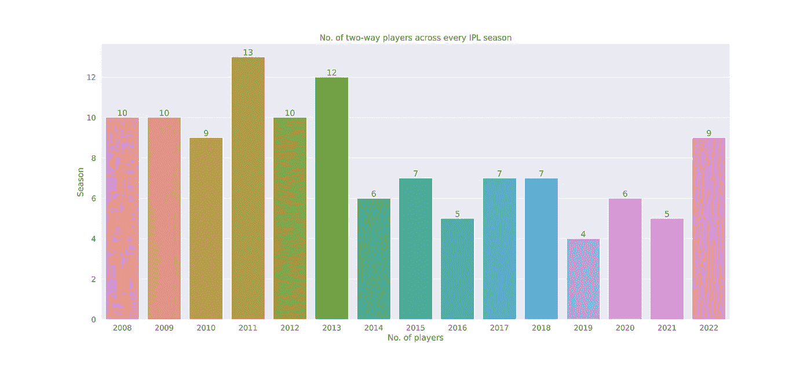

# IPL 2022:全能元的复兴

> 原文：<https://medium.com/mlearning-ai/ipl-2022-the-revival-of-the-all-rounders-meta-88be577a6838?source=collection_archive---------12----------------------->

2022 年 5 月 29 日。在雅沙维·贾斯瓦尔被解雇后，萨姆森和巴特勒看起来已经让事情回到了正轨。每个人都急切地等待着参孙在最大的舞台上发挥他的潜力。

但这是不可能的。在一个艰难的长度上完成了一次疯狂的摆动，哈迪克取得了突破。不仅如此，Hardik 会在几场比赛后回来移除 Buttler，以一个不愉快的音符结束他的超凡脱俗的击球赛季。

后来，他与舒曼·吉尔(Shubman Gill)一起打造了一个赢得比赛的重建，带领 GT 在他们的第一个赛季中获得冠军，从前面领先。

IPL 决赛是印度失去的全能选手之一 Hardik Pandya 回归的缩影。就像 Hardik 一样，我们会看到双向球员的复兴吗？

第一部分:全才的一线希望？

首先，让我们定义一下谁是双向玩家。一个公平的统计将包括那些面对和保龄球相当于一个完整的 t-20 比赛。所以我们过滤掉了面对 120 次投球和投球 120 次投球的球员。

That 2019 season is really weird. Only 4 all-rounders?

2022 年 IPL 赛季是近 9 年来双向球员数量最多的赛季。所以让我们总结一下“全能选手回来了，继续前进？”

不，我需要更多的字数。

**第二部:光辉岁月 vs 文艺复兴**

哇哦。这两年能有多大的不同？尽管比赛次数相同——都是 74 场，这两年显示出这些全能选手的显著不同的用途。

简化板球比赛，它是击球手和投球手之间的决斗。与其他人相比，2011 年的全能选手获得了更多影响比赛的机会——无论是击球还是保龄球。

Hardik Pandya 和 Ravi Ashwin——这两位进入决赛的选手获得了相当的机会，但他们却是局外人。我们知道为什么

*   哈迪克在第三位担任主播角色，这与他在《军情六处》中通常扮演的终结者角色形成鲜明对比。一个关键的击球手，如果条件需要的话，他也支持自己去打满配额的回合。
*   阿什温几乎是以一个非常特殊的角色被雇佣的——一个可以在任何位置打球的漂浮者，利用某些比赛,“希望”在这个过程中得到一些快速跑动。

相比之下，其他人在 2011 年的“出场次数”都少得可怜。

那么这里有一个问题——这是否意味着所有这一切都是“虚假的”复苏？多面手的作用减弱了？板球会变成棒球吗？在一代人的时间里，只有一次机会让日本人来为我们增光。

(如果你还没有，那就去看看大谷正平吧。那家伙是个棒球怪胎)

**第三部:相同却不同的角色**

首先，盖尔的 2011 赛季是 IPL 中最荒谬的双向表演。击球率超过 180，经济率低于 7。所有这一切，同时击球 300+交付和保龄球 200+。只是哇。谁会把宇宙老板作为他们的多面手首选呢？

从 2011 年到 2022 年，全能选手的表现将会有很大的不同。2022 年的全能选手几乎都是击球手，他们也可以以相当不错的经济价格投球。他们在击球方面没有得到同样多的资源，但也有积极击球或拼命击球的自由。

另一个有趣的是，2022 年大多数全能选手如何设法保持他们的保龄球经济率与 2011 年的同行相似。尽管平均运行率从 7.46 上升到 8.17。

较高的击球命中率很容易解释。这些天来，球队希望击球深入，这些天来，每个击球手都被期望保持这种势头，即使这意味着冒一些风险。

但是他们如何能够保持这些有利的经济利率呢？除了拉维·阿什温，他们都不是纯粹的保龄球手——他们主要是击球手，可以体面地投球。

第四部分:比赛用马

Shahbaz Ahmed has had a pretty wretched season to be honest!

2011 年和现在的一个关键相似之处是在比赛的使用上。除了 Ashwin，一个前线旋转手——使用左臂旋转手对抗右手击球手是非常明显的。

即使他们得到的投球机会有限，马克斯韦尔和摩恩·阿里的右撇子也非常有效地降低了得分率。在当今的高分环境中，这两个回合可以扭转比赛的局势。

在 2011 年，这些比赛也是可见的——但它们没有像今天这样经常被使用或关注。与我们今天看到的比赛偏好相比，右臂下旋在 2011 年经常用于对付右手击球手。

**结论:**

看到全能选手的模板如何转变为更加注重击球的方法非常有趣——转变为更高风险高回报的情况，要求这些球员从一开始就有影响力。

在这种情况下，我坚信多面手已经回来了，并且会一直留在这里。无论在什么情况下，没有什么比拥有一个双向球员对球队做出贡献更好的了。

最后要注意的是！我们刚刚讨论了所有这些关于比赛和比赛如何演变的东西，Hardik Pandya 在决赛中的表现证明了没有什么能打败好的板球。最终，所有的分析都是为了这个目标。**取胜。**

感谢你花时间阅读这篇文章！请分享你对下一步想看什么的想法！

 [## Mlearning.ai 提交建议

### 如何成为 Mlearning.ai 上的作家

medium.com](/mlearning-ai/mlearning-ai-submission-suggestions-b51e2b130bfb)