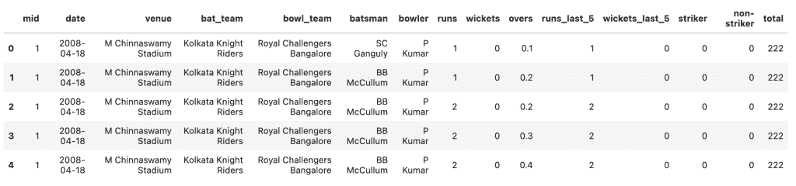
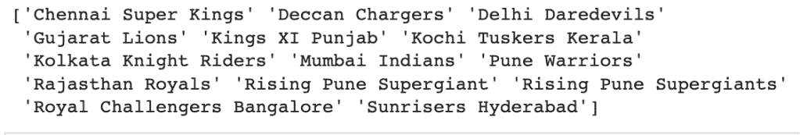
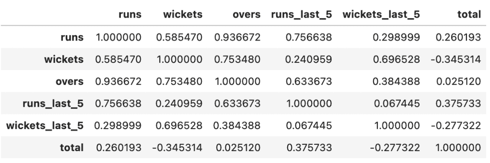
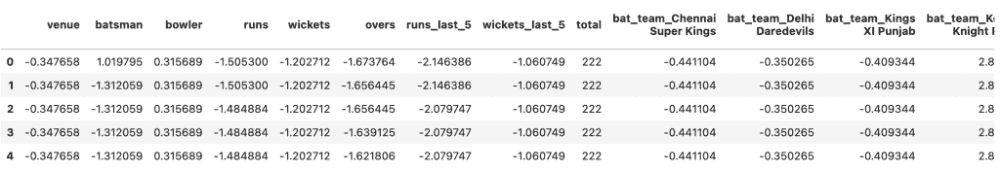
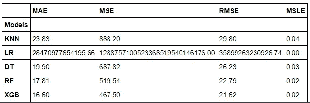
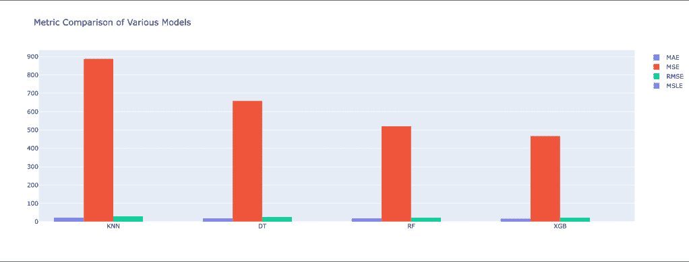

# 使用机器学习的 IPL 分数预测

> 原文：<https://medium.com/mlearning-ai/ipl-score-prediction-using-machine-learning-f6587e353532?source=collection_archive---------1----------------------->


[**SOURCE**](https://keepingupwithdatascience.wordpress.com/2022/02/14/ipl-score-predictions/)

# 介绍

随着 IPL 赛季的到来(对于那些不熟悉 IPL 的人来说，这是印度和所有板球国家的欧洲板球联赛或 NBA)，我想分享数据科学在板球中的用例。数据科学和分析正在体育领域得到广泛应用。你可以在[这里](https://www.analyticsinsight.net/the-role-of-ai-iot-and-data-analysis-in-cricket/)阅读更多关于数据科学和体育分析的信息。

在这篇[博客](https://keepingupwithdatascience.wordpress.com/)的帖子中，我将带你浏览一个叫做 IPL 分数预测器的数据科学用例。在开始这个项目之前，我想向那些不了解板球的人解释一下板球运动。如果你知道这个游戏，请随意跳过它，进入代码部分。

# 板球是什么？

板球有两个队，每队 11 人。每个队轮流击球和比赛，就像在棒球中一样。在板球运动中，击球手是击球手，投手是投球手。投球手试图击倒三柱门的栏杆。击球手试图通过击球来阻止投球手击中三柱门。两名击球手同时在球场上。

我希望你已经了解了游戏的基本知识。现在，让我们深入问题陈述。

# IPL 分数预测器

# 问题陈述

问题陈述指出，

> *使用 IPL 数据集，预测你最喜欢的球队的得分。*

让我们阅读数据文件，并初步看看数据。您可以通过[链接](https://github.com/Chitwan54/IPL-Score-Prediction)访问数据。

# 数据分析和数据预处理

```
# Load the data
ipl_data = pd.read_csv("/content/ipl_data.csv")
ipl_data.head()
```



现在我们知道数据是什么样子了。下一步包括分析基本指标，如数据的形状、空值的数量、每个变量的数据类型等。所有这些都可以通过使用 pandas info()函数轻松完成。下面的代码单元格演示了同样的情况。

```
ipl_data.info()
```


从上面的输出可以清楚地看出，我们的数据集中有大约 76014 个非空条目和总共 14 个变量/特征。我们数据分析和预处理的下一步包括找出变量之间的关系/依赖性，删除不必要的列，对分类列进行编码等。

接下来，我们删除一些不必要的变量，并进行进一步的预处理。

```
# Drop the unnecessary cols like mid, striker and non strikercolumns_to_drop = ['mid', 'striker', 'non-striker']
ipl_data.drop(columns_to_drop, axis = 1, inplace = True)
```

去掉不必要的变量后，我们检查数据集中的团队。

```
# Print all the teams
print(np.unique(ipl_data['bat_team']))
```



那些板球爱好者和 IPL 的追随者必须意识到，上面输出中显示的一些球队要么已经完全退出，要么已经改变了他们的名字。因此，在下一步中，我将放弃那些与 IPL 无关的队伍，只考虑当前的队伍。例如，Gujarat Lions 不再比赛，因此，所有与之相关的数据点都将被删除。

```
# We don't want the teams which are not playing rnall_teams = np.unique(ipl_data['bat_team'])
old_teams = ['Deccan Chargers', 'Kochi Tuskers Kerala', 'Gujarat Lions', 'Kochi Tuskers Kerala', 'Rising Pune Supergiant', 'Pune Warriors', 'Rising Pune Supergiants']
current_teams = [teams for teams in all_teams if teams not in old_teams] # Use the rows which have current_teamsipl_data = ipl_data[ipl_data['bat_team'].isin(current_teams) & ipl_data['bowl_team'].isin(current_teams)]
```

去除旧团队后，我们检查变量之间的相关性。相关性是一个统计术语，描述两个变量相互协调移动的程度。这可以在 Python 中使用熊猫来完成。DataFrame.corr()函数。



runs 和 overs 以及 runs 和 runs_last_5 之间似乎有很高的相关性。这是有道理的，而且跑的次数似乎也增加了。

数据预处理的下一步包括分类变量的编码。因此，分类变量可以有两种类型:序数和名词性。有序分类变量包括那些具有潜在顺序的变量。比如好，更好，最好或者高，中，低。另一种类型是没有任何潜在顺序的名义分类变量。比如性别。

我将使用 sklearn 的 LabelEncoder 处理顺序变量，使用 pandas get_dummies()处理名义变量。对分类变量进行编码后，数据看起来像这样。


下一步是将所有变量放在同一个尺度上，这就是所谓的特征缩放。因此，这一步非常重要，如果你要建立一个线性回归模型或 KNN 模型，特征缩放可以帮助提高这些模型的性能。我将使用 sklearn 的 StandardScaler 类来缩放变量。它将所有变量的平均值降至 0，标准差降至 1。

缩放后的数据看起来像这样，



在所有的预处理步骤之后，我们就可以进行机器学习建模了。

# 机器学习建模

接下来的步骤包括，建立一个机器学习模型，预测比赛中的总得分。一种体面的方法可以是从简单的模型开始，然后逐步过渡到复杂的模型。一旦我们测试了相当数量的模型，我们就可以列出表现最好的模型，并开始调整超参数以进一步改善结果。我按照给定的顺序选择了以下型号。

1.  KNN 回归量
2.  线性回归
3.  决策树回归器
4.  随机森林回归量
5.  XGBoost 回归器

下表基于各种回归性能指标对这些模型进行了比较。



从上表可以清楚地看出，与其他所有模型相比，XGBoost 模型的性能最好。线性回归的不良表现可归因于变量之间的多重共线性。



# 结论

这是数据科学在体育领域的一个用例。你可以在这里访问整个代码库[。我希望你觉得这篇博文内容丰富。请与其他学习者分享，并帮助社区共同成长。请在评论中告诉我你的反馈。你也可以在我的博客](https://github.com/Chitwan54/IPL-Score-Prediction) [**了解更多，跟上数据科学**](https://keepingupwithdatascience.wordpress.com/) 。我每周都在这里发帖。快乐学习。🙂

[](/mlearning-ai/mlearning-ai-submission-suggestions-b51e2b130bfb) [## Mlearning.ai 提交建议

### 如何成为 Mlearning.ai 上的作家

medium.com](/mlearning-ai/mlearning-ai-submission-suggestions-b51e2b130bfb) 

🔵 [**成为作家**](/mlearning-ai/mlearning-ai-submission-suggestions-b51e2b130bfb)