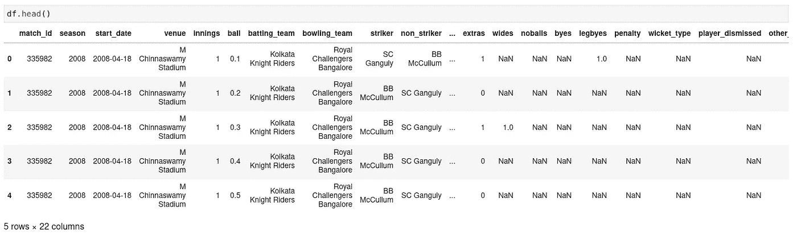
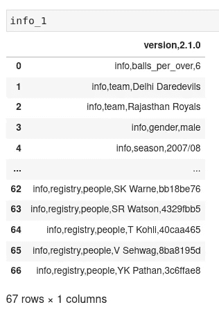
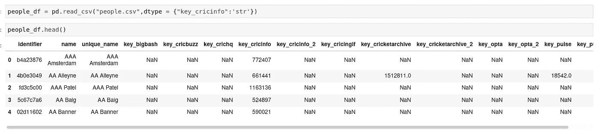
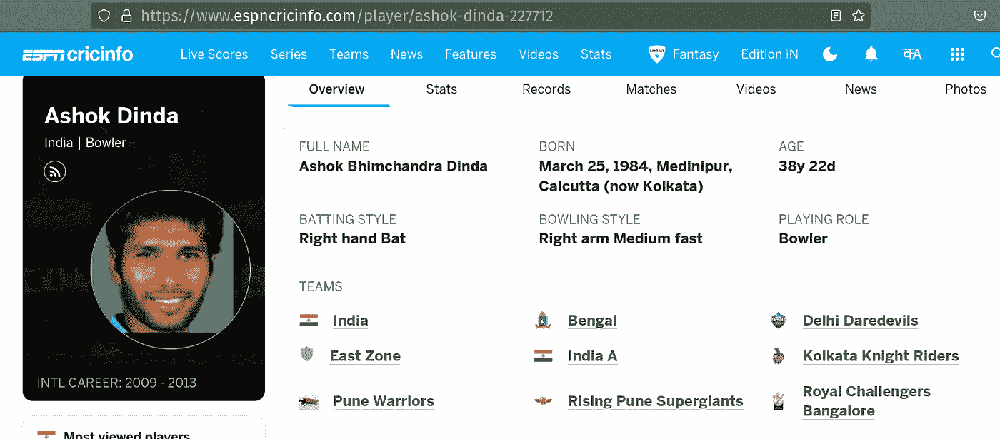
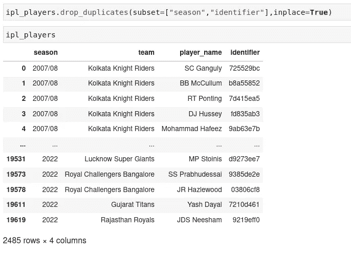

# IPL 故事#1

> 原文：<https://medium.com/mlearning-ai/ipl-stories-1-7ba75450589?source=collection_archive---------5----------------------->

获取数据(注意:涉及到数据争论！)

**第 0 部分:前言——这个系列想展示什么？**

这场 IPL 的话题是比赛。这一季，已经经常听到这样的陈述:

*   *球员“A”特别挑选，因为对手有“X”个左手击球手。*
*   *在击球手“Y”出局之前，球员“B”永远没有机会投球*
*   由于新击球手“Z”在比赛中处于劣势，球员“C”在次优时间(比如说中间回合)给出了一个回合。

本系列旨在收集足够的数据，并一步一步地探索这种匹配游戏。

**第 1 部分:数据——我从哪里获得数据？**

一球接一球的数据由' [Cricsheet](https://cricsheet.org/) '提供，这个网站由精彩的 [Stephen Rushe](https://twitter.com/srushe) 维护。出于分析的目的，我下载了 CSV 格式的整合 IPL 数据集，可以在下载部分找到。

zip 文件中有一个非常显眼的名字叫做`all_matches.csv` 的文件。然后是一堆信息文件和相应的一个球一个球的数据文件——对于每一场单独的比赛。

我们赶紧把这个装上来看看。



现在，这有球员的细节——击球手与投球手，老实说，这本身就足以让投球手与击球手在 IPL 比赛直播中短兵相接。

但是现在假设，你想更深入一层——如果我们想回答击球手是否比速度或旋转更舒服呢？

我们需要整合球员，将他们分组——步行者、旋转者等等。但是谁会这么做呢？

让我们看看比赛信息文件是否有一些细节。我们随便开一个吧。



Very helpful information like 6 balls an over (there is a reason for this though — historical tidbit!)

该数据有一堆关于游戏的基本信息，然后有两条很棒的信息。

*   两个队的 11 名队员
*   与“人员注册”的链接，包括以任何身份(如教练或裁判员)参与游戏的现在和过去的玩家

快速检查显示了[人员注册](https://cricsheet.org/register/)的链接——一个非常简洁的 csv 文件，包含 cricsheet 网站上提到的所有人员的数据库。让我们下载并一窥究竟。



*Key* to have the cricinfo key as a str — I will explain later!

识别码与 info csv 文件中的代码匹配，这是分配给每个玩家的唯一标识符。我最初的想法是只搜索一些球员的详细资料数据库。但看了资料后，我对这个`key_cricinfo`领域产生了相当大的兴趣。

让我们来看一个球员，比如 Ashok Dinda。号码 227712 和那个玩家的`key_cricinfo`一模一样。



Now if only i could transfer the player infocard onto a dataframe

但是等一下！当数据帧中显示 AB Dinda 时，如何访问 Ashok Dinda 的统计数据？

这就是愚蠢的 T4 实验的用武之地。你们中的一些人可能已经找到了答案— *“如果名称和号码很重要—为什么 cricsheet 站点只将号码作为键存储？”*

网站的工作方式如下——名称是什么并不重要，只要遵循一般语法，并且目标关键字在末尾。网页链接将自动修改以带有正确的名称。

用[https://www.espncricinfo.com/player/ab-dinda-227712](https://www.espncricinfo.com/player/ab-dinda-227712)试试，你会被重定向到同一个页面。

事实上，用 https://www.espncricinfo.com/player/John-Doe-227712 的来试试吧——同一页。我不知道你怎么想，但这让我大吃一惊。

这意味着只要我拥有`key_cricinfo`值，我就可以访问任何玩家在 Cricinfo 上的页面。

**第 2 部分:数据争论—基础**

让我们回到信息文件。解释 csv 的问题是有些行有 3 个字段，有些有 4 个，有些有 5 个。

现在我们该怎么做呢？

快速浏览几个示例 csv 可以告诉我们以下内容

```
Rows [0:19] - are game information
Rows [20:41] - are the playing eleven for both teams
Rows [42:] - are the people involved in the game, with their unique identifiers.
```

这么说吧，这花了几个小时的学习和多次修改才把所有的东西组合在一起。

逻辑如下:

*   第 7 行只是在我们想要的模板中创建了 ipl 播放器的列表——这样我以后就可以添加行了
*   第 8 行，我们为每一个匹配创建了一个循环
*   第 9 行，我们读取匹配信息 csv 文件
*   第 10 行，我们将赛季存储在一个单独的单元格中——这对于以后查看一个球员这些年的去向很有用
*   第 11 行，我们创建了 22 名球员的名单`[20:41]`
*   第 12 行，我们读取所有相关人员的列表，并将所有行组合成一个长字符串。
*   第 13–18 行将循环遍历 22 名球员中的每一个，以获取他们的球队名称和他们的名字。
*   **第 14 行，重要→我们在这里使用 try / except 的原因是因为并非所有的 info_csv 文件都具有相同的结构。**例如，有几个以 D/L 结尾的匹配项，它们有一个额外的行，使结构陷入混乱。我们不做任何事情就把这些有错误的文件排除在外。**我的期望是，由于我们正在阅读 900 场比赛，统计上有意义的球员被错过的机会非常少。**
*   第 20 行，我们解析第 12 行创建的长字符串，使用正则表达式获取 22 个玩家的`identifier`。
*   第 21–22 行，我们按照在第 7 行为数据帧创建的顺序将这些值组合成一个系列。然后，我们将该系列追加到数据帧中。

一年中会有很多重复的球员——所以让我们去掉每个赛季的重复球员。



Yash Dayal, the latest debutante in this dataset!

第三部分:思考和对下一篇文章的展望。

克服错误并理解如何解决具体问题是学习任何概念的最有效方法之一。对于像数据科学这样面向应用的概念来说尤其如此。

我非常享受处理这些数据的时光，希望你也会喜欢。

在下一部分中，我们将开始使用玩家列表，并开始从 espncricinfo 网站获取他们的信息——更高级的数据争论[？我想是的。

感谢您阅读本文，如果您能找到更好的方法来解决这些问题，请分享您的想法！毕竟我们都是来互相学习的。

[](/mlearning-ai/mlearning-ai-submission-suggestions-b51e2b130bfb) [## Mlearning.ai 提交建议

### 如何成为 Mlearning.ai 上的作家

medium.com](/mlearning-ai/mlearning-ai-submission-suggestions-b51e2b130bfb)