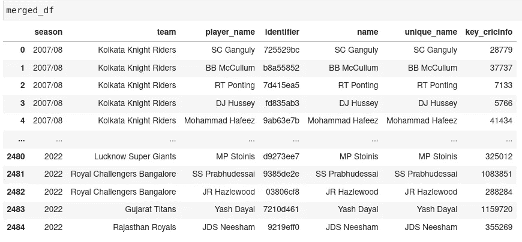
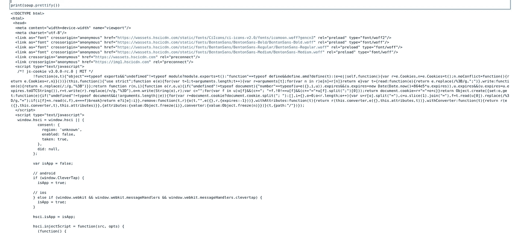
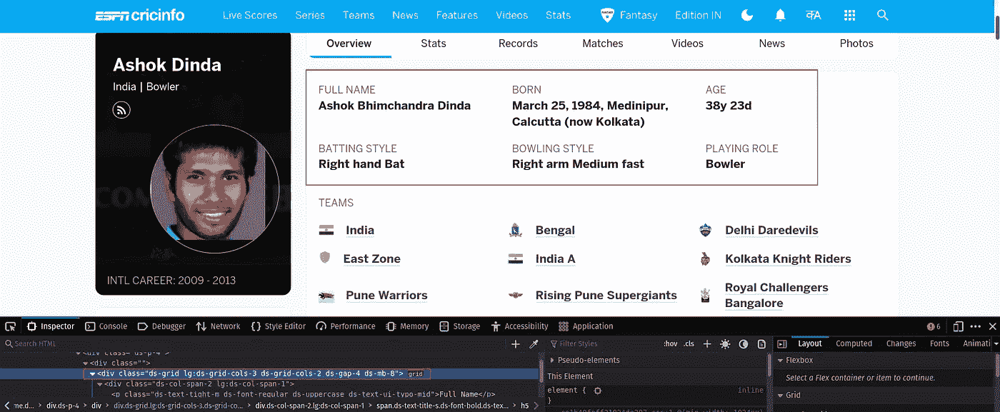
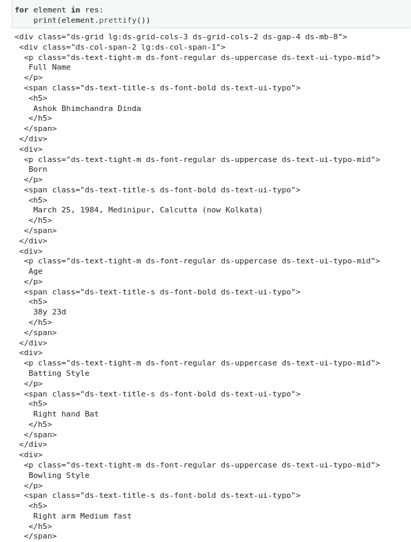
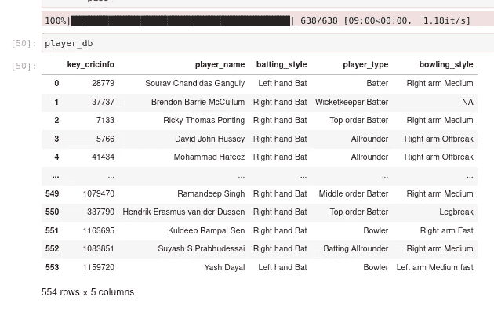
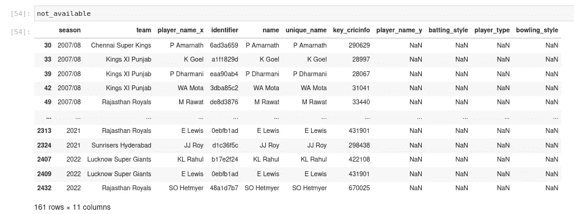
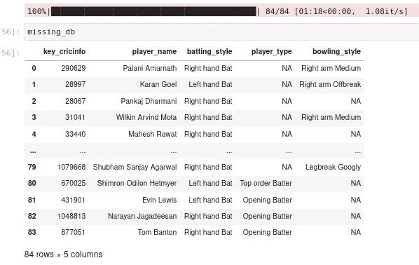
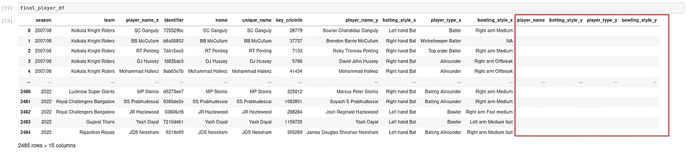
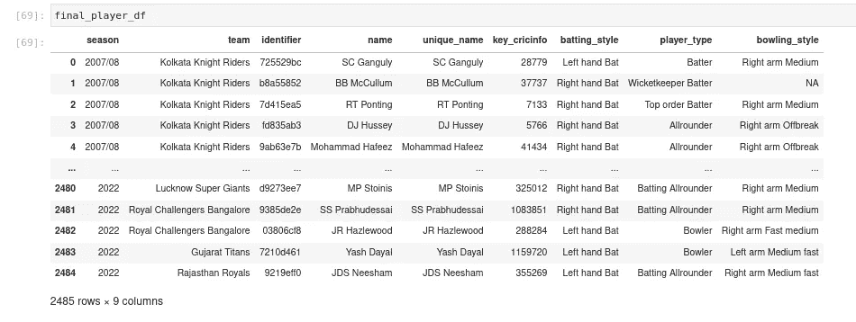

# IPL 故事#2

> 原文：<https://medium.com/mlearning-ai/ipl-stories-2-192525ba1aa?source=collection_archive---------11----------------------->

整合来自 cricinfo 的球员类型数据，开始研究比赛。

**第 0 部分:前言—目标**

上一篇[帖子](/p/7ba75450589)，我们看到了如何通过 IPL 的球数据来获取球。我们还创建了几行代码来组合玩家信息和他们的人标识符。

在本帖中，我们试图从 espncricinfo 中整合球员列表并补充附加信息(击球风格、保龄球风格和球员类型)。

**第一部分:美汤**

让我们首先将人员信息合并到我们整合的 ipl 玩家列表中。

Cricinfo keys matched with the ipl_players df

现在我们继续核心任务——从 cricinfo 网站获取信息，并将其整合到一个数据框架中。

我们都知道网页是由 html 文件组成的。Beautiful Soup 是一个整洁的包，它帮助我们解析这些 html 文件并收集相关信息。然后我们可以*指出*我们需要的数据或文本，并可以处理/存储这些特定的信息。

让我们从导入相关库并在单个播放器页面上试用开始。

The entire webpage html — it’s like a maze!

这是太多的信息。让我们尝试选择网站上显示球员信息的特定部分——为此，我们需要检查 web 浏览器中的特定元素。

ds-grid is the class we are looking for

Now we have the specific set of information!

我们可以用这个装置来获得所需的数据。这是我反复编写的最终代码。

Something’s off.

**第 2 部分:错误管理**

一旦我们运行完这个循环，我们在总共 638 个查询中只看到 554 个玩家。还剩下 84 名选手。让我们将这个数据帧与`merged_df`数据帧合并，然后过滤掉缺失的玩家。

161 rows because they are across multiple seasons

通过检查这些球员中的一些，我们可以推断出导致他们被排除在外的两种主要问题。

*   这些球员没有`player_type`字段——这导致在检查守门员击球手时出错
*   这些球员是专业球员或专业门将——他们没有`bowling_style`领域。

我们可以修改初始循环来考虑这些情况

All remaining 84 fetched without errors

我们马上就要到了。现在让我们合并一切，清理列，并创建最终的数据库。

Only 84 of these — rest will be NaN which we made blank

第三部分:思考和对下一篇文章的先睹为快。

这是我第一次接触美丽的汤，了解到它开启了一个关于数据收集的可能性世界。非常容易学——我可以证明这一点！

在下一部分，我们将开始分析数据，以得出匹配的见解。这里有许多线索可以用来开始我们的分析——让我们一个一个地来看。

感谢您阅读本文，如果您能找到更好的方法来解决这些问题，请分享您的想法！毕竟我们都是来互相学习的。

 [## Mlearning.ai 提交建议

### 如何成为 Mlearning.ai 上的作家

medium.com](/mlearning-ai/mlearning-ai-submission-suggestions-b51e2b130bfb)