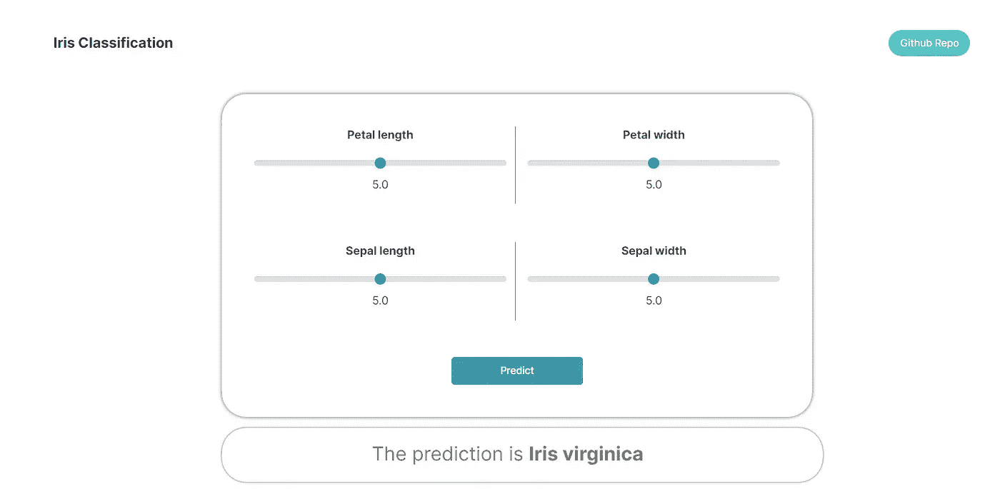
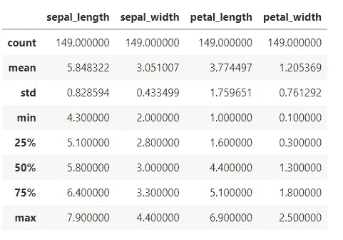
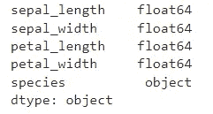
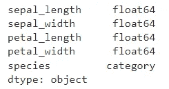

# Iris 分类 Heroku 部署的数据收集，第 1 部分

> 原文：<https://medium.com/mlearning-ai/iris-classification-data-collection-to-heroku-deployment-4b5a055c246f?source=collection_archive---------7----------------------->

大家好，今天在这篇文章中我们将创建一个名为虹膜分类的项目，我将尽力解释每一个步骤。在这个项目中，我们将从数据收集开始，并逐步在 Heroku 上部署我们的模型。

大概是这样的:



我知道大多数初学者的教程都没有展示如何保存模型，以及如何在 Heroku 这样的云平台上部署模型。然后，你必须搜索和观看各种视频或教程，只是为了部署。因此，我将从 0 级开始制作每一个项目教程，这意味着从我们收集数据的部分到我们在云上免费部署自己的模型的部分。

如果你想要一些机器学习项目的好主意。看看我的这篇文章。

如果你想查看这个库，这里有 GitHub [链接](https://github.com/sharmas1ddharth/Iris-classification)。

# 关于数据集:


在这个项目中，我们将对鸢尾花的种类进行分类，是**刚毛鸢尾花**、**海滨鸢尾花**还是**杂色鸢尾花**。该数据集中有 150 行和 5 列，4 列是功能列，1 列是目标列。

数据集包括:

*   **150 个样本**
*   **3 个标签:**鸢尾属植物种类(*刚毛鸢尾、海滨鸢尾*和*杂色鸢尾*
*   **4 个特征:**萼片长度、萼片宽度、花瓣长度、花瓣宽度以厘米为单位

# 步骤 1:数据准备

导入必要的库，从 csv 读取数据集，理解并准备数据集

**导入库以阅读和理解数据集**

```
import pandas as pddata = pd.read_csv('data/raw/iris.data')
data.describe()
```

**输出:**



我们使用了 *data.describe()* 来查看数据的统计描述，其中包含:

*   count =非 NA/null 观察值的计数。
*   平均值=数值的平均值
*   std =观察值的标准偏差。
*   min =对象中的最小值。
*   25% =值小于值的 25%
*   50% =值小于值的 50%
*   75% =值小于值的 75%
*   max =对象中的最大值。

正如我们在 describe 函数的输出中看到的，非空值的计数是相同的。我们还可以使用[**is null()**](https://pandas.pydata.org/docs/reference/api/pandas.isnull.html)**来检查数据中是否有空值。**

让我们也通过使用 *data.dtypes* 来检查我们的列的数据类型。

```
data**.**dtypes
```

**输出:**



所有四个特征列都是**浮点**类型，但是目标列是**对象**类型。因此，对于模型训练，我们必须将对象类型转换为 int 或 category 类型，因为分类模型不能处理对象数据类型。

对于这个数据集，让我们将物种列的数据类型更改为**类别**类型

```
data['species'] **=** data['species']**.**astype('category')
```

现在，让我们再次检查数据类型

```
data**.**dtypes
```

输出:



正如您所看到的，species 列现在被转换为 **category** dtype，可以用于进一步的处理。

# 步骤 2:拆分数据集

我们必须将数据集分为训练数据集和测试数据集。

因此，首先将列分为**特征**和**类**或 **X** 和 **y**

```
X **=** data**.**drop('species', axis**=**1)
y **=** data['species']
```

如果你很好奇 **X** 和 **y** 里面有什么，你可以用**X . head()*和 *y.head()* 来验证*

*现在，我们必须将数据分为训练和测试，为此我们可以使用 scikit-learn。*

```
***from** sklearn.model_selection **import** train_test_splitX_train, X_test, y_train, y_test **=** train_test_split(X, y, test_size**=**0.4, random_state**=**42)*
```

*如果你不知道 train_test_split，请阅读这篇文章*

*我们已经完成了数据准备步骤。*

*下一步是创建我们的模型，并执行培训和测试，我将在本文的下一部分写这些。*

*链接到下一部分将很快可用！*

*[](/mlearning-ai/mlearning-ai-submission-suggestions-b51e2b130bfb) [## Mlearning.ai 提交建议

### 如何成为 Mlearning.ai 上的作家

medium.com](/mlearning-ai/mlearning-ai-submission-suggestions-b51e2b130bfb)*