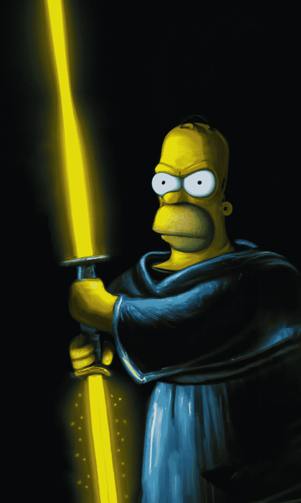
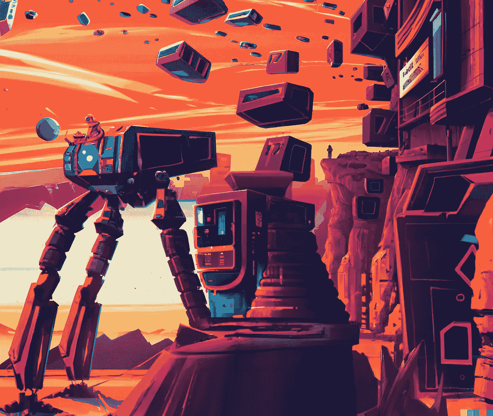

# 人工智能是艺术的死亡吗？还是创造力的未来？

> 原文：<https://medium.com/mlearning-ai/is-a-i-the-death-of-art-or-the-future-of-creativity-78ed410673d3?source=collection_archive---------2----------------------->

Homer Simpson as a Jedi Knight, Aron Brand, DALLE-2 outpainting based on multiple textual prompts and some manual finishing with Photoshop

“艺术已经死了，伙计。”这是贾森·艾伦的说法，他是一幅人工智能图像的创作者，这幅图像在科罗拉多州博览会的年度艺术竞赛中获奖。

但是人工智能真的是人类艺术的丧钟吗？

诚然，人工智能艺术近年来取得了长足的进步。多亏了 Midjourney、DALLE2 和 Stable Diffusion 等工具，任何人只需在文本框中键入几个词，就可以创建复杂、惊人美丽和逼真的图像。虽然这些工具可能让一些人类艺术家对自己的未来感到紧张，但它们也引发了关于人工智能艺术伦理的激烈辩论。

一些人工智能艺术的反对者担心这会降低专业艺术家作品的价值。毕竟，像任何商品一样，艺术的价值来源于其供给和需求，如果艺术创作变得容易，人人都可以获得，供给将呈指数增长，导致艺术作品的市场价值暴跌。艺术家谋生已经很难，反对者认为，如果人工智能艺术变得广泛，只会变得更难。

关于新艺术制作技术的争议并不新鲜。许多画家极度反对照相机的发明，他们认为照相机是对人类艺术的威胁。但是照相机并没有取代画家，它只是为他们创造了一种新的探索媒介。人工智能创造的艺术也是如此。

虽然 image synth 工具的最初迭代仅限于艺术家在一个镜头中告诉他们要做的事情，但这些工具正在迅速得到增强，以增加创造性控制并支持迭代工作。这些创造性的控制正在恢复艺术家在创作过程中的重要性。

让我们谈一谈这些新功能以及它们给艺术家带来的自由:

**修复**是一个由人工智能填充艺术作品中缺失部分或“漏洞”以呈现完整图像的过程，通常根据文本提示提供一些选项来完成。人类艺术家可以拍摄由人工智能或其他方法生成的图像，故意挖洞，并允许人工智能根据他们的创作愿景为艺术家设计出许多完成选项。这一过程实现了创造性控制，因为艺术家可以根据他们试图实现的整体概念，在现有图像上迭代。

**Outpainting** 是对修复的补充，艺术家提供一个现有的图像，并要求人工智能将其扩展到原始边界之外，根据文本提示想象缺失的内容。如果你愿意的话，可以叫“解开”。你有没有想过在《蒙娜丽莎》或《最后的晚餐》的框架之外发生了什么？嗯，有了 outpainting，您现在可以基于自己的艺术想法，轻松地为这些问题生成富有想象力的艺术答案，完美地匹配原始图像的风格。

**图像到图像(img2img)** 是一个术语，用来描述在文本的引导下，从其他图像生成图像的技术。源图像可以是图像合成器的输出、现有的作品，甚至是草图。这个过程使艺术家能够更快地创作出更好的艺术作品，让他们在迭代中工作，快速试验不同的想法。这有点像传统艺术家的工作流程，他们从草图开始，然后对其进行完善，直到对最终结果感到满意。主要区别在于，使用 img2img，艺术家可以对源图像进行更改，并实时查看结果。这项技术正在创造一种有点有趣的 MS paint 艺术家的复兴，他们能够将自己的涂鸦转化为完全有血有肉的专业艺术作品。

如果你正在观看人工智能艺术场景，你会注意到最好的人工智能艺术作品现在是作为一种人类和机器之间的对话而创作的。人工智能图像合成远不是对人类艺术家的威胁，实际上是增加他们的能力。这是一个新的工具，他们可以用新的和令人兴奋的方式探索图像制作的世界。在可预见的未来，它不会取代人类艺术家，而只是为他们提供另一种创造美丽艺术的方式。

艺术没有死亡。然而，它正在演变。

A brutalist living habitat on mars, Aron Brand, DALLE-2 outpainting + inpainting, multiple textual prompts

If you found this article interesting, read more about this topic in my previous article

 [## Mlearning.ai 提交建议

### 如何成为 Mlearning.ai 上的作家

medium.com](/mlearning-ai/mlearning-ai-submission-suggestions-b51e2b130bfb)