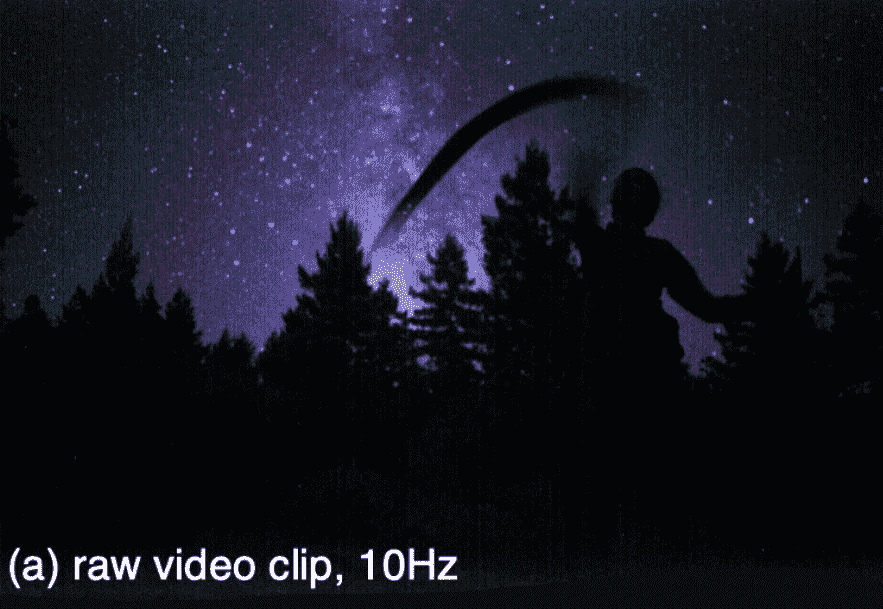

# AI 比动物更擅长在黑暗中看东西吗？

> 原文：<https://medium.com/mlearning-ai/is-ai-better-than-animals-at-seeing-in-the-dark-81dd544e11c7?source=collection_archive---------7----------------------->

## [机器学习艺术](https://mlearning.substack.com)

## 极度黑暗中机器人视觉的极限

[Dancing under the stars by Kristina Monakhova, Stephan R. Richter, Laura Waller, Vladlen Koltun](https://mlearning.substack.com)

## **研究动物夜间的行为**

在最黑暗的夜晚，我们很难看清。在**非常黑暗的情况下**，月亮提供了大约 3/4 的光线，并且曝光时间长…