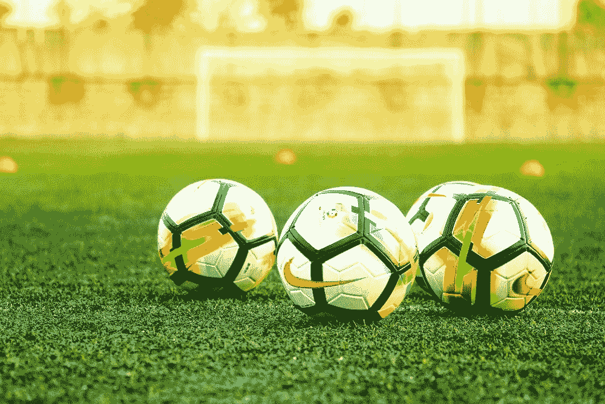
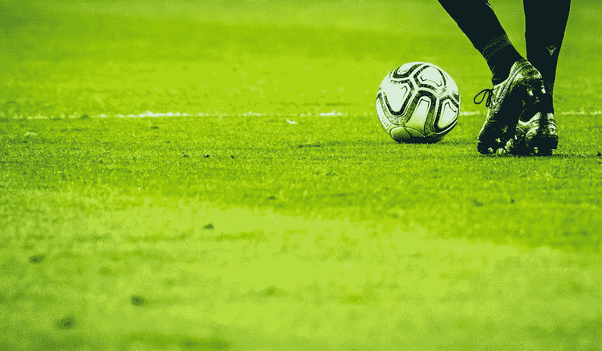
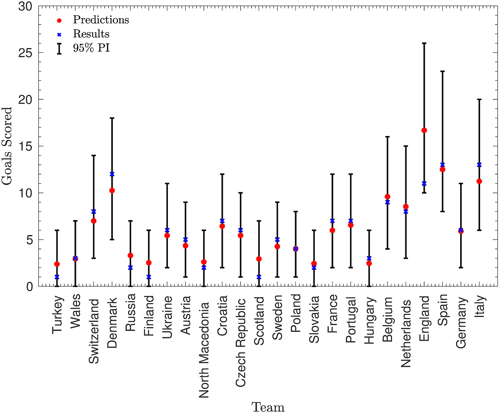
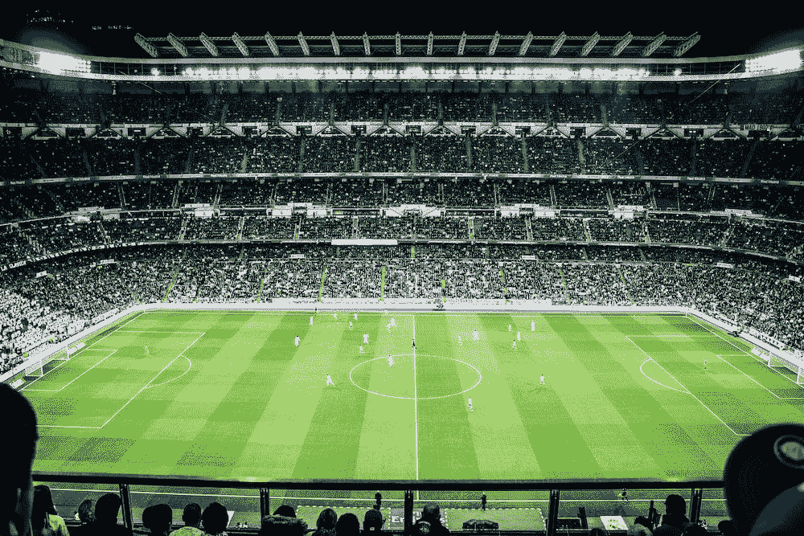
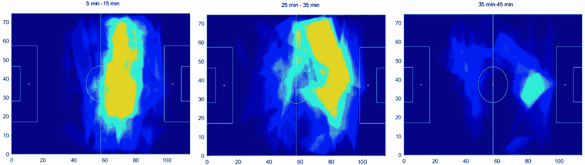
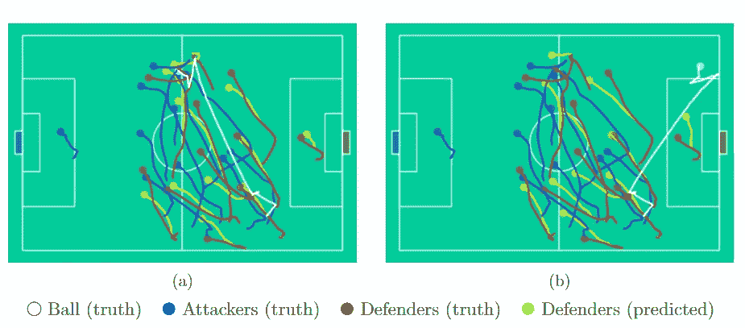
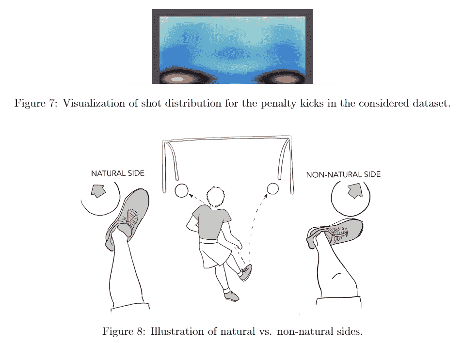
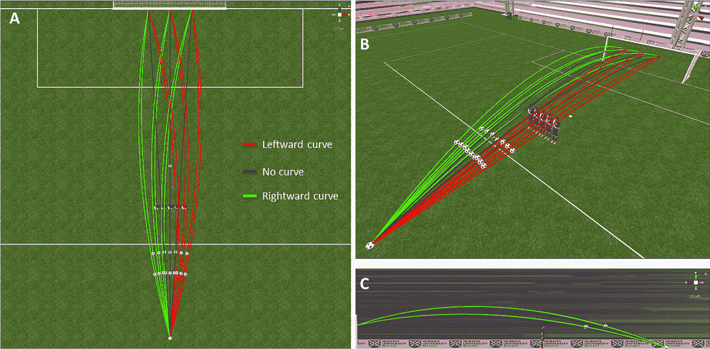
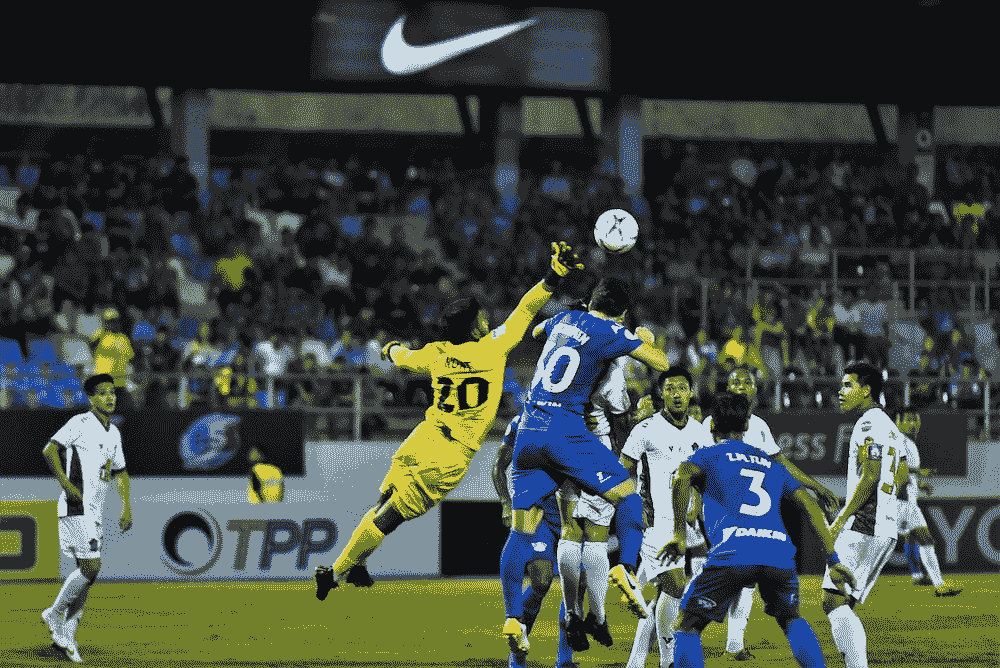
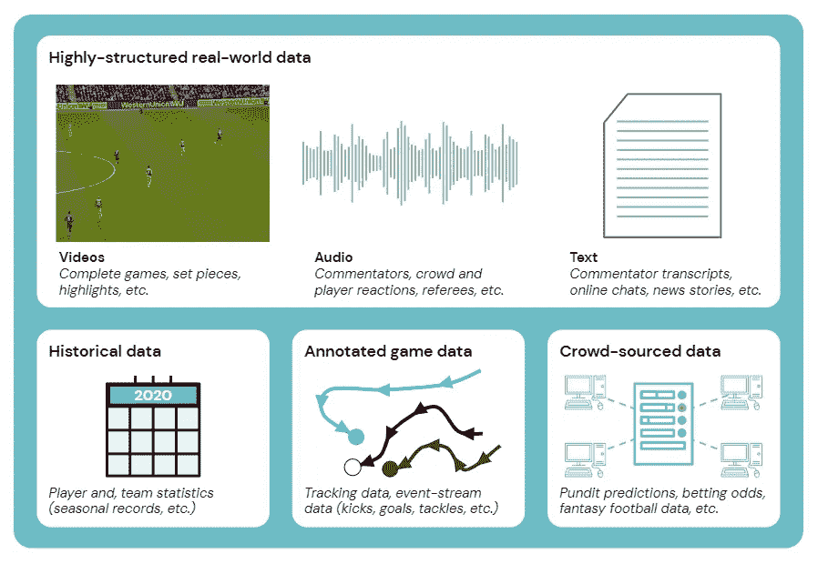

# AI 在改变足球吗？

> 原文：<https://medium.com/mlearning-ai/is-ai-changing-football-123386582c9b?source=collection_archive---------0----------------------->

## 数据科学已经来到了足球界。团队和公司如何使用它？

image by [Travel Nomades](https://unsplash.com/@travelnomades) at [unsplash.com](https://unsplash.com/)

人工智能正在各行各业兴起。随着世界杯的临近，人们可能会想人工智能是否也会在足球中发挥作用。哪里有数据，哪里就可以使用机器学习模型:足球产生海量数据，还有一个[百年统计](https://www.iffhs.com/)，音频，视频，新闻，社交网络帖子。致力于足球人工智能的公司近年来如雨后春笋般涌现，足球队聘请了分析师和数据科学家。为什么？用于什么应用？本文对此进行了探讨。

# 预测未来的领域

只要有体育运动，就有赌博。古罗马人曾在战车跑道上打赌([据说奥古斯都皇帝在比赛](https://ultimatehistoryproject.com/in-rome-all-was-fair-in-games-and-races.html)中输掉了 3 万塞斯特斯)。古罗马人为了赢得比赛，会祈求神灵的眷顾，或者依靠魔术师在铅板上书写魔法公式。

> “我呼唤你，神，请你折磨和杀死绿色派系的马，你粉碎司机费利克斯和戴克勒斯。”—罗马人领导平板电脑要求在游戏中获胜

今天，我们不再依赖魔术师，尽管在 2010 年，我们依赖章鱼预测世界杯的结果([这里是我最喜欢的视频之一](https://www.youtube.com/watch?v=pc0FLC8H7D8&ab_channel=VoiceofAmerica)，其中章鱼猜测决赛的结果)。无论如何，**体育博彩仅 2021 年就创造了**[**43.3 亿**](https://www.sportspromedia.com/news/us-sports-betting-2021-revenue-new-jersey-pennsylvania-illinois-nevada-michigan) 的收入(而且还在增长)。对于博彩网站来说，估算赔率是至关重要的，这样可以避免用户赢款的损失。**博彩机构使用复杂的算法来设定赔率。**

image by [Emilio Garcia](https://unsplash.com/@piensaenpixel) at unsplash.com

预测获胜，不仅让投注者感兴趣，也让经纪公司感兴趣。预测一个团队的胜利或失败的问题引起了数学家和统计学家的兴趣。[发表在《公共科学图书馆·综合》杂志上的一篇文章](https://journals.plos.org/plosone/article?id=10.1371/journal.pone.0268511)使用双泊松模型**正确预测了八分之一决赛八名参赛选手中的六名以及意大利战胜英格兰**:

> 双泊松模型于 1982 年首次开发，在该模型中，每支球队的进球被假设为泊松分布，其平均值取决于进攻和防守强度，尽管已经开发了大量更新的方法，但该模型仍然是预测足球比分的流行选择。[……]这些预测赢得了皇家统计学会的预测比赛，证明了即使是这个简单的模型也能产生高质量的结果。— [来源](https://journals.plos.org/plosone/article?id=10.1371/journal.pone.0268511)

Number of Goals scored by each team during the 2020 Euro cap. The figure shows: the number of effective goals scored, the predicted goal, and an approximate 95% prediction interval. source: [original article](https://journals.plos.org/plosone/article?id=10.1371/journal.pone.0268511), license: [here](https://creativecommons.org/licenses/by/4.0/)

无论如何，这是一项回顾性研究。《T2》的作者预测比利时将在 2022 年世界杯上获胜。**还有其他的预测，每一个都不和谐** : [劳埃德根据每个球员的可保价值(累计价值)预测](https://www.forbes.com/sites/steveprice/2022/11/12/economists-predict-england-will-win-qatar-2022-world-cup-but-ai-backs-brazil/?sh=223b94686a95)英国将赢得奖杯(这种方法在 2014 年和 2018 年奏效)。Opta 分析师使用人工智能预测巴西会赢(16.3 %的赔率，阿根廷 13 %)。艺电还用算法模拟了谁会捧杯，赌阿根廷赢。

# 不放过天才的机器人侦察兵

2003 年，[书《金钱球](https://en.wikipedia.org/wiki/Moneyball)大受欢迎，讲述了[比利·比恩](https://en.wikipedia.org/wiki/Billy_Beane)(奥克兰运动家棒球队[的经理](https://en.wikipedia.org/wiki/Oakland_Athletics))如何利用统计学来组建球队。比恩能够证明，熟练地使用统计学可以使他比球探更好地识别球员。

> 而是把事情归结为一个数字。用我们阅读这些数据的方式，我们会发现球员身上别人看不到的价值。人们因为各种偏见和感知缺陷而被忽视。—引自电影[金钱球](https://en.wikipedia.org/wiki/Moneyball_(film)) ( [来源](https://www.imdb.com/title/tt1210166/quotes))

能够发现人才并不是一个小壮举:仅在 2022 年夏天，欧洲就花费了 44 亿英镑用于球员转会(今年最贵的是曼联的安东尼(T2)，8500 万英镑，，但不在有史以来最贵的前十名之列)。此外，还有许多玩家花费数千万和[结果是翻牌](https://www.goal.com/en/lists/pogba-coutinho-hazard-most-expensive-transfer-flops-football-history/blte0e8ded442f2c60d#csbb8aff64506d3e65)。

如果这在今天的篮球比赛中是常态，那么在足球比赛中就不那么容易了。在棒球运动中，多年来一直在收集和使用统计数据，再加上需要分析的因素较少(例如，一次只有一支球队试图得分)。在足球比赛中，许多模型只关注进球数量或进球动作，但当时不触球的球员也起着重要作用。

image by [Chaos Soccer Gear](https://unsplash.com/@chaossoccergear) at unsplash.com

尽管困难重重，但如今许多团队不仅依赖观察者，还依赖专门研究算法的公司。此外，许多公司聘请了分析师和数据科学家。最有趣的一个例子是[布伦特福德](https://premierleaguenewsnow.com/football-through-data-science-brentford-ideologies-make-them-most-interesting-team-join-premier-league-since-leagues-inception/)，**它开发了自己的** [**算法来选择那些价值较低但潜力巨大的**](https://www.youtube.com/watch?v=Sy2vc9lW5r0&t=2s&ab_channel=TEDxTalks)**(以低预算买入，以较高的利润率卖出)玩家。另一方面，老板边沁通过他的公司 Smartodds 赚了数百万，在那里，他与一组统计学家一起比博彩公司更好地计算了比赛结果。**

> **“如果大卫想打败歌利亚，你不能用同样的武器，”布伦特福德的联合导演— [来源](https://talksport.com/football/fa-cup/659667/brentford-data-revolution-england-smartest-club-championship-leicester-fa-cup/)**

**然而，这不是一个能够找到最被低估的球员的问题。这也是在成千上万的潜在候选人中为球队找到最好的球员。正如布伦特福德的老板所说，模特们也必须关注球员的发展。**

**有些公司专门从事这一过程的所有部分。收集球员数据的公司，分析这些数据并提出潜在购买建议的公司，以及提出合适薪水的公司。例如，SciSports 通过其算法跟踪了超过 50 万名潜在收购团队的球员。**

****

**image by [Vienna Reyes](https://unsplash.com/@viennachanges) at unsplash.com**

# **这完全是策略问题**

**正如一些球队发现的那样，花费数十亿美元来获得最好的球员并不能确保胜利。足球是一项团队运动，运动员必须合作。如今，一些研究人员和公司已经开始关注如何改善团队的战略和战术。**

**事实上，这个想法并不新鲜。早在 1950 年 [Charles Reep](https://en.wikipedia.org/wiki/Charles_Reep) 就分析了比赛并得出结论，大多数进球都是在少于三次传球的情况下打进的，建议尽可能向前传球。多年来已经开发了更复杂的方法，例如里斯本大学与巴塞罗那合作开发的方法。作者使用球员的位置数据来建立对对方防守的假设威胁。**

****

**“Three heatmaps of 10 min each of the first half of the 4th match representing minutes 5 through 15 (left figure), 25 through 35 (mid figure), and 35–45 (right figure). In these heatmaps the dark red area represents areas that were under potential passes for 30 s or more.” text and figure adapted from [here](https://www.nature.com/articles/s41598-021-89184-6), license: [here](https://creativecommons.org/licenses/by/4.0/)**

**当然，一场比赛中有上百次传球。一个想要分析策略以准备对抗另一个团队的团队必须分析视频并计算统计数据。**现在有专门的公司使用计算机视觉算法分析记录的镜头，然后出售结果。****

**然而，这些图像的售价很高。为了补救这一点，研究人员将注意力集中在预测玩家不在画面中时如何移动。最近，DeepMind 和利物浦足球俱乐部合作了一个类似的方法，最近发表了一篇[论文](https://www.jair.org/index.php/jair/article/view/12505)(嗯，DeepMind 创始人大卫·哈萨比斯是利物浦的终身支持者)。作者结合使用了统计学习、视频理解和博弈论:**

> **我们特别说明了足球是研究人工智能研究的一个有用的缩影，以自动化视频助理教练(AVAC)系统的形式为体育决策者提供了长期的好处— [来源](https://www.deepmind.com/blog/advancing-sports-analytics-through-ai-research)**

****

**Predictive modeling using football tracking data. image from [here](https://www.jair.org/index.php/jair/article/view/12505/26683), license: [here](https://jair.org/index.php/jair/about#jair-license)**

> **像足球这样的游戏非常有趣，因为有很多代理人在场，有竞争和合作的方面，”— Karl Tuyls，DeepMind 研究员([来源](https://www.wired.co.uk/article/deepmind-football-liverpool-ai))**

**研究人员分析了欧洲球员罚的 12000 多个点球，根据他们本该如何射门以及是否得分对他们进行了分组。分析显示，中场球员使用了一种更平衡的方法:他们更有可能在左角射门，并使用他们最强壮的一侧。**

**此外，对于守门员来说，挡开点球是很困难的；他只有一瞬间的时间来决定是否投掷以及向何处投掷。因此，守门员现在可以统计球员通常射点球的位置。也有研究[致力于任意球](https://journals.plos.org/plosone/article?id=10.1371/journal.pone.0243287)，关于如何设置障碍，以允许守门员的最佳视野。**

****

**image from [here](https://www.jair.org/index.php/jair/article/view/12505/26683), license: [here](https://jair.org/index.php/jair/about#jair-license)**

**其他研究集中在分析球员何时应该射门，何时传球或接球，开始向球门跑去，等等。这些研究中的一些使用的方法来自自主机器的相同模拟算法。例如，被阿森纳收购的 [StatsDNA 就采用了这种方法(例如依靠遥测技术和](https://arseblog.news/2017/06/video-arsenal-owned-statdna-on-why-football-data-matters/)[基于马尔可夫链的算法](http://nessis.org/nessis11/rudd.pdf))。**

> **“我不认为你会在未来六个月或一年内看到大的影响，但在未来五年内，一些工具将会更加发达，你可能会看到像‘自动化视频助理蔻驰’这样的东西，它可以帮助进行赛前和赛后分析，或者可以查看比赛的上半场，并给你建议下半场可以改变的地方。”— Karl Tuyls，DeepMind 研究员([来源](https://www.wired.co.uk/article/deepmind-football-liverpool-ai))**

**看起来这些研究到目前为止还没有产生影响，仅仅停留在研究层面。相反，近年来，球员尝试射门的距离已经缩短。数据分析已经清楚地计算出概率，距离增加得越多，得分的概率降低得越多。**在数据和分析的支持下，球队推动球员近距离射门，避免长传到对方区域。****

****

**Study how to set the barrier optimally during a free kick. The image represents virtual simulations. image source: [here](https://journals.plos.org/plosone/article?id=10.1371/journal.pone.0243287), license: [here](https://creativecommons.org/licenses/by/4.0/)**

**此外，决定是否在比赛中更换球员并不是一个容易的选择(注意所有关于克里斯蒂亚诺罗纳尔多换人的争议)。“没有偏袒，因为人工智能消除了决策过程中的情感，”[Martin McCarthy](https://thinkml.ai/artificial-intelligence-ai-in-football-soccer/)说，他与 [IBM Watson](https://www.ibm.com/blogs/think/2019/04/how-one-english-football-club-scores-points-with-ai/) 合作进行赛前和赛后分析、变化选择和其他策略。**

# **只有球保持不变**

**事实上，人工智能有望彻底改变足球周围的一切。有许多初创公司正在研究运动员的最佳饮食，并进行训练以避免肌肉损伤。如果一名球员受伤，有关于[如何预测恢复时间](https://journals.lww.com/acsm-msse/Fulltext/2019/07000/Machine_Learning_in_Modeling_High_School_Sport.2.aspx)或最佳恢复策略的研究。**

**也有其他用途，决定门票的成本是使用算法确定的(取决于游戏，最有价值的时间和日期，等等)。更不用说，在重大活动期间进入体育场会造成排队和错误，这就是为什么有公司正在研究将面部识别用于售票系统。或者**德甲已经与 AWS 合作，因此它可以在广播期间更好地选择见解，制作集锦，并对球员进行自动标记。****

**自动跟踪球运动(尤其是在新冠肺炎期间)的机器人摄像机已经进行了实验。尽管这并不总是成功，但在一场比赛中，算法[将巡边员的光头误认为是球](https://www.theverge.com/tldr/2020/11/3/21547392/ai-camera-operator-football-bald-head-soccer-mistakes)。球迷们抱怨他们因此错过了他们球队的进球。**

****

**image by [Prapoth Panchuea](https://unsplash.com/@bangjumbo) at unsplash.com**

**NBA 的一项研究显示，裁判在 8.2%的情况下会犯错，在比赛的最后几分钟有 1.49 %的决定是错误的(并可能改变比赛的结果)。足球也好不到哪里去，无休止的争论导致了 VAR 和球门线技术[的](https://link.springer.com/chapter/10.1007/978-3-319-09396-3_4)[引进。人工智能裁判正在被研究，其想法是避免有争议的案件(如马拉多纳在 1986 年世界杯上著名的手球，“](https://en.wikipedia.org/wiki/Video_assistant_referee) [la mano de Dios](https://en.wikipedia.org/wiki/The_hand_of_God) ”)。**

****此外，体育新闻也有可能发生变化。新的语言建模越来越能够生成连贯的文本。不经常被报道的小联盟可能会受益。[荷兰当地媒体 NDC 已经用算法](https://pressgazette.co.uk/automated-journalism-united-robots/)写出了一年 6 万场比赛的比赛报告。****

# **离别的思绪**

**足球联盟产生了大量的数据，从视频到成千上万的帖子、报纸文章和无休止的讨论。今天，许多团队在实践中使用传感器，使他们能够收集其他大量数据。**随着人工智能的发展，体育也会受到影响只是时间问题。****

****

**image from [here](https://www.jair.org/index.php/jair/article/view/12505/26683), license: [here](https://jair.org/index.php/jair/about#jair-license)**

**然而，体育往往不愿意改变规则和引入技术，特别是在正式比赛中(引入 VAR 和 line 技术需要进行大量讨论)。与此同时，足球是一个十亿美元的行业，可以预见的是，球队将开始依赖数据科学来提高签约率(毕竟，在一次失败中花费一亿美元是一个代价高昂的错误)。**

**整个复杂生态系统的其他方面也将受到影响，从战略到教练，从伤病预测到门票销售，甚至体育新闻。**

> **足球可以说是所有主要团队运动中最具挑战性的分析之一。它涉及大量角色各异的玩家，很少突出的事件，得分极低——deep mind 文章([来源](https://www.jair.org/index.php/jair/article/view/12505/26683))**

**另一方面，与其他运动相比，足球带来了更大的挑战，而且还需要考虑其他外部因素。随着时间的推移，革命将会到来。比如莱昂内尔·梅西这样的球员，根据算法相对于他的价值被认为薪酬过高，但他却带来了难以计算的广告回报。还有，所有与任意错误相关的争议产生了大量的文章和评论，带来了兴趣。毕竟，这是一项男人的运动，如果没有错误、争议和无休止的讨论，它就没什么吸引力了。你们觉得怎么样？请在评论中告诉我。**

# **如果你觉得有趣:**

**你可以寻找我的其他文章，你也可以 [**订阅**](https://salvatore-raieli.medium.com/subscribe) 在我发表文章时得到通知，你也可以在**[**LinkedIn**](https://www.linkedin.com/in/salvatore-raieli/)**上连接或联系我。**感谢您的支持！****

****这是我的 GitHub 知识库的链接，我计划在这里收集代码和许多与机器学习、人工智能等相关的资源。****

**** [## GitHub - SalvatoreRa/tutorial:关于机器学习、人工智能、数据科学的教程…

### 关于机器学习、人工智能、数据科学的教程，包括数学解释和可重复使用的代码(python…

github.com](https://github.com/SalvatoreRa/tutorial) 

或者随意查看我在 Medium 上的其他文章:

 [## 人工智能如何帮助保存艺术品

### 艺术杰作随时都是风险；人工智能和新技术可以助一臂之力

towardsdatascience.com](https://towardsdatascience.com/how-ai-could-help-preserve-art-f40c8376781d)  [## 人工智能如何拯救亚马逊雨林

### 亚马逊正处于危险之中，人工智能可以帮助保护它

towardsdatascience.com](https://towardsdatascience.com/how-artificial-intelligence-could-save-the-amazon-rainforest-688fa505c455)  [## 艾重新想象世界上最美丽的 20 个词

### 无法翻译的单词怎么翻译？

medium.com](/mlearning-ai/ai-reimagines-the-worlds-20-most-beautiful-words-cd07090ea59b)  [## 说生命的语言:AlphaFold2 和公司如何改变生物学

### 人工智能正在重塑生物学研究，并开辟治疗的新领域

towardsdatascience.com](https://towardsdatascience.com/speaking-the-language-of-life-how-alphafold2-and-co-are-changing-biology-97cff7496221)  [## Mlearning.ai 提交建议

### 如何成为 Mlearning.ai 上的作家

medium.com](/mlearning-ai/mlearning-ai-submission-suggestions-b51e2b130bfb)****