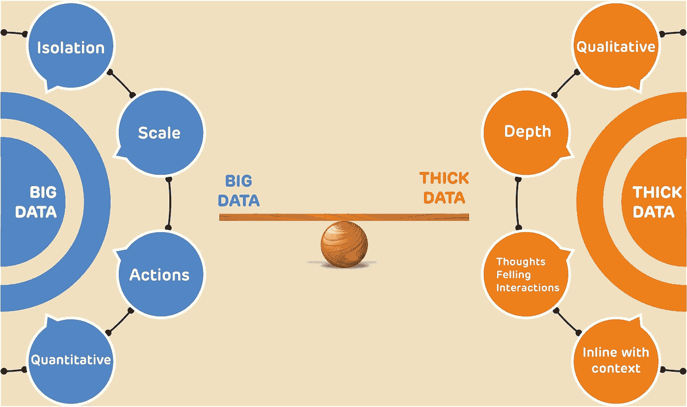
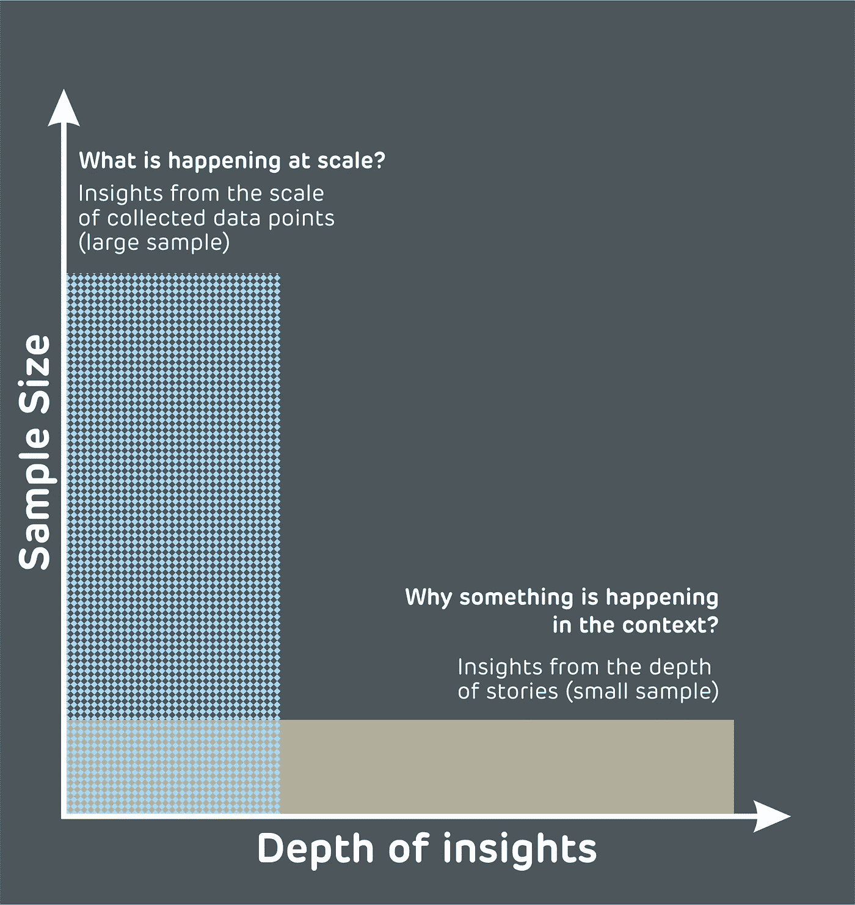
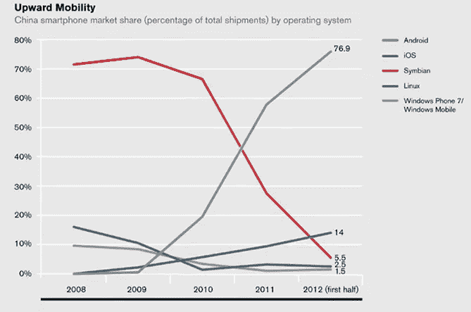
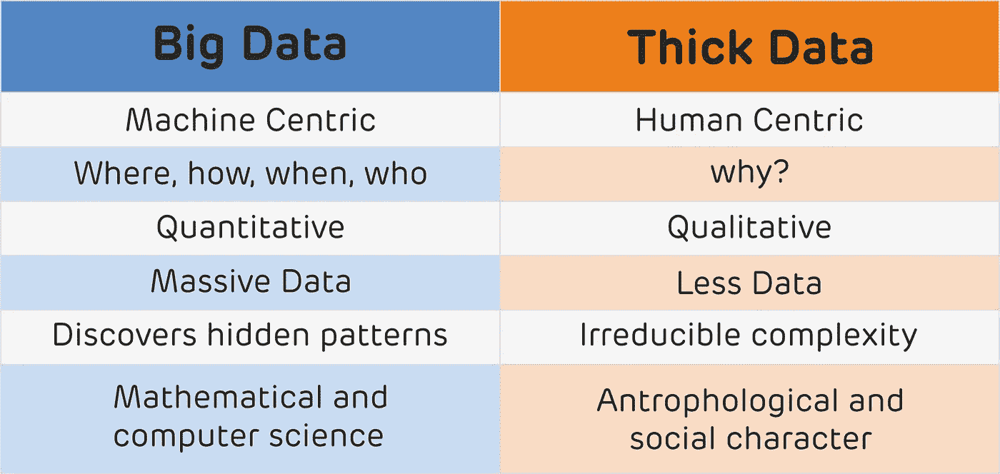

# 是大数据 Vs 厚数据还是大数据补充厚数据？

> 原文：<https://medium.com/mlearning-ai/is-big-data-vs-thick-data-or-big-data-complements-thick-data-d752c127703a?source=collection_archive---------5----------------------->

嘿伙计们，

在本文中，我们将讨论大数据和厚数据。这些术语有时看起来令人困惑。大数据 vs 厚数据还是两者相辅相成？所以，让我们来详细探讨一下这些流行语。

大数据已经成为数据驱动的热门词汇，它彻底改变了世界。在当今世界，每个人都在谈论大数据，企业也在围绕大数据运转。例如，像网飞、Spotify、亚马逊 Prime 等娱乐巨头。人们认为更多的数据意味着更好的决策。但这是部分真实的。说得好，垃圾进垃圾出。因此，数据的质量与数据集的大小同等重要，甚至更重要。数据的质量称为厚数据。

诺基亚就是一个最好的例子，它没有感受到厚数据的力量，而是严重依赖大数据。在 2005 年 iPhone 发布后，诺基亚·布洛伊建议公司去感受消费者情绪的神经(当时只有一小部分智能手机用户在那里)。当时，诺基亚正处于兴奋状态。2006 年，诺基亚在移动市场占有 60%的份额，是无可争议的领导者。诺基亚依赖于他们以前的销售和客户基础(大数据)，但在几年的时间里，诺基亚在移动行业成为了历史。

因此，最重要和最有意义的问题出现了。大数据够用吗？或者大而厚的数据都需要。

大数据对于解决任何业务中的预测都至关重要，但仅有大数据是不够的。大数据依靠定量和宏观维度的信息来回答正在发生的事情？

但是，为了深入了解人类的心理和意图，宏观和定量维度(大数据)必须与微观和定性维度(厚数据)相结合。因此，两者的结合可以有效地解决为什么会发生什么？大数据和厚数据对于形成一幅完整的画面都很重要，它们以不同的规模和深度呈现不同类型的见解。

很多时候，我们看到的一个小数据产生了难以置信的意义和故事的深度。它被称为厚数据。这与大数据相反。大数据的规模很大，遵循 3V(容量、速度和多样性),并利用新技术进行捕获、存储和分析。

因此，大数据和厚数据的集成可以为组织提供任何给定环境的更完整的上下文。为了描绘完整的业务图景，他们需要利用大数据和厚数据，因为它们都在不同的规模和深度上产生不同的见解。大数据依赖于海量的大量数据点来从大数据中发现隐藏的模式，而厚数据依赖于少量的数据点来深入了解以人为中心的模式。厚数据靠人类学习，大数据靠机器学习方式。

大数据揭示了来自大量数据集的洞察力，而厚数据揭示了小数据集中数据点之间连接的社会背景(定性)。一些时间组织陷入神话，认为更多的数据会产生更多的见解，但这并不总是正确的，大数据严重依赖于定量结果，而忽视了定性数据的重要性。

# **结论**

孤立地使用大数据可能会有问题。厚数据是了解未知的最好方法。当企业想知道他们不知道的事情时，他们需要探索厚数据，因为它提供了大数据无法提供的东西。厚数据往往会发现意想不到的事情。所以，在事物中取长补短是个好办法。

总结笔记时，请随意分享您的意见。您的掌声和评论将有助于我更好地展示内容。下周见。

 [## Mlearning.ai 提交建议

### 如何成为 Mlearning.ai 上的作家

medium.com](/mlearning-ai/mlearning-ai-submission-suggestions-b51e2b130bfb)