# 埃尔顿·约翰在经营一家推特巨魔吗？

> 原文：<https://medium.com/mlearning-ai/is-elton-john-running-a-twitter-troll-2a6ae781c8dc?source=collection_archive---------6----------------------->

使用 SparkNLP 确定巨魔是否正在创作

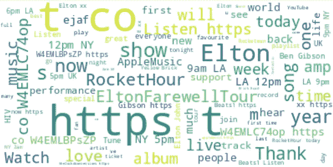

What Elton John is talking about!

我喜欢数据工程、数据科学和机器学习，所以我喜欢问有趣的问题，想有趣的方法来解决问题。

在 Twitter 上发现一个假账户可不简单。但首先要检测一个账户是否可以被归类为“巨魔”。“一个网络流氓，或网络恶霸，通过在脸书帖子、博客、YouTube 视频下、论坛和其他社交媒体，如 Twitter 和 Instagram 上发布贬损性评论，故意试图冒犯、制造麻烦或直接攻击他人。”——Endsleigh.co.uk

在几年前的选举期间，[fivethirtyeeight](http://fivethirtyeight.com)收集了一组推特信息，这些信息被俄罗斯攻击选举的巨魔用来左右公众舆论，让他们想要的人当选。这个数据集的标记方式应该允许我们使用机器学习方法来预测埃尔顿·约翰写的推文是否可以被归类为来自巨魔的推文。

我做的第一件事是提取我能找到的埃尔顿·约翰的推文。我希望来自 [FiveThirtyEight](http://fivethirtyeight.com) 的标注数据集的所有特征都可以在我可以直接从 Twitter 获得的数据中找到。

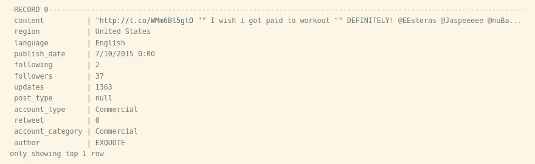

Labeled data for potential troll tweets

这个记录是我将在原始的未标记的 Twitter 数据中寻找的特征。

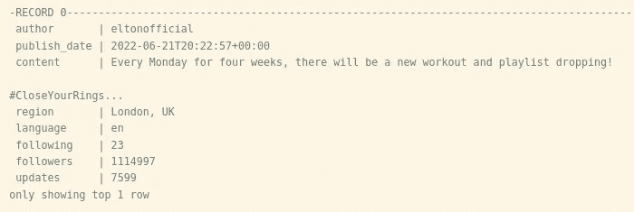

The matching raw twitter data for later fitting to the model

然后，我们将从标记的数据集中获取与成为巨魔相关的帐户。我们需要首先修复语言，使它们在两个数据集中匹配。

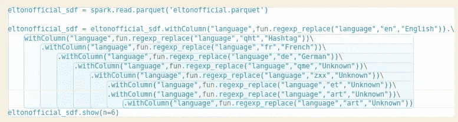

Cleaning the language feature

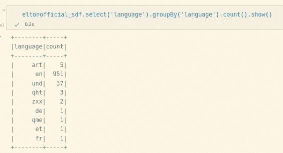

Pre-cleaned language

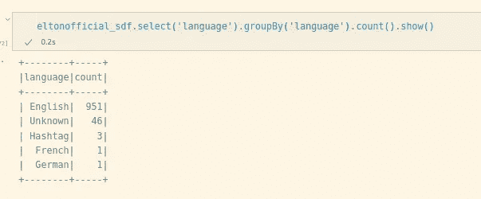

Language after being cleaned

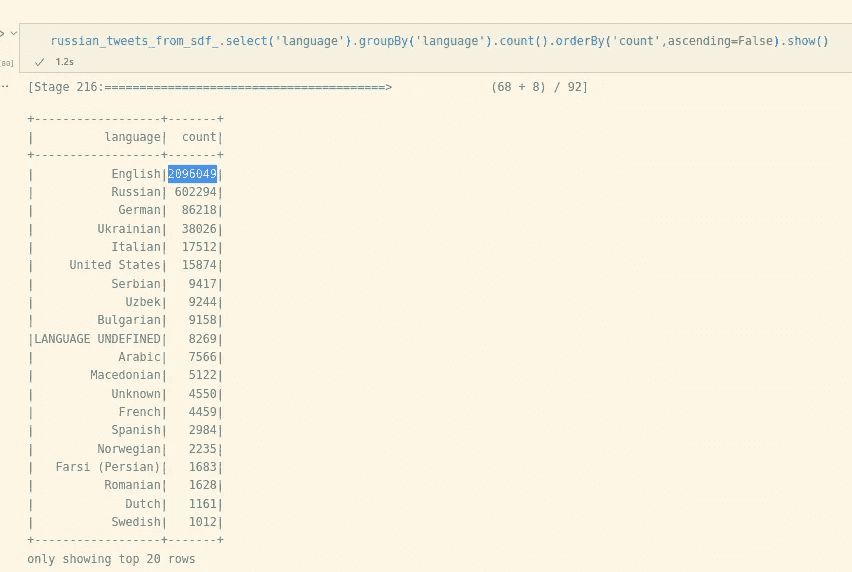

The Labeled Dataset

在这里，我们可以看到带标签的数据集有大量英语条目，因此我们将在两个数据集中限制我们的活动。

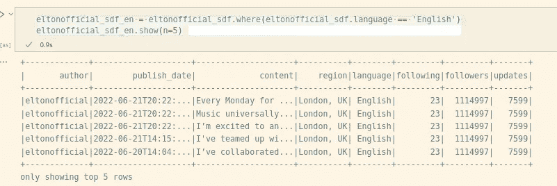

Original Twitter data in English only

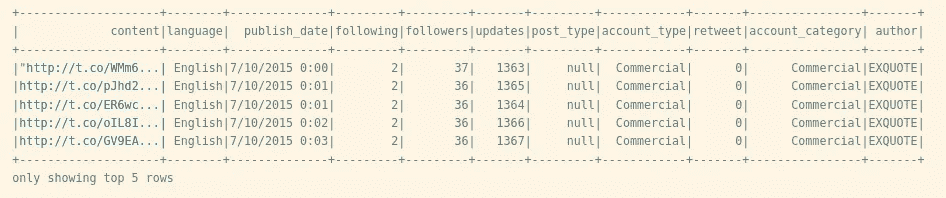

Labeled Dataset in English only

现在，我们需要确定标签数据集中的哪些列将有助于确定该推文是否来自钓鱼帐户。

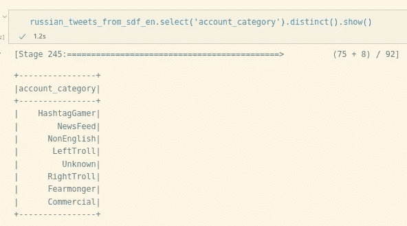

LeftTroll or RightTroll

account_category 是一个特性，它告诉我们是否可以将该帐户视为一个 troll 帐户。

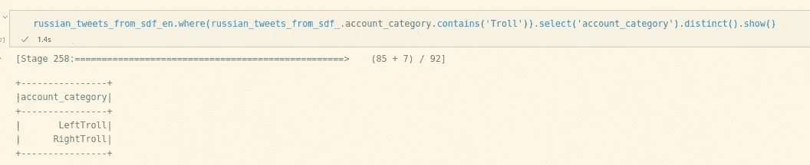

Troll Account Query

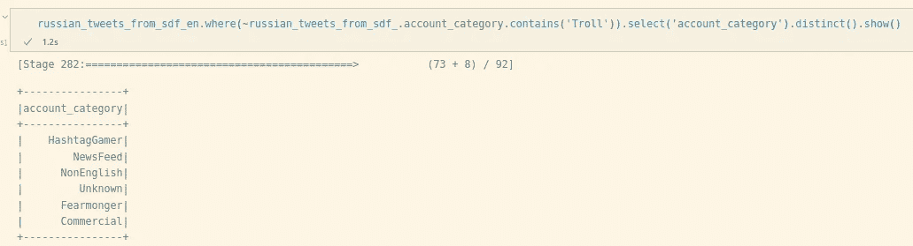

To balance the dataset, I will ensure that there are 50/50 trolls and non-trolls

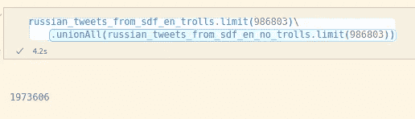

Balanced Dataset of trolls and no trolls

我真的不相信 Twitter 的区域是非常可靠的，所以我将从训练集中排除它。

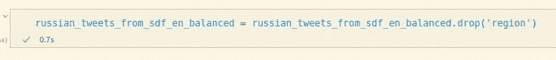

Dropped region feature

因为我们只关心作为标签的 troll，所以我们可以从训练集中的特性列表中删除 account_type。

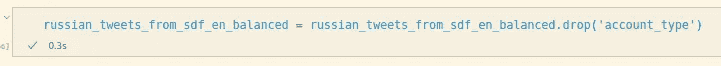

Removed account_type

最初的 Twitter 数据似乎不包括转发信息，所以我将从训练和测试数据集中删除这些功能。我也暂时不提出版日期。我们也可以删除语言列，因为它们都是同一种语言。我们还可以删除作者列，因为它不会用于确定推文是否来自巨魔。

首先，我将尝试通过对 tweet 文本应用 nlp 技术，将其转换为可由机器学习算法使用的特征，来看看我在预测 tweet 是否来自 troll 时能有多准确。

我从一个简单的逻辑回归算法开始，准确率约为 65%。我将随机行的数量范围从 100 到 500，000，仍然获得了大约 67%的准确率。

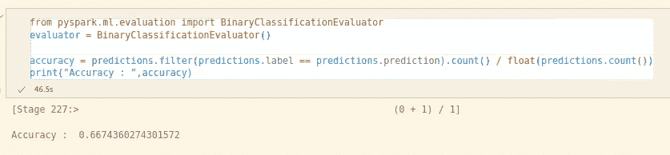

Logistic Regression

当仅仅考虑使用其他算法如梯度增强的文本本身时，准确率似乎在 70%左右。

如果我们使用其他分类变量，排除推文本身的内容，我会看看它的表现如何，看看它有多准确。

我试图用另一组特征来预测一个推特用户是不是巨魔。关注者的数量，账户被关注的数量和推文的数量可以非常准确地预测巨魔账户。使用梯度增强算法，准确率达到近 97%。

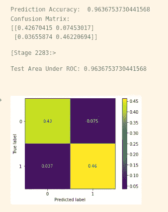

Accuracy based on followers, following and #tweets

在未来，将数字、文本和分类特征结合到一个管道中，看看它们如何相互作用，以影响该帐户是否应被归类为巨魔，这可能会很有趣。

对于题目中的问题，答案是否定的。埃尔顿·约翰没有开设巨魔账户。

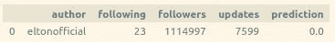

Prediction

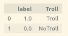

Label for Predictions

 [## Mlearning.ai 提交建议

### 如何成为 Mlearning.ai 上的作家

medium.com](/mlearning-ai/mlearning-ai-submission-suggestions-b51e2b130bfb)