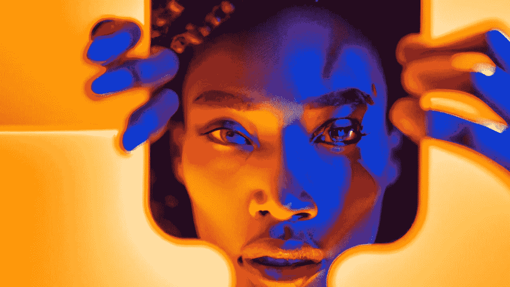

# 有可能黑机器学习吗？

> 原文：<https://medium.com/mlearning-ai/is-it-possible-to-hack-machine-learning-ca8188b0f6c0?source=collection_archive---------2----------------------->

## [创造性的机器学习](https://open.substack.com/pub/mlearning/p/how-can-you-hide-from-ai-person-recognition?r=z7zu8&utm_campaign=post&utm_medium=web)

## [黑客检测系统](https://open.substack.com/pub/mlearning/p/how-can-you-hide-from-ai-person-recognition?r=z7zu8&utm_campaign=post&utm_medium=web)

[Learn how detection systems may be manipulated.](https://open.substack.com/pub/mlearning/p/how-can-you-hide-from-ai-person-recognition?r=z7zu8&utm_campaign=post&utm_medium=web)

对[机器学习](https://open.substack.com/pub/mlearning/p/how-can-you-hide-from-ai-person-recognition?r=z7zu8&utm_campaign=post&utm_medium=web)系统的安全威胁普遍存在。它们很容易被恶意行为者和黑客滥用。因此，风险管理的负担太重了，不能只由技术团体来承担。人工智能艺术破解人类探测系统。