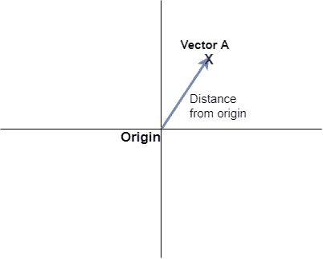
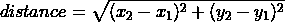
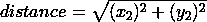
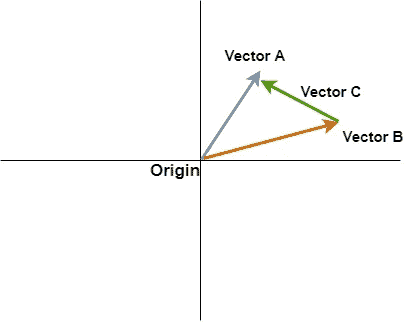

# L2 范数=欧氏距离吗？

> 原文：<https://medium.com/mlearning-ai/is-l2-norm-euclidean-distance-a9c04be0b3ca?source=collection_archive---------1----------------------->

有一个可能有点混乱的概念是机器学习中范数和距离的区别。什么时候你称它为 L2 范数或欧几里德距离？今天让我们永远澄清这一点。

Photo by [frank mckenna](https://unsplash.com/@frankiefoto?utm_source=medium&utm_medium=referral) on [Unsplash](https://unsplash.com?utm_source=medium&utm_medium=referral)

# 定义向量范数:

假设我们有一个 2D 向量 A.
向量 A 到原点的距离称为向量 A 的范数

Norm of Vector A

正如你所看到的，这就是我们如何在 2D 表示一个向量，从原点到向量 A 的距离被称为向量 A 的范数

该距离可以使用各种方法计算，例如欧几里德距离、曼哈顿距离等。

让我们用欧几里得距离来计算向量 A 离原点的距离，这是 2D 的样子。

假设向量 A 的坐标是(x2，y2)，原点的坐标是(x1，y1)=(0，0)，因此，我们得到如下:

使用欧几里得距离的向量范数也称为 L2 范数。
类似地，如果我们使用曼哈顿距离计算向量范数，那么它被称为 L1 范数。
为了计算一个向量的范数，我们只需要这个向量的坐标(正如你在距离方程中看到的)。

*简而言之:向量范数就是向量离原点的距离。*😉

# 定义矢量距离:

距离是可以存在于任何两点或向量之间的度量。例如，我们可以计算原点和向量 A 之间的距离，或者我们也可以计算两个向量 A 和 b 之间的距离。

在上图中可以看到，向量 A 和向量 B 之间的距离等于一个新的向量 c。

现在我们可以说向量 C 的长度是*向量 A 和向量 b 之间的距离，那么我们如何计算向量 C 的长度呢？通过使用欧几里德距离、曼哈顿距离等。

这一次，坐标(x1，y1)可能不为零，不像我们之前看到的向量范数的情形。

*因此，矢量距离是使用欧几里德、曼哈顿距离计算的两个矢量之间的距离，这产生了另一个矢量(在我们的例子中是矢量 C)*。可爱！😇

# 规范和距离有什么异同？

现在我们知道了向量范数和向量距离的含义，我们来看看这两者有什么相似或不同。

每当你看到一个向量的范数，比如 L1 范数，L2 范数等，那么它就是这个向量到向量空间原点的距离，这个距离是用欧几里德，曼哈顿等计算出来的。

每当你看到欧几里德距离，曼哈顿距离，或其他形式的距离，它就意味着两个向量或数据点之间的距离。

**好了，这个很重要:**
*因为两个向量 A 和 B 之间的距离产生了一个新的向量 C，我们也可以计算这个向量 C 的范数*有意义吗？👻

干得好！我希望这有用！🙌

# 结论:

1.  范数只针对一个向量，即它离原点的距离。
2.  *像欧几里得距离这样的东西只是一种计算两个向量之间距离的技术。*
3.  *对于向量范数，当距离计算技术是欧几里得时，它被称为 L2 范数，当该技术是曼哈顿时，它被称为 L1 范数。*
4.  保持健康，不断学习！😎

# 与我联系:

***邮箱****:saurav@guptasaurav.com* ***LinkedIn****:*[*https://www.linkedin.com/in/sauravgupta20*](https://www.linkedin.com/in/sauravgupta20/)

 [## Mlearning.ai 提交建议

### 如何成为 Mlearning.ai 上的作家

medium.com](/mlearning-ai/mlearning-ai-submission-suggestions-b51e2b130bfb) 

🔵 [**成为作家**](/mlearning-ai/mlearning-ai-submission-suggestions-b51e2b130bfb)