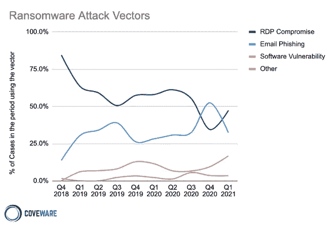

# 机器学习是网络攻击的银弹吗？

> 原文：<https://medium.com/mlearning-ai/is-machine-learning-the-silver-bullet-for-cyber-attacks-a400227a7143?source=collection_archive---------9----------------------->

很抱歉让你失望了。不幸的是，机器学习(ML)并不是网络安全的灵丹妙药…

然而，ML 正越来越多地被用于对抗不断发展的网络威胁。为什么 ML 正在成为安全产品的必备组件？

在接下来的几节中，我将回顾挑战和机遇，并讨论为什么现在比以往任何时候都更适合构建基于 ML 的网络安全解决方案。

Silver Bullet by DALL-E

**这仍然是 ML 和 Cyber 的第一天**

根据 [Gartner](https://www.gartner.com/smarterwithgartner/gartner-top-10-trends-in-data-and-analytics-for-2020?utm_medium=social&utm_source=twitter&utm_campaign=SM_GB_YOY_GTR_SOC_SF1_SM-SWG&utm_content=&sf240089296=1) 的研究，到 2024 年底，75%的企业将通过从试点转向运营 ML 来获得竞争优势。

类似地，在网络安全方面采用 ML 的公司将获得显著优势。许多 ML 功能特别适合解决网络安全挑战，包括建模用户行为(异常检测)、电子邮件钓鱼(分类)、威胁评分(线性回归)等。

# 挑战

从历史上看，安全是一个基于规则的二元系统，其状态要么是 0(该文件是良性的)，要么是 1(恭喜，您感染了病毒)。复杂系统基于一组规则定义这些类。

但是，面对每天超过 450，000 种[新发现的恶意软件类型](https://www.av-test.org/en/statistics/malware/)和已经存在的超过 13 亿种恶意软件类型，您如何面对这一大规模挑战呢？安全运营中心(SOC)团队如何应对新类型和大规模攻击的爆发？

此外，安全专家需要了解为什么文件或事件被归类为恶意软件或异常。

机器学习旨在使机器能够从一组预先观察到的类中学习。但是，如果一种类型的数据不存在于预先观察的类中，会发生什么呢？即使是最复杂的模型也无法预测新的模式，例如，一个被训练来对狗进行分类的模型将无法预测斑马。这正是零日攻击所利用的。

问题越来越严重。随着安全产品的发展，攻击者不再袖手旁观，而是开发基于人工智能的攻击载体。例如，攻击者使用人工智能技术来创建能够模仿可信系统组件的恶意软件。

> “我们不再被人类攻击了。电脑在攻击我们，软件在攻击我们。唯一的出路是使用人工智能”(AXA IT North Europe 首席技术官 Yorck Reuber)

这句话特别有趣，因为它来自欧洲最大的保险公司之一 AXA 的首席技术官，该公司最近[宣布](https://apnews.com/article/europe-france-technology-business-caabb132033ef2aaee9f58902f3e8fba)将停止在其网络保险政策下支付赎金。

下图显示了勒索软件攻击媒介不断变化的性质:

Source: [https://www.coveware.com/blog/ransomware-attack-vectors-shift-as-new-software-vulnerability-exploits-abound](https://www.coveware.com/blog/ransomware-attack-vectors-shift-as-new-software-vulnerability-exploits-abound)

主要的攻击媒介是远程桌面协议(RDP)危害(从 80%下降到 40%)、电子邮件钓鱼(在 2020 年飙升到 50%以上)和软件漏洞(众所周知，90%的生成代码基于开源、GitHub 存储库等可重用的代码。).

# 机会

我必须强调，单独的 ML 很少是可行的解决方案。包括人为干预在内的其他措施可能是必要的。例如，在一些用例中，让一个人来评估低于某个阈值的机器预测是一个很好的实践。

建立连贯的 ML 战略并克服在大规模生产中使用 ML 的许多挑战(你可以在这里了解 MLOps [的挑战)的公司将能够提供准确的警报，误报率较低，并将能够与较小的 SOC 团队合作，从而降低人力成本。](/mlearning-ai/why-is-mlops-a-strategic-goal-for-tech-leaders-c2cf3262defa)

另一个有增长潜力的领域是零起点学习(ZSL)，这是 ML 最吸引人的领域之一。简单地说，ZSL 允许模型识别它以前没有见过的东西。

ZSL 可能是零日漏洞的有效解决方案。ZSL 还可以帮助处理安全信息事件管理(SIEM)和入侵检测(IDS)等网络安全系统面临的警报泛滥问题。

这篇[文章](https://arxiv.org/abs/2106.14647)提出了一种新的方法来自动检测 SIEM 中生成的警报标签，并将它们与特定的攻击类型相关联。使用这种方法，我们可以识别攻击，确定哪些特征有助于分类，并对它们进行分类，而无需任何先验知识。

ZSL 提出了一种基于特征影响将新型攻击分类为特定新类别的零攻击方法。使用所产生的系统，可以将攻击与正常流量区分开，并且可以基于促成攻击的特征来自动生成标签。

# 为什么现在是合适的时机？

现在，我们比以往任何时候都更生活在一个开发者有肥沃的土壤来构建基于 ML 的网络解决方案的时代。这是由于三个主要因素。

第一个因素是人工智能 ML 公司使 ML 民主化，并使 ML 从业者能够更快地创新。像 SageMaker 这样的 ML 平台加快了从研究到概念验证和从概念验证到生产的时间间隔。AutoML 使开发人员能够运行快速实验，快速获得通过/失败结果。

第二个因素是充满活力的生态系统。NVIDIA 最近推出了 NVIDIA [Morpheus](https://catalog.ngc.nvidia.com/orgs/nvidia/teams/morpheus/containers/morpheus) ，这是一个为网络用例定制的 ML 框架，使网络安全开发者能够创建优化的人工智能管道，用于过滤、处理和分类大量实时数据和预训练模型。

第三个因素是自然语言处理(NLP)的兴起。网络领域最大的挑战之一是缺乏标记数据。然而，自我监督学习(SSL)的实践正在增长。本质上，SSL 是一个机器学习过程，其中模型训练自己从输入的另一部分学习输入的一部分。今天，你可以在拥抱脸网站上找到安全领域的预训练 BERT 模型，如 SecBERT 和 [SecRoBERTa](https://huggingface.co/jackaduma/SecRoBERTa?text=Paris+is+the+%3Cmask%3E+of+France) 。

您可以在此阅读更多信息:

 [## 理解零射击学习——让 ML 更人性化

### 一个模型如何识别它没见过的东西的直观概述。

towardsdatascience.com](https://towardsdatascience.com/understanding-zero-shot-learning-making-ml-more-human-4653ac35ccab) 

[https://catalog . NGC . NVIDIA . com/orgs/NVIDIA/teams/morpheus/containers/morpheus](https://catalog.ngc.nvidia.com/orgs/nvidia/teams/morpheus/containers/morpheus)

 [## jackaduma/SecRoBERTa 拥抱脸

### 我们正在通过开源和开放科学来推进和民主化人工智能的旅程。

huggingface.co](https://huggingface.co/jackaduma/SecRoBERTa?text=Paris+is+the+%3Cmask%3E+of+France)  [## 随着新的软件漏洞利用大量出现，勒索软件攻击媒介也在转移

### Coveware 季度勒索软件报告描述了 2021 年 Q1 期间勒索软件事件响应趋势。数据…

www.coveware.com](https://www.coveware.com/blog/ransomware-attack-vectors-shift-as-new-software-vulnerability-exploits-abound) 

[https://medium . com/mlearning-ai/why-is-mlops-a-strategic-goal-for-tech-leaders-c2cf 3262 defa](/mlearning-ai/why-is-mlops-a-strategic-goal-for-tech-leaders-c2cf3262defa)

 [## 使用可解释人工智能的自适应网络安全零射击学习方法

### 网络安全是一个攻击模式不断变化的领域，我们需要一些方法来使我们的…

arxiv.org](https://arxiv.org/abs/2106.14647)  [## Mlearning.ai 提交建议

### 如何成为 Mlearning.ai 上的作家

medium.com](/mlearning-ai/mlearning-ai-submission-suggestions-b51e2b130bfb)