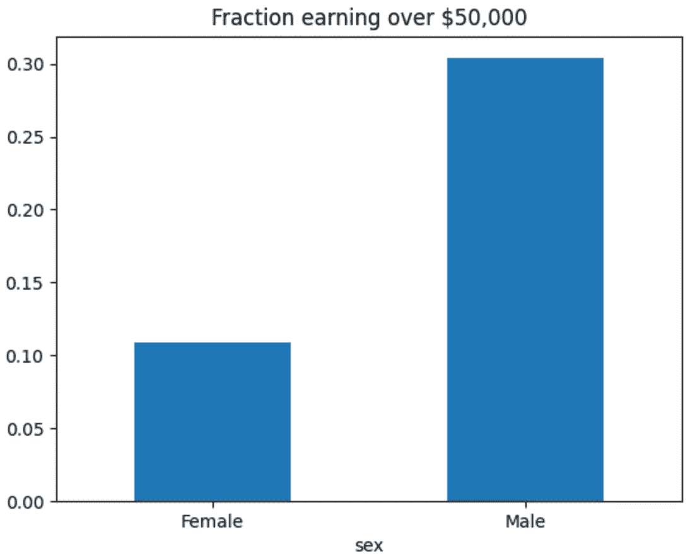

# 我的 AI 模型有偏差吗？—人工智能公平性概述

> 原文：<https://medium.com/mlearning-ai/is-my-ai-model-biased-a-brief-overview-of-ai-fairness-252a912e5f14?source=collection_archive---------10----------------------->

Photo by [Elisa Ventur](https://unsplash.com/@elisa_ventur?utm_source=unsplash&utm_medium=referral&utm_content=creditCopyText) on [Unsplash](https://unsplash.com/s/photos/frustrated?utm_source=unsplash&utm_medium=referral&utm_content=creditCopyText)

# 介绍

一个晴朗的夜晚，我正在训练一个贷款金额预测模型。这是一个回归问题，我们根据可能授予特定申请人的贷款金额给出预测。在训练过程中进行了成功的实验后，我最终得到了一个性能可以接受的模型，均方差在 30 左右。

但是，当我在新的看不见的数据上测试模型时，我突然观察到一件事，那就是肯定存在模型偏差，由于这种偏差，每个性别的预测范围是不同的。

想象一下把这个模型投入生产。

在训练 ML 模型时，我们通常会遇到模型偏差，有一些公开可用的技术可以帮助减轻它。

# 偏见与公平

模型偏差是由于 ML 模型在决策过程中所做的一些错误假设而产生的。一般来说，偏见意味着对某个特定的个人或群体做出典型的预测。

偏差可以在建模过程中的任何阶段引入，无论是数据收集、数据清理、特征工程、模型训练还是模型测试。在每个阶段进行检查、监控、评估、调查和评价是非常重要的。

公平指的是不基于个人或群体的属性对他们有偏见。偏见是对特定个人或群体的歧视。

Example of minor vs major entity in a group

# 如何减轻模型偏差？

让我们讨论一下可以减少任何 ML 模型偏差的不同方法。

**一、截然不同的影响:**假设有两组，我们的模型偏向一组。所以，与另一组相比，有偏见的一组肯定得到了一些积极的结果。不同的影响计算为每组内积极结果之间的比率。

为了减少视差的影响，我们可以使用一种称为 ***视差影响消除器*** 的预处理技术。

**二。对抗性去偏置:**这是一种在模型训练中执行的技术。基本上，我们训练两个模型。一个模型试图从特征和实际目标中学习。第二模型或对抗模型试图从原始特征中学习，但是目标取自第一模型的预测。对抗模型将无法在敏感属性上表现良好，这就是我们如何能够在第一个模型中检测到偏差。

**三世。均衡赔率:**这是一种后处理方法，其中分类器以相同的方式处理每组，如果它们具有相同的错误率。

# 使用 Python 处理偏差

python 中有一些库可以帮助减少偏差。

**i. FairLearn:** 我们可以使用 FairLearn，这是一个 python 库，用于计算准确性、精确度等指标。基于性别等敏感特征。它也有一个减少模块，通过它我们可以减少人口均等。更多关于 FairLearn 的细节可以在[这里](https://fairlearn.org/v0.7.0/quickstart.html)找到。

**二世。人工智能公平 360:** AIF 360 最初是由 IBM 开发的，我们可以使用它来减轻任何 ML 模型的偏差。因此，我们可以在不同的阶段引入模型处理，以使模型更加公平。不同的阶段是预处理、加工中和后处理。在这里通过 AIF 360 [探索不同的模型处理方法。](https://aif360.readthedocs.io/en/stable/modules/algorithms.html#id12)

# 参考

我想感谢以下博文的作者写了关于人工智能中的公平，我请求你浏览一下这些链接。

1.  [你的模型做出不公平预测的 5 个原因](https://towardsdatascience.com/algorithm-fairness-sources-of-bias-7082e5b78a2c)

2. [AI 公平性——不同冲击消除器的说明](https://towardsdatascience.com/ai-fairness-explanation-of-disparate-impact-remover-ce0da59451f1)

3.[使用对抗性去偏置减少模型偏置](https://towardsdatascience.com/reducing-bias-from-models-built-on-the-adult-dataset-using-adversarial-debiasing-330f2ef3a3b4)

4.[衡量机器学习模型中的公平性](/data-from-the-trenches/measuring-fairness-in-machine-learning-models-2be070fab712)

 [## Mlearning.ai 提交建议

### 如何成为 Mlearning.ai 上的作家

medium.com](/mlearning-ai/mlearning-ai-submission-suggestions-b51e2b130bfb)