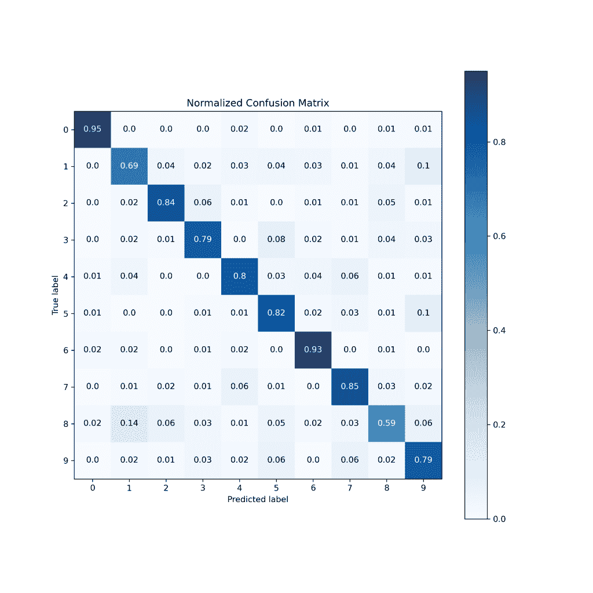
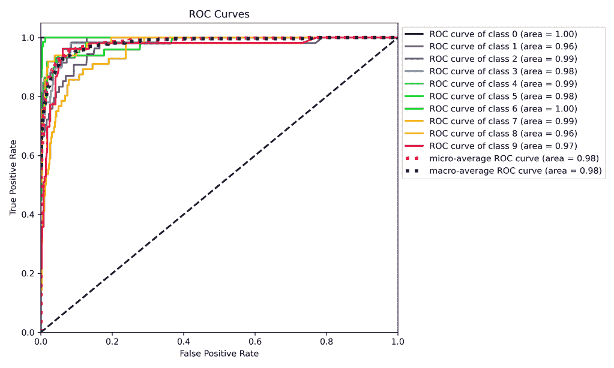
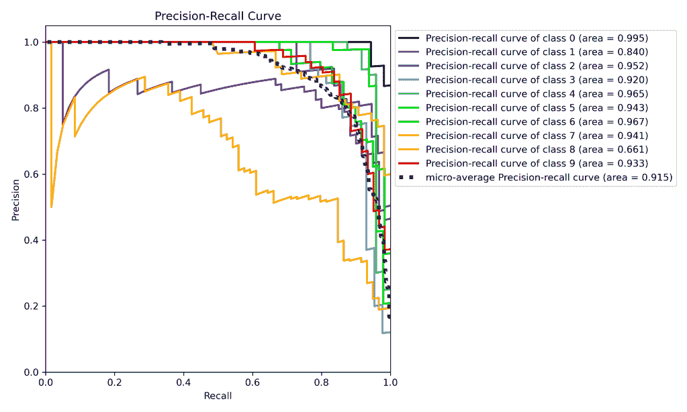
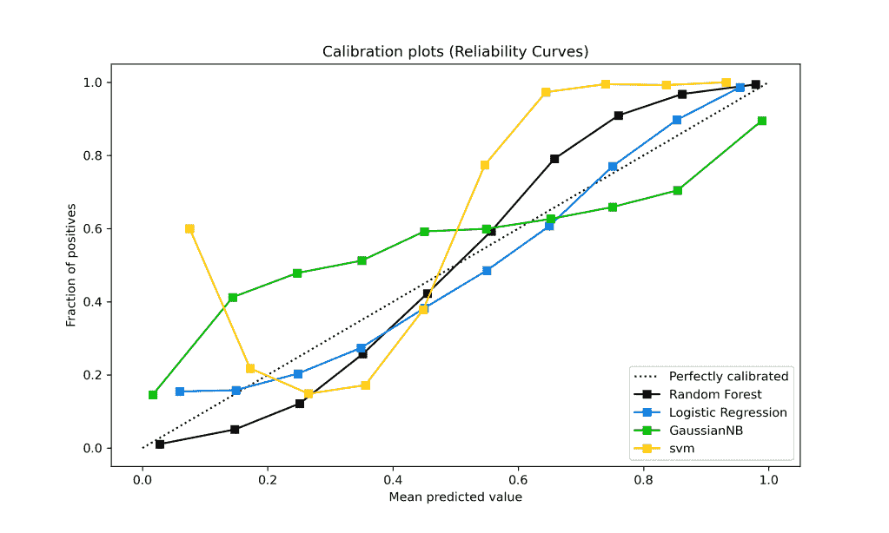
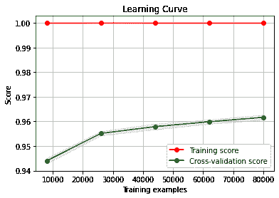
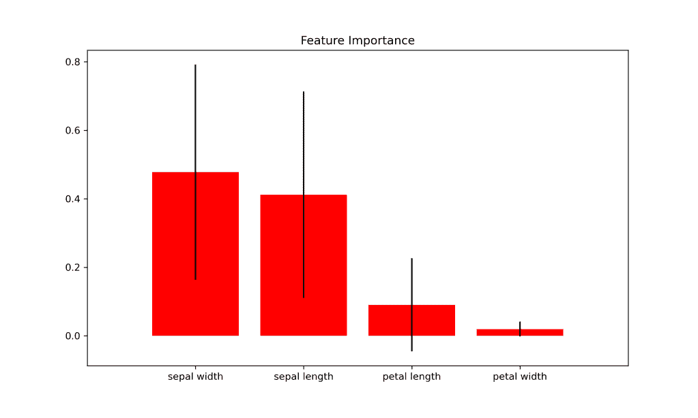

# 我的模特训练的好吗？

> 原文：<https://medium.com/mlearning-ai/is-my-model-trained-well-b2dcb75a4f5d?source=collection_archive---------4----------------------->

## 已训练模型的性能参数

机器学习是模型的组合，如果在正确的环境中应用，会产生意想不到的结果。相反，如果选择不当，可能会导致错误的预测或输出。因此，开发高度准确的机器学习模型的周期不会停止于训练和使数据集适合所选模型。我们必须分析不同参数的训练模型，以验证其预测的有效性。python 中提供了多种参数图，可用于理解训练模型。Python 有一个特殊的库 **Scikit-plot** ，它有一些包和函数，可以用来创建图表，以便用几行代码理解一个经过训练的模型的性能。在这个博客中，我们将讨论这个库中一些最常用的函数。

# 西基特图

每个数据科学家都知道，可视化是数据科学过程的重要组成部分之一，不应该被忽视。然而，在训练模型时，大多数数据科学家更关心模型的准确性、超参数调整或获得期望的输出。在这个设置中，像 Scikit-plot 这样的库帮助很大，它提供了使用几行代码创建信息丰富的图形的包。让我们看看如何使用这个库来创建重要的机器学习图。

# 装置

可以使用 PyPi 通过以下命令下载最新版本的 Scikit-plot。

# Scikit-plot 的先决条件

在使用 **Scikit-plot** 创建图形之前，需要导入所需的库。 **Scikit-plot** 已经使用 matplotlib 创建，所以我们也需要导入它。下面的代码导入了我们在实验中使用 **Scikit-plot** 时所需的大部分库。

# 混淆矩阵

训练模型后最重要的输出之一是其混淆矩阵，该矩阵可用于解释多种结果，如**真阳性率、假阳性率、精确度、召回率或 F1 测量值**。通常我们可以输出一个简单的矩阵，但是 Scikit-plot 提供了一个漂亮的混乱矩阵的热图。这个混淆热图将能够用深色表示混淆矩阵中的高值，这样我们就不会意外地忽略一个重要的输出。

让我们将 **RandomForestClassifier** 应用于 **sklearn.datasets** 中可用的**数字**数据集，然后使用带有默认参数的 **cross_val_predict** 进行预测，下面是代码。

现在让我们使用 **Scikit-plot** 绘制混淆矩阵，下面是代码和输出图像。它在混淆矩阵的对角线上显示较暗的单元，这是所期望的，因为大多数预测与实际类别相似。可以从各种博客或教科书中研究与混淆矩阵相关的更多细节，medium.com 就是一个例子。

# 受试者工作特征曲线

这是真阳性率和假阳性率之间的曲线。当数据集存在类别不平衡问题时，此图非常重要，但是，它也应该与正常数据集一起绘制。基本上，ROC 曲线下的面积是要观察的主要参数，面积越高模型越好。为标注数据集的每个输出类生成 ROC 曲线。Scikit-plot 绘制了一条 ROC 曲线，其中包含微观平均值和宏观平均值以及所有输出类，下面写有一行代码。由此代码生成的 ROC 曲线也如下。关于 ROC 曲线的细节可以从[这个博客](https://towardsdatascience.com/understanding-auc-roc-curve-68b2303cc9c5)中研究。

# 精确回忆曲线

精度-召回曲线用于测试预测阳性类别的模型的准确性。Scikit-plot 提供了一个在单行代码中创建精度-召回曲线的函数。关于精确召回曲线的更多细节可以从[的博客](https://towardsdatascience.com/precision-recall-curves-how-to-easily-evaluate-machine-learning-models-in-no-time-435b3dd8939b)中研究。 **Scikit-plot** 的代码及其输出如下。

# 模型校准(校准曲线)

每当模型为我们提供一个精度值时，它并不反映模型在预测标记输出时的置信度。在任务关键型应用模型中，在比较多个机器学习模型时，还应该考虑预测输出类别的置信度。例如，如果一个经过训练的模型预测一个人没有健康状况(比如说电晕),置信度只有 0.60。在这种情况下，此人应该进行进一步的测试，因为 0.60 不是预测负类的好置信度。校准曲线有助于显示类别的平均预测值以及阳性分数。 **Scikit-plt** 的以下代码提供了为四种不同机器学习算法的合成生成数据集生成校准曲线的功能，并显示了它们的校准值以及完美校准的曲线。关于模型校准的细节可以从[这个博客](https://towardsdatascience.com/classifier-calibration-7d0be1e05452)中进一步研究。

# 学习曲线

学习曲线是用于比较模型在训练和验证数据集上的训练和测试准确性的曲线。它是根据用于计算这些值的训练示例的数量绘制的。 **Scikit-plot** 提供了一个可以帮助你绘制这条曲线的函数，你可以在下面找到代码及其输出。这个图表也可以让你了解**偏差-方差权衡。**

# 特征重要性

减少数据集中的要素数量是数据预处理的主要任务之一。它可以为机器学习模型的成功做出很大贡献。PCA 和许多其他技术用于创建新特征，这些新特征可以是一个或多个特征的组合。然而，我们可以在模型训练后计算每个特征的特征重要性值，它也可以反映每个特征对输出决策的贡献。 **Scikit-plot** 库也具有查找每个特征的特征重要性值并表示其标准偏差的功能。下面的代码使用 sklearn 包中可用的 iris 数据集，并发现它的四个特性对于将实例分类到不同的类中的重要性。

# 结论

多个模型的比较和模型的不同版本应该在多个参数上进行比较，以便找到最适合给定数据集的参数。在向老板展示这些结果时，与数字相比，图表总是更好的表达方式，这也是事实。有一个名为 Scikit-plot 的 python 包可以帮助机器学习实践者用最少的代码行生成这些图形。

在这篇博客中，我们已经看到了一些与分类活动相关的重要函数，以及它们各自的代码和输出。训练完模型后，您可以使用这些代码来分析训练结果。

*原载于 2021 年 12 月 11 日*[*http://rajindersandhu.com*](https://rajindersandhu.com/2021/12/11/is-my-model-trained-well-model-training-analysis/)*。*

 [## Mlearning.ai 提交建议

### 如何成为 Mlearning.ai 上的作家

medium.com](/mlearning-ai/mlearning-ai-submission-suggestions-b51e2b130bfb)