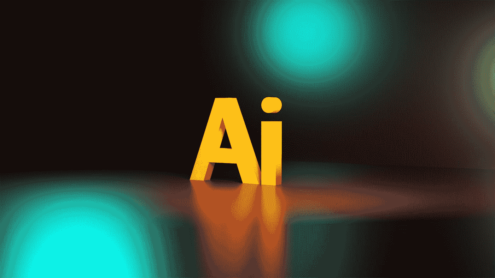

# 大脑是人工智能的有用模型吗

> 原文：<https://medium.com/mlearning-ai/is-the-brain-a-useful-model-for-artificial-intelligence-625faae02f77?source=collection_archive---------8----------------------->

## 人工智能能再造任何人脑吗？

Photo by [Jackson Sophat](https://unsplash.com/@jacksonsophat?utm_source=medium&utm_medium=referral) on [Unsplash](https://unsplash.com?utm_source=medium&utm_medium=referral)

毫无疑问，人工智能近年来取得了令人难以置信的进步。

> 但是它真的能再造人脑吗？