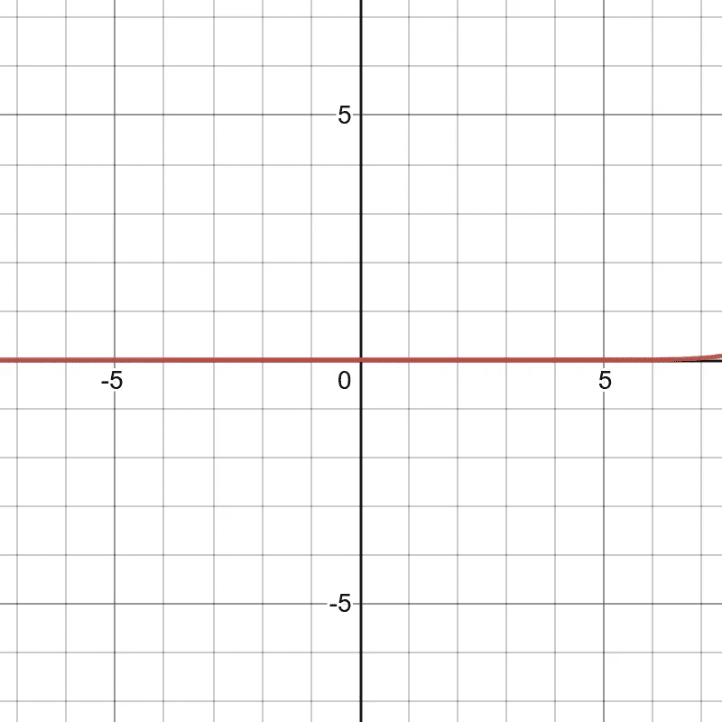
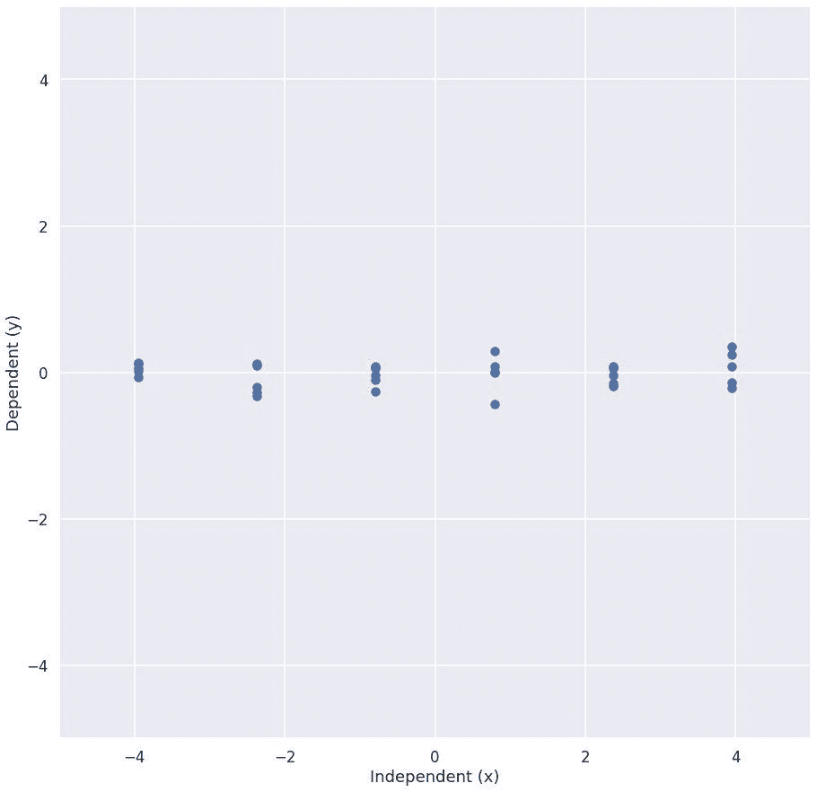
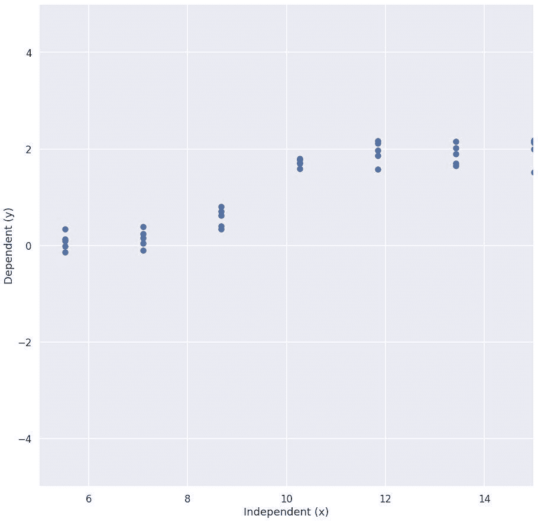
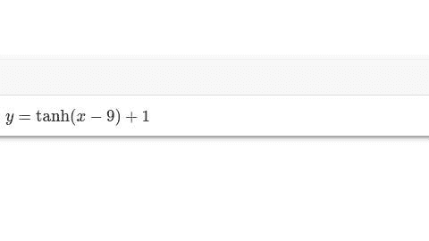

# 有什么，还是什么都没有？

> 原文：<https://medium.com/mlearning-ai/is-there-something-or-nothing-c539edf1b875?source=collection_archive---------9----------------------->

## 通过错综复杂的数据发现关系

数据是你真正关心的东西的窗口。如果你在听病人的心脏，声波就是数据。但是你真的关心那些你看不到也摸不到的心脏瓣膜。

所以数据是有用的，但可能会误导人。这是不可避免的。避免被误导的最好方法是围绕你的数据仔细思考*:还有什么其他解释可以解释我所看到的？*

“Doesn’t look like anything to me…”

在这里，我将谈论一个主要的替代解释:你的变量不是*线性的*，但是你正在像它们一样分析它们。我们将大致了解一下这意味着什么，然后再看一个具体的例子。

互动笔记本(模拟资料):[https://colab . research . Google . com/drive/1 D4 ly 9 hpqtkr _ WBS 4 wqmcsuhc 0 gxkflrl？usp =分享](https://colab.research.google.com/drive/1d4Ly9HPQTKr_WBS4wqmcsuHc0GxkFlrL?usp=sharing)

## 起初什么都没有…

我们要“做一个实验”

(It’s actually a simulation but we’ll revisit that at the end.)

看起来改变我们控制的变量(独立的 x)不会改变我们观察的变量(依赖的 y)。

如果我们做相关分析，我们会发现 X 和 y 之间没有统计学上的显著性，我们不能拒绝它们不相关的无效假设。

换句话说，他们看起来没有血缘关系。

## …然后*噗*，关系！

但是假设你的朋友做了同样的实验，告诉你 X 和 Y 是相关的。什么？！他们怎么会这么傻？

然后你看看他们的实验

(Simulation of a different range for x)

哇，看起来 X 和 y 之间没有一条直线。看起来它们是相关的！

结果是你的朋友做了同样的实验，但是是在不同的 X 范围内，很容易看到，当 X 上升并超过 10 时，Y 会上升。

## 真相是什么？

关于*模拟*数据的伟大之处在于，你知道真相是什么:你构建了它！

所以让我们来看看是什么生成了我们的数据:[https://www.desmos.com/calculator/xwb1cexqep](https://www.desmos.com/calculator/xwb1cexqep)

红线是在我们添加一些静态数据之前产生数据的事实。红线有这个等式——它可能看起来很复杂，但它是你会遇到的最不复杂的事情之一。

Small, but tricky, curveball

这里发生的事情是，我们在 X 的一个小范围内运行我们的实验，并假设这个小范围代表整个范围。

在这个小范围内收集更多的样本**并不能解决我们的问题**。问题是我们假设变量之间是线性关系，而实际的关系不是线性的。

## 那又怎样？

在过去，我们会被困在试图把小块的线条拼凑成大图。但是今天，很大程度上由于*机器学习*，我们可以避免做线性假设，因为计算机可以比我们在纸上做更复杂的计算。

能够发现非线性可能是“这不是一种有前途的治疗”和“神奇药物”之间的区别。接下来，我们将深入更复杂的方法，通过数据来了解我们关心的关系。

 [## Mlearning.ai 提交建议

### 如何成为 Mlearning.ai 上的作家

medium.com](/mlearning-ai/mlearning-ai-submission-suggestions-b51e2b130bfb)