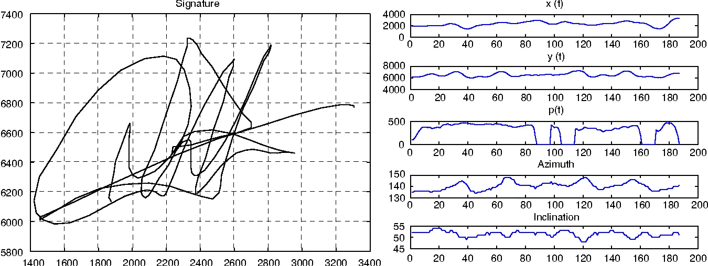
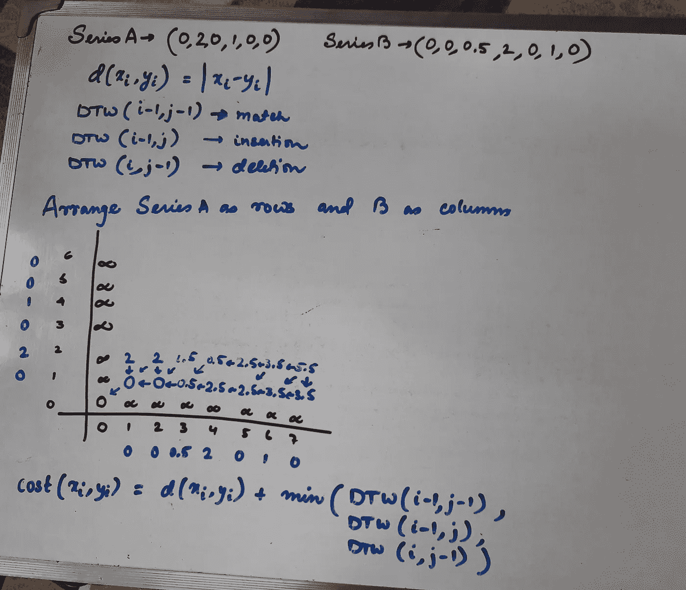
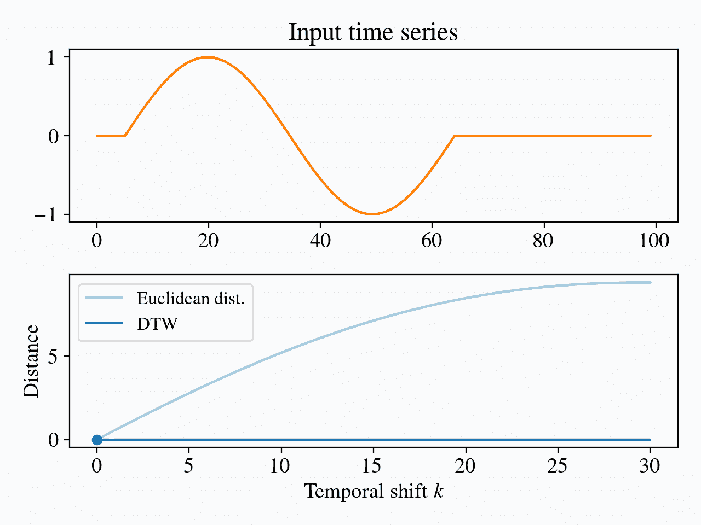

# 这是签名伪造吗？？

> 原文：<https://medium.com/mlearning-ai/is-this-signature-forgery-6bb8043495c1?source=collection_archive---------6----------------------->

使用动态时间弯曲(DTW)的签名识别方法

signature recognition and matching

签名识别是行为生物识别的一个例子，它根据笔迹来识别一个人。

它以两种方式运行:

*   **静态:**用户将他们的签名写在纸上，使用任何 OCR(光学字符识别)设备或相机对其进行扫描，以将签名图像转换为比特。然后系统根据签名的形状对其进行分析。该技术也被称为**【离线签名识别】**
*   **动态:**使用数字化设备实时捕捉签名。它也被称为'**在线签名识别**，通常捕获以下信息:

→空间坐标 x(t)和 y(t)

→压力 p(t)

→方位角 az(t):球面坐标系中的角度测量

→倾斜角度(t)

→笔向上/向下

用于签名识别的一些流行的模式匹配技术有:[隐马尔可夫模型](https://en.wikipedia.org/wiki/Hidden_Markov_model)、[矢量量化](https://en.wikipedia.org/wiki/Vector_quantization)、[动态时间弯曲](https://en.wikipedia.org/wiki/Dynamic_time_warping#Warping_properties)

*在这篇博客中，我们将详细讨论动态时间扭曲，了解直觉、工作原理以及 DTW 如何帮助签名识别；主要是在线签名识别*

## 什么是动态时间扭曲？

在时间序列分析中，动态时间弯曲(DTW)是一种用于测量两个时间序列之间相似性的算法，这两个时间序列的速度可能不同。

观测发生的精确时间步长被忽略；只有它们的排序才重要。

> **动态**，因为它使用动态编程| ' **时间**，因为它用于时间序列| ' **扭曲**，因为它可以被解释为计算两个序列的扭曲(变形)版本之间的“通常”距离

## 为什么是 DTW？

你肯定会问为什么不是其他的距离度量，比如欧几里德距离？？

dtw vs euclidean

让我们从上图所示的例子中理解。这两个系列是相似的还是相差甚远？？

虽然欧几里德距离是主要的距离度量，但是每当涉及到**时间不变性**时，它都不能涵盖距离的实际情况。上面显示的两个系列相似，只是速度不同。这对于大多数时间序列数据来说是正确的，其中速度可能由于各种因素而变化，但是总体模式保持不变。

动态时间弯曲是一种非线性弹性时不变距离度量。

## 直觉理解

怎样才能直观地了解 DTW？

考虑两个时间序列 A -> (0，1，1，-2，0)和 B -> (0，0，1，-1)。 **DTW 是将序列 B 转换成序列 a 的最小成本。**

转换使用 3 个操作进行:插入；删除和匹配，这三种操作遵循一定的原则:

*   可以在相邻空间中插入或删除条目的副本。这是零成本。从(0，1，1，-2，0) → (0，1，1，-2，-2，0)的成本为零
*   可以编辑条目。如果你编辑 a 到 b，代价是 a 和 b 之间的距离。例如，从(0，1，1，-2，0) → (0，1，5，-2，0)花费了 d(1，5)
*   可以在序列的末尾插入或删除 0。这没有成本

所以，考虑到上面的系列 A 和 B，

(0,1,1,-2,0) → (0,0,1,1,-2,0) → (0,0,1,-2,0) → (0,0,1,-1,0) →(0,0,1,-1)

发生的成本仅在第三步中从-2 转换到-1，即 1

上述原则属于编辑距离，DTW 使用类似的方法使用动态编程来计算其距离

## DTW 的动态规划方法

Computing cost matrix for Dynamic Time Warping

使用动态规划的目的是使用以下等式构建成本矩阵

> 代价:= d(s[i]，t[j])
> DTW[i，j] :=代价+最小值(DTW[i-1，j]，//插入
> DTW[i，j-1]，//删除
> DTW[i-1，j-1]) //匹配

要了解更多关于该算法的信息，我建议你阅读:[维基百科文章](https://en.wikipedia.org/wiki/Dynamic_time_warping)或观看 [youtube 视频](https://youtu.be/ro_UKUtXwNI)

由于时间不变性的优点，无约束 DTW 有一些限制，因此两个变体 Sakoe-chiba 和 Itakura 提供了性能的增强。

局限性在于这样一种理解，即 dtw 查询中的一个点可以与相应引用中的任意数量的点匹配，反之亦然。然而，**我们理想地想要限制匹配**的最大点数，因此使用两个参数:固定的窗口大小(如在 Sakoe-chiba 中)和对齐的斜率(如在板仓中)

dtw time invariance

> 从上面的 GIF 中可以明显看出，即使位移在不断增加，DTW 测量的距离却没有变化。我们需要将时间不变性限制为仅测量局部不变性

我们将在单独的博客中深入探讨这两种变体。要了解更多信息，[请参考这里的](https://perun.pmf.uns.ac.rs/radovanovic/publications/2019-inista-dtw.pdf)

## 结论

我们现在已经探索了动态时间扭曲、直觉理解和算法方法。在线签名匹配利用 dtw 的这种时间不变性来将输入签名与用户提供的参考进行匹配。这允许在相当大的范围内的变化，以考虑签名作为个人的生物识别。

感谢您的阅读！！希望你喜欢并有一些有价值的东西要考虑:)继续沐浴你的❤和支持

**在这里关注我，在** [**LinkedIn**](https://www.linkedin.com/in/sourav-agarwal-saag/) 与我联系

 [## Mlearning.ai 提交建议

### 如何成为 Mlearning.ai 上的作家

medium.com](/mlearning-ai/mlearning-ai-submission-suggestions-b51e2b130bfb)