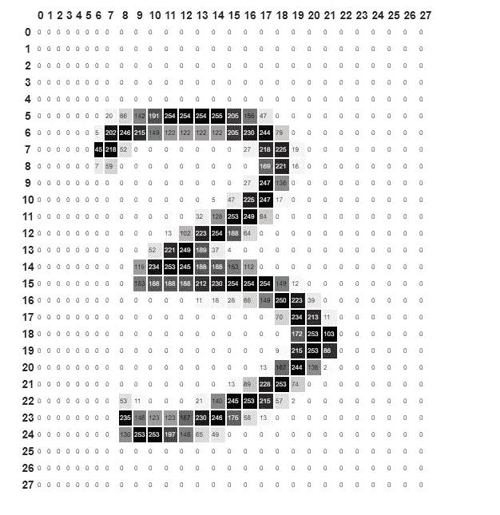
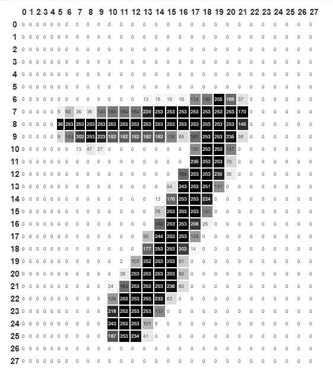
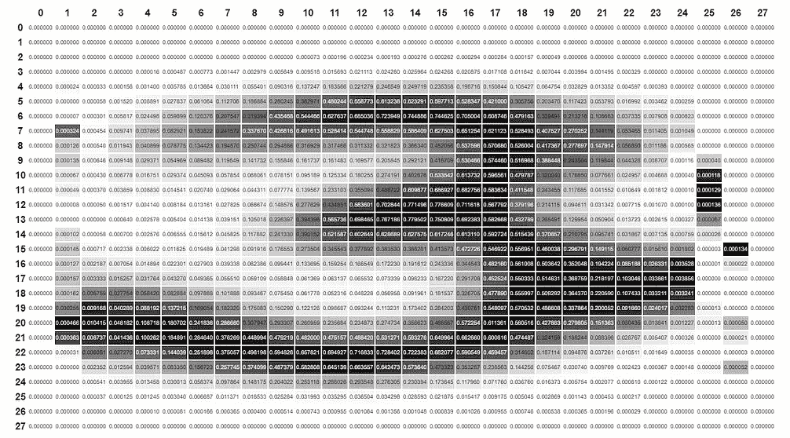
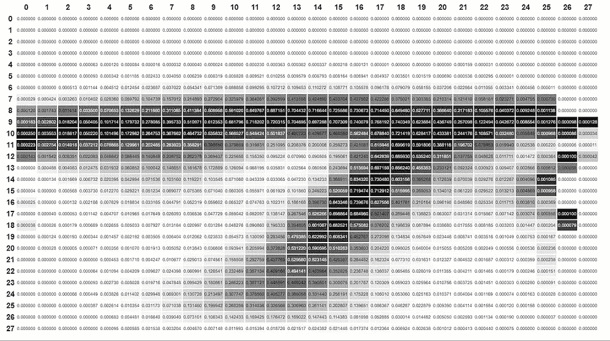
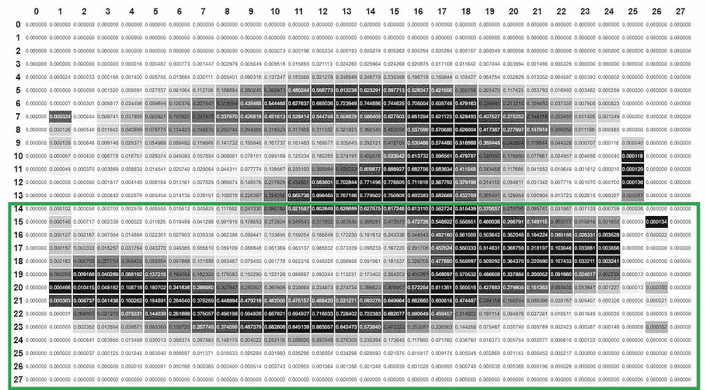
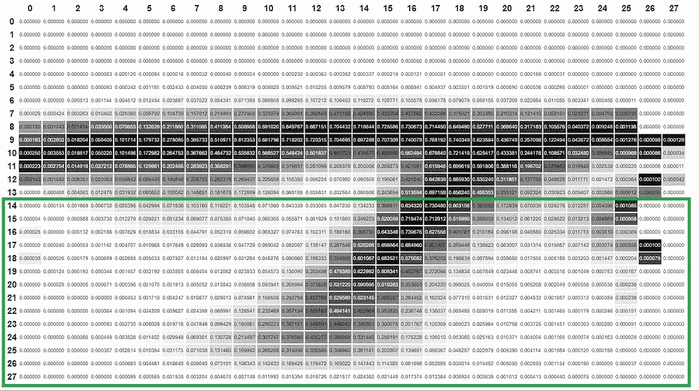

# 你的机器学习模型值得你承受压力吗？

> 原文：<https://medium.com/mlearning-ai/is-your-machine-learning-model-worth-the-stress-80aa93bfa808?source=collection_archive---------2----------------------->

28x28 arrays used to store images in the MNIST dataset

假设您被要求使用 MNIST 数据集构建一个可以区分手写 3 和 7 的模型。你花了接下来的几周时间使用机器学习来解决这个问题，你的最终模型做出的预测有 75%的准确率。

对于几周的工作来说，这听起来是一个不错的数字，但是我们如何判断这种表现呢？我们如何真正知道我们超级花哨的模型是否值得机器学习过程所需的时间和人力？

这就是机器学习项目的基线出现的地方。基线是简单的模型，我们用它来判断更复杂模型的性能。如果一个简单的模型——在几个小时内建立——可以达到 70%的准确率，那么基于相同数据并需要更大规模的时间、财政资源和计算资源投入的机器学习模型应该会有显著提高的性能。

基线是一个简单、易于实现的模型，用于评估所有后来的模型——后来的模型需要优于基线。获取基线的另一个好方法是四处搜索，寻找其他解决过类似问题的人，并在您的数据集上运行他们的代码。

**为样本项目创建基线**

为了更好地理解基线的概念，我们将把这个方法应用到上面提到的 MNIST 项目中。MNIST 数据集包含存储为 28by28 数组的手写数字图像，数组的每个元素代表图像中的一个像素值，如下所示。

我们的任务是区分手写的 3 和 7，这需要我们将图像分为两类。考虑到类别的数量，最基本的基线应该是 50% —正确预测的概率。这意味着任何低于这个基线的模型都是浪费时间，因为这比随机猜测更糟糕。

正确预测的概率可以作为基线，但这是一个非常糟糕的选择，因为一个好的基线需要你花心思去创建它。这意味着在可能的情况下，在您决定使用它作为基线之前，您的基线应该已经比随机猜测要好。

对于 MNIST 问题，我们将尝试两种不同的分类方法来确定最佳基线，这两种方法是:

像素相似性

使用非零像素值的部分像素相似性

**方法 1——像素相似度**

如前所述，MNIST 图像存储为 28 x 28 的数组，训练集包含超过 12000 个分类为 3 或 7 的图像。如果我们找到每个类别中所有数组的平均值，则得到的数组将代表我们定义的理想 3 和理想 7。

Images and arrays of the ideal 3 & 7

获得理想图像后，我们使用以下步骤对新图像进行分类:

I .从理想 3 的阵列中减去代表新图像的阵列

二。求结果数组的绝对值

三。求绝对值数组的平均值——这是新图像和理想图像 3 之间的距离

四。重复步骤 1-3，但用理想的 7 代替理想的 3

动词 （verb 的缩写）比较新图像与理想图像 3 和理想图像 7 的距离

不及物动词如果图像更接近理想的 3，则将图像分类为 3，否则将其分类为 7

这种方法是从 [fastai MOOC](https://course.fast.ai/) 获得的，通过将其应用于 MNIST 数据集，得到的模型能够以 95%的准确率对验证集中的图像进行分类。

用于实现这个解决方案的代码可以在[这里](https://colab.research.google.com/drive/1HQHfIH0u8TnW5C19zFkrFviHc4w-Wx9b?usp=sharing)找到。

**方法 2——使用非零像素值的部分像素相似度**

这种分类 MNIST 图像的方法是通过观察数字 3 和 7 的一般结构而设计的。这个观察表明，数字 3 的下半部分倾向于一条曲线，而数字 7 的下半部分倾向于一条直线。在下面的理想 3 和 7 的图像中可以观察到这种特性。

Different lower halves of 3s and 7s

基于这一观察，数字 3 的下半部分比数字 7 的下半部分具有更多的非零值像素，因为下半部分 3 的曲线往往比 7 的下半部分的直线更长。基于该方法的模型被开发和利用如下:

**训练**

I .仅导入训练集中表示数字 3 的所有数组的下半部分

二。计算每个数组中非零值的数量

三。找出一个“3”的下半部分中非零像素的平均数——理想的是 3

四。对所有 7 的图像重复步骤 1-3，找出“7”的下半部分中非零像素的平均数，即理想的 7

**分类**

要对新图像进行分类:

I .找出图像数组下半部分中非零值的数量

二。找出非零值的数目和理想 3 的下半部分中非零值的数目之间的绝对距离

三。找出非零值的数目和理想 7 的下半部分中非零值的数目之间的绝对距离

四。如果图像更接近理想的 3，则将图像分类为 3，否则将其分类为 7

这种方法是本文作者创建的，通过将其应用于 MNIST 数据集，得到的模型能够以 80%的准确率对验证集中的图像进行分类。

用于实现这个解决方案的代码可以在[这里](https://colab.research.google.com/drive/1HQHfIH0u8TnW5C19zFkrFviHc4w-Wx9b?usp=sharing)找到。

**结论**

方法 1 和 2 分别以 95%和 80%的准确率用于执行期望的任务。考虑到这个性能，我们可以选择一个远高于 95%的基线，并使用这个基线来判断我们所有的模型。在这种情况下，我们有非常高的基线，明智的做法是后退一步，首先评估对人工智能解决方案的需求。您可能会发现您的解决方案与简单的基线解决方案配合得非常好，并且您可以避免人工智能项目所需的投资。

基线鼓励你在用人工智能解决问题之前充分探索你的问题。它还创建了一个指标，您可以使用它来判断复杂的机器学习解决方案的真实性能值。在可能的情况下，为人工智能项目找到一个基线总是明智的。

如果你觉得这篇文章有用，请给它一些掌声，谢谢。