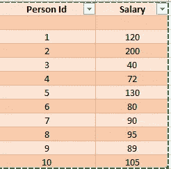
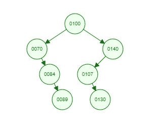

# iTree:隔离森林

> 原文：<https://medium.com/mlearning-ai/itree-isolation-forest-dae58b516e0f?source=collection_archive---------3----------------------->

## 使用无监督学习的异常检测


photo by author

隔离林和流行的随机林很像。唯一不同的是，与随机森林不同，隔离森林是无监督学习技术。

# 无监督学习

快速刷新无监督学习—训练数据没有标记。该算法找出输入数据之间的相似性和差异。然后，它将训练数据分类成组。无监督学习最流行的用法是聚类算法和关联。

聚类:它将相似类型的数据分组在一起。流行的技术是 K-均值、K 最近邻等。

关联:这用于查找两个不相关的产品是如何关联的。ex **篮子数据分析。**

# **隔离森林:**核心概念

隔离森林的基本理念是离群者很少，并且与其他人非常不同。对于异常检测，惯例是定义“正常”。这就是隔离林的不同之处——它没有定义正常——它确定了什么是不正常的，因为它们“很少而且非常不同”。

简而言之，如果你的训练数据大部分是异常的，隔离森林就不起作用。在这种情况下，你需要定义什么是正常的(即使用监督学习)。

# 隔离林:算法

1.  抽取一些子样本并随机选择任何属性。
2.  将数据拆分到该节点的左侧和右侧。这是通过使用一些分割阈值(在属性的最大值和最小值之间)来完成的。
3.  对左侧和右侧子节点重复该过程，直到无法进一步分割。
4.  这给出了具有内部节点和叶节点的二叉树。
5.  不，我们把数据传给树。正常数据将传播得更深，异常数据不会传播得更深(将到达叶节点)。
6.  一个经常使用的优化方法是创建一棵特定高度的树。原因是任何达到那个高度的东西都不会是异常的。

让我们看下面的例子:



Data table

让我们在 100 处随机分开。这是树根。假设下面是树



iTree: Values in circle are split threshold value

如果我们看 200，就不会了，它只会到第二级。另一方面，95 将进入第 5 级。此功能用于显示异常情况。树的高度可以像上面的例子一样固定。

# 隔离林:实现

Scikit Learn 提供了隔离林的库实现。

```
from sklearn.ensemble import IsolationForest
```

创建模型的代码

```
model=IsolationForest(n_estimators=30, max_samples=10, max_features=1.0)
model.fit(df[['Salary']])
```

# 因素

估计量的数量:集合中的树。它是可选的，默认值为 100

最大样本数:训练每个基本估计量的样本数。默认值为自动。在这种情况下，值将由库选择

最大特征:它是训练每个基本估计器或树的特征的数量。最大要素的默认值为 1。

更多详情，请参考 [scikit](https://scikit-learn.org/stable/modules/generated/sklearn.ensemble.IsolationForest.html?highlight=isolationforest#sklearn.ensemble.IsolationForest) 文档。

为了进一步学习:

[](/mlearning-ai/mlearning-ai-submission-suggestions-b51e2b130bfb) [## Mlearning.ai 提交建议

### 如何成为 Mlearning.ai 上的作家

medium.com](/mlearning-ai/mlearning-ai-submission-suggestions-b51e2b130bfb)