# 这都是关于回归——梯度下降

> 原文：<https://medium.com/mlearning-ai/its-all-about-regression-gradient-descent-f827de988036?source=collection_archive---------1----------------------->

# 概述

在我们的[上一篇博文](https://vachan15.medium.com/its-all-about-regression-part-1-c002fcaa8a55)中，我们学习了优化线性回归模型的普通最小二乘法(OLS)。我们讲述了线性回归模型的基础知识，浏览了成本函数&梯度下降的思想，并通过使用 python 包 *statsmodel 创建了我们的第一个线性回归模型。*最后，我们通过讨论模型运行的假设结束了这篇文章。在这篇博文中，我们将深入探讨成本函数和梯度下降，并尝试理解 OLS 如何使用它来得出模型的最优 beta 估计。

# 成本函数

假设你花 5 美元买了一包薯片，你的朋友没看账单就预测你买的薯片的价格是 3 美元，那么他/她就错了 2 美元。因此，与预测相关的成本为 2 美元。这是我们希望通过学习来减少的预测成本或误差，也是这篇博文的重点。因此，用非常简单的术语来说，成本函数是对模型性能有多差的度量。

在上面的示例中，我们使用实际值和预测值之间的差异来查找模型中的成本或误差，类似地，我们可以利用其他函数来确定模型的成本。函数的选择是由你要解决的问题类型决定的，每个函数都有不同的属性。我们来看看一些常用的代价函数。

**残差平方和(RSS ) :** 是残差平方和(哼！，但你可能会问，什么叫残)。残差是实际值和预测值之差。在上面的例子中，2 美元是剩余的。OLS 使用 RSS 来估计 beta 值。

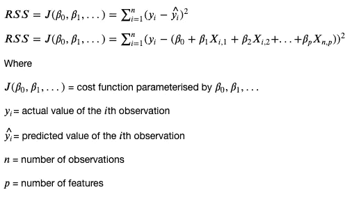

**均方误差(MSE ) :** 是残差平方的平均值。

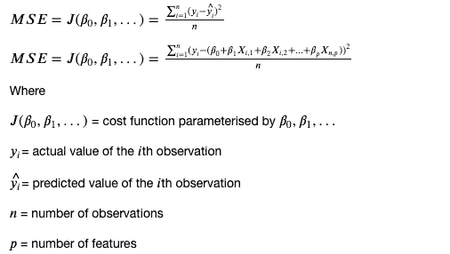

**逻辑回归成本函数:**是使用逻辑回归的分类问题的成本函数。在探讨分类问题时，我们将更详细地研究它。现在，我只是想让你们熟悉不同的成本函数的概念。

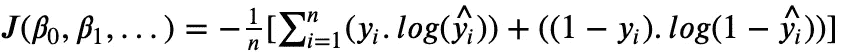

还有很多成本函数，但这些是最常用的成本函数。

# 梯度下降

既然我们理解了成本函数的概念，让我们来看看梯度下降算法。


Credit : [Alex Lange](https://unsplash.com/@alexlange92) (Unsplash)

所以，假设你正在雪山上享受假期，某天下午你决定去滑雪。你带上所有必要的装备，到达山顶，让自己冲下山坡。你轻轻推了自己一把，滑向山下。在山顶上，由于是一个陡坡，你获得了一些冲力，很快就跑了很长一段距离。相反，在山的尽头，你开始失去动力，开始减速。现在山坡的坡度几乎为零，你知道你已经到了底部，如果不付出额外的努力就不能再滑了。梯度下降算法的工作方式完全相同。

顾名思义，我们沿着*‘斜坡’或坡度*‘下降’*。为了更好地理解，我们来看一个例子。*

```
X = [1, 2, 3, 4] Y = [2, 4, 6, 8]
```

从上面的数据中我们可以看出，该函数采用以下形式:

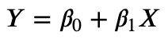

如果我们把上面的数据给我们在[上一篇文章](https://vachan15.medium.com/its-all-about-regression-part-1-c002fcaa8a55)中定义的 OLS 函数，我们会期望

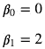

出于说明的目的，因为β_ 0 是零，所以让我们只关注β_ 1。因此，函数的形式为**Y = beta _ 1 * x。**现在让我们计算与不同 beta 值相关的成本。

假设算法估计值为 **beta_1 = 2** ，让我们计算与模型 **Y = 2 * X.** 相关的成本

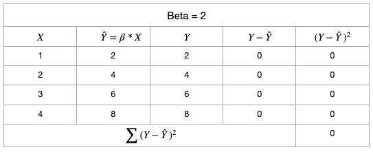

类似地，让我们计算与该模型相关联的成本，如果该模型已经估计了一个 **beta_1 = 1。**

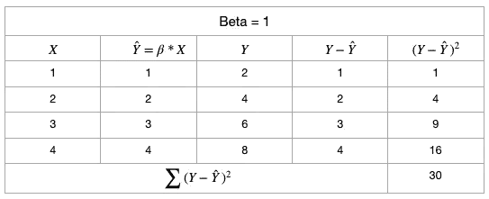

最后，让我们计算与模型相关联的成本，如果模型已经估计了一个 **beta_1 = 3。**

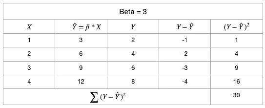

同样，我们可以计算任何β值的成本。

```
beta_1 = [-1, 0, 1, 2, 3, 4, 5]cost = [270, 120, 30, 0, 30, 120, 270]
```

既然我们已经有了与七个不同β值相关的成本，让我们试着将它形象化，以更好地理解β对成本和预测的影响。

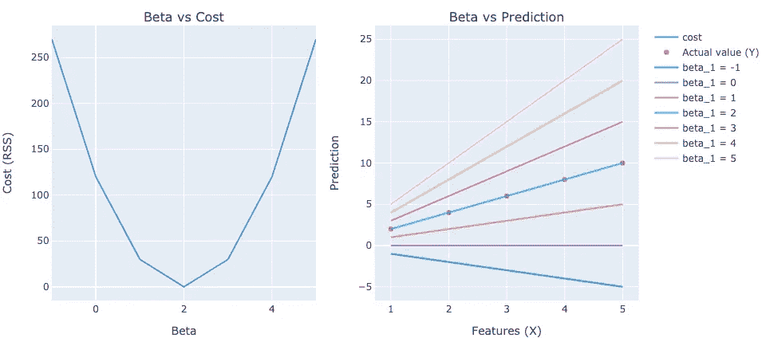

从上面的想象中，我们可以发现一些有趣的点，如下所示:

1.  首先，通过组合这些图表，我们可以看到，当我们从β=-1 移动到β= 2 时，预测变得更加准确，与模型相关的成本降低到 RSS = 0。然后，随着我们将 beta 值从 2 进一步增加到 5，预测开始变得不准确，与模型相关的成本开始增加。
2.  其次，我们离一个好的估计越远，成本函数的斜率就越陡。类似地，换句话说，当我们越接近一个好的估计时，成本函数的斜率就越小。(左图)
3.  最后，与模型相关的最小成本总是大于或等于零。在这里，从右边的图表中我们可以看到，由于我们的 beta = 2(蓝绿色)的模型与实际值(Y)重叠，因此与该模型相关的成本为 0。

现在，我们在概念层面上理解了梯度下降的工作，让我们现在将我们的焦点转移到算法进行什么计算来确保我们在山的底部，即成本函数。

回到滑雪的例子，我们知道我们在山的底部，当没有更多的斜坡可供你滑雪时，滑雪就停止了。类似地，该算法试图计算成本函数(RSS)相对于β值的斜率，并在成本函数的底部停止。

你可能会问，如何计算这个斜率？

对于所有的数学魔术师来说，我们知道斜率只不过是函数的导数。因此，我们从成本函数上的任意点开始，沿着最大斜率的方向一点一点地下山。每当我们移动时，我们再次计算斜率，当斜率，即导数，等于零时停止。

为了便于说明，我们将假设只有一个特征 X，然而，该算法对于任何数量的特征都完全相同。

算法如下:

1.  给贝塔分配随机值。
2.  使用 beta 值计算预测

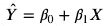

3.计算 RSS(与分配的 beta 值相关的成本)

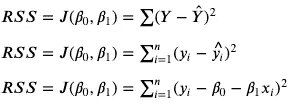

4.计算 RSS 相对于每个β的偏导数。我们用链式法则来做下面的计算。如果我们有更多的特征，我们也会计算它们的β。

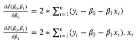

5.更新我们的估计值或 beta 值。这一步是为了确保我们向山下移动(成本函数)。

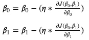

在上述步骤中，eta(η)称为**学习率**。它决定了我们希望我们的算法下坡时有多快或多慢。为了解释这个等式，可以这样想:从我们在成本函数(beta)上的点，向山下移动(减法)，用 eta 乘以斜率。我们将在另一篇博客中讨论更多关于 eta 对我们算法的影响。

**注:**上式中使用的导数值与*步骤 4* 中计算的导数值相同。β值的更新是同时进行的。因此，我们首先计算每个β的所有导数(*步骤 4* )，然后在步骤 5 中同时更新β值。

6.我们重复步骤 2、3、4 和 5，直到满足停止条件。

理想情况下，我们希望重复这些步骤，直到我们到达山脚，即坡度等于零的地方。然而，当我们接近最优解时，我们会发现 beta 值的更新很小。这是因为我们越接近最优解，斜率越接近零。此时*步骤 5* 可总结如下:

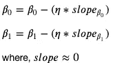

因此，可能需要大量的计算和时间来达到绝对最优，然而，由于缺乏资源，我们不介意接近最优或次优解。因此，一旦达到期望的次优解，我们就停止算法。

**停止条件**

在决定何时停止算法时，我们可以研究许多指标。最受欢迎的两种方法如下:

*   重复步骤'***' n '***的次数。该算法可能或可能给出最优解。
*   重复该步骤，直到当前迭代和前一迭代之间的成本变化小于阈值。这是一个优选的选择，因为我们可以假设在这一点之后迭代中的任何成本变化都将小于阈值，因此可以忽略不计。

最后，梯度下降是一种流行的算法，可以在许多包中使用，而不必编码。然而，理解算法而不是像黑盒一样使用它总是一个好的实践。

恭喜你！！就是这样。我们现在理解了梯度下降的基本原理。梯度下降有一些变化，但它们都是从这个基本算法中导出。我们将在未来博客中研究这些变化。

在那之前，继续摇摆吧！