# 这都是关于回归的——汇总表解释

> 原文：<https://medium.com/mlearning-ai/its-all-about-regression-summary-table-on-share-price-ccc69fc8bfa2?source=collection_archive---------7----------------------->

线性回归不仅仅是一个预测模型。如果使用得当，它不仅可以帮助你解决复杂的问题，还可以帮助你进行一些推理分析。在我们开始之前，让我们先回顾一下到目前为止我们已经讲过的内容。

到目前为止，在“*都是关于回归*的”系列中，我们已经了解了

1.  [线性回归模型](https://vachan15.medium.com/its-all-about-regression-part-1-c002fcaa8a55):我们讨论了线性回归，并使用普通最小二乘法(OLS)实现了一个非常基本的回归模型。此外，我们讨论了模型运行的几个假设。
2.  [梯度下降](/mlearning-ai/its-all-about-regression-gradient-descent-f827de988036):我们研究了回归模型使用的各种成本优化函数，最后我们了解了梯度下降以及算法如何在线性回归模型中估计 beta 值

在这篇博文中，我们将详细讨论回归模型的*输出*，看看我们如何利用这些结果。为了使它更有趣，让我们对股票价格数据进行分析。

# 问题陈述

正如我们在第一篇博客中承诺的，在这篇博客中，我们将尝试解决一些现实世界的问题。我们要研究的问题如下:在配对交易中，一种统计套利策略，我们通过同时下两个订单来交易。这意味着，当我们为公司“X”购买 *x* 数量的股票时，我们同时为公司“Y”出售 *y* 数量的股票，反之亦然。因此，了解公司“X”和“Y”之间的关系对我们来说非常重要。在这篇博文中，我们希望使用 OLS 模型的汇总表来了解这些关系。

**注意:**股票的同时买卖是基于一些规则的，这些规则将在我们以后的博客中讨论，因为这超出了本文的范围。现在，要了解 pairs 交易，你可以参考[下面的链接](https://en.wikipedia.org/wiki/Pairs_trade)。因此，没有任何进一步的麻烦，让我们开始吧。

我们首先导入一些我们分析需要的库。我们将使用*y finance*(Yahoo-finance)下载所需工具的数据，使用 *statsmodel* 创建我们的线性回归模型，使用 *plotly* 进行可视化。

在这里，我们下载了苹果公司(AAPL)和 ANSYS 公司(ANSS)一年(1 年)的数据。

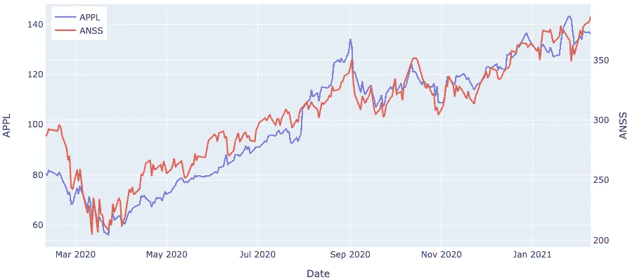

现在我们有了数据，让我们创建一个 OLS 模型并打印出结果，看看我们是否能发现一些有用的见解。

# 模型摘要

上述代码的输出将如下所示:

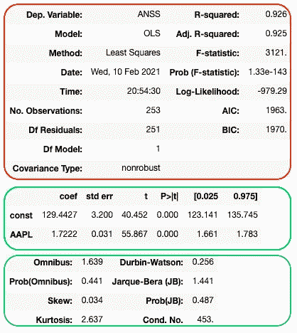

为了便于理解，我将整个输出分成了 3 个不同的部分，其中第一个红色块为我们提供了拟合模型的概述，第二个绿色块为我们提供了关于 beta 值估计值的信息，最后一个蓝色块告诉我们关于拟合模型分布的更多信息。现在，让我们详细了解每一部分，更重要的是了解如何在交易股票时用**做决定****。**

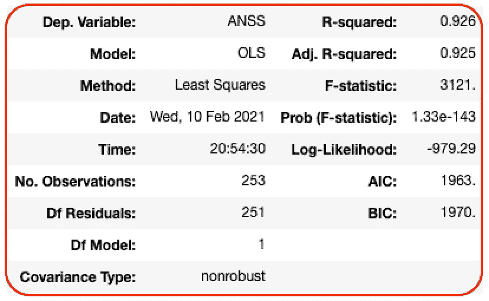

红色部分为我们提供了装配模型的总体概述。使用该模型时要寻找的几个重要指标如下:

**R 平方**:它告诉我们输入变量 X 解释了我们的响应变量 Y 的多少可变性。由于我们希望 X 尽可能多地解释我们的 Y，R 平方值越大意味着模型越好。

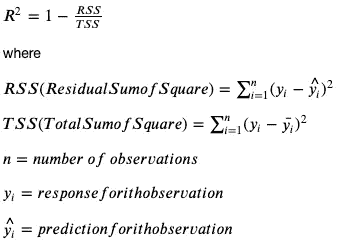

R 平方的值始终介于 0 和 1 之间，包括 0 和 1。在这里的总结中，我们的 R 平方接近 1，这意味着我们准备好了。

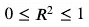

**调整的 R 平方**:调整的 R 平方测量与 R 平方相同的拟合质量，但是不同之处在于对使用太多输入特征的模型进行惩罚。这对于我们评估模型中的过度拟合是有用的。

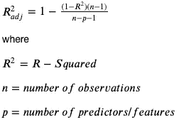

F 统计量:F 统计量是对我们的输入和我们的响应变量之间关系的一种度量。它用于测试以下假设:

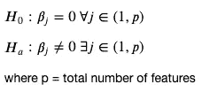

接近 1 的 F 值表示零假设为真，相反，大于 1 的 F 值表示替代假设为真。在这里，由于 F 统计量的值远大于 1，可以肯定地说，APPL 股票价格和 ANSS 股票价格之间存在关系。

**概率(F-统计量)**:F-统计量的一个问题是，我们需要丢弃基于其大值的零假设或替代假设，但是问题仍然存在，多大是大？所以 F 统计的概率是它在钟形图上位置的度量。我们通常希望该值小于 0.05，以放弃无效假设。

**AIC & BIC** : *阿凯克信息准则*和*贝叶斯信息准则*是选择最佳模型，即具有β值最佳估计的模型的准则。我们主要使用它们来比较两个模型，而不是单独研究任何特定模型的标准。AIC 或 BIC 的值越低，表示模型越好。

**模型**:描述用来拟合数据的模型。在我们的例子中，我们使用 OLS，但我们也可以使用 GLS(广义最小二乘法)，TLS(总体最小二乘法)或 WLS(加权最小二乘法)。我们将在以后讨论其中的一些回归模型。

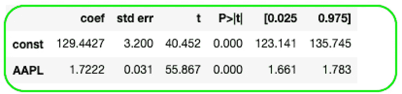

现在，让我们来谈谈汇总表中最重要和最广泛使用的部分。让我们一栏一栏地去更好地理解它。

**系数**:这一栏告诉我们模型用来拟合线性回归线的系数或 beta 值。

这些系数解释如下:

1.  平均而言，ANSS 的价格比苹果的价格高出 129.4427 个单位
2.  APPL 价格增加/减少 1 美元将导致 ANSS 价格增加/减少 1.7222 美元。同样，APPL 价格上涨 10 美元将导致 ANSS 价格上涨 17.222 美元。

**标准误差**:标准误差(std err)是 beta 估计值的标准偏差。它帮助我们量化预测中的波动。结合 APPL 的贝塔估计，我们可以这样理解:APPL 价格每上涨 1 美元，ANSS 价格就会上涨 1.7222 美元，波动幅度为 0.031 美元。

标准差越小，我们的预测就越精确。

**t(t-statistics)**:OLS 模型中的这个统计量给了我们关于分布曲线中β估计值离 0 有多远的信息。在交易的时候，这可以让我们确信输入变量(APPL)和响应变量(ANSS)之间存在联系，否则我们的分析就没有意义。它利用了以下假设:

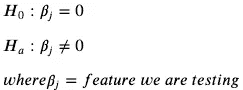

为了拒绝零假设，我们希望 t 统计量具有较大的值，计算如下:

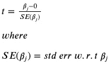

**P > |t|** :现在，有了 t-statistic，我们最终会有同样的问题**多大才算大？**因此，我们用 p 值< 0.05 来拒绝零假设。

**【0.025，0.975】**:这两列测量我们 beta 估计的 95%置信区间。更简单地说，该模型估计，对于给定的分布，APPL 的 beta 估计值在 95%的情况下将在 1.661 和 1.783 之间。

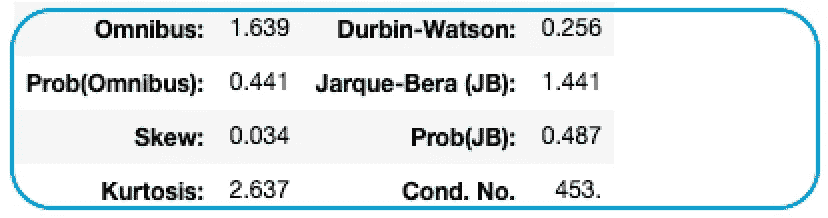

最后，让我们谈谈汇总表的最后一部分。汇总表的这一部分有助于我们理解数据和残差的分布。

**偏斜**:偏斜为我们提供了关于数据对称程度的信息。当数据没有偏斜时，线性回归效果最好，因此接近零的值有助于我们确认数据没有偏斜。

**峰度**:峰度是分布的*尾部*的度量，即紧密度的度量。为了理解这一点，请考虑一个钟形曲线(高斯分布)。具有尖峰的曲线在其平均值周围具有大量数据，因此具有较高的峰度。更高的峰度意味着离群值的机会更小，因此模型更好。

**综合& Jarque-Bera** :这两个测试都使用偏斜度和峰度来度量模型的拟合优度。我们可能已经看到了 F-统计量、T-统计量以及现在的 omnibus 和 Jarque-Bera 检验，它们都试图检查模型的有效性，但它们试图使用不同的统计量。我们将在我们关于假设检验的博客中更多地讨论这些检验。

**注意:**理解这些值/统计数据而不仅仅是使用β估计值对我们来说非常重要，因为无论我们给出什么输入，我们都会得到一个输出，即垃圾输入=垃圾输出。

因此，除非我们理解模型在幕后做什么，否则对我们来说，对关键系统使用最大似然模型是非常危险的。了解这些统计数据可以帮助我们在必要的时候改进甚至抛弃模型。

恭喜你，现在你知道如何利用汇总表了。接下来，我们将研究线性回归模型的一些变体。

在那之前，继续摇摆吧！