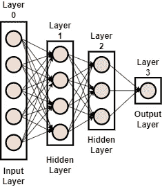
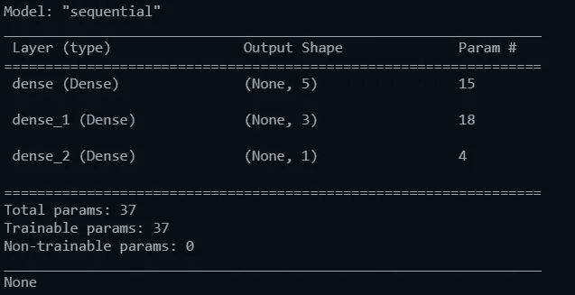
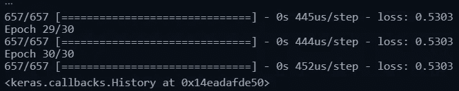
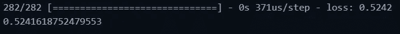
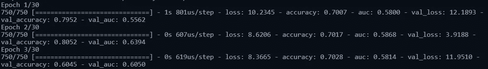

# 这只是一个神经元网络！

> 原文：<https://medium.com/mlearning-ai/its-just-a-network-of-neurons-73baf88ed680?source=collection_archive---------9----------------------->

用 TensorFlow 创建简单的神经网络


Photo by [Clint Adair](https://unsplash.com/@clintadair?utm_source=medium&utm_medium=referral) on [Unsplash](https://unsplash.com?utm_source=medium&utm_medium=referral)

**注:**本博客是使用 Tensorflow 开发深度神经网络系列博客的一部分。前一部分请阅读下面的博客。

[](/mlearning-ai/basic-operations-of-tensorflow-bf206868f491) [## 张量流的基本运算

### DNN 张量流基本原理

medium.com](/mlearning-ai/basic-operations-of-tensorflow-bf206868f491) 

代码笔记本可从以下链接下载:

[](https://github.com/rajsandhu1989/Tensorflow_projects/tree/main/Simple%20Neural%20Network) [## tensor flow _ projects/main rajsandhu 1989 年的简单神经网络/Tensorflow_projects

### 此库包含从基础到高级的所有使用 Tensorflow API 的项目…

github.com](https://github.com/rajsandhu1989/Tensorflow_projects/tree/main/Simple%20Neural%20Network) 

# 介绍

在之前的博客中，我们已经讨论了在使用 TensorFlow 开发神经网络时可能会用到的一些常用函数。在这个博客中，我们将为回归和分类等各种活动建立一些简单的神经网络。如下所示，神经网络包含从输入层到输出层的多个层。这些层需要按顺序编码以开发神经网络，这些层将在下一节中详细解释。



Figure 1 Sample Neural Network

# 层

神经网络是多个层的组合，它获取输入数据，通过隐藏层传递，并生成输出。输入图层通常标记为图层 0，因为它不执行任何计算。每一层都包含一个数学单元，将边的权重与输入相乘并添加偏差，这个单元称为神经元。一层是一个或多个神经元的集合，一层中神经元的数量可以多于或少于前一层。因此，对于神经网络的更好输出，没有层的数量和每层中神经元的数量的经验法则。坦率地说，这是一种尝试，或者深度学习程序员可以做出有根据的猜测的经验。下面讨论 TensorFlow 框架中一些最常用的层。

## 稠密的

密集层或全连接层是前一层的每个神经元与下一层的每个神经元连接的层，如图 1 所示。密集层是设计深度神经网络中最常用的层之一。下图显示了 Keras 库提供的密集图层的各种选项。

```
tf.keras.layers.Dense(
    units, activation=None, use_bias=True,
    kernel_initializer='glorot_uniform',
    bias_initializer='zeros', kernel_regularizer=None,
    bias_regularizer=None, activity_regularizer=None,  kernel_constraint=None,
    bias_constraint=None, **kwargs
)
```

将输入作为 ***输入 _ 数据*** 的模型的示例密集层如下所示。我们已经使用 Keras 包创建了三个密集层。

## 激活

密集图层可以选择需要应用于该图层输出的激活函数。然而，Keras 有一个单独的激活层，如果需要可以在不同层之间使用。这完全取决于我们需要的模型的要求和种类，在极端情况下，我们可以应用双激活层。

## 拒绝传统社会的人

过度拟合是具有小训练数据的深度神经网络的问题。Dropout 是通过消除每层中的一些节点来提高训练精度的技术之一。这种消除只发生在训练阶段，并且可以使用 Keras 中的 Dropout 层轻松完成。

Keras 提供了大量的层，可以在这里[找到](https://www.tensorflow.org/api_docs/python/tf/keras/layers)，并且可以在需要的时候使用。可以在 Keras 的重要层上写一篇单独的博客文章，然而，为了博客的简洁，只讨论我们将用来创建一个简单的神经网络的层。

# 使用 Keras 的 DNN 模型

Keras 是 TensorFlow 包中提供的高级 API，可用于创建神经网络模型。它支持各种模型的快速实现，运行在其他框架之上，由 Franç ois Chollet 编写。Keras 比 Tensorflow 更好，因为它提供了快速的行业就绪模型，使用更少的代码构建模型，构建任何架构，并将其部署在多个平台上。

## 埃及蜜蜂

Keras 建立神经网络模型有两种主要方法，即顺序模型和函数 API。序列模型是一种广泛使用的模型，表示一个简单的层堆栈，其中每一层都有一个输入张量和一个输出张量。顺序模型不允许多个输入和图层共享。相反，函数式 API 提供了比顺序模型更灵活的开发神经网络的方法。函数式 API 可以处理具有非线性拓扑、共享层甚至多个输入或输出的模型。

# 序列模型

在顺序模型中，我们创建一个模型，并根据需求一层一层地添加。顺序模型的所有基本步骤讨论如下:

**第一步:创建模型**

```
**model=tf.keras.models.Sequential()**
```

**第二步:添加一层**

在下面的代码中，我们添加了两层，分别是 ***输入层*** 和 ***密集层。输入*** 层包含 2 个神经元，我们需要在参数`input_shape`中提到输入层的大小。不要将输入层与第 0 层混淆，是第 1 层产生实际输出，见图 1。然后，我们有一个密集层，它有两个参数，即神经元的数量和该层的激活函数。

```
# Add and input and dense layer
**model.add(Dense(2, input_shape=(3,), activation="relu"))**
# Add a final 1 neuron layer
**model.add(Dense(1), activation="sigmoid")**
```

让我们为我们在上面几节中创建的神经网络创建一个顺序模型，并打印其模型摘要。



Figure 2 Model Summary

**第三步:编译模型**

创建模型后，我们需要编译模型，在这里我们将让模型知道将要使用的*和 ***优化器*** 。*

```
*# Compiling your previously built model
**model.compile(optimizer="adam", loss="mse")***
```

***第四步:拟合模型***

*最后，我们需要拟合模型，或者我们可以说用训练数据训练模型。请参见下面的代码:*

```
*# Train your model
**model.fit(X_train, y_train, epochs=5)***
```

*让我们对我们的数据集 ***UCI 信用卡*** 运行编译和拟合方法。图 3 显示了输出的最后三行。*

**

*Figure 3 model.fit() output*

*我们可以看到损失已经达到了 0.5303 的水平。你可能想知道为什么一个时期的样本大小是 657？这是因为小批量算法将所有样本分成批次。该方法在`model.fit()`中的默认批量是 32，而在`x_train`中的总样本数是 21000，21000/32=656 进行计算。我们将在以后的博客文章中详细研究这个小批量。*

***第五步:预测和评估***

*我们可以使用以下命令，使用在步骤 4 中用训练数据拟合的训练模型进行预测。*

```
*# Predict on new data
preds = model.predict(X_test)
# Look at the predictions
print(preds)*
```

*此外，我们可以使用下面的代码来评估我们的模型，这将产生如图 4 所示的输出。*

```
**# Evaluate your results* model.evaluate(X_test, y_test)*
```

**

*Figure 4 Model Evaluation*

# *Keras 模型中的其他选项*

*我们在上面使用的函数中有多个选项，可以根据应用或预测模型的要求来使用。复杂的选项将在后续的博客中讨论，但是，这里将讨论一些最常用的选项。*

## ***指标***

*我们可以在 compile 方法中使用多个指标和缺省损失值。最常用的度量是准确度和曲线下面积。*

## *验证溢出*

*在模型训练期间执行拟合方法时，Keras 可以自动创建验证数据集。验证准确度和损失将单独输出。下面的代码在上面创建的模型中使用了两个指标，以及一个占训练数据集 20%的验证数据集。图 5 显示了笔记本中的输出，现在它还显示了每个时期后模型的准确性以及 AUC 值。此外，它还显示了验证分数、准确性和 AUC 数据。*

**

*Figure 5 Output*

# *结论*

*在这篇博客中，我们讨论了一些常用的层和使用简单的 API 创建神经网络模型。然后，我们讨论了如何使用 Keras API 创建一个序列 DNN 模型。*

*这是一个创建密集神经网络的简单教程，我们将深入研究 Keras 提供的各种选项和回调，以获得更好的理解。*

*[](/mlearning-ai/mlearning-ai-submission-suggestions-b51e2b130bfb) [## Mlearning.ai 提交建议

### 如何成为 Mlearning.ai 上的作家

medium.com](/mlearning-ai/mlearning-ai-submission-suggestions-b51e2b130bfb)*