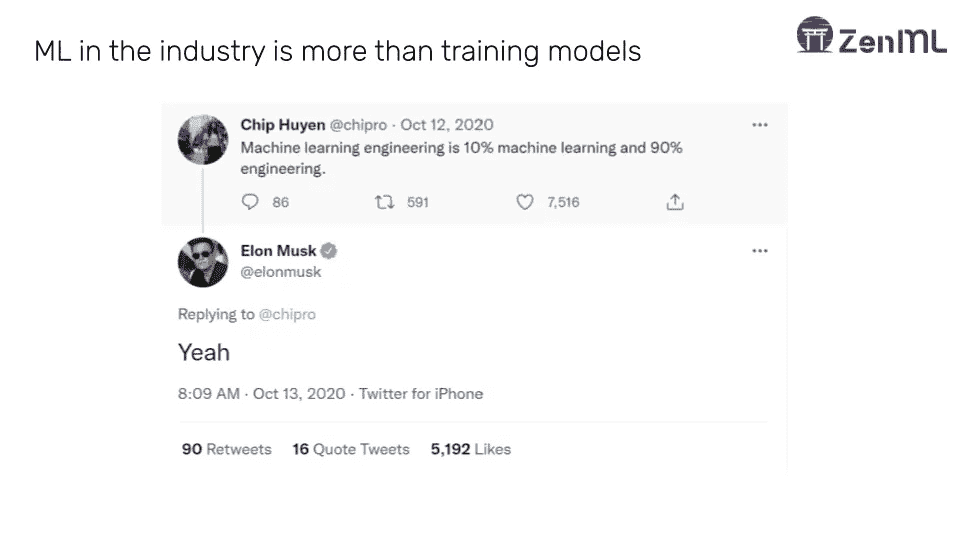
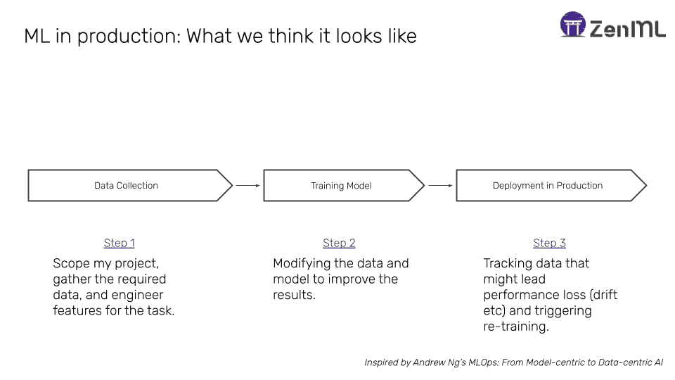
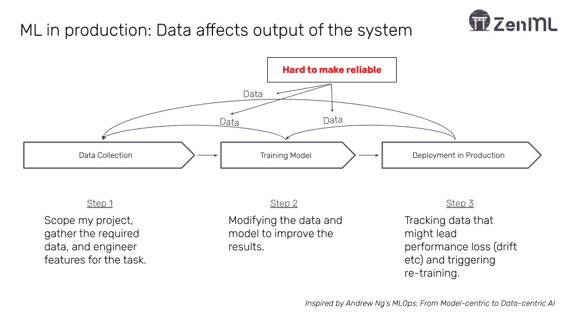
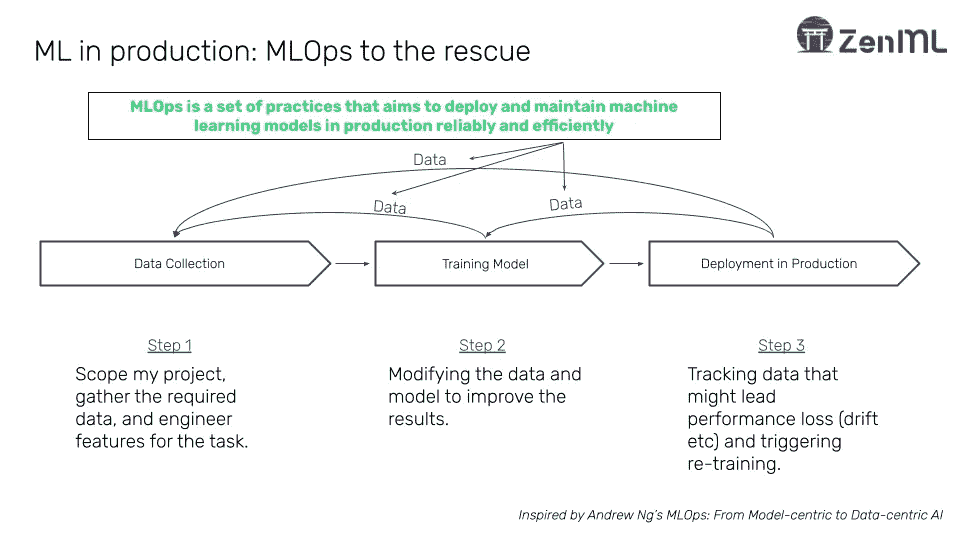
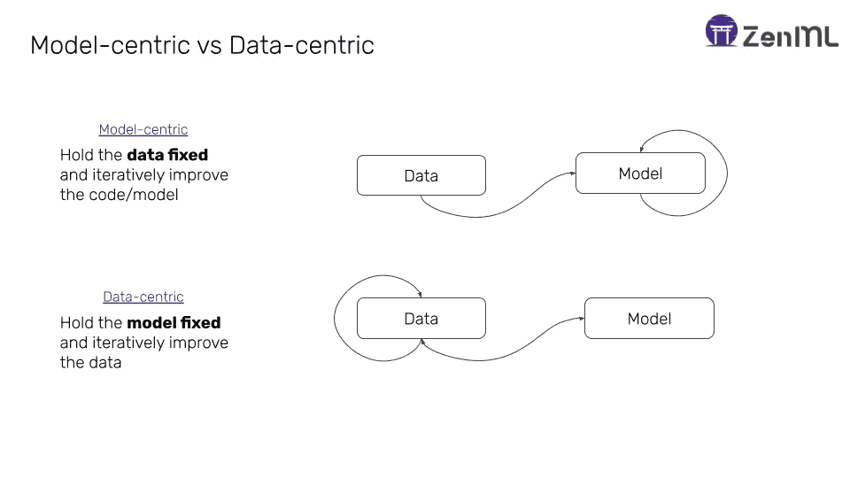

# “这是数据，傻瓜！”以数据为中心的人工智能如何推动 MLOps

> 原文：<https://medium.com/mlearning-ai/its-the-data-silly-how-data-centric-ai-is-driving-mlops-740cdb6ca09e?source=collection_archive---------8----------------------->

## 以数据为中心的机器学习和 MLOps 之间的隐藏联系

你以`jupyter lab`开始你的一天，看看昨天的最新情况。笔记本在端口 8888 上弹出，你看到昨天的 matplotlib 图，恼人地停留在 80%的准确率。经过几个小时的努力，你终于找到了一个有效的超参数。你设置好，穿过细胞，突然你就有了 95%的准确率。你一遍又一遍地检查它，在确保你做的一切都正确之后，你将你的模型导出到一个文件中，并将代码和模型移交给工程部门，脸上带着微笑，并确信**你**做得很好。现在，您可以高枕无忧，看到利润不断增长。对吗？

不对。你的工程师瞪着你，要你的`requirements.txt`文件。他无法重现你的结果——他们的机器出错了。他们会问你在哪些数据上接受过培训，在哪个操作系统上开发过，以及一般来说是否遵循了“MLOps”原则。你回去试着回答这些问题，但是现在你在一个痛苦的调试循环中。

这些听起来熟悉吗？作为受过传统训练的数据科学家，我们已经习惯于呆在笔记本环境中，迭代代码和模型。这样做会导致意想不到的后果和优化错误的结果。如果你在模型开发中采取稍微不同的方法，从一开始就扎根于工程师们一直在谈论的 MLOps 原则，也许你会做得更好。

围绕 MLOps 的资源越来越多(见本文末尾)，关于从以模型为中心到以数据为中心的机器学习的转变也越来越多。然而，很少有人谈到以数据为中心的机器学习与它如何推动当今 MLOps 实践之间的联系。在这篇文章中，我深入探讨了以数据为中心、基于管道的机器学习方法如何成为遵循 MLOps 原则的最佳方式之一，以及作为数据科学家的您如何从理解为什么会出现这种情况中受益匪浅。

# MLOps 不仅仅是部署模型

Twitter can be helpful, sometimes.

当谈到 MLOps 时，开发人员经常将其与简单的部署行为混淆。然而，如上所述的对话并不仅仅指部署模型。机器学习工程解决了一系列更广泛的挑战，这些挑战不仅仅是在服务器应用程序中包装和部署模型。

ML 开发可以分解成以下(相对)简单的过程。

ML in production: What we think it looks like

作为筒仓，这些过程听起来并不太难:

*   有了[盛宴](https://feast.dev/)这样的特色商店，特色工程变得越来越容易。
*   成千上万有助于迭代过程的工具使得训练循环变得更加容易，从实验跟踪工具如 [MLflow](https://mlflow.org/) 和[Weights&bias](https://wandb.ai/site)到高级训练框架如 [PyTorch Lightning](https://www.pytorchlightning.ai/) 。
*   随着先进工具的出现，部署模型也变得越来越容易，如 [Seldon Core](https://github.com/SeldonIO/seldon-core) ，或所有主要云提供商提供的托管服务。

然而，现实是这个过程看起来更像这样:

Its hard to feedback loops reliable in machine learning.

不止代码，在机器学习中**数据**直接影响系统的输出。在产品中部署的模型的生命周期中，有一些隐含的和经常是显式的反馈循环。虽然在传统的软件开发中，人们可以简单地测试和审查代码，因为它经过了生产的各个阶段，但是在一个受数据影响的系统中，这是更加复杂和困难的。

正是在这些反馈循环中，MLOps 最终得以生存。这个过程只做一次是不够的:一个成功的 ML 团队需要一遍又一遍地执行这个过程，并且以一种系统可以被信任的方式。

简而言之，MLOps 是一套实践，旨在可靠有效地在生产中部署和维护机器学习模型。这不仅包括将这些模型部署到生产中。

MLOps live in the feedback loops of machine learning development.

# 部署后的困境

从这个角度来看，更直观的理解是，问题始于第一次部署之后。以下是几个例子:

**延迟问题:**

如果在开发 ML 模型时不考虑延迟，它会对业务产生巨大影响。如果应用程序加载缓慢，你可能会损失一半的流量。这意味着当在生产中使用模型时，需要了解生产中的延迟需求。

**维护公平，避免偏见**

如果不加控制，偏差很容易进入 ML 系统。[微软流氓种族主义的推特机器人](https://www.nytimes.com/2016/03/25/technology/microsoft-created-a-twitter-bot-to-learn-from-users-it-quickly-became-a-racist-jerk.html)就是在 ML 开发中不设置系统维护公平的例子。如果一个模型没有被仔细检查(例如，在切片度量方面)，那么一个从业者可能会冒他们可能无意中在系统中建模偏差的风险。这就是仔细检查数据对于确保一个稳健和公平的系统至关重要的地方。

**缺乏可解释性和可审核性**

如果一个系统不能保持公平，那么立法者将完全有权利去追捕洗钱者。[欧盟委员会](https://ec.europa.eu/commission/presscorner/detail/en/IP_21_1682)已经推出了新的法律和检查，我们只能期待这种情况随着时间的推移而增长。从业者应该能够回答这样的问题，例如为什么做出某个预测，某个模型是如何训练的，以及在哪个数据切片上。这些审计线索都是 MLOps 工作流程的一部分。

**极其缓慢的开发周期**

对许多公司来说，将一个模型投入生产可能需要一年的时间。这意味着仅经历上述过程一次就可能花费数十万美元，更不用说一次又一次地重复了。如果团队要为在企业中应用机器学习的合理投资回报进行任何形式的辩论，他们需要将大多数乏味的东西自动化。

**模型、概念和数据漂移**

现实世界不是一成不变的。基于不变数据的训练模型有意忽略了现实世界中不会发生这种情况的事实。Zillow 最近的灾难说明了漂移会给企业带来多大的损失。随着世界的变化，MLOps 系统需要对这些变化具有鲁棒性，并在它们出现时进行处理。

# 以模型为中心与以数据为中心的机器学习

吴恩达最近通过他在 2020 年的精彩演讲普及了以数据为中心的机器学习这个术语。观看以下完整视频:

演讲的本质如下:以数据为中心而不是以模型为中心，你可以从你的数据中获得很多回报。这意味着，在 ML 开发中，与其迭代模型/代码并保持数据静态，不如保持代码/模型静态(或者甚至从一个简单的模型开始)并尝试用数据模拟真实世界的行为，这会带来更多的好处。这当然与 ML 在速成班和大学中的教学方式形成了鲜明的对比，在速成班和大学中，这个过程通常从阅读一个静态的、准备好的数据集开始，并在其上训练一个模型。

Model-centric vs data-centric deployment

当看一看 ML 在今天的生产中所面临的挑战时，很明显，向以数据为中心的转变只是所需的自然思维转变。延迟问题可以通过让数据科学家了解真实世界的数据摄取模式来解决。通过在模型训练时检查数据，可以避免公平性和偏差。如果在开发模型时对数据进行版本控制和跟踪，就可以保留可审计性跟踪。通过创建能够适应不断变化的数据的以数据为中心的工作流，开发周期也可以大大加快。最后，可以在开发过程的早期考虑漂移和数据质量。

这是一个以模型为中心的决策与以数据为中心的决策的对比示例，也展示了它与 MLOps 的联系。假设一个数据科学家有一个去年的数据集，他的任务是开发一个模型。以模型为中心的处理这种任务的方法是使用整个数据来训练模型，用一点剩余的数据作为测试集来验证模型度量。也许应用超参数调整是为了从模型和数据中挤出最大的精确度。

另一方面，以数据为中心的决策，也是最终有助于生产的决策，将对数据进行分区，将数据的一部分(比如一年的前三个季度)用于训练过程，最后一个季度用作单独的数据集，以查看模型如何随时间推移而变化。这可能会导致模型准确性的轻微损失，但是通过模拟模型在现实世界中的部署，可以给出关于模型行为的关键信息。

最后，虽然以模型为中心有它的好处，但在现实世界中应用 ML 时，将以数据为中心的决策添加到组合中最终是最好的前进道路。因此，这与采用 MLOps 之间存在自然的协同作用。

# 走向以数据为中心的 ML(Ops):从脚本到管道

向以数据为中心的机器学习的具体转变通常涉及 ML 团队将重点从基于脚本的开发转移到基于管道的开发。机器学习非常适合流水线开发，因为大多数开发都是由一系列按顺序执行的步骤组成的。

在这里，区分数据驱动管道和任务驱动管道是很重要的。这意味着严肃的团队将 ML 代码开发成大块的步骤，使用某种形式的工具将步骤执行的编排相互隔离。这有以下好处:

Developing in pipelines lends itself naturally to data-centric machine learning.

通常这意味着走出笔记本环境，或者找到某种方式将笔记本代码移植到这样的范例中。

# 外卖食品

因此，简而言之，这是 MLOps 和以数据为中心的机器学习之间的联系:

*   生产中的 ML 不同于研究中的 ML，具有不同的挑战。
*   随着 ML 应用的增加，这些挑战变得越来越重要。
*   MLOps 有助于解决这些问题。
*   MLOps 植根于以数据为中心，而不是以模型为中心。
*   开发管道有助于更加以数据为中心。

我希望这有助于澄清这两个流行术语之间的联系，并给初学 MLOps 的从业者一个指示，当他们为他们的组织开发内部 ML 工具时，应该在哪里努力。

无耻之徒:如果你想通过开发 ML 管道开始向以数据为中心的机器学习转变，那么你可能想看看 [ZenML](https://github.com/zenml-io/zenml) 。它的设计目标如下:

*   简单直观地给出以数据为中心的机器学习的简单路径。
*   在整个 MLOps 体系中不考虑基础设施和工具。
*   开始在笔记本上写下你的管道，用最少的努力轻松地把它带到云中。

# 资源

如果您想深入了解 MLOPs，我推荐以下优秀资源:

*   MLOps 课程 [MadeWithML](https://madewithml.com/)
*   [CS 329S:机器学习系统设计](https://mlsys.stanford.edu/)
*   [全栈深度学习](https://fullstackdeeplearning.com/)
*   [ZenBytes —通过 ZenML 学习 MLOps】](https://github.com/zenml-io/zenbytes)

# 参考

YouTube 上一些受吴恩达“从以模型为中心到以数据为中心的人工智能”启发的图片:[https://www.youtube.com/watch?v=06-AZXmwHjo](https://www.youtube.com/watch?v=06-AZXmwHjo)

 [## Mlearning.ai 提交建议

### 如何成为 Mlearning.ai 上的作家

medium.com](/mlearning-ai/mlearning-ai-submission-suggestions-b51e2b130bfb)