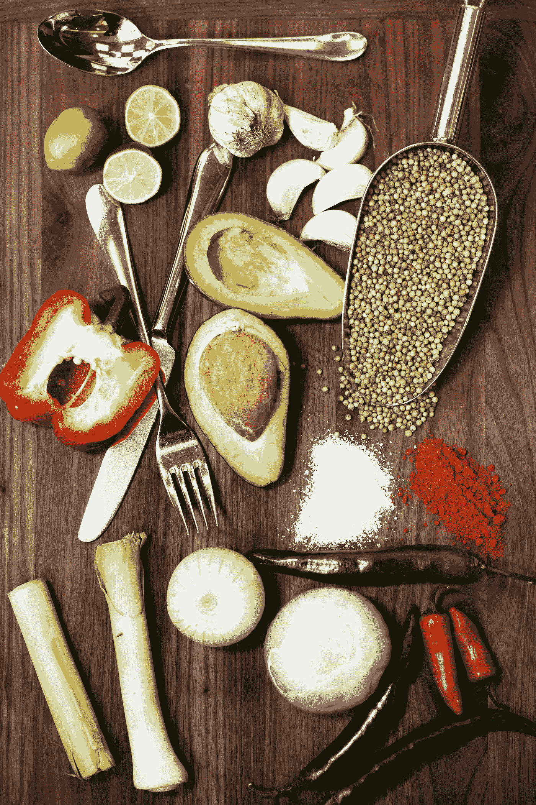

# 我分析了世界粮食产量，下面是结果

> 原文：<https://medium.com/mlearning-ai/ive-analyzed-the-world-food-production-and-those-are-the-results-c043c04226bf?source=collection_archive---------2----------------------->

## 世界食品生产中的食物浪费和排放概述。

Photo by [mulugeta wolde](https://unsplash.com/@onestopproductions?utm_source=unsplash&utm_medium=referral&utm_content=creditCopyText) on [Unsplash](https://unsplash.com/s/photos/food-production?utm_source=unsplash&utm_medium=referral&utm_content=creditCopyText)

这是我发表的第一个完整的数据科学项目，它来源于我正在学习的数据科学课程的“数据操作和可视化”项目。