# 伊维菌素、新冠肺炎和死亡

> 原文：<https://medium.com/mlearning-ai/ivermectin-covid-19-and-death-355114059c41?source=collection_archive---------3----------------------->

## 使用二项式、负二项式、贝塔和零膨胀贝塔分布对公布数据进行贝叶斯荟萃分析。

伊维菌素作为一种可能的新冠肺炎前处理已经受到了很多关注。无论是在研究的数量上，还是从(大部分)医学界的强烈反对上。这篇文章不是要展示伊维菌素是否有效，而是关于分析数据的方法。顺便说一下，这些都是从这个[生活系统综述](https://ivmmeta.com/)中摘录的。正如你在网站上看到的，有很多关于研究有效性和荟萃分析本身的讨论，这很好。这是科学。

简而言之，我下载了数据，只关注死亡率。预选是在那些研究中完成的，这些研究清楚地标明了给药剂量和两组中的事件数。对死亡率的唯一关注是因为这一指标对研究中可能出现的大量偏差更为稳健。几乎所有的研究都有一个可能但严重的局限性，那就是伊维菌素几乎从未作为唯一的药物使用。然而，这篇文章不是为了改变临床政策，而是关于分析这样的数据集。正如您将看到的，尽管可以自由地用多种方式解决它们，但它们可能相当具有挑战性。

那么，让我们开始吧。这将是相当后，所以我会添加代码之间。

```
library(ggplot2)
library(dplyr)
library(brms)             # Bayesian modeling through Stan
library(tidybayes)        # Manipulate Stan objects in a tidy way
library(broom)            # Convert model objects to data frames
library(broom.mixed)      # Convert brms model objects to data frames
library(vdemdata)         # Use data from the Varieties of Democracy (V-Dem) project
library(betareg)          # Run beta regression models
library(extraDistr)       # Use extra distributions like dprop()
library(ggdist)           # Special geoms for posterior distributions
library(gghalves)         # Special half geoms
library(ggbeeswarm)       # Special distribution-shaped point jittering
library(ggrepel)          # Automatically position labels
library(patchwork)        # Combine ggplot objects
library(marginaleffects)  # Calculate marginal effects for frequentist models
library(emmeans)          # Calculate marginal effects in even fancier ways
library(modelsummary)     # Create side-by-side regression tables
library(RColorBrewer)
library(modelr)
library(reshape2)
library(grid)
library(gridExtra)
library(lme4)
library(sjPlot)
library(sjmisc)
library(metafor)
library(meta)
library(dmetar)
```

我拿的数据来自 https://ivmmeta.com/[网站。由于数据无法下载，我在 Excel 文件中重新创建了数据，结果如下。不幸的是，我无法提取所有的数据。](https://ivmmeta.com/)

让我们来看看我得到了什么，并将每项研究转换成比值比。

```
df <- read_excel("Data.xlsx")
View(df)
skimr::skim(df)
df%>%print(n=50)df%>%
  mutate(OR = (Treatment_cases/Treatment_N) / (Control_cases/Control_N))%>%
  ggplot(., aes(y=Study, x=OR, colour=Setting))+
  geom_point()+
  geom_vline(xintercept=1, col="black", lty=2)+
  theme_bw()
```

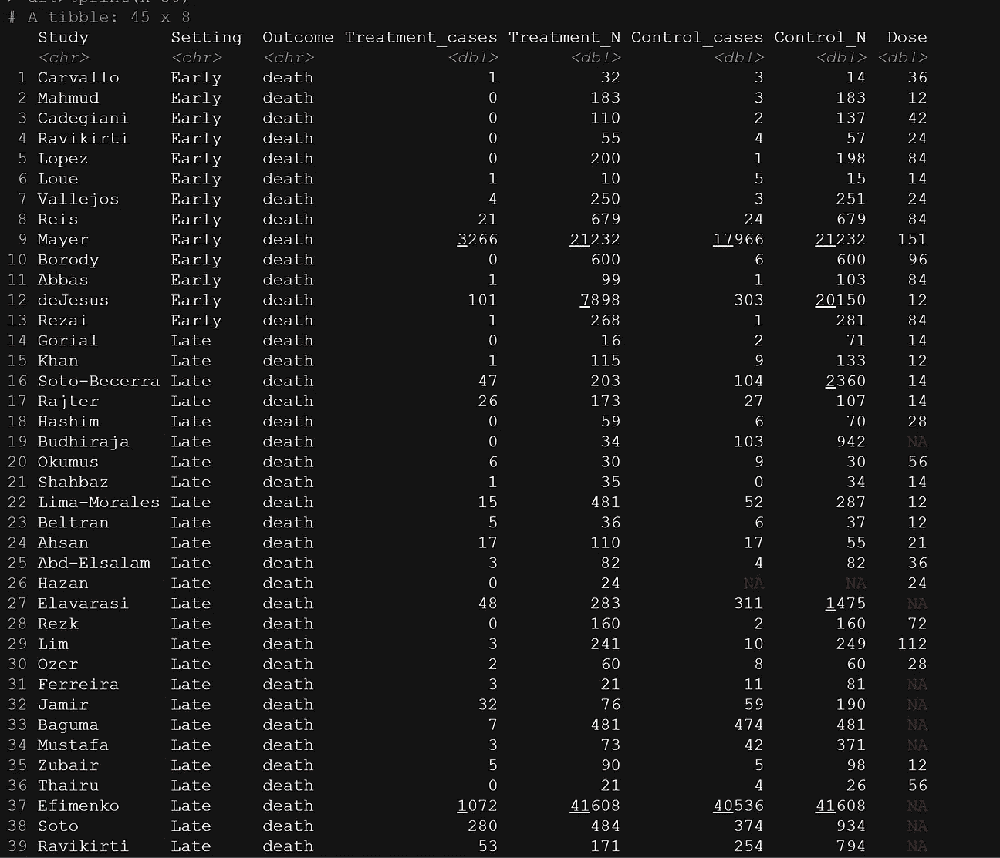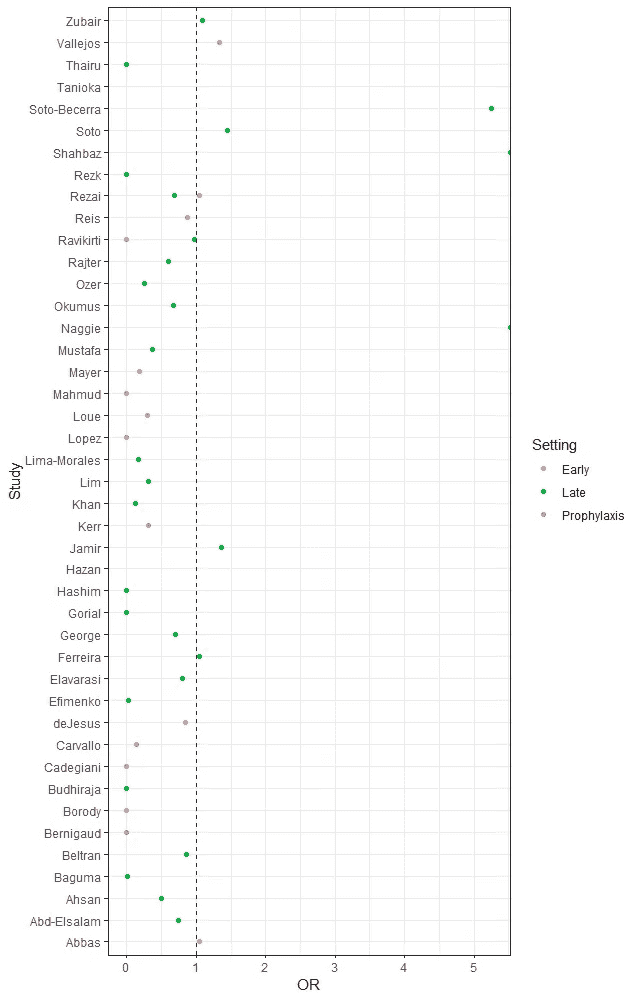

The first 39 lines of data coming from the Excel file, and the odds ratio graph. The zero-point in an odds ratio is 1.

现在，分析这个数据集最简单的方法是以一种频繁的方式使用正式的元分析。我已经写了几次关于一个[元分析](https://towardsdatascience.com/introduction-to-meta-analysis-in-r-468e9b33925c)实际上只不过是一个[混合模型](/mlearning-ai/introduction-to-mixed-models-in-r-9c017fd83a63)的文章。你会看到同样的事情发生在这里。使用 [meta](https://cran.r-project.org/web/packages/meta/meta.pdf) 包，我将让内置函数计算每个研究的优势比，并使用[广义线性混合模型](https://pub.towardsai.net/generalized-linear-mixed-models-in-sas-distributions-link-functions-scales-overdisperion-and-4b1c767bb89a)将它们转换成一个汇总估计。从这个模型中，你可以做很多额外的测试，比如测试发表偏倚、影响分析、分组和元回归。

```
dfOR_meta<-dfOR%>%
  dplyr::select(Study,
         Treatment_cases, 
         Treatment_N, 
         Control_cases, 
         Control_N, 
         Outcome)%>%
  dplyr::filter(Outcome=="death")%>%
  tidyr::drop_na()meta1<-metabin(Treatment_cases, 
               Treatment_N, 
               Control_cases, 
               Control_N,
              studlab=Study,
              tau.common=FALSE,
              data = dfOR_meta, 
              method = "GLMM",
              model.glmm = "CM.AL",
              sm="OR",
              MH.exact = TRUE,
              fixed = FALSE,
              random = TRUE,
              method.tau = "ML",
              prediction = TRUE, 
              haln=TRUE)
meta1
summary(meta1)
forest.meta(meta1, layout = "RevMan5")
exp(meta1$TE.random)
meta1$tau2
find.outliers(meta1)
def.inf <- InfluenceAnalysis(meta1, random = TRUE)
plot(def.inf, "baujat")
plot(def.inf, "influence")
plot(def.inf, "es")
plot(def.inf, "i2")
drapery(meta1, 
        labels ="studlab",
        type = "pval", 
        legend = FALSE)
funnel(meta1)
metabias(meta1, 
         method.bias = 'linreg', 
         k.min = 5, 
         plotit = T)
```

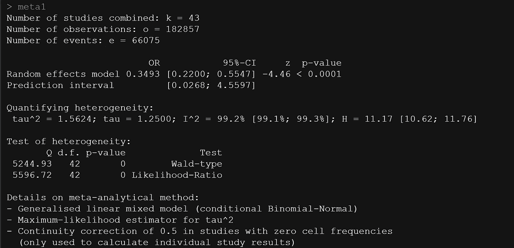

The results from the meta-analysis including all studies. It will show you the summary estimate of the odds ratio, the [confidence intervals and p-values](/mlearning-ai/inference-estimates-p-values-and-confidence-limits-a-frequentist-approach-acdd45d94bd5), the prediction interval and tests of heterogeneity.

上面的结果最好用森林图来描绘。在这里你可以看到每个研究的优势比，这是驱动结果的数据。此外，您还可以看到汇总估计值和预测间隔。在之前的一篇博文[中，我已经提到了当下面有一个更宽的预测区间时，报告一个显著的置信区间的含义。人们应该同时考虑两者，如果预测区间真的那么宽，置信区间对任何形式的临床应用都没有什么信心。现在看来，这里的情况也将如此。](/mlearning-ai/confidence-vs-prediction-intervals-576d3047f4c)

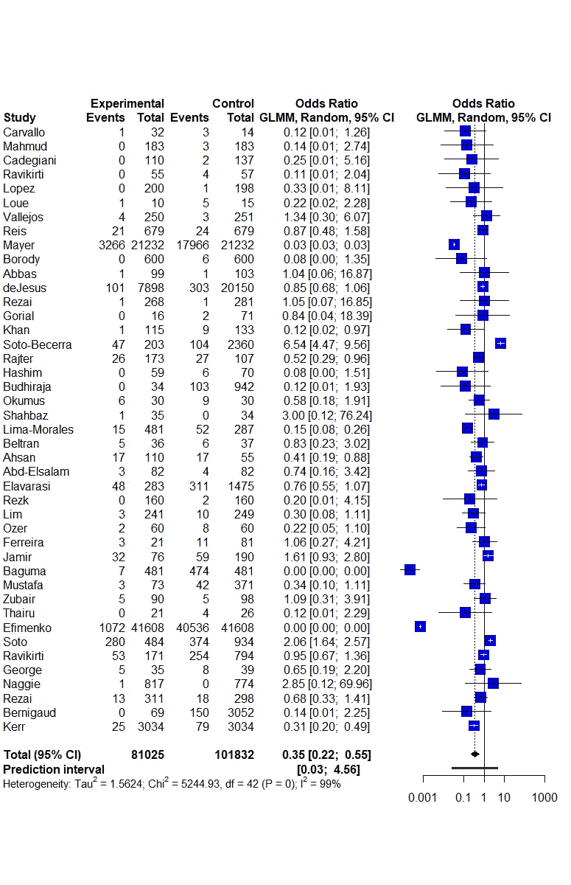

The summary estimate is in favor of Ivermectin, but the prediction interval clearly shows that the data cannot be used for individual prediction, and hence it is difficult to estimate how people will react to getting the treatment. In such a case, a full risk analysis needs to be made, which is not done here.

现在，当你有这么多的研究时，看看它们如何影响结果以及它们各自的贡献是很好的。正如您在下面看到的，我已经绘制了每个纳入研究的效应大小变化。实际上，它显示的是如果你忽略一项研究，影响大小是如何变化的。

很明显，除了最下面的两个，大多数的研究都很小。如果我们回到之前的森林图，你可以看到这些研究确实有更大的样本量，但也有更多的事件。对我来说，不清楚如何实际解释网站上展示的这些结果，所以我最终把它们拿出来了。这是有风险的，现在只有小规模的研究，但至少是我能理解的研究。

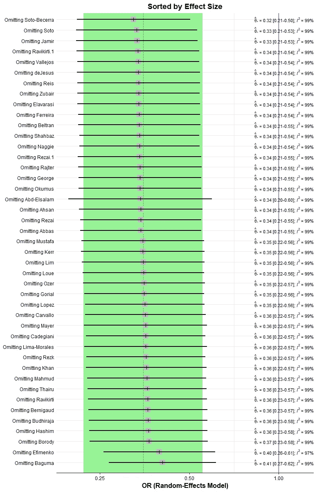

This is a very neat graph showing the influence of a study.

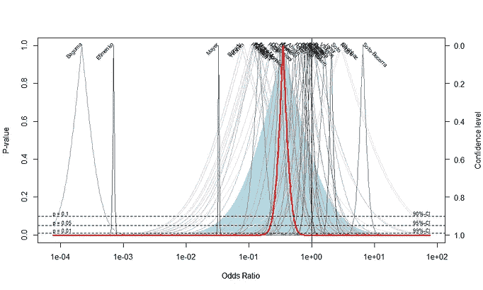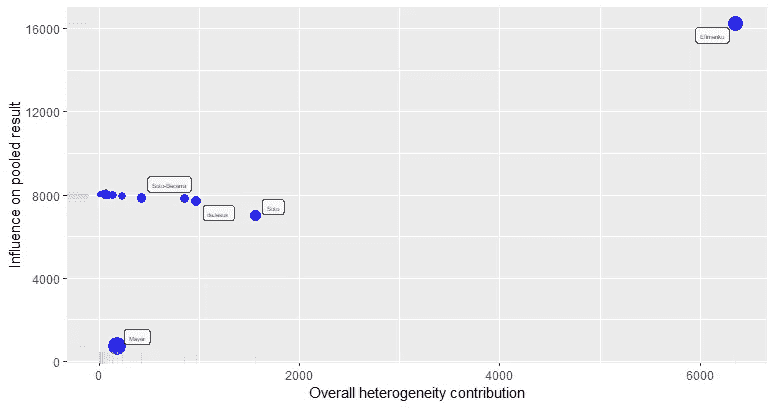

These graphs show the same — how each study influences particular metrics. What you want to see is not only their influence, but also **why** and **how** much they differ. There is nothing wrong with deviating from the rest, but if they have such a big influence, the body of evidence becomes much more fragile.

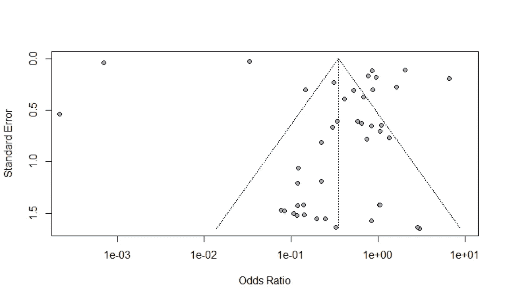

This plot is perhaps the most famous of all, besides the forest plot. It’s a funnel plot showing the distribution of the odd-ratio as a function of the standard error. The theory goes that if there is indeed publication bias, small studies will not be shown. Negative results in general will not be shown. So, what you want is an even spread. Once again, I see three studies with extreme positive odds ratio’s for the experimental group with almost no standard error. Keeping those studies in is too much of a risk.

基于以上结果，我决定删除三项研究。首先，我发现他们在网站上的展示不是很清晰，显示了对照组的极端死亡人数。这很可能是我喜欢的理解，但我仍然想知道如果删除这些研究会发生什么。

```
dfOR_meta2<-dfOR%>%
  dplyr::select(Study,
                Treatment_cases, 
                Treatment_N, 
                Control_cases, 
                Control_N, 
                Outcome)%>%
  dplyr::filter(Outcome=="death")%>%
  dplyr::filter(!Study %in% c('Efimenko', 
                              'Mayer', 
                              'Baguma'))%>%
  tidyr::drop_na()meta2<-metabin(Treatment_cases, 
               Treatment_N, 
               Control_cases, 
               Control_N,
               studlab=Study,
               tau.common=FALSE,
               data = dfOR_meta2, 
               method = "GLMM",
               model.glmm = "CM.AL",
               sm="OR",
               MH.exact = TRUE,
               fixed = FALSE,
               random = TRUE,
               method.tau = "ML",
               prediction = TRUE, 
               haln=TRUE)
forest.meta(meta2, layout = "RevMan5")
```

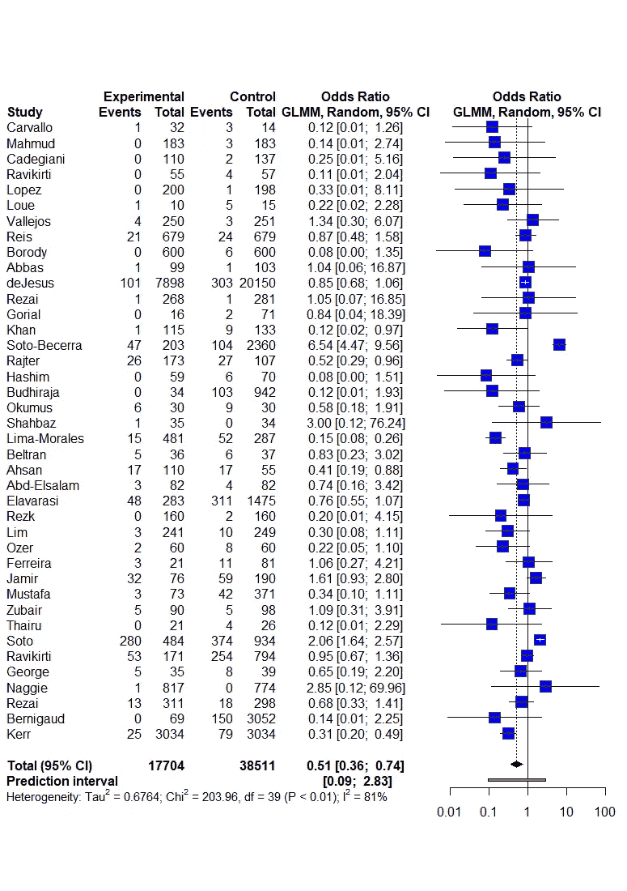

And the forest plot. The random effects summary estimate still favors Ivermectin and the confidence intervals are within bounds. However, the prediction interval does not, meaning that there is a lot of uncertainty in the data, and the message is not suited for clinical communication. We do not have any idea who will benefit from this treatment.

到目前为止，我们只从全球的角度来看这些研究，没有考虑到更进一步的背景，如*设定*或*剂量*。让我们来做一个分组分析，仔细看看 S*setting*。

```
dfOR_meta2_subgroup<-dfOR%>%
  dplyr::select(Study,
                Treatment_cases, 
                Treatment_N, 
                Control_cases, 
                Control_N, 
                Outcome, 
                Setting)%>%
  dplyr::filter(Outcome=="death")%>%
  dplyr::filter(!Study %in% c('Efimenko', 
                              'Mayer', 
                              'Baguma'))%>%
  tidyr::drop_na()
meta2_sub<-metabin(Treatment_cases, 
               Treatment_N, 
               Control_cases, 
               Control_N,
               studlab=Study,
               subgroup=Setting,
               tau.common=FALSE,
               data = dfOR_meta2_subgroup, 
               method = "GLMM",
               model.glmm = "CM.AL",
               sm="OR",
               MH.exact = TRUE,
               fixed = FALSE,
               random = TRUE,
               method.tau = "ML",
               prediction = TRUE, 
               haln=TRUE)
meta2_sub
summary(meta2_sub)
forest.meta(meta2_sub, layout = "RevMan5")
exp(meta1$TE.random)
meta1$tau2
find.outliers(meta1)
def.inf <- InfluenceAnalysis(meta1, random = TRUE)
plot(def.inf, "baujat")
plot(def.inf, "influence")
plot(def.inf, "es")
plot(def.inf, "i2")
drapery(meta1, 
        labels ="studlab",
        type = "pval", 
        legend = FALSE)
funnel(meta1)
metabias(meta1, 
         method.bias = 'linreg', 
         k.min = 5, 
         plotit = T)
```

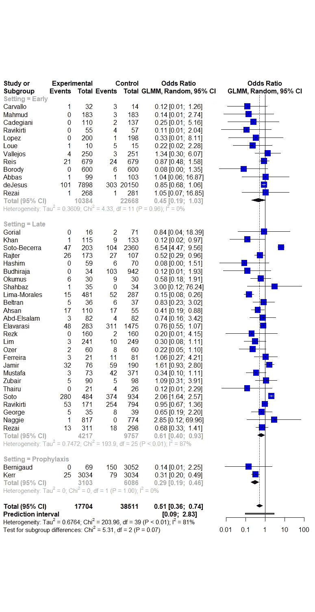

This is quite a big forest plot but it does the trick. As you can see, I cut the analysis in three and looked at the odds ratio between Ivermectin and the control for three settings: ‘Early’, ‘Late’ and ‘Prophylaxis’. The last one is actually way to small to create any meaningful sub-group analysis.

亚组分析显示对早期设置没有影响，对晚期设置有轻微的积极影响，对预防有积极影响。亚组差异的测试是不显著的，但我不关心这个。在临床上，你在什么样的环境下进行实验性治疗是非常重要的，所以需要进行亚组分析。

然而，最后两种设置表现出严重的异质性，这限制了数据的可用性。我甚至不得不质疑这种级别的分组划分是否足够。概率是有条件依赖的，可以通过一个变量或一项研究的纳入或排除做出重大反应。此外，即使没有描述，也不需要很长时间就可以解读出后期设置的预测间隔也将超过 1，这意味着伊维菌素数据不能用于单独预测谁将从中受益。

是时候更上一层楼，做更多的造型了。我们还没有触及*剂量*，我希望在分析本身中有更多一点的自由。

因此，正如我所说的，元分析是一个广义的线性混合模型，我们可以从不同的角度使用 r 中可用的不同库来处理它。让我们看看如果我使用 [lme4 包](https://cran.r-project.org/web/packages/lme4/index.html)的 **glmer** 函数会发生什么，并查看每个样本中的事件数。现在，我只想看一看变化。为此，我确实需要改变数据的构建方式。

请注意，我正在通过计算比率来准备 Beta 分布的数据。由于β不喜欢 0 或 1，我将增加或减少一个非常小的数字。

```
dfmelt<-df%>%
  dplyr::select(-Outcome)%>%
  melt(., id.vars=c("Study", "Setting", "Dose"))%>%
  tidyr::separate(variable, c("Treatment", "N"))%>%
  dplyr::arrange(Study)%>%
  tidyr::spread(N, value)%>%
  dplyr::filter(!Study %in% c('Efimenko', 
                              'Mayer', 
                              'Baguma'))
dfmelt$ratio<-dfmelt$cases/dfmelt$N
dfmelt2<-dfmelt%>%
  dplyr::mutate(ratio = ifelse(ratio == 0, 0.001, ratio),
                Dose = ifelse(Treatment == "Control", 0, Dose))%>%
  dplyr::mutate(Treatment = forcats::fct_recode(Treatment, 
                                                "Ivermectine" = "Treatment"))
dim(dfmelt2)
dfmelt2%>%print(n=90, na.print="")fit_random_int<-glmer(cbind(cases,N)~1 + (1|Study), 
                      data=dfmelt2,
                      family=binomial(link="logit"))
summary(fit_random_int)
plot(fit_random_int)
plot_model(fit_random_int, type="re")
coef(fit_random_int)
fixef(fit_random_int)
exp(fixef(fit_random_int))
ranef(fit_random_int)
fixef(fit_random_int)[[1]]+ranef(fit_random_int)[[1]]
```

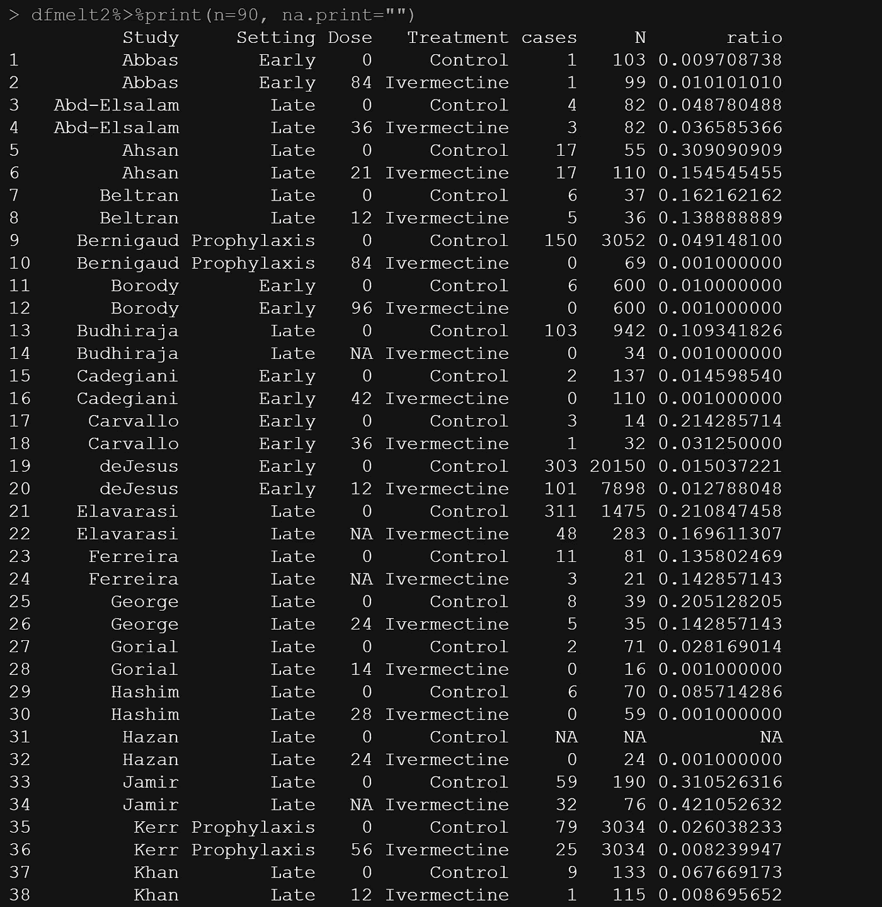

The melted dataset with two lines per study — one for each treatment. We will need this dataset for later analysis.

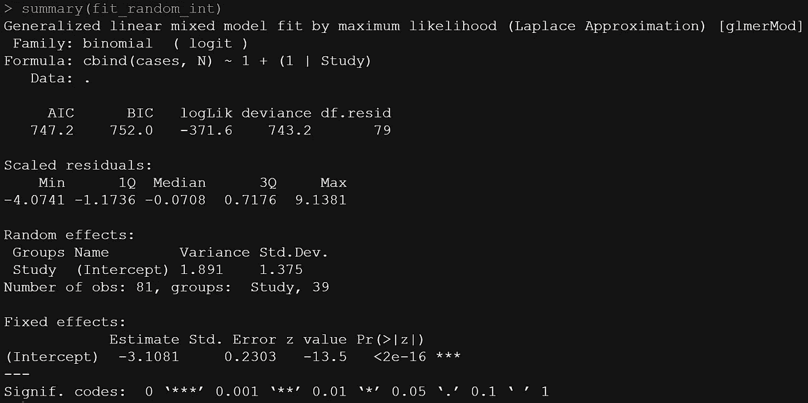

The analysis is wrong from the beginning, since I have two lines per study yet did not include treatment as the differentiator. It was better of me to just pre-calculate the OR and then look for variation using the **lmer** function, but lets stick with this for a moment.

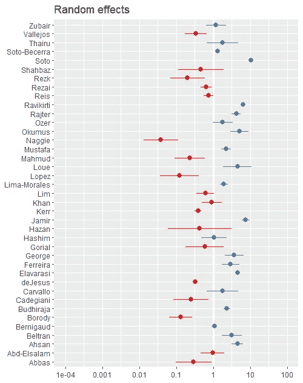

Here, we can see the random effects from the **glmer** function. It seems that there is sufficient variation, but the analysis is not fail safe, yet. Lets add **Treatment**.

因此，让我们添加*治疗*。

```
fit_random_int_b<-glmer(cbind(cases,N)~Treatment + (1|Study), 
                        data=dfmelt2,
                        family=binomial(link="logit"))
anova(fit_random_int, fit_random_int_b)
plot_model(fit_random_int_b, type="diag")
plot_model(fit_random_int_b, type="re")
```

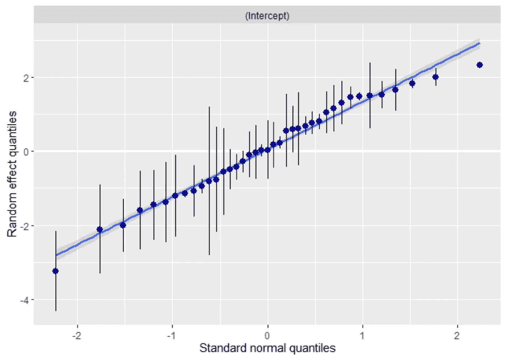

The assumption of normality of the variances is met, at least for the random effect of **Study**.

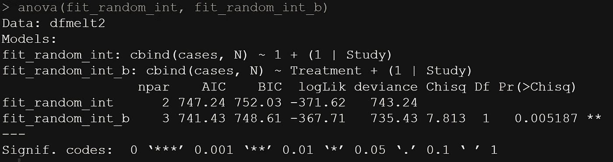

And of course the model including treatment fits the data MUCH better — I made the data in such a way that treatment would be a very big differentiator. No surprises here. In fact, this model NEEDS to have treatment included, regardless of model performance.

我没有真正做的一件事是查看原始数据，并绘制图表。当然，我们有了第一张显示每项研究优势比的图表，但这还不够。我想看看更原始的数据，因为二项式分布很可能不是最好的选择。你永远不会事先真正知道，有些人可能会说这没关系，但我们不要走那条路。

如果你看看原始数据，你会发现很多时候其中一组没有死亡。这很好，这意味着新冠肺炎不致命，但这也意味着我们可能会处理零充气模型，我们需要以不同的方式处理这些问题。

```
ggplot(dfmelt2, aes(x = ratio, fill="All data")) +
  geom_density(alpha = 0.6) +
  scale_fill_viridis_d(option = "plasma", end = 0.8) +
  labs(x = "Proportion of deaths", y = "Density") +
  ggthemes::theme_clean() +
  theme(legend.position = "bottom")g1<-ggplot(dfmelt2, aes(x = Treatment, y = ratio)) +
  geom_half_point(aes(color = Treatment), 
                  transformation = position_quasirandom(width =0.1),
                  side = "l", size = 0.5, alpha = 0.5) +
  geom_half_boxplot(aes(fill = Treatment), side = "r") + 
  scale_fill_viridis_d(option = "plasma", end = 0.8) +
  scale_color_viridis_d(option = "plasma", end = 0.8) +
  guides(color = "none", fill = "none") +
  labs(x = "Treatment", y = "Proportion of deaths") +
  ggthemes::theme_clean()
g2<-ggplot(dfmelt2, aes(x = ratio, fill = Treatment)) +
  geom_density(alpha = 0.6) +
  scale_fill_viridis_d(option = "plasma", end = 0.8) +
  labs(x = "Proportion of deaths", y = "Density", fill = "Treatment") +
  ggthemes::theme_clean() +
  theme(legend.position = "bottom")
grid.arrange(g1,g2,ncol=2)
```

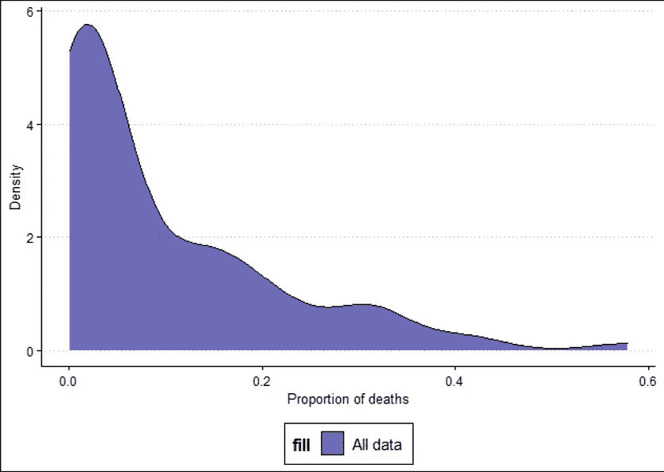

The data definitely hints at zero-inflated data. It looks very much like a Poisson or a Gamma, but considering the discrete nature of the data, I would say that taking extreme care of that big peak to the left does not hurt.

```
ggplot(dfmelt2, aes(x = ratio, fill = Treatment)) +
geom_density(alpha = 0.6) +
scale_fill_viridis_d(option = "plasma", end = 0.8) +
labs(x = "Proportion of deaths", y = "Density", fill = "Treatment")+
ggthemes::theme_clean() +
facet_wrap(~Setting, scales="free")+
theme(legend.position = "bottom")
```

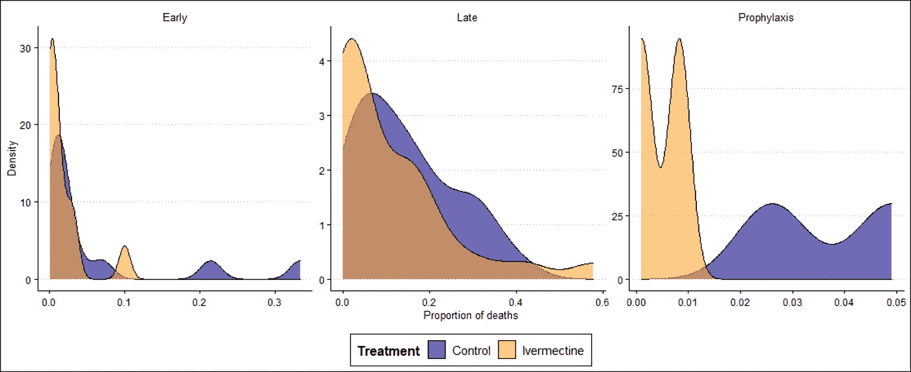

Splitting the data by **Setting** goes to show how sparse the mortality data is in the Early and Prophylaxis stage. In those settings, I am not even sure if I can make any meaningful analysis. Also, do note that the data in itself is sparse for density functions. Because of the incidental occurrence of death, density functions almost make it seem as if there are some funky things going on, but it is actually just a lack of events we are seeing.

下面，你可以看到我经历了几个不同的模型。他们每个人都使用二项式分布，这可能不是最好的分布。对我来说，这是关于看看如果我添加/删除固定和/或随机效果会发生什么。

```
fit0<-glm(cbind(cases,N)~Treatment+Dose+Setting, 
           data=dfmelt2,
           family=binomial())
fit<-glmer(cbind(cases,N)~Treatment+Dose+Setting + 
             (1|Study), 
           data=dfmelt2,
         family=binomial())
fit2<-glmer(cbind(cases,N)~Treatment+Dose+ 
             (1|Study), 
           data=dfmelt2,
           family=binomial())
fit3<-glmer(cbind(cases,N)~Treatment*Dose+ 
              (1|Study), 
            data=dfmelt2,
            family=binomial())
fit4<-glmer(cbind(cases,N)~1+(1|Study), 
            data=dfmelt2,
            family=binomial())
fit5<-glmer(cbind(cases,N)~Treatment+(1|Study), 
            data=dfmelt2,
            family=binomial())
AIC(fit0, fit, fit2, fit4, fit5)
anova(fit, fit2)
anova(fit4, fit5)
```

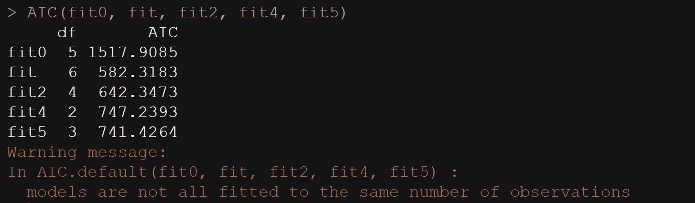

Since not all models have the same number of observations, you cannot compare them.

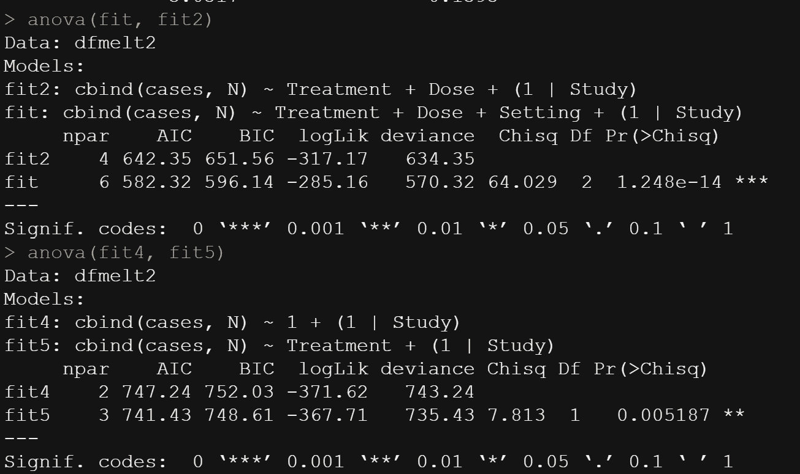

**Setting** adds to the model, which could already be depicted from the graphs above. Also, it is best to keep in **Treatment**, but also Dose. It seems that, via indirect comparison, the best model is the model that includes all.

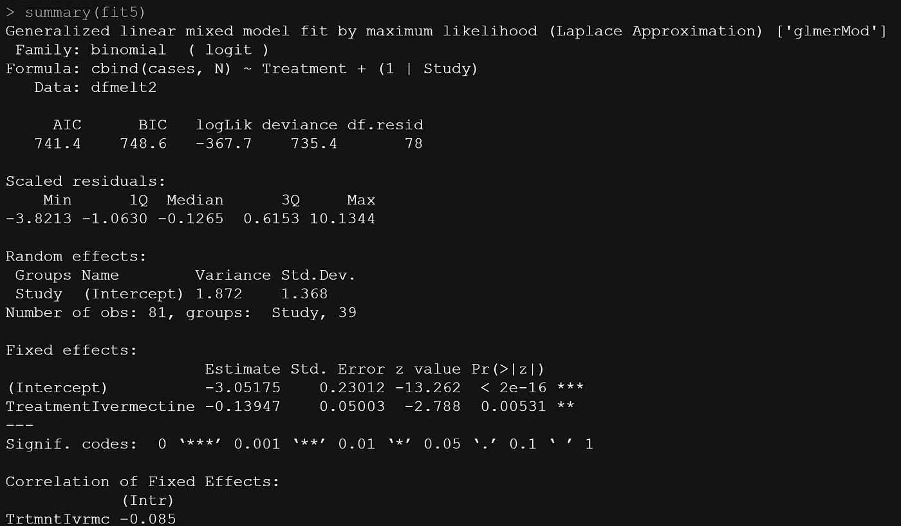

And here we have the fit of the model including the random component of **Study** and the fixed effect of **Treatment**. The variance of **Study** is sufficient to warrant its inclusion and **Treatment** is a significant differentiator. However, without **Setting** and **Dose**, these results do not matter that much. [Conditional probabilities](https://blog.devgenius.io/marginal-vs-conditional-probabilities-visualizations-and-models-in-r-e7288ad26cb9) have a fun way of reshuffling it all.

该走了贝叶斯！在过去的一个月里，我已经发表了几篇展示贝叶斯分析方法的文章，我不会深入讨论贝叶斯理论。为此，你需要看看我的博客列表，或者在网上阅读许多其他优秀的博客。不，这里重要的是我们如何在这个数据集上应用贝叶斯分析，因为正如我已经提到的，伊维菌素是一种并非没有争议的治疗方法。但是，在我转向 prior 之前，是时候寻找一个更好的发行版了。

让我们从我使用 glmer 应用的相同分析开始。我最喜欢的贝叶斯包是 [brms](https://www.rdocumentation.org/packages/brms/versions/2.17.0) 。

```
get_prior(cases | trials(N)~Treatment+Dose+Setting + (1|Study), 
          data=dfmelt2,
          family=binomial(link="logit"))
bayes_binom<-brm(
  cases | trials(N)~Treatment+Dose+Setting + (1|Study), 
  data=dfmelt2,
  family=binomial(link="logit"),
  warmup = 1000, 
  iter = 4000,
  chains = 4,
  cores=6,
  seed = 123)
summary(bayes_binom)
plot(bayes_binom)
pp_check(bayes_binom, ndraws=100)
prior_summary(bayes_binom)
pp_check(bayes_binom, type = "error_hist", ndraws = 11)
pp_check(bayes_binom, type = "scatter_avg", ndraws = 100)
pp_check(bayes_binom, type = "stat_2d")
pp_check(bayes_binom, type = "loo_pit")
```

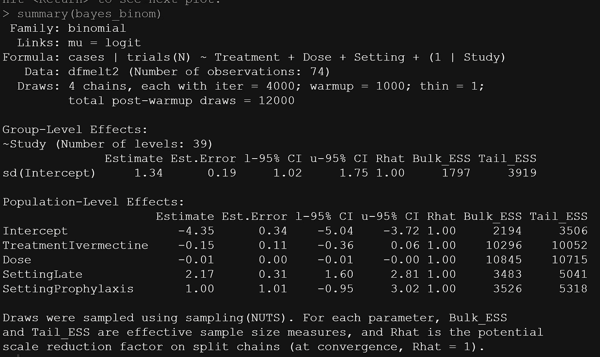

And the first model. It looks good!

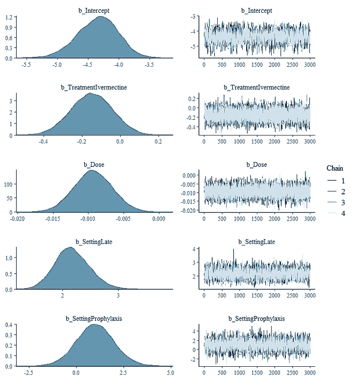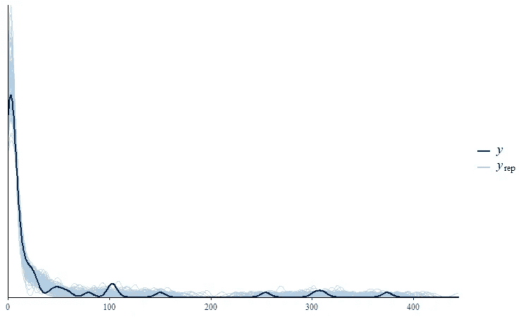

Looking good again.

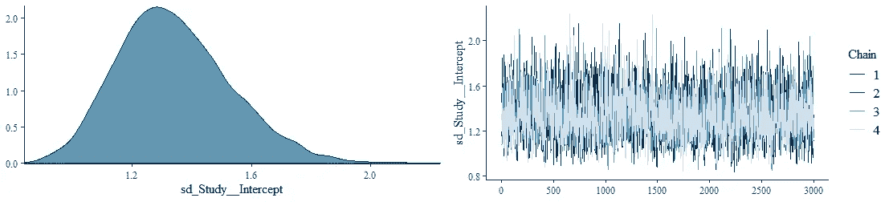

Good.

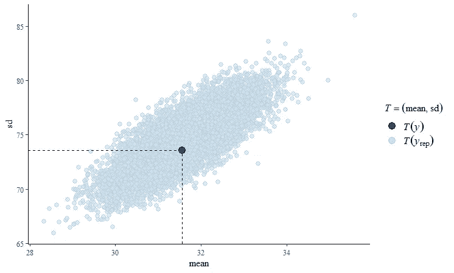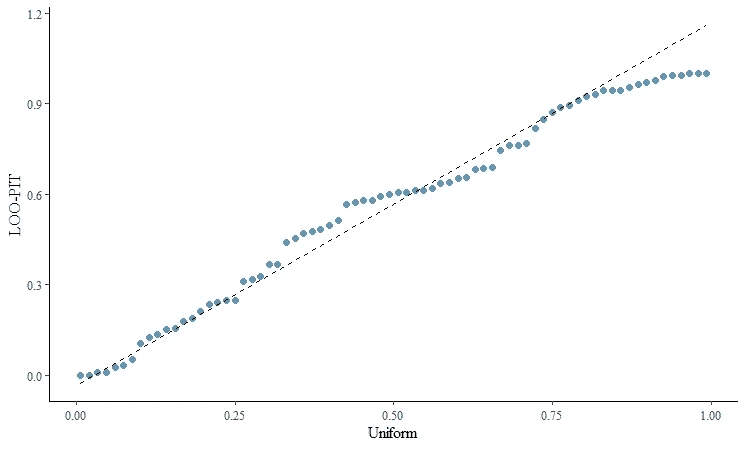

And good.

上面的模型看起来不错，尽管还远远没有准备好。它不是贝叶斯模型，它的先验直接来自数据。但对我来说，最重要的部分是能够得到一个符合贝叶斯模型在链收敛和抽样方面的所有假设的结果。确实如此。

现在，我们可以创建一个很长的图表列表来显示模型的表现。实际上，它显示了采样是如何进行的。后验概率可以任意偏离可能性。它不需要适合。

```
yrep<-posterior_predict(bayes_binom)
y<-dfmelt2$cases[!is.na(dfmelt2$cases) & !is.na(dfmelt2$Dose)]
group<-dfmelt2$Treatment[!is.na(dfmelt2$cases) & !is.na(dfmelt2$Dose)]
x<-dfmelt2$Dose[!is.na(dfmelt2$cases) & !is.na(dfmelt2$Dose)]
bayesplot::ppc_dens_overlay(y, yrep)
bayesplot::ppc_ecdf_overlay(y, yrep[sample(nrow(yrep), 25), ])
bayesplot::ppc_hist(y, yrep[1:8, ])
bayesplot::ppc_boxplot(y, yrep[1:8, ])
bayesplot::ppc_dens(y, yrep[200:202, ])
bayesplot::ppc_freqpoly(y, yrep[1:3,], alpha = 0.1, size = 1, binwidth = 5)
bayesplot::ppc_freqpoly_grouped(y, yrep[1:3,], group) + yaxis_text()
bayesplot::ppc_dens_overlay_grouped(y, yrep[1:25, ], group = group)
bayesplot::ppc_ecdf_overlay_grouped(y, yrep[1:25, ], group = group)
bayesplot::ppc_violin_grouped(y, yrep, group, size = 1.5)
bayesplot::ppc_violin_grouped(y, yrep, group, alpha = 0, y_draw = "points", y_size = 1.5)
bayesplot::ppc_violin_grouped(y, yrep, group, alpha = 0, y_draw = "both",
                   y_size = 1.5, y_alpha = 0.5, y_jitter = 0.33)bayesplot::bayesplot_theme_set(ggplot2::theme_linedraw())
bayesplot::color_scheme_set("viridisE")
bayesplot::ppc_stat_2d(y, yrep, stat = c("mean", "sd"))
bayesplot::bayesplot_theme_set(ggplot2::theme_grey())
bayesplot::color_scheme_set("brewer-Paired")
bayesplot::ppc_stat_2d(y, yrep, stat = c("median", "mad"))
```

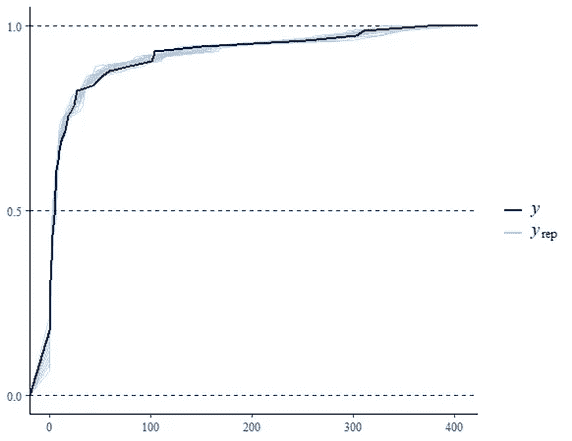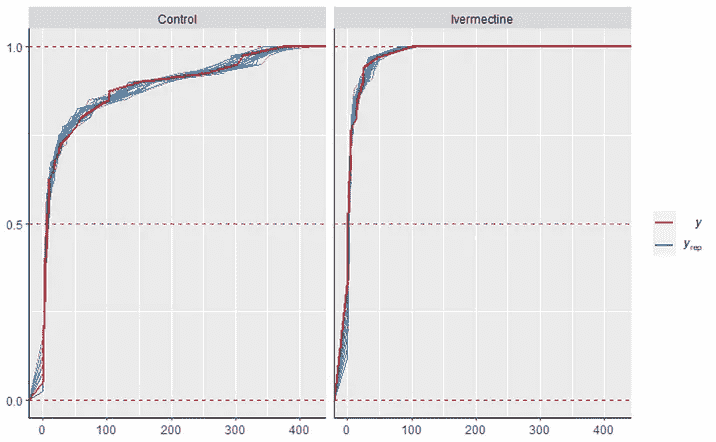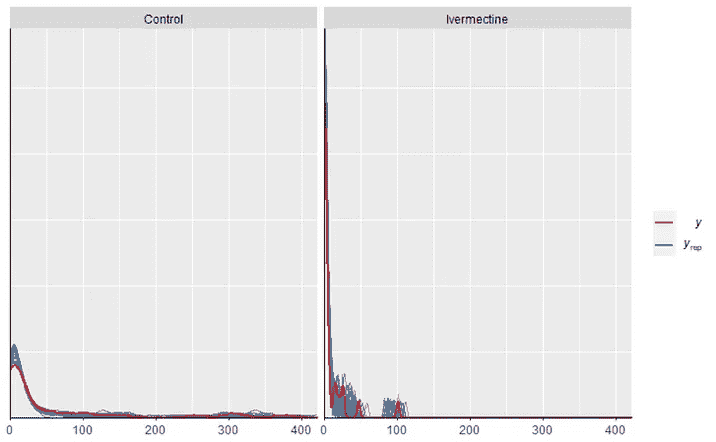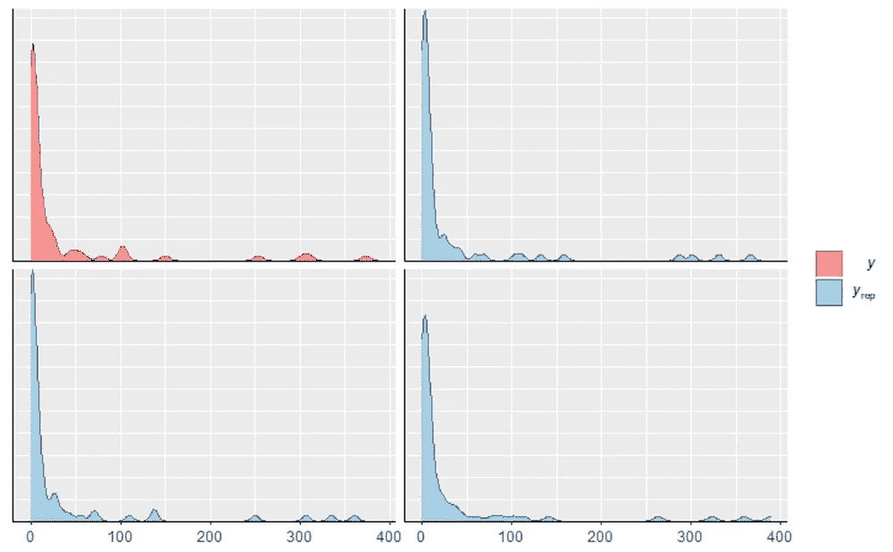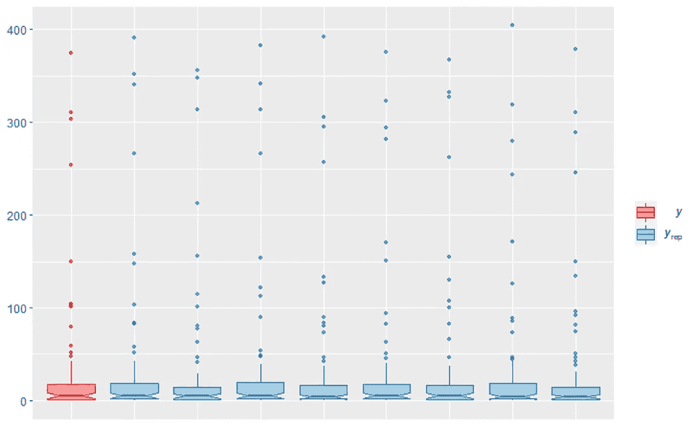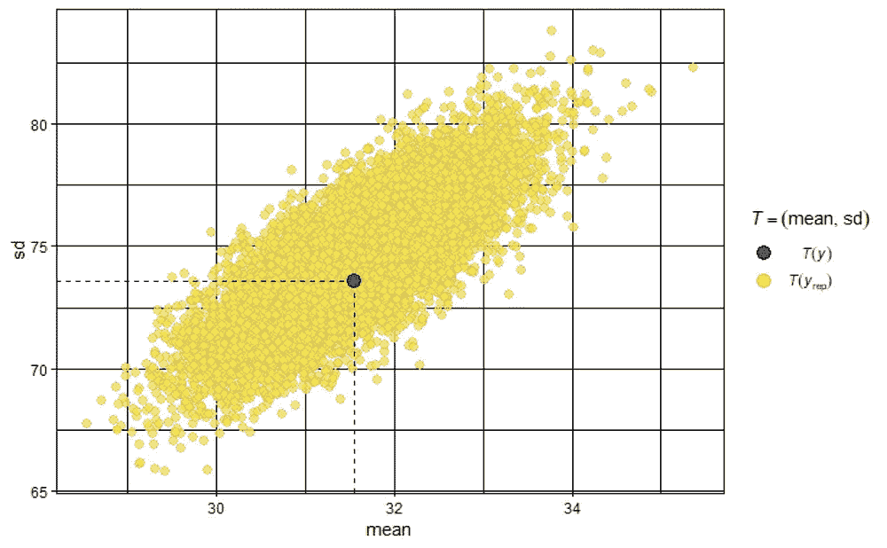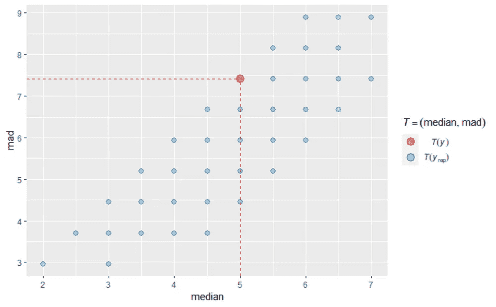

Lots of plots showing you how the posterior sampling goes and what it amounts to. Without an informative prior, the plots only help you to give some assessment in terms of sampling.

接下来是评估我们是否选择了正确发行版的代码。我们把这个叫做[概率积分变换](https://en.wikipedia.org/wiki/Probability_integral_transform) (PIT)，基本上就是利用 CDF 性质来*把*连续的随机变量转换成均匀分布的。**然而，如果用于生成连续随机变量的分布是真实分布，这仅适用于*和*。这里有一篇关于这个的非常好的博文。因此，使用留一法交叉验证，模型转换数据，如果选择的分布是“实际”分布(你永远无法知道)，向均匀分布的转换将在 QQ 图中显示正态分布的属性。简单，不是吗？不，当然不是，但是除了你永远无法知道正确的分布是什么之外，它是一个有用的检查工具。但是，当涉及到贝叶斯分析时，这也有点违反直觉，因为后验概率是先验概率和似然概率的函数。拥有一个可靠的先验知识和一个可靠的数据收集程序来获取可能性，比检查分布是否正确更重要。**

不管怎样，我们还是去看看吧。

```
loo1 <- loo(bayes_binom, save_psis = TRUE, cores = 4)
psis1 <- loo1$psis_object
lw <- weights(psis1)
bayesplot::ppc_loo_pit_overlay(y, yrep, lw = lw)+theme_bw()
bayesplot::ppc_loo_pit_qq(y, yrep, lw = lw)+theme_bw()
bayesplot::ppc_loo_pit_qq(y, yrep, lw = lw, compare = "normal")+theme_bw()
keep_obs <- 1:30
bayesplot::ppc_loo_intervals(y, yrep, psis_object = psis1, subset = keep_obs)+theme_bw()
bayesplot::ppc_loo_intervals(y, yrep, psis_object = psis1, subset = keep_obs,
                  order = "median")+theme_bw()ce<-conditional_effects(bayes_binom)
pe<-plot(ce, rug=TRUE)
grid.arrange(pe$Treatment,
             pe$Dose, 
             pe$Setting,
             ncol=3)
```

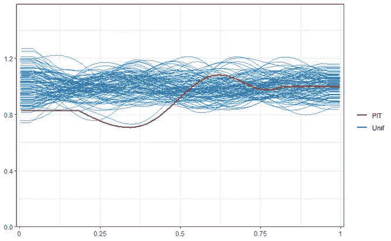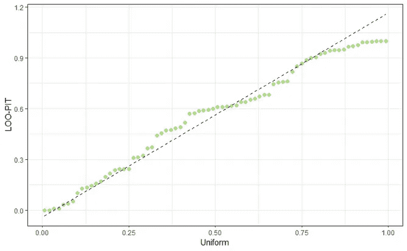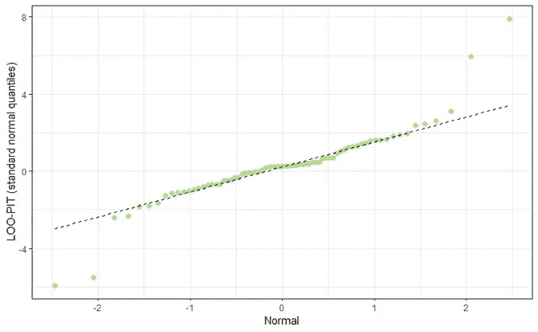

Looks good! The Beta should do the trick nicely. The Normal distribution is not suited which should not surprise you. Data are discrete, not continuous.

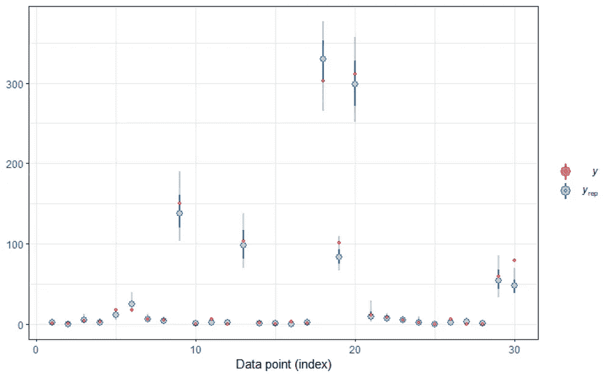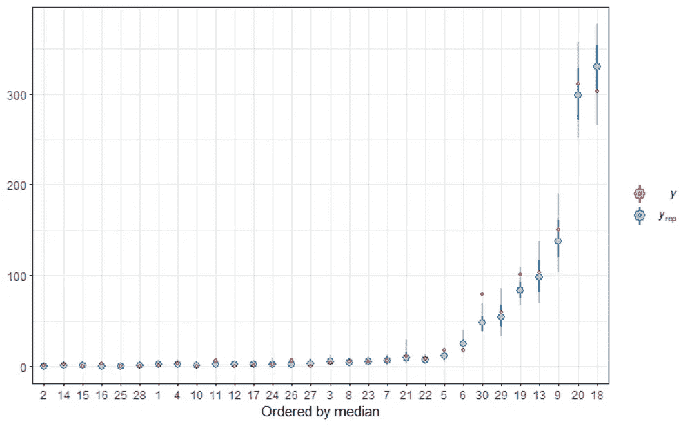

And the observed vs predicted plot. The data shows the zero-inflation very clearly.

一旦建立了一个合适的模型，我们就可以看看这里显示的条件分布。总的来说，没有治疗效果，没有剂量效果，但有明显的设置效果。

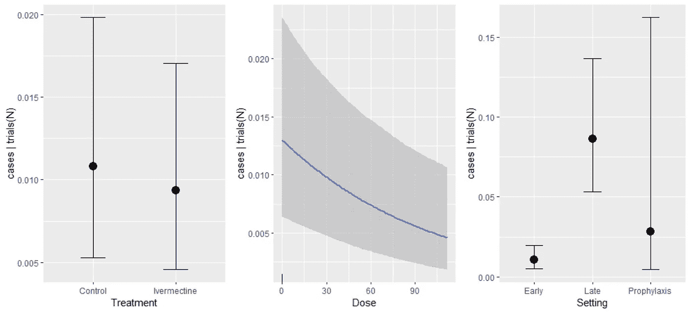

然而，我们还没有完成。

我之前发表过，离散数据，如二项式数据，可以用多种方法进行分析。你可以选择二项式，[，就像我在](https://pub.towardsai.net/analyzing-ordinal-data-in-sas-using-the-binary-binomial-and-beta-distribution-8efe5fe5af66)之前做的那样，但也要计算比率并应用 beta 分布。所以，让我们使用我之前已经计算过的比率，并绘制数据。

```
ggplot(dfmelt2, aes(y=Study, 
                    x=ratio, 
                    colour=Treatment))+
  geom_point()+
  theme_bw()ggplot(dfmelt2, aes(y=ratio, 
                    x=log(N), 
                    colour=Study))+
  geom_point()+
  facet_wrap(~Treatment)+
  theme_bw()+
  theme(legend.position = "none")ggplot(dfmelt2, aes(y=ratio, 
                    x=log(N)))+
  geom_density_2d_filled()+
  facet_wrap(~Treatment)+
  theme_bw()+
  theme(legend.position = "none")ggplot(dfmelt2, aes(y=ratio, 
                    x=log(N)))+
  geom_density_2d_filled()+
  facet_wrap(~Setting, scales="free")+
  theme_bw()+
  theme(legend.position = "none")
```

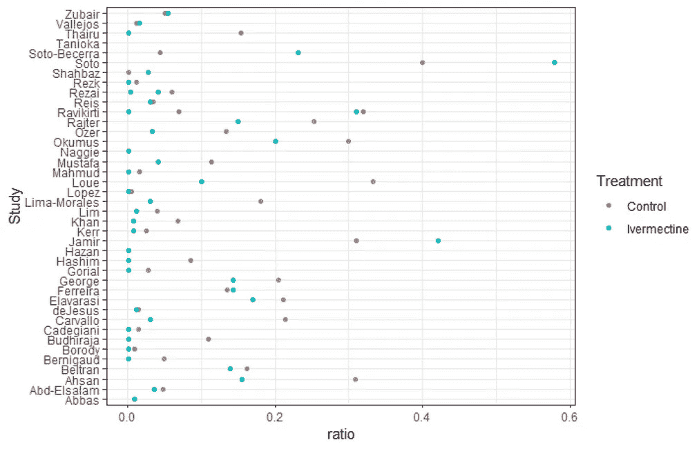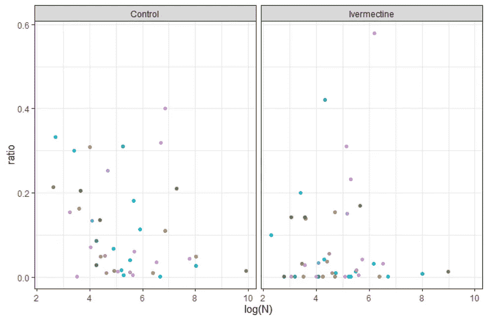

In the left plot you can see, per study, the ratio of deaths as a function of the number of people included. For the majority of studies, Ivermectin has a lower ratio than control, but that is not a definitive answer. From the right plot, you may discern the ratio as a function of the sample size. Looks good enough, considering that most studies are really not that big.

下面是对数据进行[空间分析](https://towardsdatascience.com/spatial-regression-using-fabricated-data-bbdb35da4851)的前奏，它以图形方式告诉我，哪一组的数据更精确。这不是一种比较不同组的正式方法，而是掌握数据的额外步骤。

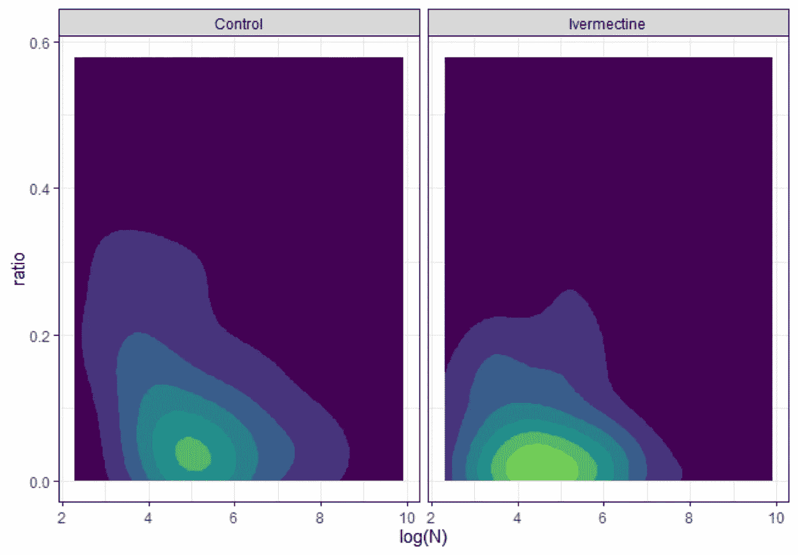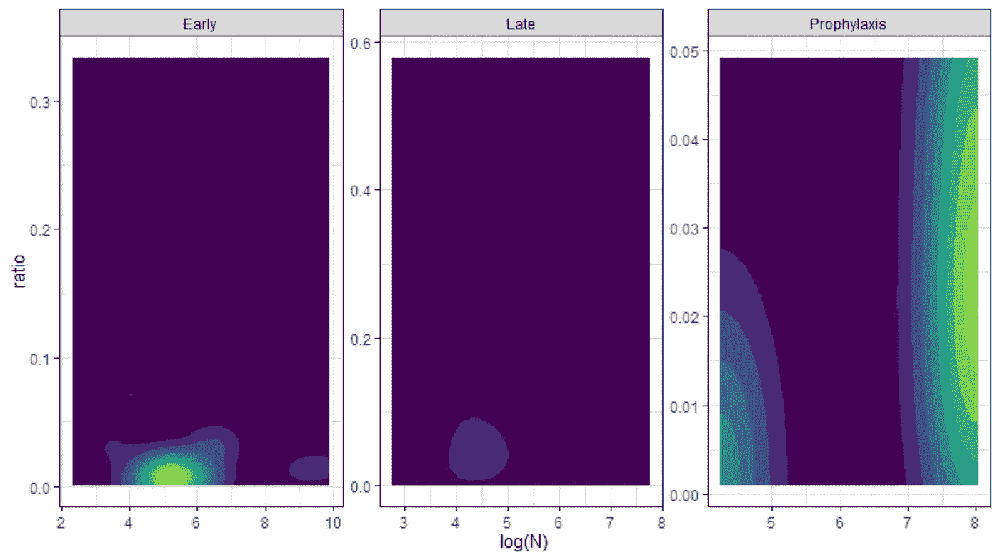

The Prophylaxis group just does not have the sample size necessary from which to extract any meaningful analysis.

这是回归测试的第一步。在这里，我将再次使用所有因素作为主效应，并且不包括**研究**的随机成分。我们已经知道它需要被包括在内，但现在让我们只处理数据并应用 beta 分布。

```
model_beta <- betareg(ratio ~ Treatment + Dose + Setting, 
                      data = dfmelt2, 
                      link = "logit")
summary(model_beta)
plot(model_beta)
tidy(model_beta)
marginaleffects(model_beta,
                newdata = 
                  datagrid(
                    Treatment = c("Ivermectine", "Control"),
                    Dose      = c(14,0),
                    Setting   = c("Early", "Early")))
```

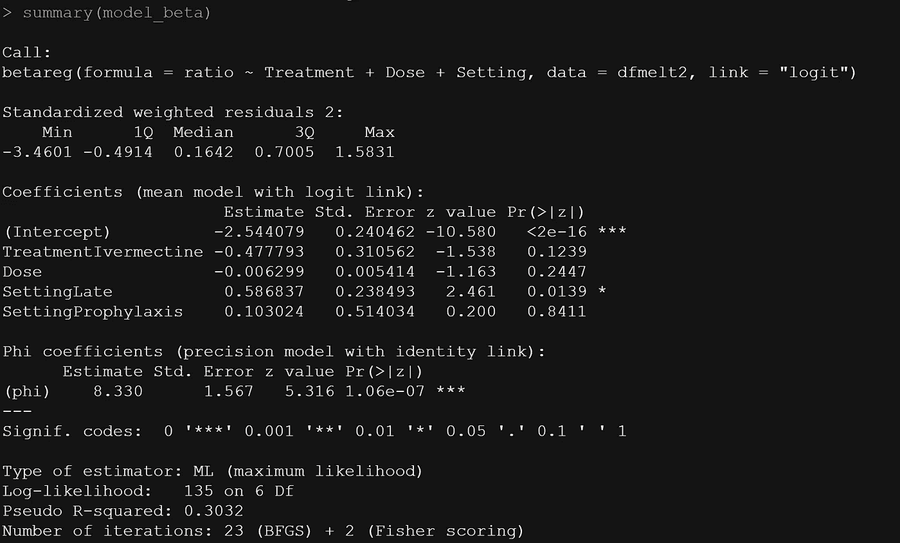

Summary of the beta-model made. The link function is the logit, so we should obtain odds ratios by taking the exponential of the coefficients.

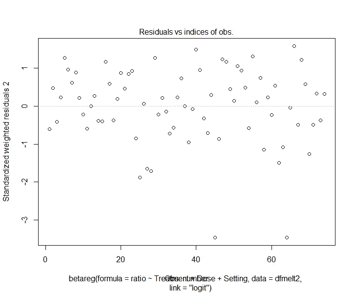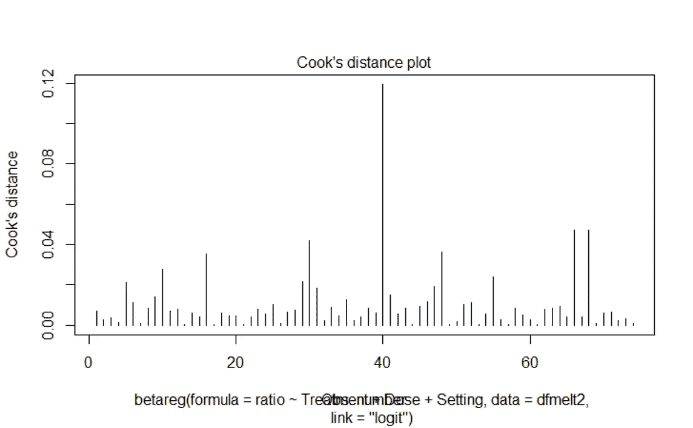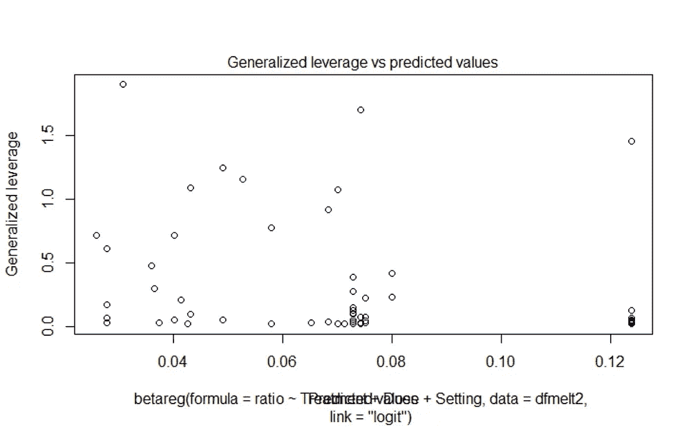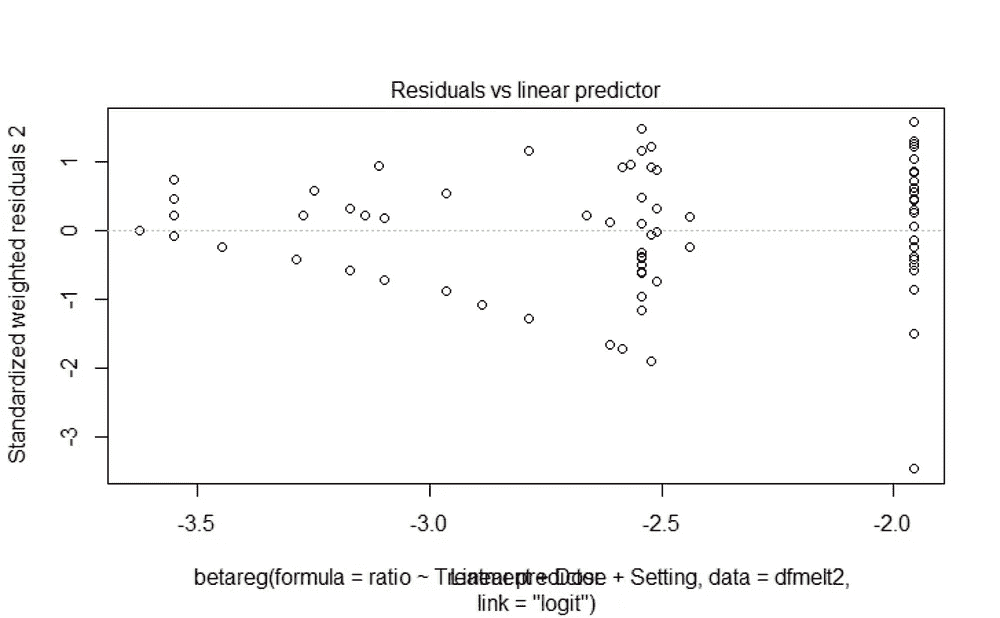

Looking good enough, except the bottom right. That is not looking good — I want to see a cloud.

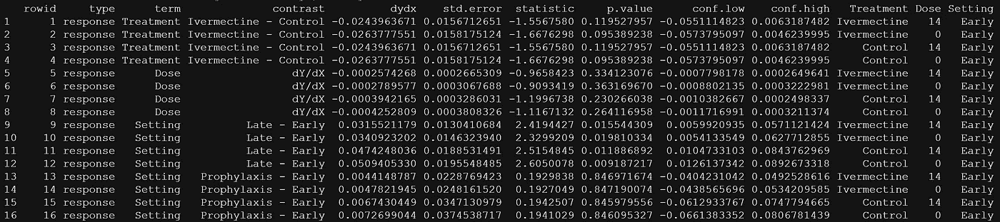

The marginal effects as a function of treatment, dose, and setting.

我们还使用 brms 系列创建了一个 beta 回归。在没有特定先验的情况下，这只是可能性分析，现在我确实包括了*研究*的随机成分。在贝叶斯分析中，所有参数都是随机的，所以这有点用词不当，但我想说的是，我将包括一个参数*研究*，它是从所有级别的*研究*中建立起来的。这不同于单独评估所有研究。

我们开始了，使用 Beta 分布对数据进行非贝叶斯贝叶斯分析。现在，模型本身应该看起来简单明了，除了一件事，那就是 *phi* 或精度估计。通常，您可以使用 alpha 和 beta 值来使用 Beta 分布，这将帮助您计算分布的均值和方差。

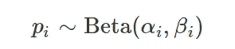

例如，使用 alpha=5 和 beta =6 的 Beta 分布如下所示:

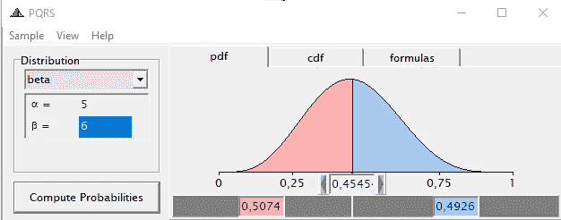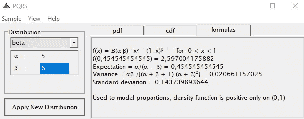

但是，我们也可以使用使用平均值和精度的 Beta 分布，您可以在 brms 中将其添加为自定义分布。[该公式在数学上看起来像这样](https://paul-buerkner.github.io/brms/articles/brms_customfamilies.html):


因此，我要建模的是两个部分:均值和方差，这是我可以在 brms 中分别做的。

```
model_beta_bayes <- brm(
  bf(ratio ~ Treatment+Dose+Setting+(1|Study),
     phi ~ Treatment),
  data = dfmelt2,
  family = Beta(),
  chains = 4, iter = 2000, warmup = 1000,
  cores = 6, seed = 1234, 
  backend = "cmdstanr")
summary(model_beta_bayes)
plot(model_beta_bayes)
tidy(model_beta_bayes, effects = "fixed")
```

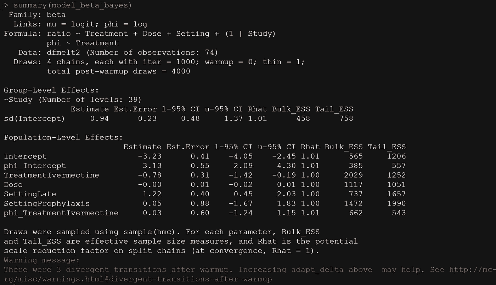

The summary model. You can see that there is a **phi_TreatmentIvermectine** estimate in the bottom. That is the precision estimate, and what I did is tell this model that the mean is determined by the **Treatment**, **Dose**, **Setting** and **Study**. The precision of the model is determined by **Treatment**.

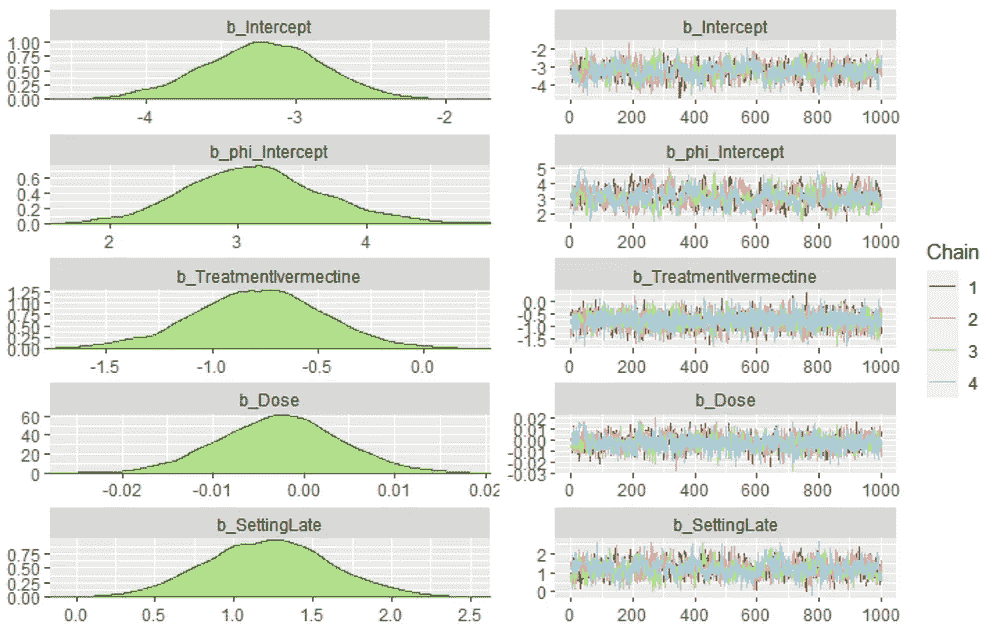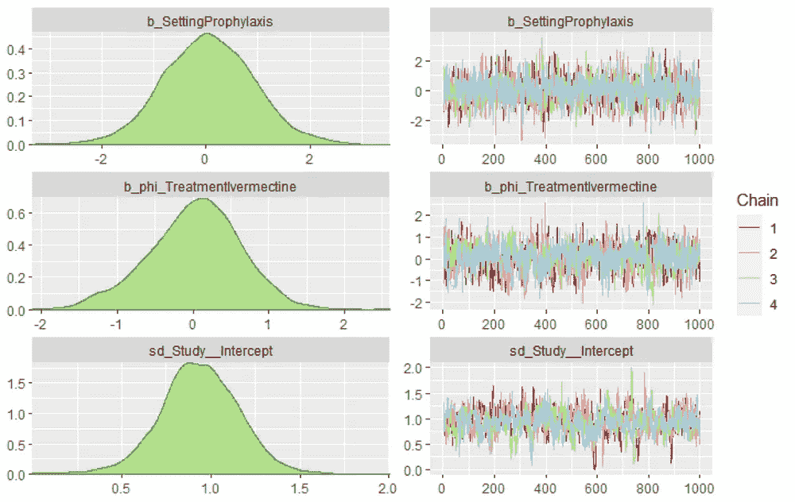

Distribution of the posterior estimates which all look good. Note that the precision estimate is quite large, but basically comes done to zero.

```
model_beta_bayes %>% 
  gather_draws(`b_.*`, regex = TRUE) %>% 
  dplyr::mutate(component = ifelse(stringr::str_detect(.variable, "phi_"), "Precision", "Mean"),
                intercept = stringr::str_detect(.variable, "Intercept"))%>%
  ggplot(., aes(x = .value, 
                y = forcats::fct_rev(.variable), 
                fill = component)) +
  geom_vline(xintercept = 0) +
  stat_halfeye(aes(slab_alpha = intercept), 
               .width = c(0.8, 0.95), point_interval = "median_hdi") +
  scale_fill_viridis_d(option = "viridis", end = 0.6) +
  scale_slab_alpha_discrete(range = c(1, 0.4)) +
  guides(fill = "none", slab_alpha = "none") +
  labs(x = "Coefficient", y = "Variable",
       caption = "80% and 95% credible intervals shown in black") +
  facet_wrap(vars(component), ncol = 1, scales = "free_y") +
  ggthemes::theme_clean()
```

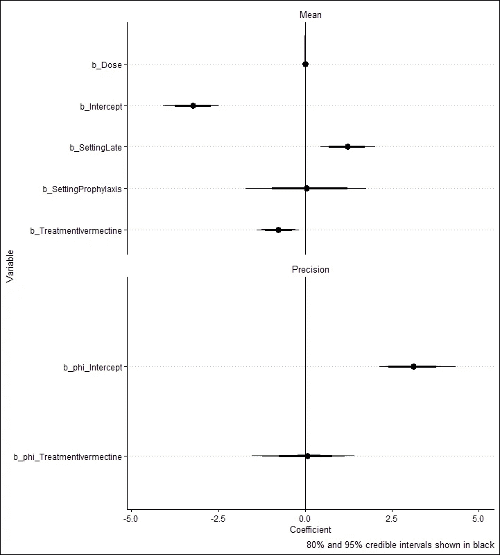

And here we have our estimates of the mean and the precision in terms of 80% and 95% credible intervals. For sure some estimates seem to have informative credible intervals, but without a suitable prior, it really does not mean much.

```
model_beta_bayes %>% 
  spread_draws(`b_.*`, regex = TRUE) %>% 
  mutate(across(starts_with("b_phi"), ~exp(.))) %>%
  mutate(across((!starts_with(".") & !starts_with("b_phi")), ~plogis(.))) %>%
  gather_variables() %>% 
  median_hdi()
emmeans(model_beta_bayes, ~ Treatment,
        transform = "response") %>% 
  contrast(method = "revpairwise")
emmeans(model_beta_bayes, ~ Treatment | Setting,
        transform = "response") %>% 
  contrast(method = "revpairwise")
```

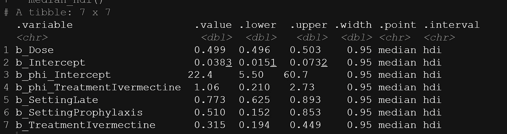

A tibble showing the estimates in terms of their median and highest density interval.

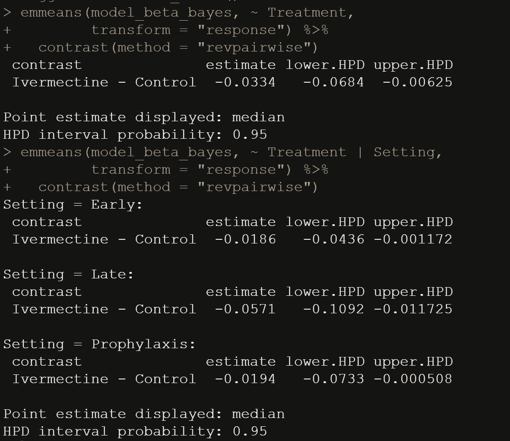

And the differences between the treatments marginally, and conditionally by setting.

```
model_beta_bayes %>%
  recover_types(dfmelt2) %>%
  emmeans::emmeans( ~ Treatment) %>%
  emmeans::contrast(method = "pairwise") %>%
  gather_emmeans_draws() %>%
  ggplot(aes(x = .value, 
             y = contrast)) +
  stat_halfeye(alpha=0.5)+
  theme_bw()emmeans(model_beta_bayes, ~ Treatment | Setting,
        transform = "response") %>% 
  contrast(method = "pairwise")%>%
  gather_emmeans_draws()%>%
  dplyr::select(Setting, .value)%>%
  group_by(Setting)%>%summarise(mean = mean(.value), 
                                sd = sd(.value))model_beta_bayes %>%
  recover_types(dfmelt2) %>%
  emmeans::emmeans( ~ Treatment | Setting, adjust="sidak") %>%
  emmeans::contrast(method = "pairwise") %>%
  gather_emmeans_draws() %>%
  ggplot(aes(x = .value, 
             y = contrast, 
             fill=Setting)) +
  stat_halfeye(alpha=0.5)+
  theme_bw()
```

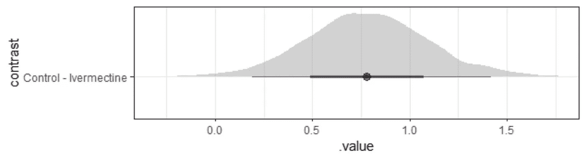

Graph showing the marginal difference.

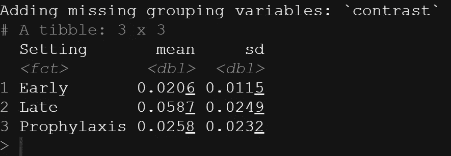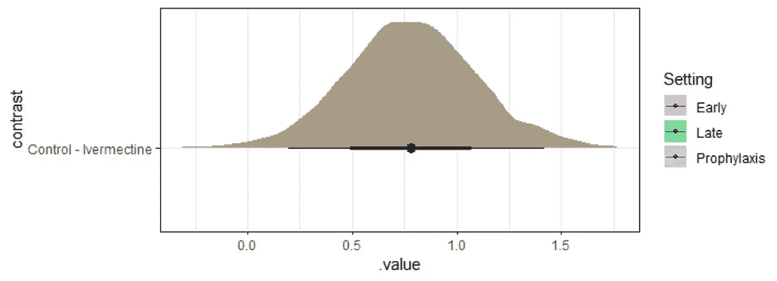

Seems that the setting does not affect the difference between the treatments. Not fully congruent with what I saw above, although the difference was indeed small.

下面是相同的贝叶斯模型，但没有随机的*研究*。

```
model_beta_bayes_fixed <- brm(
  bf(ratio ~ Treatment+Dose+Setting,
     phi ~ Treatment),
  data = dfmelt2,
  family = Beta(),
  chains = 4, iter = 2000, warmup = 1000,
  cores = 6, seed = 1234, 
  backend = "cmdstanr")
summary(model_beta_bayes_fixed)
LOO(model_beta_bayes_fixed, model_beta_bayes)
```

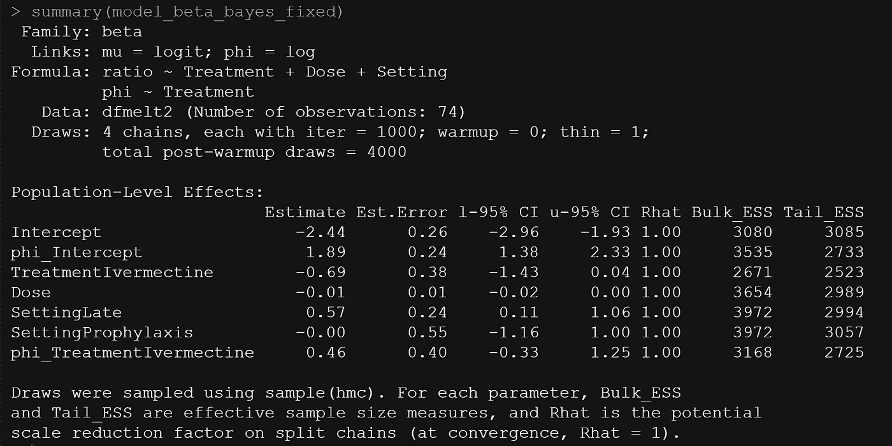

Summary of the model.


The model without random **Study** seems to perform better, but the Pareto K diagnostic values of that model are not really good. So, a comparison is not trustworthy by my standards.

不过，让我们来看看估计值是如何表现的。

```
g1<-model_beta_bayes_fixed %>%
  epred_draws(newdata = tibble(Treatment = c("Ivermectine", "Control"), Setting   = c("Late", "Late"), Dose = c(24,24)))%>%
  ggplot(., aes(x = .epred, y = Treatment, fill = Treatment)) +
  stat_halfeye(.width = c(0.8, 0.95), point_interval = "median_hdi")+
  scale_fill_viridis_d(option = "plasma", end = 0.8) +
  guides(fill = "none") +
  labs(x = "P (Death | Treatment, Setting = Late, Dose = 24mg)", y = NULL,caption = "80% and 95% credible intervals shown in black") +
  theme_bw()
g2<-model_beta_bayes_fixed %>%
  recover_types(dfmelt2) %>%
  emmeans::emmeans( ~ Treatment) %>%
  emmeans::contrast(method = "pairwise") %>%
  gather_emmeans_draws() %>%
  ggplot(aes(x = .value, y = contrast)) +
  stat_halfeye()+
  theme_bw()
g3<-model_beta_bayes_fixed %>%
  recover_types(dfmelt2) %>%
  emmeans::emmeans( ~ Treatment | Setting, adjust="sidak") %>%
  emmeans::contrast(method = "pairwise") %>%
  gather_emmeans_draws() %>%
  ggplot(aes(x = .value, y = contrast, fill=Setting)) +
  stat_halfeye()+
  theme_bw()+
  theme(legend.position="bottom")
grid.arrange(g1,g2,g3,nrow=3)
```

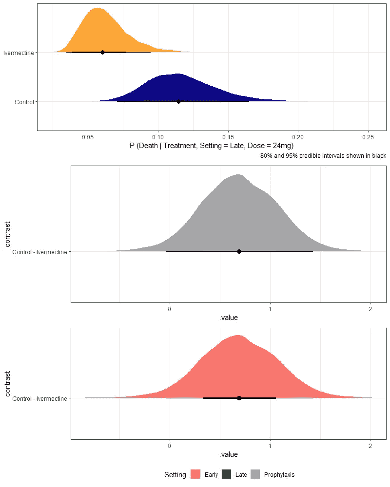

Plot showing the posterior distribution of the treatments, separately, their comparison and the comparison per setting. The latter still does not differentiate.

下面是一个新的模型，这次增加了*设置*到精度参数。

```
model_beta_bayes_fixed_phi <- brm(
  bf(ratio ~ Treatment+Dose+Setting,
     phi ~ Treatment + Setting),
  data = dfmelt2,
  family = Beta(),
  inits = "0",
  chains = 4, iter = 2000, warmup = 1000,
  cores = 6, seed = 1234, 
  backend = "cmdstanr")
summary(model_beta_bayes_fixed_phi)
plot(model_beta_bayes_fixed_phi)
LOO(model_beta_bayes_fixed, 
    model_beta_bayes,
    model_beta_bayes_fixed_phi)model_beta_bayes_fixed_phi %>% 
  predicted_draws(newdata = tibble(Treatment = c("Ivermectine", "Control"),Setting = c("Late", "Late"),Dose = c(24,24))) %>% 
  mutate(is_zero = .prediction == 0,.prediction = ifelse(is_zero, .prediction - 0.01, .prediction))%>% ggplot(., aes(x = .prediction)) +geom_histogram(aes(fill = is_zero), binwidth = 0.025,boundary = 0, color = "white") + geom_vline(xintercept = 0) +
  scale_fill_viridis_d(option = "plasma", end = 0.5,guide = guide_legend(reverse = TRUE)) + labs(x = "Predicted P(Death | Treatment, Setting = Late, Dose = 24)", y = "Count", fill = "Is zero?") + facet_wrap(vars(Treatment), ncol = 2,labeller = labeller(quota = c(`Treatment` = "Treatment", `Control` = "Control"))) + ggthemes::theme_clean() + theme(legend.position = "bottom")
```

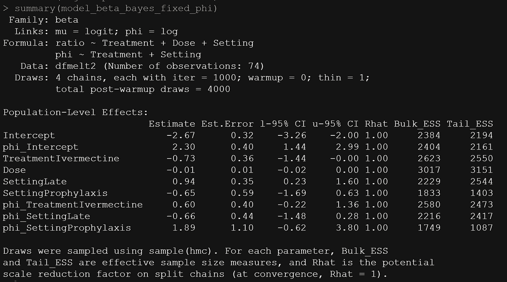

We now have three parameter estimates for precision. Clear to see that none of the precision estimates have an informative posterior to be added to the model. Once again, this is not a full Bayesian analysis. I will get to that in the end.

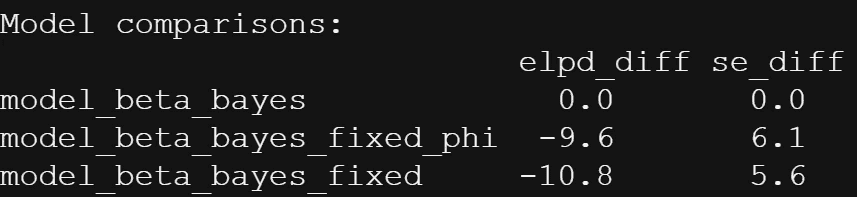

It seems that the prior model is still the best, but I like the model containing the precision estimates better. However, since those posterior estimates are not really informative there is no reason to keep that model.

我已经提到过数据集中可能有太多的零，如果是这样的话，我也需要建模。那么，用这个模型我实际上预测了多少个零呢？嗯，没有！这似乎是不正确的，所以我们需要很快更仔细地研究数据中零的数量，并找到一种建模的方法。

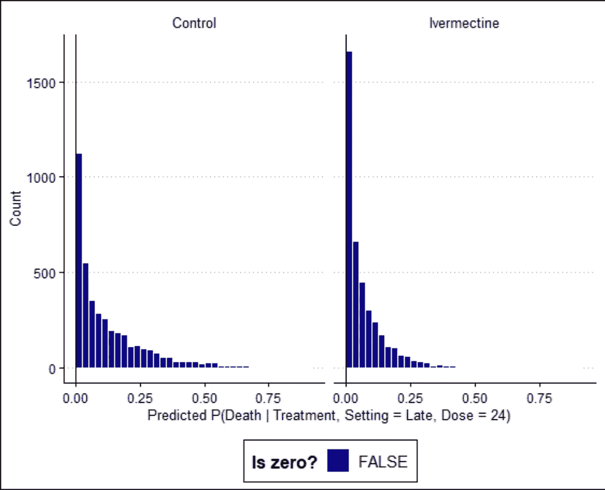

The Beta distribution model does not predict any zero’s.

```
model_beta_bayes_fixed_phi %>% 
  epred_draws(newdata = tidyr::expand_grid(Treatment = "Ivermectine",
                                    Setting = "Late",
                                    Dose = seq(0, 120, by = 1)))%>%
  ggplot(., aes(x = Dose, 
                y = .epred)) +
  stat_lineribbon() + 
  scale_fill_brewer(palette = "Purples") +
  geom_hline(yintercept=0, col="black", lty=2)+
  labs(x = "Dose ivermectine (mg)", 
       y = "P(Deaths%|Dose & Setting = Late)",
       fill = "Credible interval") +
  ggthemes::theme_clean() +
  theme(legend.position = "bottom")emtrends(model_beta_bayes_fixed_phi, ~ Dose, var = "Dose", 
         transform = "response")
emtrends(model_beta_bayes_fixed_phi, ~ Dose, var = "Dose",
         at = list(Dose = c(20, 50, 80)),
         transform = "response")
```

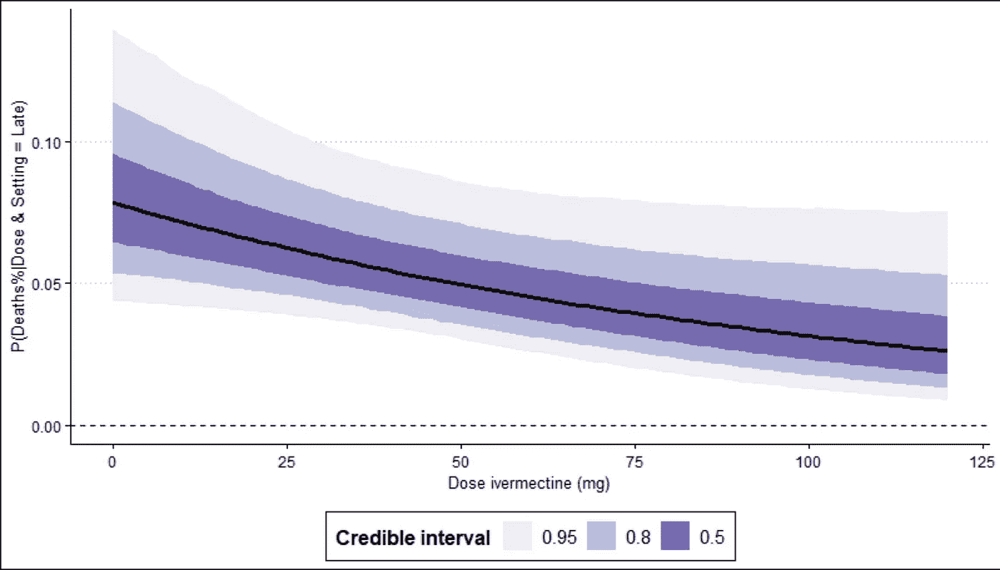

The relationship between dose and proportion of deaths when **Setting** = ‘Late’.

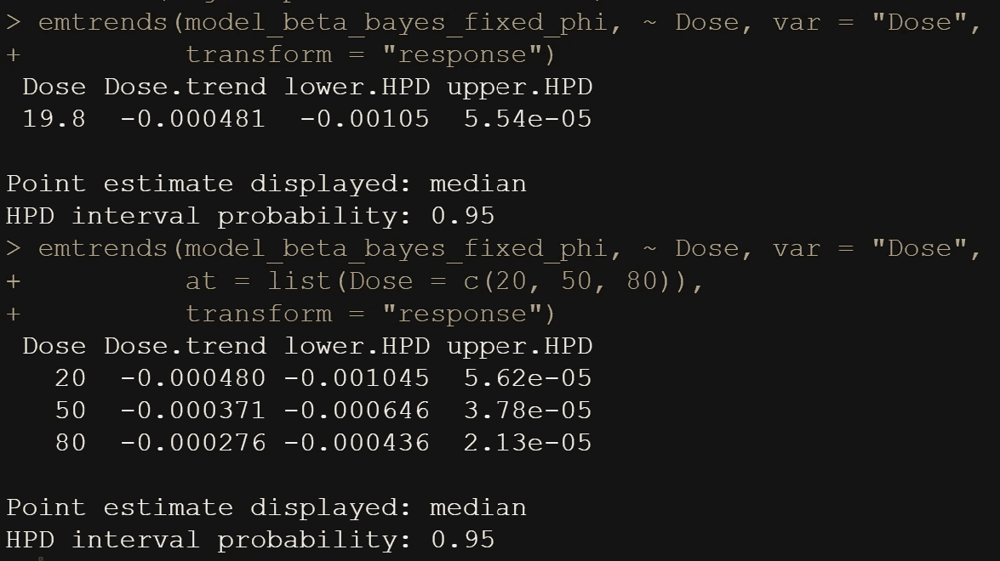

The trend for **Dose** at the mean dose, and at specific dosages. All marginally.

```
model_beta_bayes_fixed_phi %>% 
  emtrends(~ Dose, var = "Dose",
           at = list(Dose = c(14,24,48,96)),
           transform = "response") %>% 
  gather_emmeans_draws()%>%
  ggplot(., aes(x = .value, 
                fill = factor(Dose))) +
  geom_vline(xintercept = 0) +
  stat_halfeye(.width = c(0.8, 0.95), point_interval = "median_hdi",
               slab_alpha = 0.75) +
  scale_fill_viridis_d(option = "viridis", end = 0.6) +
  labs(x = "Average marginal effect of dose (ivermectine)", 
       y = "Density", fill = "Dose",
       caption = "80% and 95% credible intervals shown in black") +
  ggthemes::theme_clean() +
  theme(legend.position = "bottom")model_beta_bayes_fixed_phi %>% 
  emtrends(~ Dose | Setting, var = "Dose",
           at = list(Dose = c(14,24,48,96)),
           transform = "response") %>% 
  gather_emmeans_draws()%>%
  ggplot(., aes(x = .value, 
                fill = factor(Setting))) +
  geom_vline(xintercept = 0) +
  stat_halfeye(.width = c(0.8, 0.95), point_interval = "median_hdi",
               slab_alpha = 0.75) +
  scale_fill_viridis_d(option = "viridis", end = 0.6) +
  facet_wrap(~Dose, scales="free")+
  labs(x = "Average marginal effect of dose (ivermectine)", 
       y = "Density", fill = "Dose",
       caption = "80% and 95% credible intervals shown in black") +
  theme_bw() +
  theme(legend.position = "bottom")
```

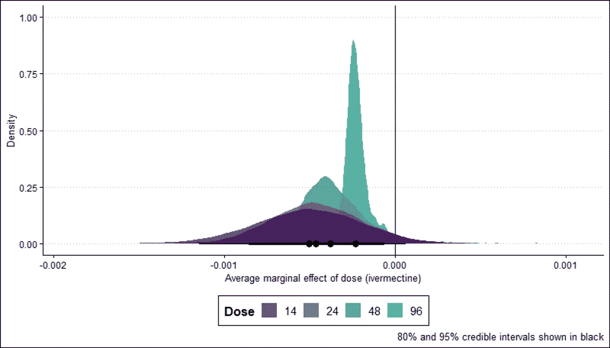

Marginal effect of **Dose**.

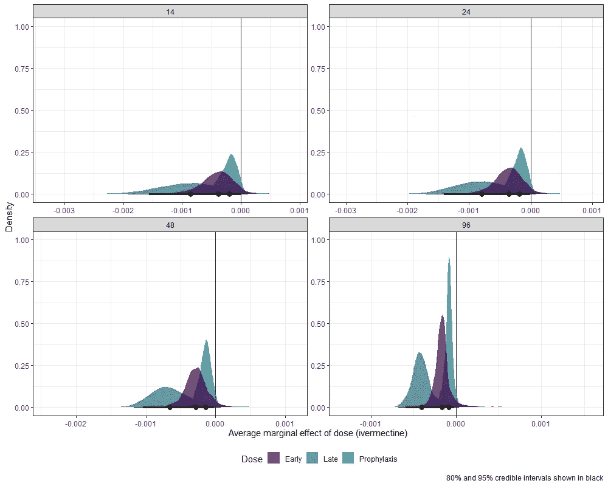

Conditional effect of dosages per setting. There is a clear **Setting*Dose** interaction in this graph, even though I did not model that explicitly. Could also be a sample size issue, in which case I am seeing things that are not there. Will investigate soon.

但首先，让我们来处理我所知道的零通胀数据。

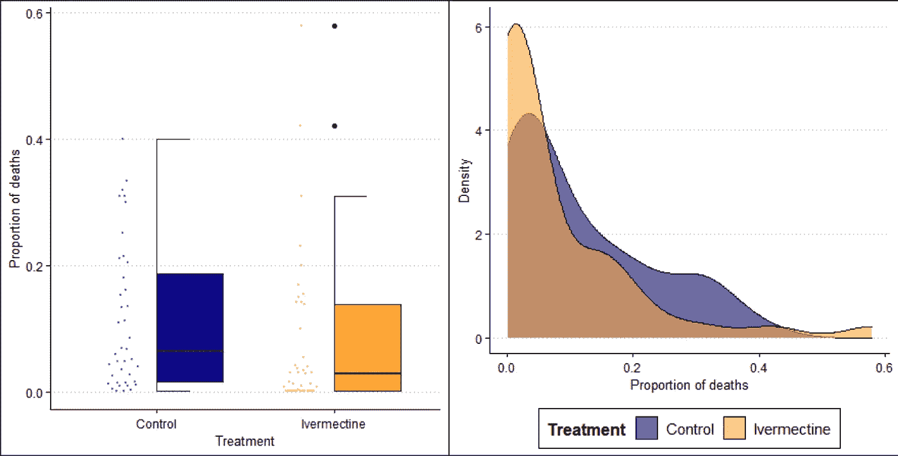

所以，零膨胀的贝塔分布实际上做了一件贝塔分布没有做的事，那就是模拟多余的零部分。因此，我们现在有三个参数:**表示**、**精度**和**零膨胀**。

让我们看看第一个简单的模型是什么样子的。我将均值和精度建模为截距的函数，随机*研究*组件，只寻找零膨胀组件的截距。换句话说，我想看看是否存在零膨胀反应。

```
model_beta_zi_int_only <- brm(
  bf(ratio ~ 1 + (1|Study),
     phi ~ 1 + (1|Study),
     zi ~ 1),
  data = dfmelt2,
  family = zero_inflated_beta(),
  chains = 4, 
  iter = 2000, 
  warmup = 1000,
  cores = 6, 
  seed = 1234,
  backend = "cmdstanr")
summary(model_beta_zi_int_only)
plot(model_beta_zi_int_only)
pp_check(model_beta_zi_int_only, ndraws=200)
LOO(model_beta_bayes_random, 
    model_beta_bayes_random2, 
    model_beta_zi_int_only)
tidy(model_beta_zi_int_only, effects = "fixed")
zi_intercept <- tidy(model_beta_zi_int_only, effects = "fixed") %>% 
  filter(component == "zi", term == "(Intercept)") %>% 
  pull(estimate)
plogis(zi_intercept)
```

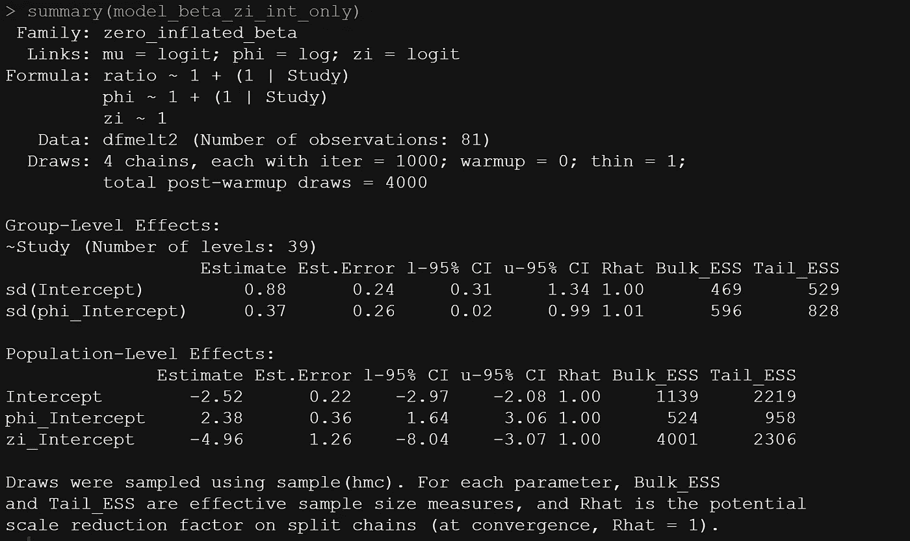

Two variance components, and three population-level effects which combine to estimates for the mean, precision, and zero-inflation component. The **sd(phi_Intercept)** shows a somewhat deviating Rhat which will probably light-up in the chain graphs.

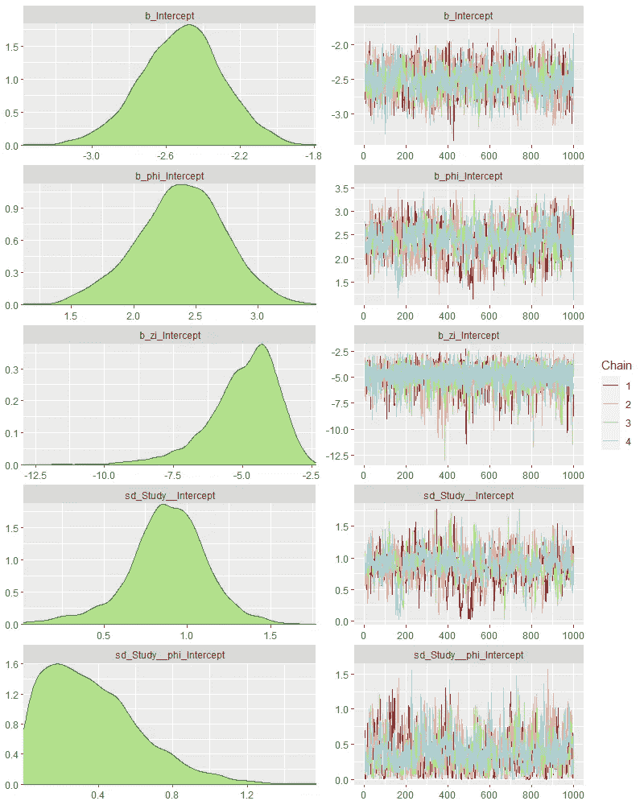

Yes it does.

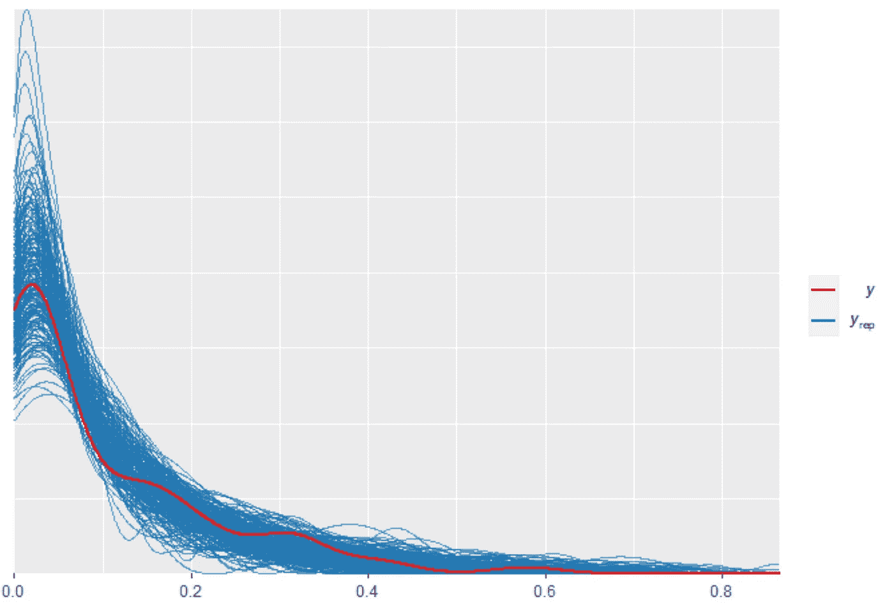

Not too bad.

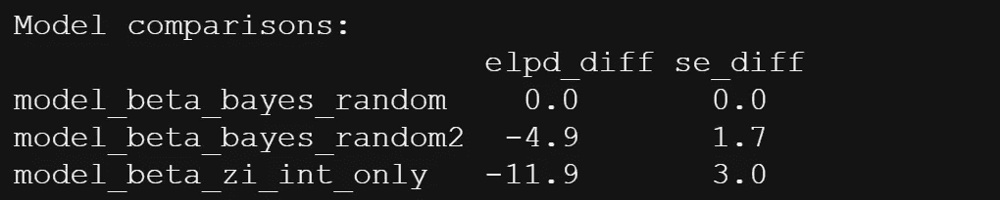

And the zero-inflated model performs much better than other models containing random components.

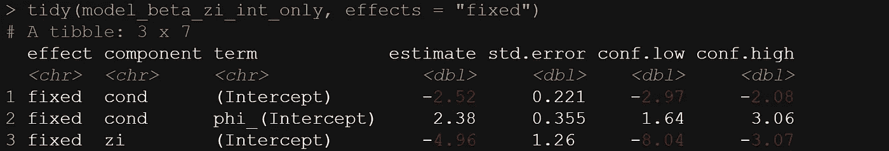

Estimates are meaningful.

```
df_random<-model_beta_zi_int_only %>%
  spread_draws(r_Study[Study,term])
g1<-ggplot(df_random, aes(x=r_Study, 
                      alpha=0.5))+
  geom_density()+
  theme_bw()+theme(legend.position = "none")
prior_summary(model_beta_zi_int_only)
stancode(model_beta_zi_int_only)
g2<-ggplot(df_random, aes(x=r_Study, 
                      fill=Study, 
                      alpha=0.5))+
  geom_density()+
  theme_bw()+theme(legend.position = "none")
grid.arrange(g1,g2,ncol=2)
```

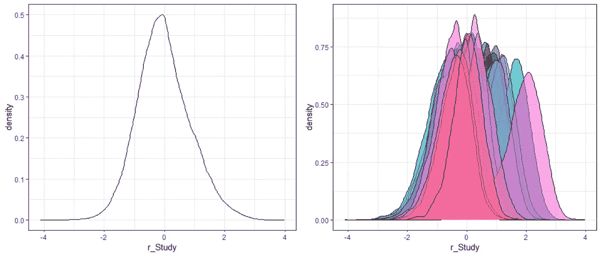

The random component of the model, showing the overall posterior distribution of **Study**, and the **Study-by-Study** estimate that makes up the overall estimate.

```
dfmelt2 %>%
  data_grid(Study) %>%
  add_epred_draws(model_beta_zi_int_only, 
                  dpar = c("mu", "phi", "zi"), allow_new_levels=TRUE) %>%
  sample_draws(100) %>%
  ggplot(aes(x = .epred, fill=Study)) +
  geom_density(alpha=0.5) +
  theme_bw()+
  theme(legend.position="none")
```


让我们更进一步，把感兴趣的变量包括进来。由于数据的稀疏性，我仍然把它们作为主要影响包括在内。这当然是有争议的。

```
model_beta_zi <- brm(
  bf(ratio ~ Treatment+Dose+Setting,
     phi ~ Treatment,
     zi ~ Treatment),
  data = dfmelt2,
  family = zero_inflated_beta(),
  chains = 4, iter = 2000, warmup = 1000,
  cores = 6, seed = 1234,
  backend = "cmdstanr")
summary(model_beta_zi)
pp_check(model_beta_zi, ndraws=200)
LOO(model_beta_zi_int_only, 
    model_beta_zi)
yrep<-posterior_predict(model_beta_zi)
x<-dfmelt2$Dose[!is.na(dfmelt2$cases)]
y<-dfmelt2$ratio[!is.na(x)]%>%na.omit()%>%as.vector()
group<-dfmelt2$Treatment[!is.na(x)]
bayesplot::bayesplot_theme_set(ggplot2::theme_linedraw())
bayesplot::color_scheme_set("viridisE")
bayesplot::ppc_stat_2d(y, yrep, stat = c("mean", "sd"))
bayesplot::bayesplot_theme_set(ggplot2::theme_grey())
bayesplot::color_scheme_set("brewer-Paired")
bayesplot::ppc_stat_2d(y, yrep, stat = c("median", "mad"))theme_set(theme_bw())
ce<-conditional_effects(model_beta_zi)
ce_plot<-plot(ce, rug=TRUE)
grid.arrange(ce_plot$Treatment, 
             ce_plot$Dose, 
             ce_plot$Setting, 
             ncol=3)
```

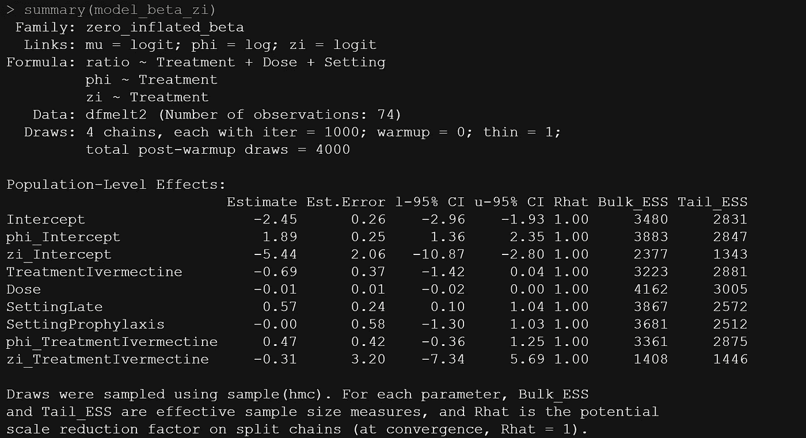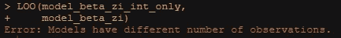

Oops. Cannot compare because of different observations used. Due to missing data, the sample size will decrease as NAs are not allowed.

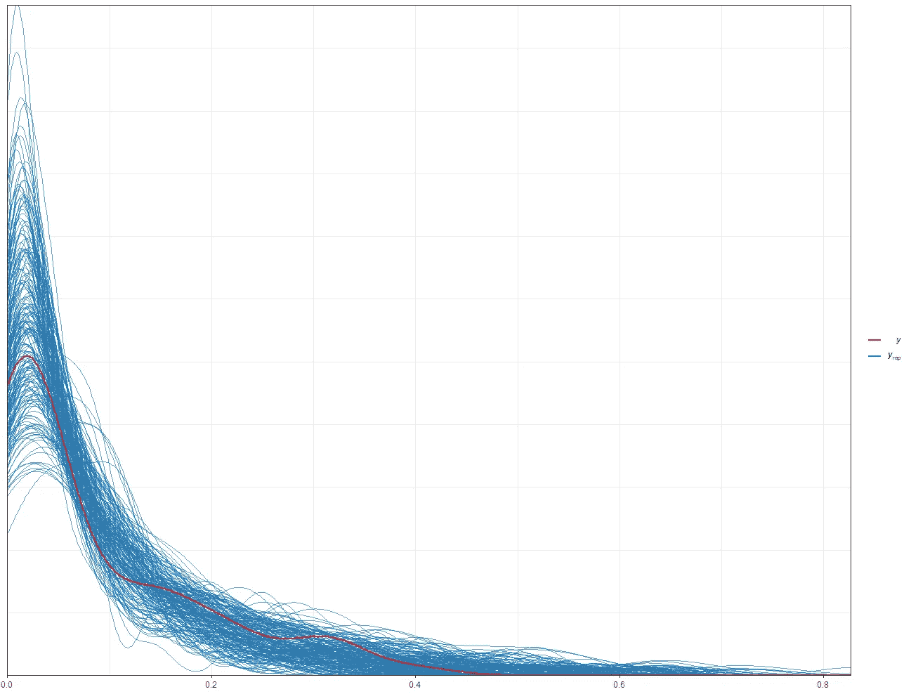

Looking good.

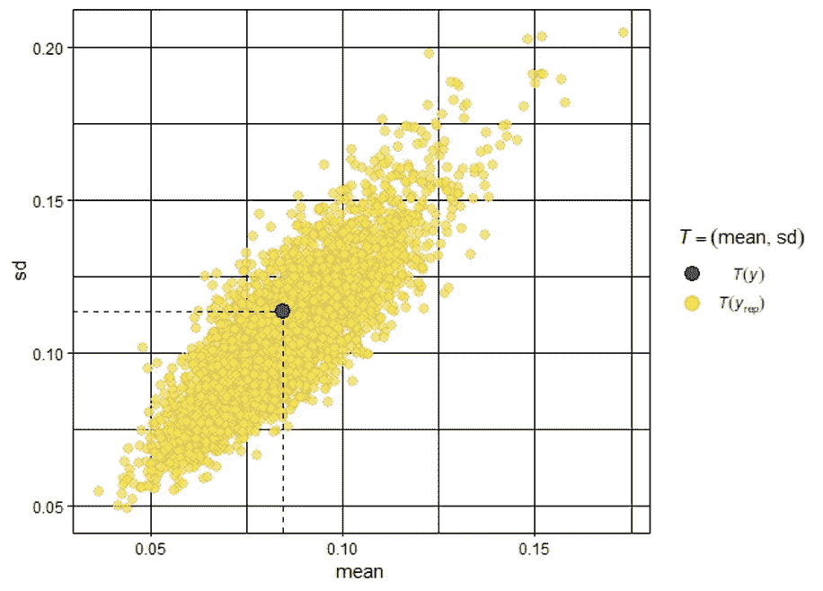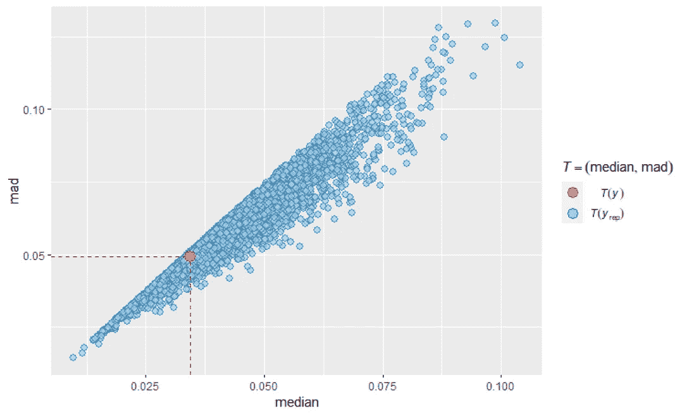

Looking good as well, nothing funky with the sampling.

```
model_beta_zi %>% 
  predicted_draws(newdata = tibble(Treatment = c("Ivermectine", "Control"),
                                   Setting = c("Late", "Late"),
                                   Dose = c(24,24))) %>% 
  mutate(is_zero = .prediction == 0,
         .prediction = ifelse(is_zero, .prediction - 0.01, .prediction))%>%
  ggplot(., aes(x = .prediction)) +
  geom_histogram(aes(fill = is_zero), binwidth = 0.025, 
                 boundary = 0, color = "white") +
  geom_vline(xintercept = 0) +
  scale_fill_viridis_d(option = "plasma", end = 0.5,
                       guide = guide_legend(reverse = TRUE)) +
  labs(x = "Predicted P(Death | Treatment, Setting = Late, Dose = 24)", 
       y = "Count", 
       fill = "Is zero?") +
  facet_wrap(vars(Treatment), ncol = 2,
             labeller = labeller(quota = c(`Treatment` = "Ivermectine", 
                                           `Control` = "Control"))) + 
  ggthemes::theme_clean() +
  theme(legend.position = "bottom")
```

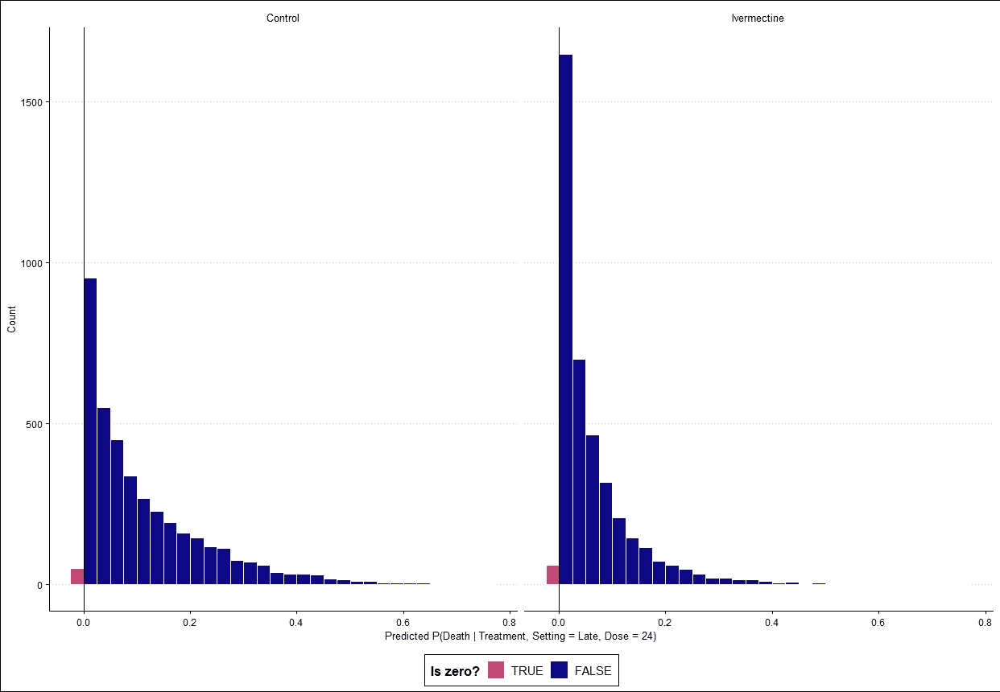

And the model IS predicting zero’s, which is a function of the zero-inflated model itself.

```
get_variables(model_beta_zi)
model_beta_zi %>%
  recover_types(dfmelt2)%>%
  spread_draws(b_Dose)%>%
  ggplot(., aes(x=b_Dose, fill=as.factor(.chain)))+
  geom_density(alpha=0.5)+
  labs(fill="Chain")+
  theme_bw()model_beta_zi%>%
  emmeans(~ Treatment | Setting + Dose,
          at = list(Dose = seq(0, 120, by = 10)),
          epred = TRUE,
          re_formula = NULL) %>% 
  contrast(method = "revpairwise") %>% 
  gather_emmeans_draws()%>%
  ggplot(., aes(x = .value, y=Setting, fill=factor(Dose))) +
  stat_halfeye(.width = c(0.8, 0.95), 
               point_interval = "median_hdi",
               alpha=0.5) +
  labs(x = "Effect of Treatment & Dose on the proportion of deaths by Setting", y = NULL,
       caption = "80% and 95% credible intervals shown in black") +
  ggthemes::theme_clean()
```

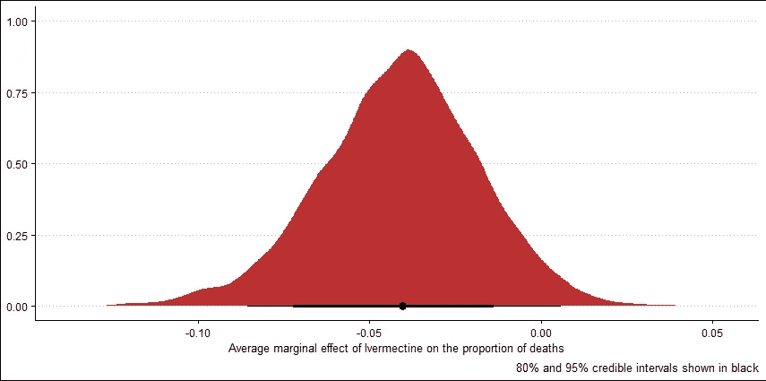

The marginal effect not showing an informative effect of Ivermectin.

```
get_variables(model_beta_zi)
model_beta_zi %>%
  recover_types(dfmelt2)%>%
  spread_draws(b_Dose)%>%
  ggplot(., aes(x=b_Dose, fill=as.factor(.chain)))+
  geom_density(alpha=0.5)+
  labs(fill="Chain")+
  theme_bw()
```

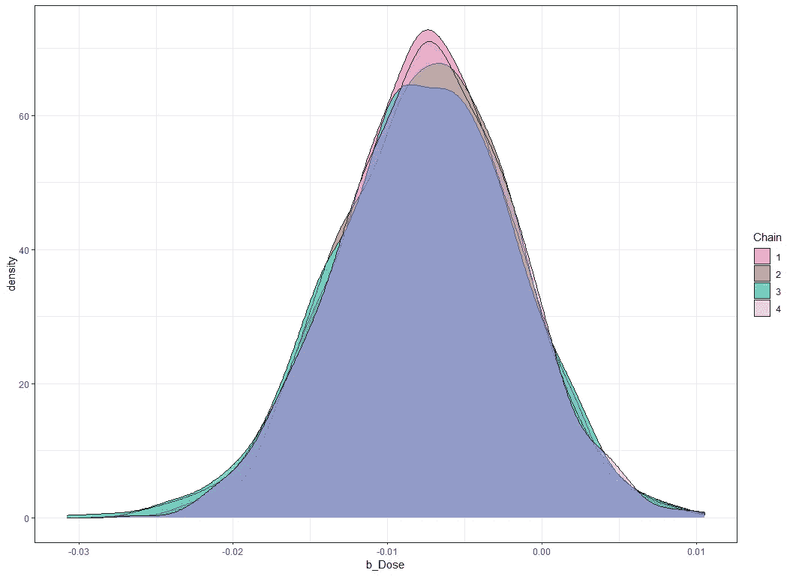

Chains tend to agree.

现在我们有了零膨胀模型，我们可以再次从中提取后验估计。

```
model_beta_zi%>%
  emmeans(~ Treatment | Setting + Dose,
          at = list(Dose = seq(0, 120, by = 10)),
          epred = TRUE,
          re_formula = NULL) %>% 
  contrast(method = "revpairwise") %>% 
  gather_emmeans_draws()%>%
  ggplot(., aes(x = .value, y=Setting, fill=factor(Dose))) +
  stat_halfeye(.width = c(0.8, 0.95), 
               point_interval = "median_hdi",
               alpha=0.5) +
  labs(x = "Effect of Treatment & Dose on the proportion of deaths by Setting", y = NULL,
       caption = "80% and 95% credible intervals shown in black") +
  ggthemes::theme_clean()
```

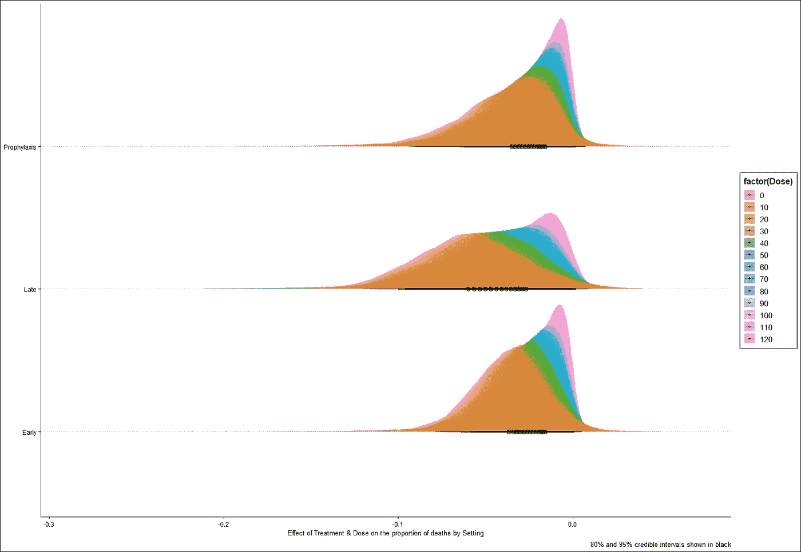

```
model_beta_zi %>% 
  emmeans(~ Treatment + Dose,
          at = list(Dose = seq(0, 120, by = 1)),
          epred = TRUE,
          re_formula = NULL) %>% 
  gather_emmeans_draws()%>%
  ggplot(.,
       aes(x = Dose, 
           y = .value, 
           color = Treatment, 
           fill = Treatment)) +
  stat_lineribbon(aes(fill_ramp = stat(level))) +
  scale_fill_viridis_d(option = "plasma", end = 0.8) +
  scale_color_viridis_d(option = "plasma", end = 0.8) +
  scale_fill_ramp_discrete(range = c(0.2, 0.7)) +
  geom_point(data=dfmelt2, aes(x=Dose, y=ratio), col="black")+
  facet_wrap(vars(Treatment), ncol = 2,
             labeller = labeller(Treatment = c(`Ivermectine` = "Ivermectine",
                                           `Control` = "Control"))) +
  labs(x = "Dose (ivermectine)",
       y = "Predicted proportion of deaths",
       fill = "Treatment", color = "Treatment",
       fill_ramp = "Credible interval") +
  ggthemes::theme_clean() +
  theme(legend.position = "bottom")
```

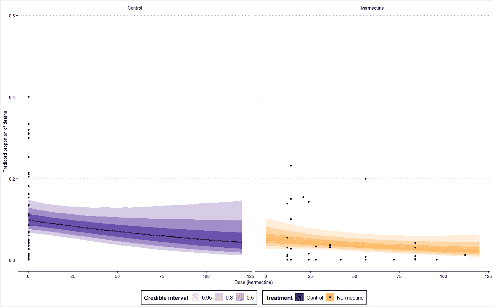

让我们运行其他模型，将它们与之前的模型进行比较。我确实在一些模型中包含了交互作用。

```
model_beta_zi_2 <- brm(
  bf(ratio ~ Treatment*Dose+Setting,
     phi ~ Treatment,
     zi ~ Treatment),
  data = dfmelt2,
  family = zero_inflated_beta(),
  chains = 4, iter = 2000, warmup = 1000,
  cores = 6, seed = 1234,
  backend = "cmdstanr")
summary(model_beta_zi_2)
LOO(model_beta_zi, model_beta_zi_2)model_beta_zi_3 <- brm(
  bf(ratio ~ Treatment + Dose+Setting,
     phi ~ Treatment,
     zi ~ Treatment),
  data = dfmelt2,
  family = zero_inflated_beta(),
  chains = 4, iter = 2000, warmup = 1000,
  cores = 6, seed = 1234,
  backend = "cmdstanr")
summary(model_beta_zi_3)
LOO(model_beta_zi,
    model_beta_zi_2, 
    model_beta_zi_3)
```

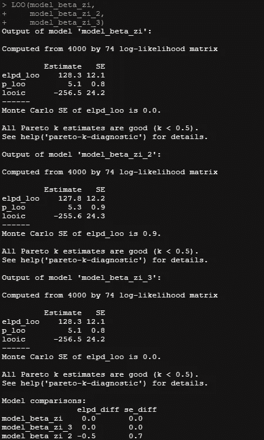

No real difference between the models. Interaction between **Dose** and **Treatment** does not add much, and any interaction with **Setting** will be messy with Prophylaxis. I could take that one out as well, but I will stick with it when I move to a full Bayesian analysis.

```
ndraws = 50
dfmelt2%>%
  group_by(Treatment, Setting) %>%
  data_grid(Dose= seq_range(Dose, n = 101)) %>%
  add_epred_draws(model_beta_zi_3, ndraws = ndraws) %>%
  ggplot(aes(x = Dose, y = ratio, color = factor(Treatment))) +
  geom_line(aes(y = .epred, group = paste(Treatment, .draw)), alpha=0.3) +
  geom_point(data = dfmelt2, aes(x=Dose, y=ratio, color=Treatment)) +
  scale_color_brewer(palette = "Dark2")+
  facet_wrap(~Setting)+
  theme_bw()+
  theme(legend.position = "none")dfmelt2%>%
  group_by(Treatment, Setting) %>%
  data_grid(Dose= seq_range(Dose, n = 101)) %>%
  add_predicted_draws(model_beta_zi_3) %>%
  ggplot(aes(x = Dose, y = ratio, 
             color = factor(Treatment), 
             fill =factor(Treatment))) +
  stat_lineribbon(aes(y = .prediction), .width = c(.95, .80, .50), alpha = 1/4) +
  geom_point(data = dfmelt2) +
  scale_fill_brewer(palette = "Set2") +
  scale_color_brewer(palette = "Dark2")+
  facet_wrap(~Setting)+
  labs(fill = "Treatment", color="")+
  guides(color = FALSE)+
  theme_bw()
```

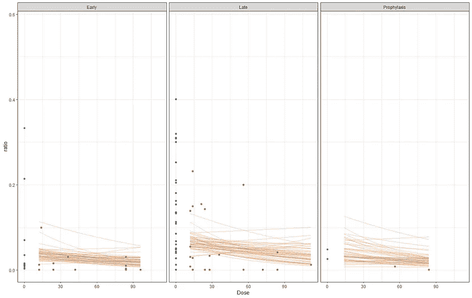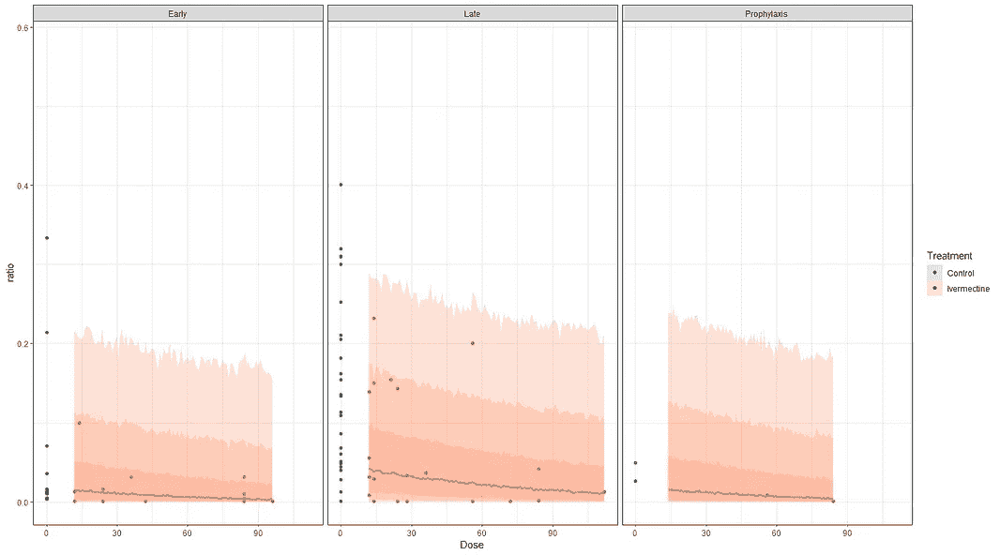

```
dfmelt2%>%
  group_by(Treatment, Setting) %>%
  data_grid(Dose= seq_range(Dose, n = 101)) %>%
  add_predicted_draws(model_beta_zi_3) %>%
  ggplot(aes(x = Dose, y = ratio)) +
  stat_lineribbon(aes(y = .prediction), 
                  .width = c(.99, .95, .8, .5), color = brewer.pal(5, "Blues")[[5]]) +
  geom_point(data = dfmelt2) +
  scale_fill_brewer() +
  facet_grid(Treatment ~ Setting, space = "free_x", scales = "free_x")+
  theme_bw()
```

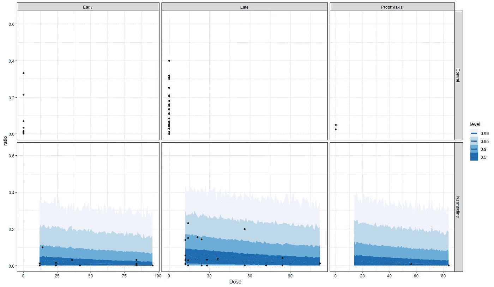

所以，上面的图显示了来自模型的后验绘制。这一切看起来非常好，整洁，令人印象深刻，但它不是一个完整的贝叶斯分析。没有一个信息丰富的先验，这是不可能的，所以我们现在就做！

下面是我想展示的最终模型。这是一个**零膨胀贝塔回归模型**，我从其中建模出**均值**、**精度**和**零膨胀**。前科都是一样的——一个信息丰富的没有什么区别的前科。伊维菌素已经与许多人进行了很多讨论，认为它对新冠肺炎没有任何帮助。它是动物体内的除虫剂，所以你为什么要用它呢？因此，我会加上先验，加上几乎可以肯定它对死亡比例没有任何影响的数学等价。

```
model_formula<-bf(
    ratio ~ Treatment + Dose + Setting + (1|Study),
    phi ~ Treatment + Setting,
    zi ~ Treatment + Setting)
get_prior(
  model_formula,
  data = dfmelt2,
  family = zero_inflated_beta())
priors<-c(prior(normal(0, 2),  class = b, coef=Dose),
          prior(normal(0, 2),  class = b, coef=SettingLate),
          prior(normal(0, 2),  class = b, coef=SettingProphylaxis),
          prior(normal(0, 2),  class = b, coef=TreatmentIvermectine),
          prior(normal(0, 2),  class = Intercept),
          prior(normal(0, 2),  class = sd, group=Study),
          prior(normal(0, 2),  class = Intercept, dpar=phi),
          prior(normal(0, 2),  class = b, coef=SettingLate, dpar=phi),
          prior(normal(0, 2),  class = b, coef=SettingProphylaxis, dpar=phi),
          prior(normal(0, 2),  class = b, coef=TreatmentIvermectine, dpar=phi),
          prior(normal(0, 2),  class = Intercept, dpar=zi),
          prior(normal(0, 2),  class = b, coef=SettingLate, dpar=zi),
          prior(normal(0, 2),  class = b, coef=SettingProphylaxis, dpar=zi),
          prior(normal(0, 2),  class = b, coef=TreatmentIvermectine, dpar=zi))
bayes_beta_final<-
  brm(model_formula, 
      data=dfmelt2,
      family=zero_inflated_beta(),
      prior=priors,
      control = list(adapt_delta = 0.91,
                     max_treedepth = 11),
      chains = 4, iter = 4000, warmup = 1000,
      cores = 6, seed = 1234, 
      threads = threading(12),
      backend = "cmdstanr")
summary(bayes_beta_final)
plot(bayes_beta_final)
```

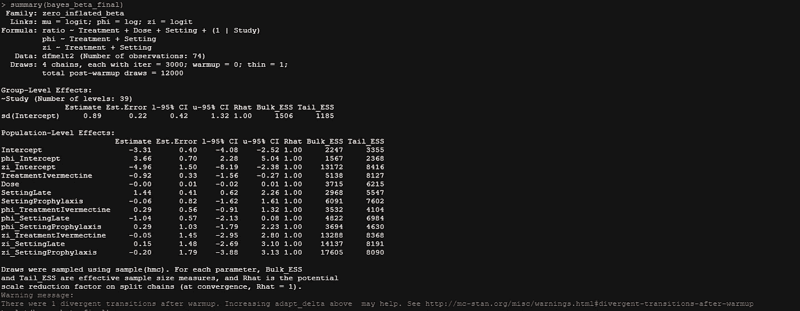

Models looks good in terms of sampling.

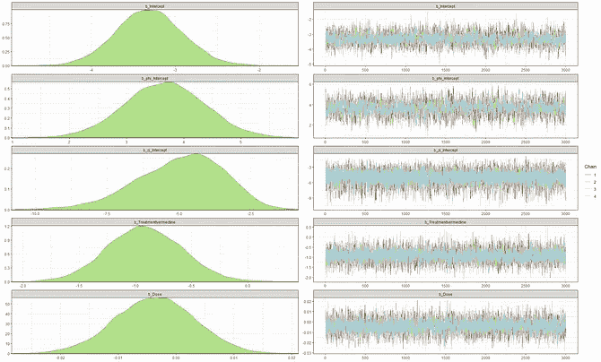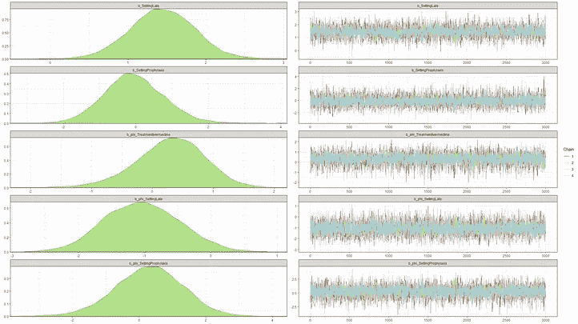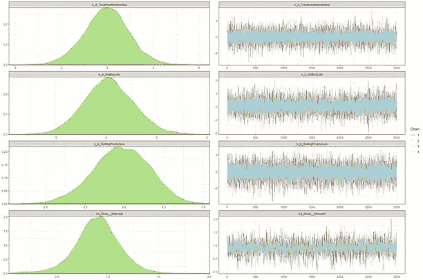

Chains also show the model looks good.

```
pp_check(bayes_beta_final, ndraws=100)
LOO(model_beta_zi,
    model_beta_zi_2, 
    model_beta_zi_3, 
    bayes_beta_final) # final model definitly not the best 
yrep<-posterior_predict(bayes_beta_final)
x<-dfmelt2$Dose[!is.na(dfmelt2$cases)]
y<-dfmelt2$ratio[!is.na(x)]%>%na.omit()%>%as.vector()
group<-dfmelt2$Treatment[!is.na(x)]
bayesplot::bayesplot_theme_set(ggplot2::theme_linedraw())
bayesplot::color_scheme_set("viridisE")
bayesplot::ppc_stat_2d(y, yrep, stat = c("mean", "sd"))+theme_bw()
bayesplot::bayesplot_theme_set(ggplot2::theme_grey())
bayesplot::color_scheme_set("brewer-Paired")
bayesplot::ppc_stat_2d(y, yrep, stat = c("median", "mad"))+theme_bw()
```

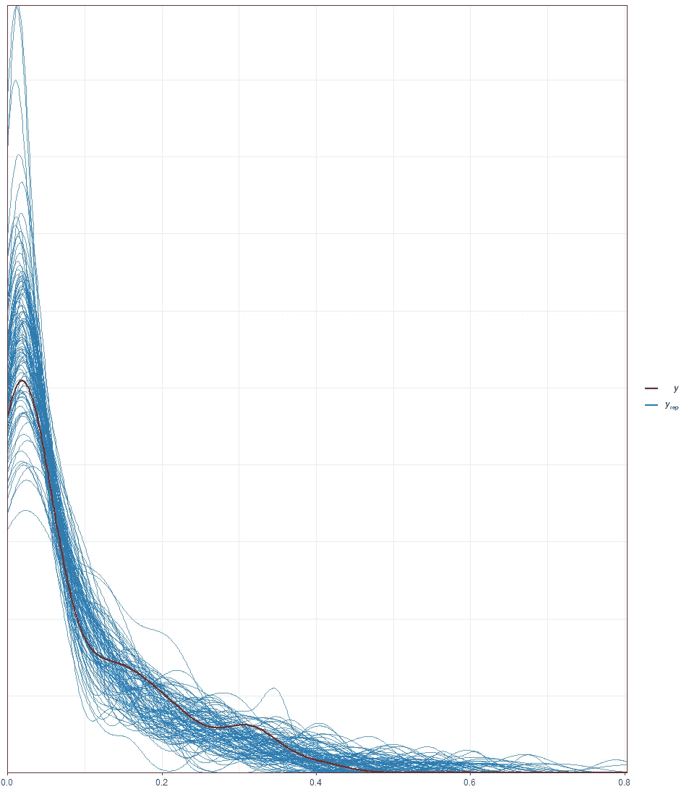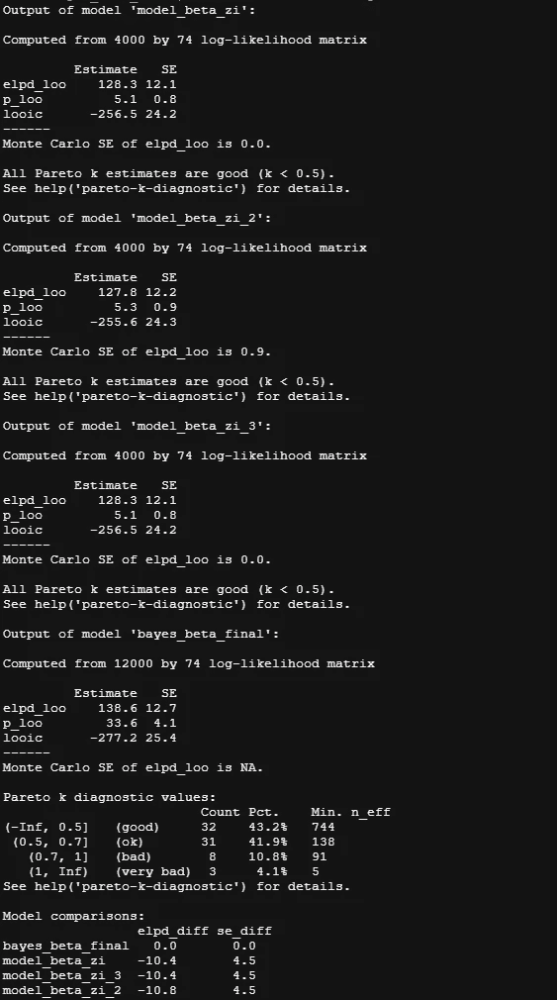

Left: looking good. Right: the model with the informative prior is deemed to be the worst, with the other three being equally better. Still, I will keep this model. It HAS informative priors and the rest are just likelihood models.

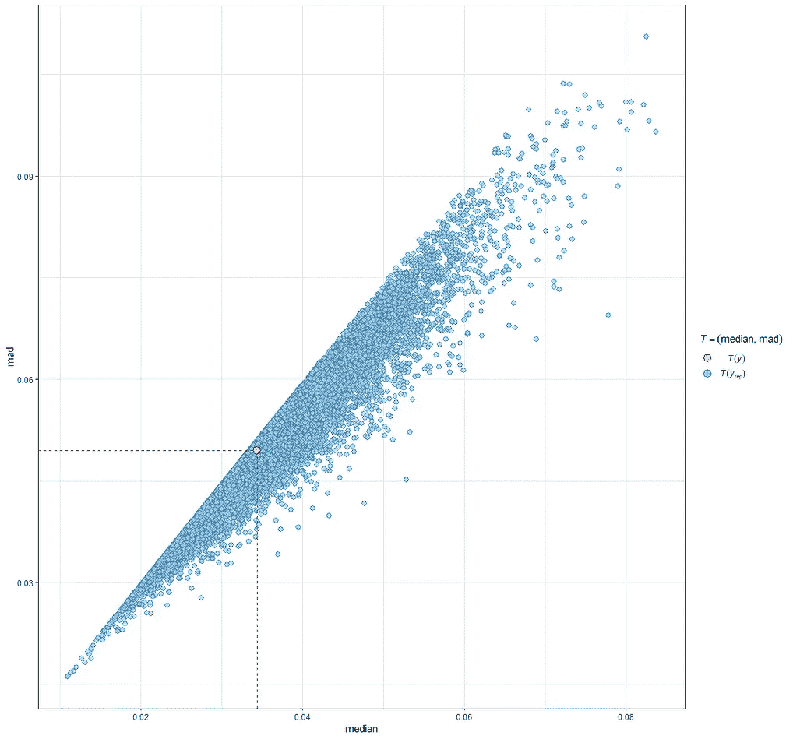

Sampling looking good.

接下来是有趣的部分——后面的抽奖。

```
bayes_beta_final%>% 
  predicted_draws(newdata = tibble(Treatment = c("Ivermectine", "Control"),
                                   Setting = c("Late", "Late"),
                                   Dose = c(24,24), 
                                   Study = c('Ravikirti', 'Ravikirti'))) %>% 
  mutate(is_zero = .prediction == 0,
         .prediction = ifelse(is_zero, .prediction - 0.01, .prediction))%>%
  ggplot(., aes(x = .prediction)) +
  geom_histogram(aes(fill = is_zero), binwidth = 0.025, 
                 boundary = 0, color = "white") +
  geom_vline(xintercept = 0) +
  scale_fill_viridis_d(option = "plasma", end = 0.5,
                       guide = guide_legend(reverse = TRUE)) +
  labs(x = "Predicted P(Death | Treatment, Setting = Late, Dose = 24, Study = Ravikirti)", 
       y = "Count", 
       fill = "Is zero?") +
  facet_wrap(vars(Treatment), ncol = 2,
             labeller = labeller(quota = c(`Treatment` = "Ivermectine", 
                                           `Control` = "Control"))) + 
  ggthemes::theme_clean() +
  theme(legend.position = "bottom")
```

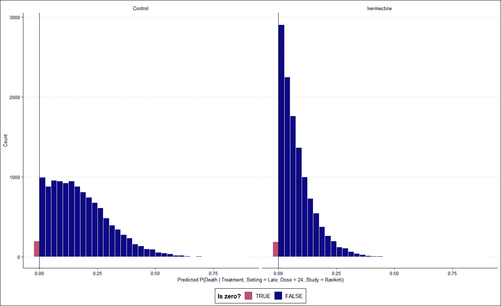

The difference in terms of treatments is large, in which we model equal zero’s in both groups but a much more skewed distribution in the Ivermectine group.

```
bayes_beta_final %>% 
  emmeans(~ Treatment + Dose ,
          at = list(Dose = seq(0, 120, by = 20)),
          epred = TRUE,
          re_formula = NULL) %>% 
  gather_emmeans_draws()%>%
  ggplot(.,
         aes(x = Dose, 
             y = .value, 
             color = Treatment, 
             fill = Treatment)) +
  stat_lineribbon(aes(fill_ramp = stat(level))) +
  scale_fill_viridis_d(option = "plasma", end = 0.8) +
  scale_color_viridis_d(option = "plasma", end = 0.8) +
  scale_fill_ramp_discrete(range = c(0.2, 0.7)) +
  facet_wrap(vars(Treatment), ncol = 2,
             labeller = labeller(Treatment = c(`Ivermectine` = "Ivermectine",
                                               `Control` = "Control"))) +
  labs(x = "Dose (ivermectine)",
       y = "Predicted proportion of deaths",
       fill = "Treatment", color = "Treatment",
       fill_ramp = "Credible interval") +
  ggthemes::theme_clean() +
  theme(legend.position = "bottom")
```

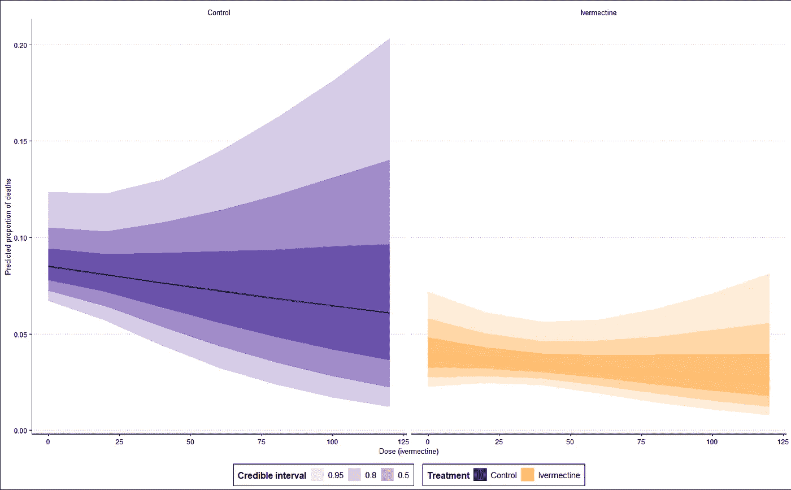

Don’t be alarmed by the curve in the placebo group (which has no dose). The prediction actually comes from the function of the other variables included. So it is an artefact.

```
bayes_beta_final %>% 
  emmeans(~ Setting + Dose,
          at = list(Dose = seq(0, 120, by = 20)),
          epred = TRUE,
          re_formula = NULL) %>% 
  gather_emmeans_draws()%>%
  ggplot(.,
         aes(x = Dose, 
             y = .value, 
             color = Setting, 
             fill = Setting)) +
  stat_lineribbon(aes(fill_ramp = stat(level))) +
  scale_fill_viridis_d(option = "plasma", end = 0.8) +
  scale_color_viridis_d(option = "plasma", end = 0.8) +
  scale_fill_ramp_discrete(range = c(0.2, 0.7)) +
  facet_wrap(vars(Setting), ncol = 2,
             labeller = labeller(Setting = c(`Early` = "Early",
                                               `Late` = "Late",
                                             `Prophylaxis` = "Prophylaxis"
                                             ))) +
  labs(x = "Dose (ivermectine)",
       y = "Predicted proportion of deaths",
       fill = "Setting", color = "Setting",
       fill_ramp = "Credible interval") +
  ggthemes::theme_clean() +
  theme(legend.position = "bottom")
```

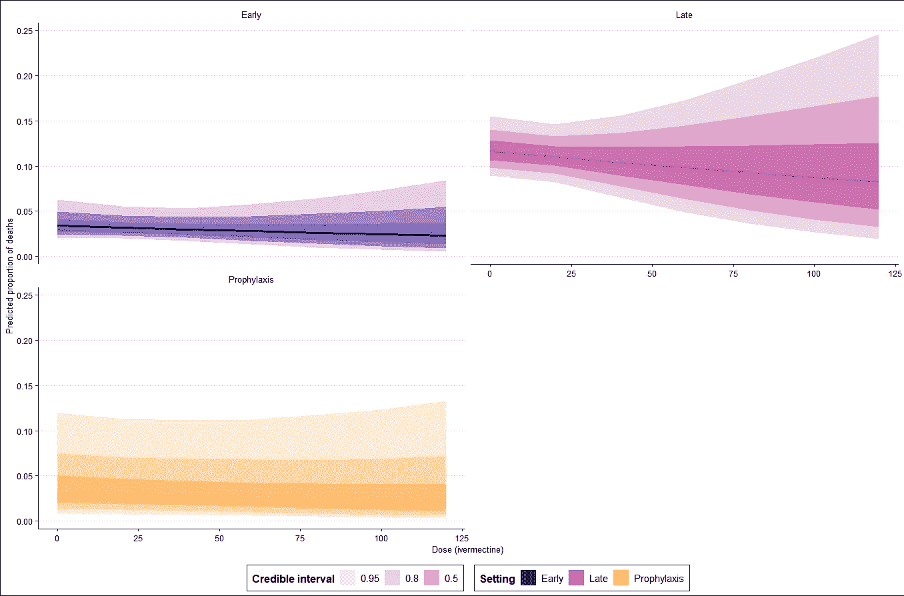

By setting. Quite some uncertainty, and we know that several settings, like early and prophylaxis, do not seem to lend themselves for any formal analysis.

```
bayes_beta_final %>% 
  emmeans(~ Treatment + Setting + Dose,
          at = list(Dose = seq(0, 120, by = 20)),
          epred = TRUE,
          re_formula = NULL) %>% 
  gather_emmeans_draws()%>%
  ggplot(.,
         aes(x = Dose, 
             y = .value, 
             color = Treatment, 
             fill = Treatment)) +
  stat_lineribbon(aes(fill_ramp = stat(level))) +
  scale_fill_viridis_d(option = "plasma", end = 0.8, alpha=0.5) +
  scale_color_viridis_d(option = "plasma", end = 0.8, alpha=0.5) +
  scale_fill_ramp_discrete(range = c(0.2, 0.7)) +
  geom_point(data=dfmelt2, aes(x=Dose, y=ratio, col=Treatment))+
  facet_wrap(vars(Setting), 
             ncol = 3,
             labeller = labeller(Setting = c(`Early` = "Early",
                                             `Late` = "Late",
                                             `Prophylaxis` = "Prophylaxis")))  +
  labs(x = "Dose (ivermectine)",
       y = "Predicted proportion of deaths",
       fill = "Treatment", 
       color = "Treatment",
       fill_ramp = "Credible interval") +
  ggthemes::theme_clean() +
  theme(legend.position = "bottom")
```

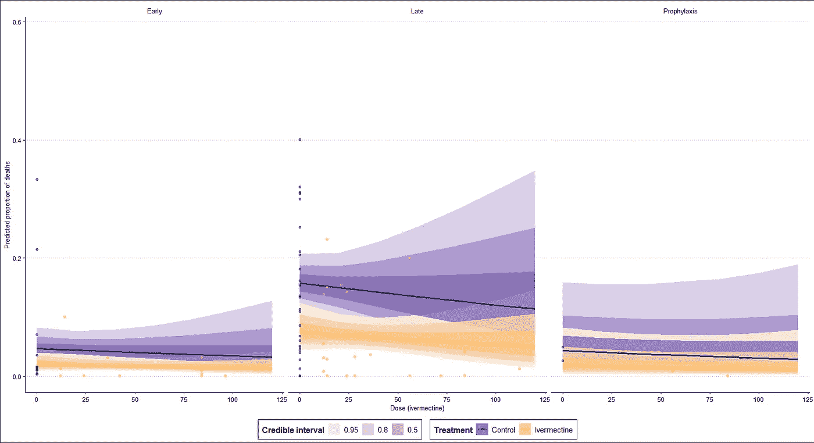

By **Treatment** and **Setting**. Shows again that the posterior by **Dose** makes no sense, it is an artefact of the rest of the model.

最终模型显示了作为*设置*和*剂量*函数的处理之间的对比。*剂量*确实是一个实验，所以应该小心使用，但它确实清楚地显示:

1.  伊维菌素组的死亡比例低于对照组。
2.  效果因*设置*而异。
3.  预防法没有足够的数据告诉我们任何事情。
4.  “无效”的先验不能带走数据中的东西，它可能仍然有其局限性。

因此，这些发现不是最终的，分析将受益于未来的贝叶斯更新。但目前看来，数据似乎在告诉我们，伊维菌素对死亡比例的影响不太可能为零。目前还无法预测谁将从中受益。

```
bayes_beta_final%>%
  emmeans(~ Treatment | Setting + Dose,
          at = list(Dose = seq(0, 120, by = 10)),
          epred = TRUE,
          re_formula = NULL) %>% 
  contrast(method = "revpairwise") %>% 
  gather_emmeans_draws()%>%
  ggplot(., aes(x = .value, y=contrast, fill=factor(Dose))) +
  stat_halfeye(.width = c(0.8, 0.95), 
               point_interval = "median_hdi",
               alpha=0.5) +
  labs(x = "P(death | Treatment, Setting & Dose) - Informative prior assuming no effects overal", y = NULL,
       caption = "80% and 95% credible intervals shown in black") +
  facet_wrap(~Setting, scales="free")+
  labs(fill="Dose")+
  ggthemes::theme_clean()
```

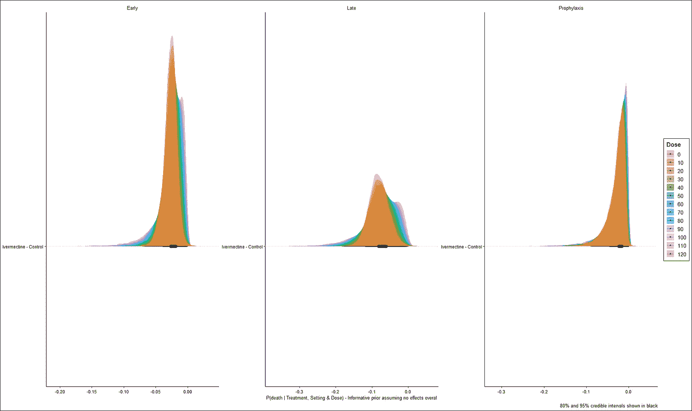

让我知道是否有什么遗漏，错误或者只是简单的错误！

[](/mlearning-ai/mlearning-ai-submission-suggestions-b51e2b130bfb) [## Mlearning.ai 提交建议

### 如何成为 Mlearning.ai 上的作家

medium.com](/mlearning-ai/mlearning-ai-submission-suggestions-b51e2b130bfb)