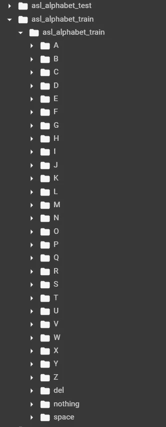
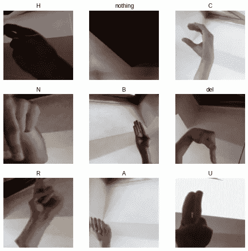
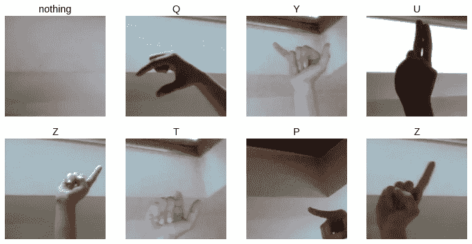
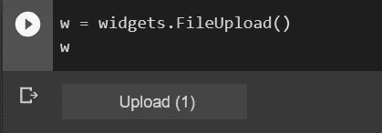

# 穿越 Fastai:使用 Kaggle 数据构建图像分类器

> 原文：<https://medium.com/mlearning-ai/journeying-through-fastai-building-an-image-classifier-using-kaggle-data-9bc5762fe676?source=collection_archive---------0----------------------->

选择的悖论。

作为深度学习领域的热情初学者，我被分散在互联网上的大量资源淹没了，每个资源都声称是“最好的”。

*   PyTorch vs TensorFlow？
*   数学 vs 编码？
*   Coursera vs Udemy？

如果你像我一样是个新手，我想在你旅程的某个阶段，你一定也经历过类似的经历——不知道从哪里开始，没有任何进展。感受到这种烦恼后，我最终决定选择我找到的一门课程，并坚持下去直到完成。

这门课叫做 Fastai，由出色的杰瑞米·霍华德教授。

# Fastai 是什么？

Fastai 是一个构建在 PyTorch 之上的库，它提供了高级和低级功能，简化了最先进的神经网络的构建和训练。Fastai 旨在让越来越多的人能够接触到深度学习，并鼓励他们以聪明、创造性的方式利用这项技术。

在本文中，我们将了解使用这个库并为个人项目构建深度学习模型是多么容易。

[](https://course.fast.ai/) [## 面向编码人员的实用深度学习

### 如果你现在就准备好投入进去，下面是开始的方法。如果你想更多地了解本课程，请阅读…

course.fast.ai](https://course.fast.ai/) 

# 项目范围和动机

我们的项目的目的是建立一个图像分类器，使用预先训练的卷积神经网络。该网络应该通过提取每一类图像中最重要的特征来区分不同类的图像。

为了更容易理解，我们将把这个过程分解成容易理解的部分。

请注意，这篇博客的目的不是教卷积神经网络如何工作，或者数据增强如何帮助改进我们的模型，有许多帖子已经在这方面做了很好的工作。相反，这里的目标是向您展示 fastai 的实际应用，以及实现这些应用的容易程度，并激发您(读者)尽情发挥您的想法。

让我们开始我们的项目吧。


# 数据收集

数据收集和清理是深度学习管道中最基本的，但却经常被忽视的一部分。有多种方法来管理你的自定义数据集，fastai 甚至提供了[下载图像](https://course.fast.ai/images)的方法。

为了这个项目，我使用 Kaggle 找到了一个相关且有趣的数据集:美国手语字母表图像数据集。

[](https://www.kaggle.com/grassknoted/asl-alphabet) [## 美国手语字母

### 美国手语字母的图像数据集

www.kaggle.com](https://www.kaggle.com/grassknoted/asl-alphabet) 

如数据集描述中所述:

> 训练数据集包含 87，000 幅 200x200 像素的图像。共有 29 个类，其中 26 个类用于字母 A-Z，3 个类用于空格、删除和无。
> 
> 测试数据集仅包含 28 幅图像，以鼓励使用真实世界的测试图像。

我以 zip 文件的形式下载了数据，然后上传到 Google Drive，以便在我的模型应用程序中使用。

# 平台

深度学习项目需要 GPU 来处理大量数据。对于初级项目，我强烈推荐使用 [Google Colab](https://research.google.com/colaboratory/) 来达到这个目的。

Fastai 提供了一个在 Colab [这里](https://course.fast.ai/start_colab)建立他们的库的教程。只要确保连接后把你的硬件加速器换成 GPU 就行了。这可以通过点击运行时→更改运行时类型→硬件加速器→ GPU 来完成。

如果你对 Colab 不熟悉，可以通过他们的[官方教程](https://colab.research.google.com/notebooks/basic_features_overview.ipynb)了解一下它的特性。

# 密码

现在我们进入了项目的核心。

## 准备数据

首先，我们需要将 Google Drive 链接到我们的 Colab 笔记本，以使用我们下载的数据集。

当您运行这段代码时，Google 会要求您验证您的登录，以便将 Google Drive 安装到 Colab 上。

一旦我们安装了驱动器，我们就可以安装和导入所需的库，并解压缩之前上传的数据集。

由于数据集相当大，我选择在 Colab 磁盘上解压缩图像，而不是在我的 Google Drive 存储上。尽管以这种方式解压缩要快得多，但这意味着每次我想运行我的模型时，我都必须重复这个过程。

在另一方面，您可以通过附加如下命令，选择将图像解压缩到驱动器上您选择的目录中:

```
!unzip <your zip file directory> -d <target directory>
```

如果您遵循与我相同的步骤，您应该注意到添加到您的磁盘/自定义目录中的 test 和 train 映像文件夹:



train-test image directories

这个目录的结构至关重要。请注意 train 文件夹(和 test 文件夹)如何包含子文件夹，每个子文件夹都根据类标签进行了适当的命名，并包含相关的图像。强烈建议遵循这样的目录结构，这样可以更容易地处理我们的数据。

## 数据块和数据加载器

一个`DataBlock`本质上是一个装配你的数据的管道——描述所有需要应用于数据的过程，以使它准备好“加载”。它用于指定我们希望我们的数据如何被结构化。

另一方面，`DataLoader`是在训练机器学习模型的背景下实际加载和处理数据的东西。这包括分配批处理大小、应用在`DataBlock`中定义的所有进程、分配内存等等。

数据块中使用了多个参数:

> 这是你定义你的模型将使用的不同类型的数据的地方。通常，在元组中传递输入和输出数据类型。因为我们的输入是图像，输出是类，所以我们的“块”分别是 ImageBlock 和 CategoryBlocks。
> 
> `get_items`:该功能用于在需要时从指定路径实际拾取图像。
> 
> `splitter`:定义数据需要如何拆分为训练和验证。RandomSplitter 只是一种特定类型的拆分器方法。您可以定义保留多少数据用于验证目的(在我的例子中是 20%)。可以为可复制性指定种子值。
> 
> `get_y`:定义如何从数据中提取目标标签。因为我们所有的图像都在它们各自的类文件夹中，所以我们使用 parent_label 方法来指定每个图像的目标变量就是它各自的父文件夹名。这也是为什么将数据存储在前面定义的结构化文件中如此重要。
> 
> `item_tfms` : item transforms 是一个可选参数，用于指定当我们传递数据时，需要对每个图像执行的任何附加处理。关于具体转换的细节可以在官方文档[中阅读，这里是](https://fastai1.fast.ai/vision.transform.html)。
> 
> `batch_tfms`:使用 fast.ai 的 aug_transforms 方法对每批数据应用各种图像变换。这就是所谓的数据扩充，用于生成更多种类的训练数据，并帮助我们的模型变得更具普遍性。

在定义了结构化、分类和处理数据的规范之后，我们通过将它传递到我们的训练图像的路径和 32 个批处理大小，将它输入到我们的`DataLoader`。

## 数据可视化

一旦我们加载了数据，我们就可以开始想象它是什么样子了。

首先，我们查看我们的类的分布——特别是在我们的验证集中。


请注意，图像在验证数据集中的分布相当均衡。这是我们模型训练管道中的一个关键点，因为不平衡的数据集可能会导致模型训练和验证中的重大问题。

> 提示:path 是 Python 的`*pathlib*`类的一个对象，它提供了处理文件系统路径的方便方法。

此外，我们还可以通过在 dataloader 对象上调用 fast.ai 的便捷的`show_batch`方法来查看训练图像的样本。

```
dls.show_batch(max_n=9)
```



我们可以看到上面定义的数据扩充步骤(在 batch_tfms 参数中)是如何转换数据的。

## 模特培训

现在，我们将建立和训练我们的神经网络来分类这些图像。在 fast.ai 的领域中，被训练的模型被称为“学习者”。出于我们的目的，我们将使用一个 cnn_learner，以 ResNet34 架构为模型。

> ResNet34 是一个预训练模型，在流行的 [ImageNet](https://www.image-net.org/) 数据集上进行训练。我们将对我们的数据应用该模型，利用该模型已经学习的参数，并对它们进行微调以适应我们的数据集。这种方法被称为 ***迁移学习*** ，它是 fast.ai 模型构建方法的核心。


调用`fit_one_cycle()`方法在我们的数据集上训练 4 个时期的模型(根据指定)。输出显示了训练和验证损失以及上面指定为我们选择的度量的`accuracy`。

首先，请注意，仅通过四个时期的训练，我们的模型就能够达到接近完美的 99.9%的准确率！在验证数据集上。这种准确性的轻松实现是 fast.ai 的关键卖点之一。

这些结果中明显的另一个有趣的事情是损失值。乍一看，验证损失远低于训练损失似乎很奇怪，即使模型是在训练图像上训练的，并且是专门设计来减少这些图像上的损失的。

然而，这是一些洞察力发挥作用的地方。默认情况下，fast.ai 将我们指定的图像转换(而不是 RandomResizedCrop)应用于训练数据，而不是验证数据。这意味着训练数据集中的图像远比验证数据中的图像更复杂和多样，这使得模型更难对它们进行分类。

我们可以通过查看验证图像的样本来查看这种差异。

```
dls.valid.show_batch(max_n=8, nrows=2)
```



这些图像与原始数据集中提供的图像完全相同，只是应用了 RandomResizedCrop 变换，使其中一些图像看起来更加“放大”。然而，这些图像比之前描述的那些图像要简单得多，那些图像经过了多次批量转换。

您可以在下面的参考资料中了解更多细节:

[](https://www.pyimagesearch.com/2019/10/14/why-is-my-validation-loss-lower-than-my-training-loss/) [## 为什么我的验证损失低于培训损失？-图片搜索

### 有没有想过为什么你的验证损失低于你的培训损失？在本教程中，您将学习三个…

www.pyimagesearch.com](https://www.pyimagesearch.com/2019/10/14/why-is-my-validation-loss-lower-than-my-training-loss/) 

最后，一旦我们对模型进行了训练，并对其结果感到满意，我们就可以将它的元数据导出为. pkl 文件，然后在需要时加载它进行推理。这意味着我们不必在每次想要做出推论的时候训练我们的模型。

## 预测和结果

我们现在可以根据一直放在一边的测试数据来测试我们的模型的能力了。

为了对我们的测试数据进行预测，我们指定了测试图像的路径，并使用`get_preds`方法来生成我们的模型对这些图像的预测。

回想一下，在我们的示例中，测试数据集仅包含 28 幅图像，每幅图像属于 A-Z 类，另外两幅图像对应于“无”和“空间”。这与我们的`preds`张量总共有 28 行有关。此外，每行有 29 个值。这是因为我们的模型是在 29 个类上训练的，因此特定行中的每个值代表我们的模型认为图像属于该特定类的概率。

例如，`preds`第五行中的第四个值显示了模型认为图像属于类别‘D’的概率，而实际上它属于类别‘E’。

由于`preds`只包含与每个类别相关联的概率，我们想找出哪个类别对于每个测试图像具有最高的概率。我们通过使用 fast.ai 提供的`o2i`方法来做到这一点，该方法将对象的类与其索引进行映射。因为我们有索引，所以我们需要利用反向映射。

我们现在可以将我们的预测与实际的测试标签进行比较。由于`get_images_sorted`返回每个图像的路径，我们将不得不手动提取每个图像的标签。

由于我们的比较列表的总和返回 28，这意味着我们的模型在测试集上达到了 **100%** 的准确性。完美。

但是，因为测试集中只有 28 幅图像，所以我们可以创建自己的测试图像，并使用我们的模型来预测它们。我们可以使用 python `widgets`的魔力来实现这一点。

您可以创建一个简单的上传按钮来加载您自己的图像。A



Widget for uploading custom image

`predict`方法将返回一个元组，其中包含模型的实际类预测以及与每个类相关联的概率张量——这对分析和改进模型非常有用。

# 回顾与展望

这篇文章的目的是让你看到任何人都可以轻松地使用 fast.ai 构建深度学习模型。该库以其高水平和低水平的使用为初学者和高级用户提供了一个强大的工具。

在本文中，我们看了一个特殊的用例，将图像分类到它们对应的美国手语字母中。我们研究了数据的结构化和可视化，使用迁移学习的模型训练，以及在提供的和定制的测试集上的推理，同时实现了最先进的结果。

展望未来，我们将讨论如何改进现实世界应用的模型。尽管我们的模型完美地预测了所提供的测试数据集的类别，但是它在定制图像上犯了一些错误。因此，我们可以通过微调更多的模型参数，寻找更好的学习率，或者在我们的情况下，使用更多不同的数据进行模型训练，来改进我们的模型。

深度学习是一个令人兴奋的领域，我们所有人都有机会对它进行更多的了解，并产生创造性的有用的应用程序。我希望我的文章能启发你这么做。

# 参考

您可以在我的 github 上查看完整的代码和注释:

[](https://github.com/qasimr17/fastai/tree/main/asl) [## 主 qasimr17/fastai 的 fastai/asl

### 这个库包含了我使用 fastai 库——fastai/ASL 在 main qasimr17/fastai 上构建的个人项目

github.com](https://github.com/qasimr17/fastai/tree/main/asl) [](/mlearning-ai/mlearning-ai-submission-suggestions-b51e2b130bfb) [## Mlearning.ai 提交建议

### 如何成为 Mlearning.ai 上的作家

medium.com](/mlearning-ai/mlearning-ai-submission-suggestions-b51e2b130bfb)