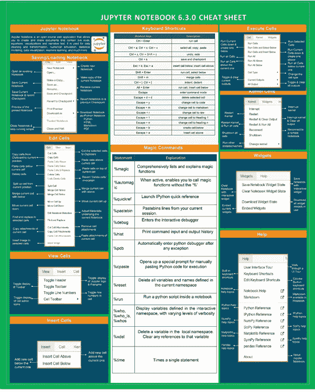

# Jupyter 笔记本备忘单

> 原文：<https://medium.com/mlearning-ai/jupyter-notebook-cheat-sheet-e4b2826adc98?source=collection_archive---------2----------------------->

eveloppaper.com

嘿伙计们，

在这篇文章中，我将讨论如何快速在 Jupyter 笔记本上编程。如果你是 Jupyter 笔记本的新手，这个备忘单将指导你记住一些重要的笔记本快捷键。我们将看到重要的快捷键，它们将帮助你以更快、更简单的方式编写代码。

那么，让我们开始吧…

我们为什么要用 Jupyter？

我们更喜欢用 python 写代码，因为我们希望高效快速地编写代码。有一个简单的概念，如果你动作快，就有机会快速下降和快速学习。当你从事一个项目时，数据处理需要时间，机器学习训练甚至需要更多时间。为了快速，您可以选择 Jupyter 笔记本电脑，它提供了运行/测试代码单元的能力。这意味着你可以只运行一小段代码，而不是完整的脚本。

***“这是一个迭代的过程。你越快完成这个循环，你的进步就越快。”——吴恩达。***

Jupyter 笔记本上手超级简单。然而，当你第一次打开 Jupyter 笔记本时，你可能会遇到一些困难，比如打开一个新的笔记本，保存当前的笔记本，在笔记本中添加或移动单元格等等。毫无疑问，当你第一次开始的时候，有很多东西等着你去发现！所以，这个 Jupyter 笔记本备忘单对那些第一次接触笔记本并希望得到一些帮助以找到他们周围的路的人来说是有用的。

您还记得 Jupyter 笔记本有一个方便的帮助菜单，其中包括一个完整的用户界面浏览。所以，不要担心，我们已经把这个包括在备忘单里了。

[点击此处查看并下载备忘单。](https://github.com/vks2021/Pythonprogramming/blob/eebeebea4b498ea4c8be68b2441af47d5e128bca/jupyter_Notebook_Cheat_Sheet.png)

总结笔记时，请随意分享您的意见。您的喜欢和评论将有助于我以更好的方式展示内容。下周见。