# Jupyter 笔记本—第一部分

> 原文：<https://medium.com/mlearning-ai/jupyter-notebook-part1-ec3d67ca9b7e?source=collection_archive---------6----------------------->

如何使用 Jupyter 笔记本

# **什么是 Jupyter 笔记本？**

Jupyter Notebook 是一个免费的开源 web 应用程序，它允许你添加和执行代码，查看交互式输出，添加文本(方程式、富文本、图表等)。)并与他人轻松分享笔记本。

它允许您使用 web 浏览器运行和编辑笔记本文档。您可以在没有互联网访问的情况下在本地桌面上运行它，也可以通过互联网从远程服务器访问它。

# **如何使用？**

Jupyter Notebooks 被数据科学家广泛用作数据分析工具。

一些用途包括:

*   数据清理和转换
*   数据可视化
*   数据探索
*   统计建模

Jupyter 支持超过 40 种编程语言，包括 Python、R、Julia 和 Scala。

# **安装**

Jupyter Notebook 可以使用以下方法之一进行安装:

## **使用画中画**

[pip](https://pypi.org/project/pip/) 是 Python 安装附带的包管理器工具。

在命令提示符(Windows)或终端(Mac)中，运行

> pip 安装 jupyter

## **使用 conda**

Conda 是安装 conda 时附带的软件包管理器工具。Anaconda 是一个 Python 和 R 发行版，它还包括数据科学包和 Jupyter Notebook。

# **运行 Jupyter 笔记本**

要运行笔记本，请在终端(Mac)或命令提示符(Windows)下运行以下命令:

> jupyter 笔记本

注意:如果上述命令无法在 Windows 上启动 jupyter，请运行以下命令:

> python -m 笔记本

这将启动 Jupyter 笔记本服务器。您的默认浏览器将打开一个新标签，其 URL 为:[http://localhost:8888/tree](http://localhost:8888/tree)

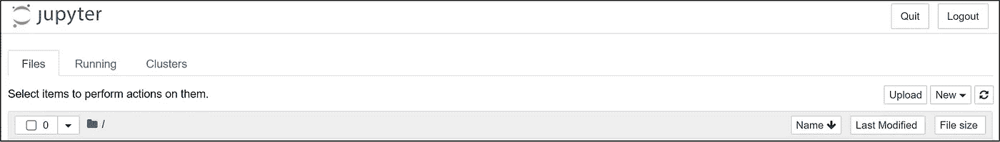

Jupyter Notebook Server starts

现在笔记本服务器正在运行，让我们创建一个笔记本。

# **创建笔记本**

单击“新建”打开选项列表以供选择。我已经安装了 Python3，所以我选择 Python3 来创建笔记本。

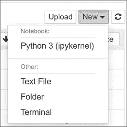

Click the **New** button to create a Notebook

这将为您新创建的笔记本打开一个新的浏览器选项卡。

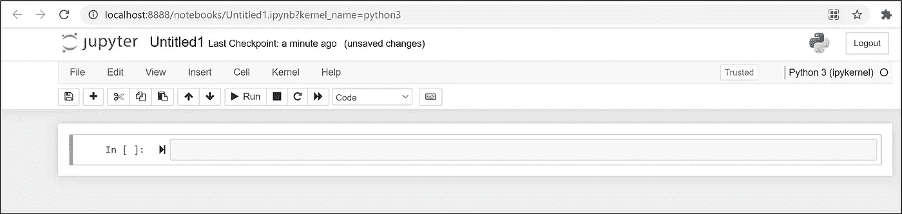

Notebook “Untitled1”

## **笔记本名称**

请注意，默认情况下，创建的笔记本名为“无标题 1”。让我们重新命名它，以便更好地描述。

*   点击“无标题 1”

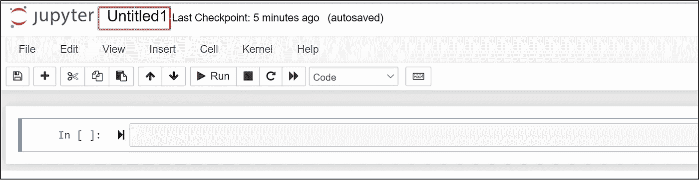

Click on “Untitled1” to rename Notebook

*   这将打开“重命名笔记本”对话框。为您的笔记本键入一个新名称。

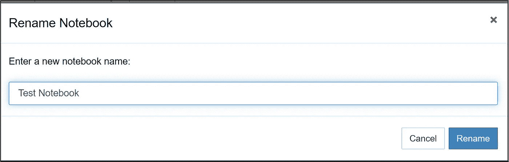

Rename Notebook dialog

*   点击重命名笔记本对话框上的**重命名**按钮。

## 菜单和工具栏

该菜单提供了控制笔记本功能的常规选项。**示例**:点击**插入**->-**在**上方插入单元格，在笔记本默认单元格上方插入一个单元格。

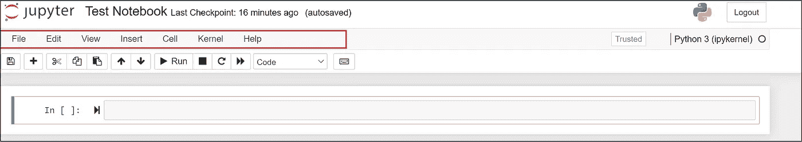

Menu bar

工具栏提供了一种快速访问笔记本上最常用选项的方法。**示例**:点击“**+”**图标，向笔记本添加另一个单元格。

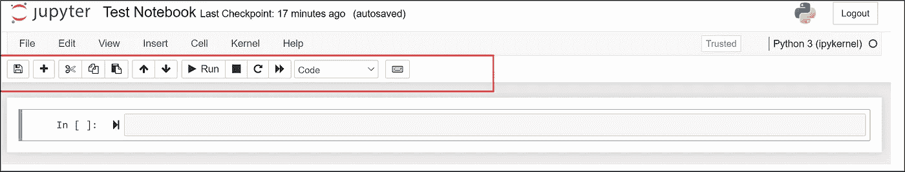

Toolbar

## **笔记本电池**

**代码单元格**

添加到笔记本的默认单元格是代码单元格。您可以在笔记本的代码单元格中键入并运行代码。因为我们用 Python3 内核创建了笔记本，所以我们可以在代码单元中编写 Python 代码。

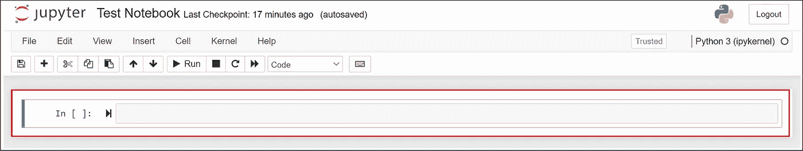

Code cell

让我们添加一些代码并运行它。

*   在代码单元格中键入 **print("Test")**
*   从工具栏中，点击**运行**执行代码
*   注意输出“测试”

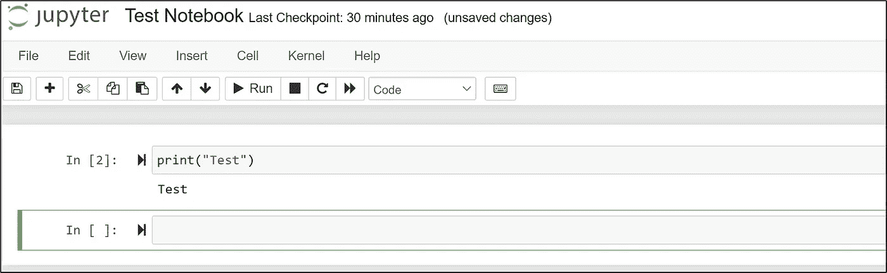

Example code in code cell and output

如果您有多个代码单元，您可以选择一个特定的单元并运行它来执行该特定的代码。你也可以运行所有的代码单元，以便共享变量，像运行程序一样运行代码。

**其他类型的细胞**

您可以将其他类型的单元格添加到笔记本中。

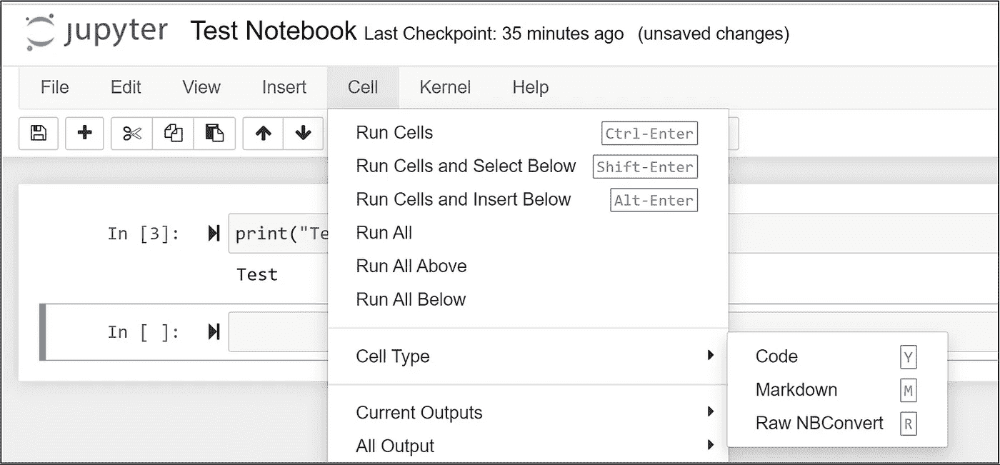

Types of Notebook Cells

**降价单元格** —类型文本呈现为 HTML，并作为说明性文本。这使您可以将笔记本用作教学/教育材料。

**原始 NBConvert 单元格** —笔记本不会评估原始单元格中的内容。原始单元格中的内容将通过命令行工具 [nbconvert](https://nbconvert.readthedocs.io/en/latest/) 不加修改地以预期格式(HTML、LaTeX 等)呈现。

您也可以选择从工具栏中设置单元格类型，如下所示。默认单元类型为**代码。**

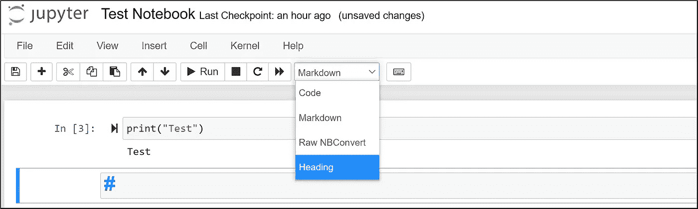

Choosing cell type

注意，它将单元格类型显示为标题的**，但不再受支持。如果选择标题类型，您将看到以下对话框**

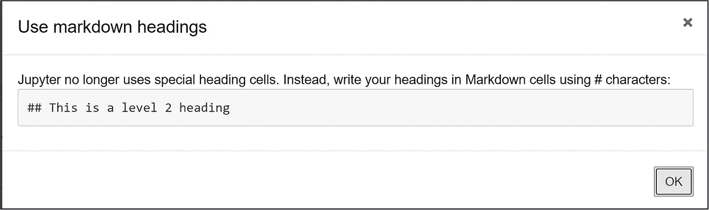

Heading type no longer used

出于我们的目的，我们将主要使用代码单元格和降价单元格。

Jupyter Notebook 支持 markdown，这是一种标记语言。您可以使用降价单元格向笔记本添加支持性说明文本。

## 添加降价

*   点击工具栏上的 **+** 图标，添加一个单元格。默认单元类型为**编码**
*   从工具栏下拉列表中将单元格类型更改为**降价**

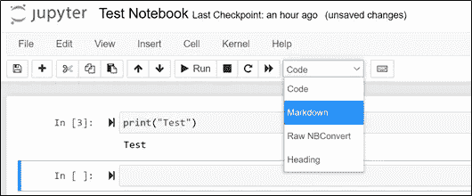

Change cell type to Markdown

*   将以下降价添加到单元格中(这里是一个[降价备忘单](https://www.markdownguide.org/cheat-sheet/))

> #标题
> 
> **粗体文本* *非粗体文本

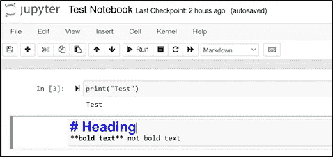

Add markdown to cell

*   点击工具栏上的**运行**
*   出现降价输出

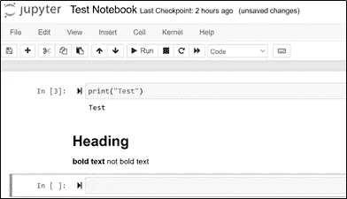

Markdown output

## 资源

*   [https://www.nature.com/articles/d41586-018-07196-1](https://na01.safelinks.protection.outlook.com/?url=https%3A%2F%2Fwww.nature.com%2Farticles%2Fd41586-018-07196-1&data=04%7C01%7C%7Ca315b01234174704e9fd08d97193f7c0%7C84df9e7fe9f640afb435aaaaaaaaaaaa%7C1%7C0%7C637665702602953404%7CUnknown%7CTWFpbGZsb3d8eyJWIjoiMC4wLjAwMDAiLCJQIjoiV2luMzIiLCJBTiI6Ik1haWwiLCJXVCI6Mn0%3D%7C1000&sdata=I4C0o2X%2BryB%2BXSu1R9qJWxvO4QPPQzIwFjsAYhC%2B43Y%3D&reserved=0)
*   https://jupyter.org/
*   [https://jupyter-notebook-初学者指南. readthedocs . io/en/latest/what _ is _ jupyter . html](https://na01.safelinks.protection.outlook.com/?url=https%3A%2F%2Fjupyter-notebook-beginner-guide.readthedocs.io%2Fen%2Flatest%2Fwhat_is_jupyter.html&data=04%7C01%7C%7Ca315b01234174704e9fd08d97193f7c0%7C84df9e7fe9f640afb435aaaaaaaaaaaa%7C1%7C0%7C637665702602963359%7CUnknown%7CTWFpbGZsb3d8eyJWIjoiMC4wLjAwMDAiLCJQIjoiV2luMzIiLCJBTiI6Ik1haWwiLCJXVCI6Mn0%3D%7C1000&sdata=2vjusuGgzEAO882tU3T0x5DAAuMFVQMbfm30TJF6nhc%3D&reserved=0)
*   [https://realpython.com/jupyter-notebook-introduction/](https://na01.safelinks.protection.outlook.com/?url=https%3A%2F%2Frealpython.com%2Fjupyter-notebook-introduction%2F&data=04%7C01%7C%7Ca315b01234174704e9fd08d97193f7c0%7C84df9e7fe9f640afb435aaaaaaaaaaaa%7C1%7C0%7C637665702602963359%7CUnknown%7CTWFpbGZsb3d8eyJWIjoiMC4wLjAwMDAiLCJQIjoiV2luMzIiLCJBTiI6Ik1haWwiLCJXVCI6Mn0%3D%7C1000&sdata=6a3OWkT79dY7z%2FZV%2F0Ku1bF9Z9VRtAIZeF%2FvRcAj2IM%3D&reserved=0)
*   [https://jupyter-notebook . readthedocs . io/en/stable/notebook . html](https://jupyter-notebook.readthedocs.io/en/stable/notebook.html)

Divya Sikka 是 Inspirit AI 学生大使计划的学生大使。Inspirit AI 是一个大学预科浓缩计划，通过在线直播课程让全球好奇的高中生接触人工智能。在[*https://www.inspiritai.com/*](https://www.inspiritai.com/)*了解更多信息。*