# Juypter 笔记本—第二部分

> 原文：<https://medium.com/mlearning-ai/juypter-notebook-part-2-5483c9e40ed7?source=collection_archive---------7----------------------->

Pandas library in Python to explore data

# **使用 Jupyter 笔记本中的熊猫探索数据**

**先决条件**:请查看 [Jupyter 笔记本—第一部分](/mlearning-ai/jupyter-notebook-part1-ec3d67ca9b7e)来设置您的 Jupyter 笔记本环境。

**得到熊猫**

Pandas 是 Python 的开源库之一，用于数据分析和数据操作。它可用于读取、写入、探索和可视化数据。

Pandas 没有提供常规的 Python 安装。按照以下步骤安装熊猫:

*   以管理员身份运行命令提示符。
*   输入“ **pip 安装熊猫**

**下载示例数据集**

本地下载 Iris 数据集。它是用于学习数据分析的最流行的数据集之一。

下载 [CSV 文件](https://datahub.io/machine-learning/iris/r/iris.csv)(来源:[https://datahub.io/machine-learning/iris#resource-iris](https://datahub.io/machine-learning/iris#resource-iris))

# **数据探索**

使用 Jupyter Notebook 浏览数据集以了解数据:

**进口熊猫**

编码:*进口熊猫为 pd*

**读取数据集**

code:***iris _ data frame = PD . read _ csv("<下载 CSV 的路径>"***

****可用于探索数据的一些常用熊猫函数****

****head()** —该函数显示数据集的前 5 行**

**代码: *iris_dataframe.head()***

**输出:**

**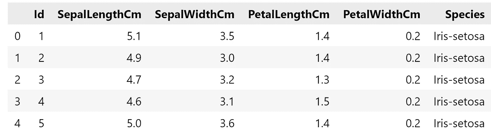**

****样本(n)** —函数随机显示数据集中的 n 行**

**代码:*iris _ data frame . sample(10)***

**输出:**

**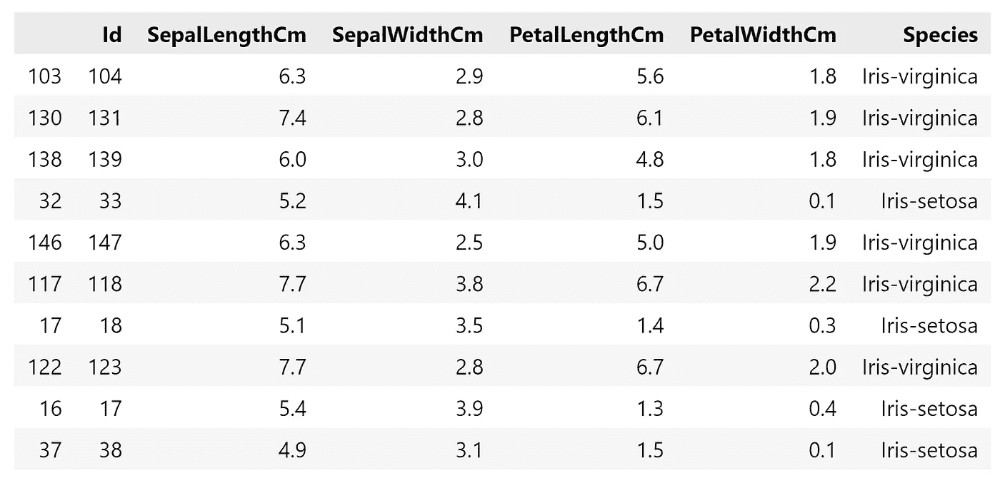**

****shape()** —该函数返回数据集中的行数和列数**

**代码: *iris_dataframe.shape***

**输出:**

****

****columns()** —函数显示数据集的所有列**

**代码: *iris_dataframe.columns***

**输出:**

**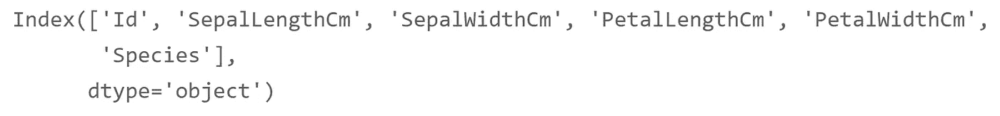**

****显示具体行****

**#本示例打印第 5 行到第 10 行**

**代码: *iris_dataframe[5:11]***

**输出:**

**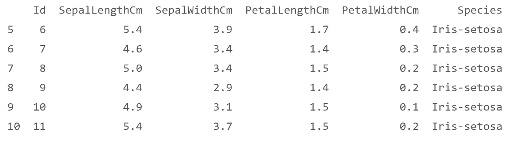**

****显示特定列****

**#此示例仅打印 Id 和 Species 列的前 10 行**

**代码: *iris_dataframe[["Id "，"物种"]]。*头(10)**

**输出:**

**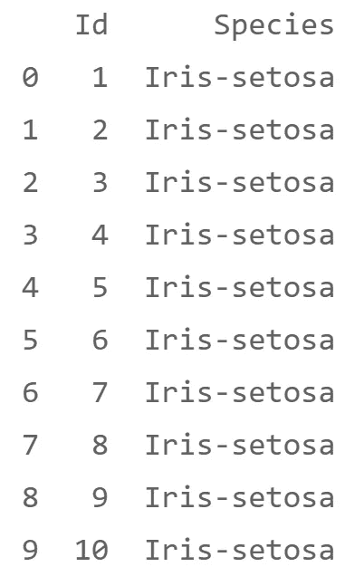**

****选择数据或过滤数据****

****loc()** 是基于标签的。使用 loc()时，必须指定行或列的名称来选择或过滤数据。**

**#在此示例中，筛选物种为鸢尾且 PetalWidthCm >0.4 的数据**

**code:*Iris _ data frame . loc[(Iris _ data frame[" Species "]= = " Iris-setosa ")&(Iris _ data frame[" PetalWidthCm "]>0.4)】***

**输出:**

**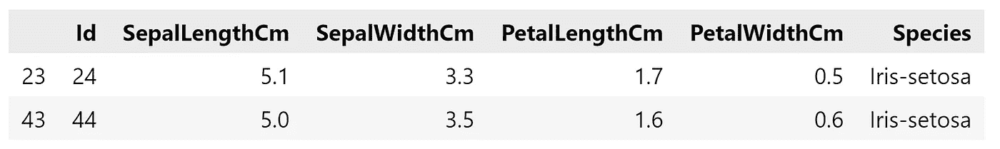**

**#在本例中，使用 loc()选择第 11 到 13 行**

**代码:*iris _ data frame . loc【11:13】***

**输出:**

**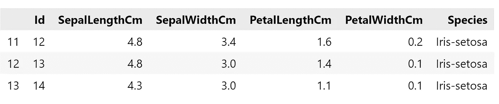**

****iloc()** 是基于索引的。使用 iloc()时，必须通过整数索引来指定行或列。**

**#在本例中，选择索引为 5 的行**

**代码: *iris_dataframe.iloc[5]***

**输出:**

**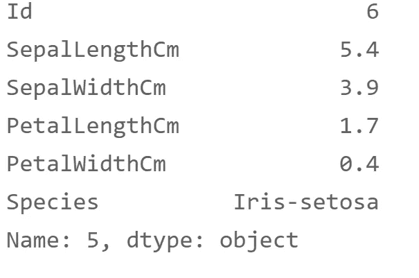**

****计算特定列的总和、平均值、中值****

**代码:**

***col _ sum = iris _ data frame[" PetalWidthCm "]。sum()***

***col _ mean = iris _ data frame[" PetalWidthCm "]。平均值()***

***col _ median = iris _ data frame[" PetalWidthCm "]。中位数()***

***print("Sum:"，col_sum，" \nMean:"，col_mean，" \nMedian:"，col_median)***

**输出:**

**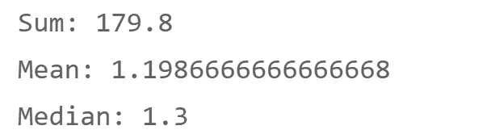**

****获取特定列的最小值、最大值****

**代码:**

***col _ min = iris _ data frame[" PetalWidthCm "]。闵()***

***col _ max = iris _ data frame[" PetalWidthCm "]。max()***

***打印("最小值:"，最小栏数，" \ n 最大值:"，最大栏数)***

**输出:**

**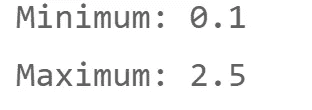**

****value_counts()** —函数统计特定值出现的次数。**

**代码: *iris_dataframe[“物种”]。value_counts()***

**输出:**

**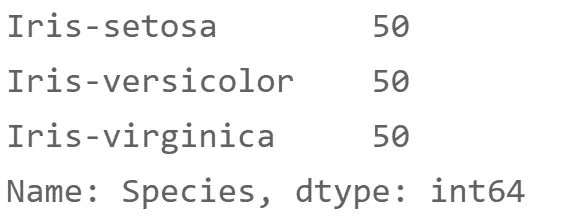**

# ****数据操作****

****添加栏目****

**代码:**

***iris _ data frame[" new _ col "]= iris _ data frame[" PetalWidthCm "]* 10***

***iris_dataframe.head()***

**输出:**

**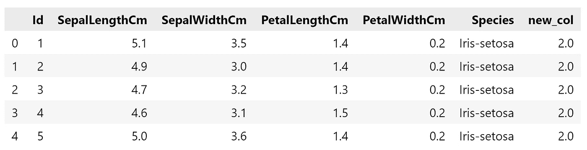**

****重命名列****

**代码:**

***rename dcols = {***

***《sepallenghtcm》:《sepalLength》，***

***“SepalWidthCm”:“sepalWidth”，***

***" petallenghtcm ":" petalLength "，***

***" PetalWidthCm ":" petalWidth " }***

***iris _ data frame . rename(columns = rename dcols，inplace=True)***

***iris_dataframe.head()***

**输出:**

**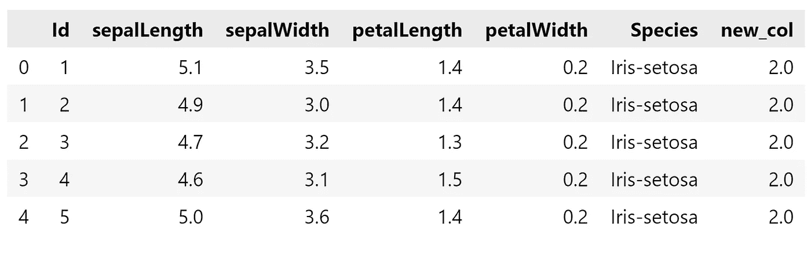**

****条件格式****

**code:*iris _ data frame . head(10). style . highlight _ max()***

**输出:**

**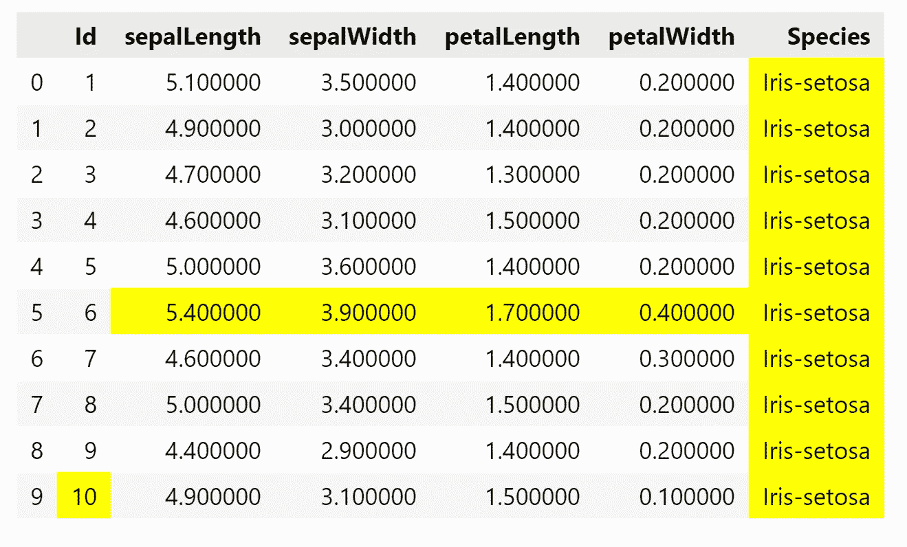**

****查找并删除缺失值****

****isnull()** —将为缺失数据显示 True，否则显示 False**

**code:*iris _ data frame . is null()***

**输出:**

**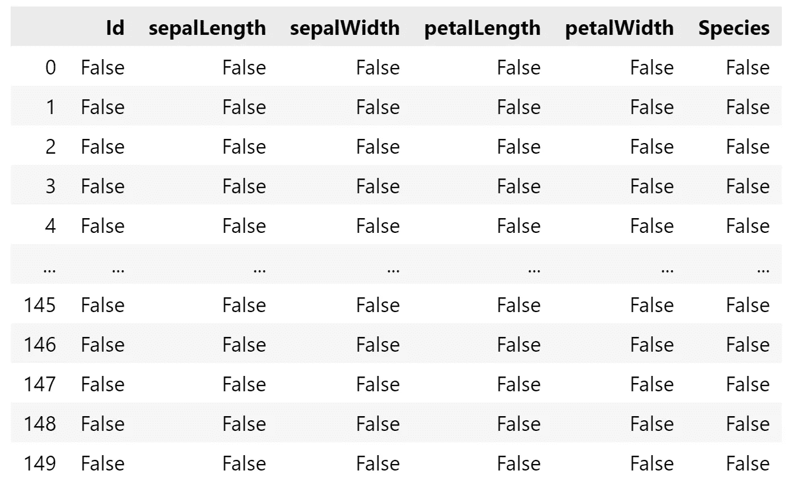**

**#本例*将告诉我们每一列中缺失值的数量***

**code:*iris _ data frame . is null()。sum()***

**输出:**

**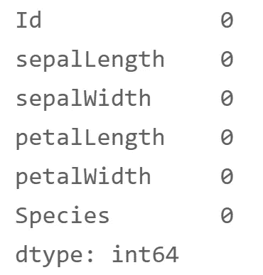**

**这些是您可以用来探索和操作数据以准备数据分析的一些函数。**

****资源:****

*   **[https://www . python central . io/how-to-install-pandas-in-python/](https://www.pythoncentral.io/how-to-install-pandas-in-python/)**
*   **[https://www . analyticsvidhya . com/blog/2021/06/style-your-pandas-data frame-and-make-it-using/](https://www.analyticsvidhya.com/blog/2021/06/style-your-pandas-dataframe-and-make-it-stunning/)**
*   **[https://www . geeks forgeeks . org/python-basics-of-pandas-using-iris-dataset/](https://www.geeksforgeeks.org/python-basics-of-pandas-using-iris-dataset/)**
*   **Stackoverflow**

** [## Mlearning.ai 提交建议

### 如何成为 Mlearning.ai 上的作家

medium.com](/mlearning-ai/mlearning-ai-submission-suggestions-b51e2b130bfb)**