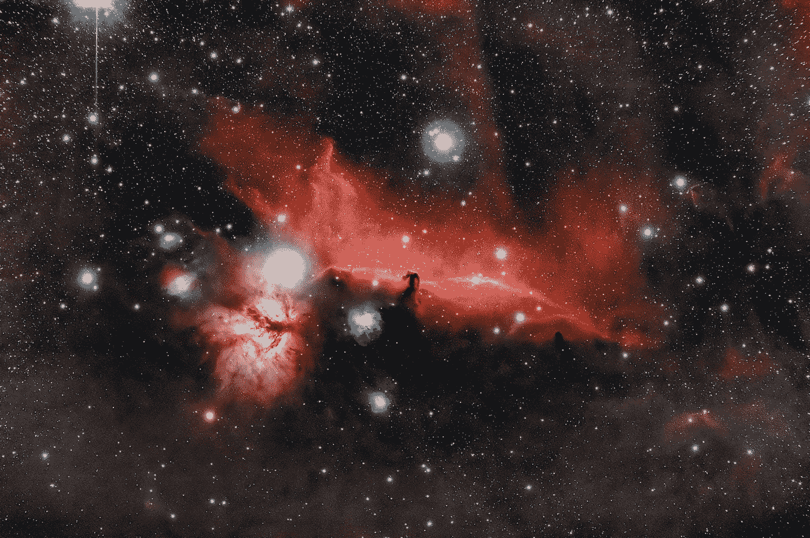
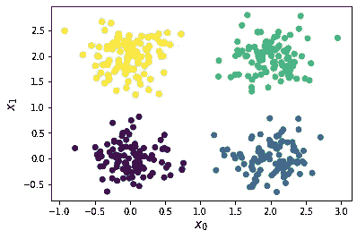
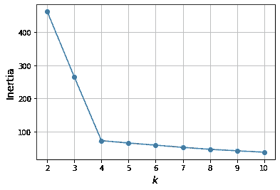
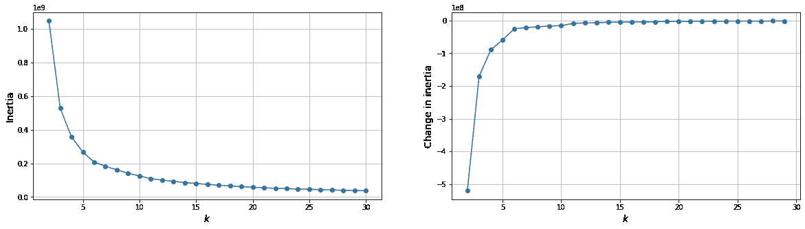
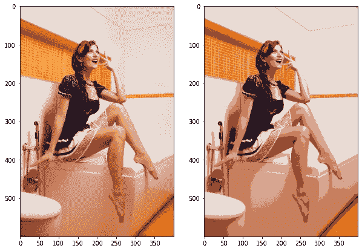

# k 均值聚类

> 原文：<https://medium.com/mlearning-ai/k-means-clustering-71a875dbce3c?source=collection_archive---------4----------------------->

## 将图像分割成簇。

聚类算法是一种非监督学习算法，广泛用于在不使用目标标签的情况下执行探索性数据分析，或者当我们只想将数据集划分为几个聚类时。除了大多数数据科学任务中常见的典型数据分析场景，事实证明，聚类算法还用于计算机视觉等其他领域！在本文中，我们将探讨如何使用 K-means 进行图像分割！



Photo by [Gaëtan Othenin-Girard](https://unsplash.com/@gatigato?utm_source=unsplash&utm_medium=referral&utm_content=creditCopyText) on [Unsplash](https://unsplash.com/?utm_source=unsplash&utm_medium=referral&utm_content=creditCopyText).

# K-均值聚类算法

K-means 聚类算法试图将数据集划分为 *k* 个聚类，第 *i* 个聚类由其质心*ᵢ* 定义。每个聚类的质心*ᵢ* 实质上是该聚类中所有 *nᵢ* 点的平均值。

因此，K-means 算法尝试使用以下步骤为整个数据集找到最合适的 K*质心值:*

1.  从数据集中随机选择 *k* 个数据点作为初始 *k* 质心值。
2.  对于数据集中的每个数据点，将其分配到最近的质心。距离用欧几里德距离来度量。
3.  重新计算 *k* 质心的值，作为分配给它的所有 *nᵢ* 数据点的平均值*。*
4.  重复步骤 2-3，直到达到最大迭代次数或某个容差值，或者聚类分配收敛。

在步骤 4 完成之后， *k* -means 算法应该已经最小化了所有 *k* 簇的惯性 *I* :

*我*=σ*ᵢ*σ*ₗ*|**x***ᵢₗ***-**ᵢ*|，***

***其中第一求和索引 *i* 遍历所有 *k* 簇，第二求和索引 *l* 遍历每个簇中的所有 *nᵢ* 数据点。 **x** *ᵢₗ* 是第 *i* 个聚类中的第 *l* 个数据点，第*ᵢ* 是第 *i* 个聚类的质心值。***

# ***用什么值的 *k* ？***

***K-means 聚类算法的一个主要问题是，我们需要指定要使用的聚类数。对于极其简单的低维数据集，如下图所示，可以通过可视化数据点轻松猜测出 *k* 的理想值。***

******

***A simple 2D dataset with 4 clusters. Image created by the author.***

***不幸的是，现实生活中的大多数数据并没有形成漂亮的球形簇，维度的数量如此之多，以至于可视化数据是不可能的。***

***我们可以使用的一种方法是根据集群的惯性 *I* 来确定要使用的集群的理想数量。通常，当我们从 2 开始增加簇的数量时，惯性趋向于迅速减小。当我们接近要使用的簇的理想值时， *I* 的下降开始趋于平稳，在 *I* vs *k* 的图表中形成一个肘形。对于上面这个简单的 2D 数据集，我们发现惯性中的肘形出现在 *k* = 4。***

******

***Elbow graph for the simple 2D dataset above, where the elbow occurs at k = 4\. Image created by the author.***

# ***使用 K-Means 分割图像***

***现在我们知道了 K-means 聚类算法是如何工作的，我们将使用 K-means 算法来分割从 Pexels 下载的图像[。](https://www.pexels.com/photo/woman-wearing-blue-and-white-dress-sitting-on-white-ceramic-batthub-1020057/)***

******

***Photo by Ferdinand Studio: [https://www.pexels.com/photo/woman-wearing-blue-and-white-dress-sitting-on-white-ceramic-batthub-1020057/](https://www.pexels.com/photo/woman-wearing-blue-and-white-dress-sitting-on-white-ceramic-batthub-1020057/)***

***图像看起来有 4 种不同的颜色——白色的墙壁、家具和裙子、橙色的墙砖和地板、深蓝色的裙子和米色的肤色，但是让我们看看 K-means 算法是如何分割图像的！***

## ***准备使用 K-means 进行聚类的图像***

***首先，我们使用`cv2`作为一个三维`numpy`数组来加载下载的图像。原始图像非常大——为了减少计算时间，我们将把图像调整到更小的尺寸。***

***此外，由于我们将使用`sklearn`来执行 K-means 聚类，我们需要将数组重新整形为可以被`sklearn` API 接受的形状。***

```
*import cv2
import numpy as np
import matplotlib.pyplot as plt
from sklearn.cluster import KMeans
import tqdm# Photo by Ferdinand Studio, downloaded from Pixels.
file_path = "pexels-ferdinand-studio-1020057.jpg"img = cv2.imread(file_path)
img = cv2.cvtColor(img, cv2.COLOR_BGR2RGB)def resize(image, width = None, height = None, scale = 1):
    # Resizes an RGB image.
    if width is None or height is None:
        width, height = image_width_height(image)
        width = int(width * scale)
        height = int(height * scale) return cv2.resize(image, (width, height))def image_width_height(image):
    # Get an RGB image's width and height.
    width = image.shape[1]
    height = image.shape[0]
    return width, heightdef image2X(image, width, height, channels = 3):
    # Converts an RGB image to an array X for use with sklearn.
    return image.reshape([width * height, channels])def X2image(X, width, height, channels = 3):
    # Converts an array X from sklearn to an RGB image.
    return X.reshape([height, width, channels])# Resize the image to a 400 x 600 resolution.
img = resize(img, width = 400, height = 600)
width, height = image_width_height(img)# Convert the image to an array which can be input into
# sklearn's API.
X = image2X(img, width, height, 3)
print(img.shape, X.shape)>>> (600, 400, 3) (240000, 3)*
```

## ***用肘法确定聚类数 k***

***接下来，我们使用肘方法来确定用于分割图像的聚类的理想数量。***

```
*# Try 2 to 30 clusters.
n_clusters = list(range(2, 30 + 1, 1))
kmeans = []
inertias = []for i in tqdm.trange(len(n_clusters)):
    kmeans.append(KMeans(n_clusters = n_clusters[i], 
                         random_state = 42))
    kmeans[-1].fit(X)
    inertias.append(kmeans[-1].inertia_)plt.figure(figsize = [20, 5])
plt.subplot(1, 2, 1)
plt.plot(n_clusters, inertias, "-o")
plt.xlabel("$k$", fontsize = 14)
plt.ylabel("Inertia", fontsize = 14)
plt.grid(True)
plt.subplot(1, 2, 2)
plt.plot(n_clusters[:-1], np.diff(inertias), "-o")
plt.xlabel("$k$", fontsize = 14)
plt.ylabel("Change in inertia", fontsize = 14)
plt.grid(True)
plt.show()*
```

******

***Left: cluster inertia I vs. number of clusters k, right: change in I with respect to k. After k = 6, the inertia I plateaus. Image created by the author.***

***左边的图表显示了当我们将簇的数量从 2 增加到 30 时，惯性 *I* 如何变化，而右边的图表显示了惯性 *I* 相对于 *k* 的变化率:d *I* /d *k* 。***

***两个图都显示惯性 *I* 在 *k* = 6 之后达到平稳状态，这意味着下载的图像最好使用 6 个簇进行分割！***

## ***用 6 个簇分割下载的图像***

***最后，我们使用 6 个聚类来分割原始图像，并获得图像中每个像素的聚类质心值。然后，我们将输出的`numpy`数组整形为一个 3 通道的 RGB 图像，以便可视化。***

```
*# Use 6 clusters in the K-means.
kmeans = KMeans(n_clusters = 6, random_state = 42)
kmeans.fit(X)# Obtain the cluster centroids for each pixel in the image.
# These centroids are essentially our image segments.
X_kmeans = kmeans.cluster_centers_[kmeans.predict(X)]
X_kmeans = X_kmeans.astype("uint8")# Convert the numpy array into an RGB image.
img_kmeans = X2image(X_kmeans, width, height, 3)# Visualize the original image with the segmented one.
plt.figure(figsize = [10, 10])
plt.subplot(1, 2, 1)
plt.imshow(img)
plt.subplot(1, 2, 2)
plt.imshow(img_kmeans)
plt.show()*
```

******

***Left: original image, right: segmented image using 6 cluster centroids. Original image taken by [Ferdinand Studio on Pexels](https://www.pexels.com/photo/woman-wearing-blue-and-white-dress-sitting-on-white-ceramic-batthub-1020057/), segmented image created by the author.***

***K-means 算法已经设法将原始图像分割成以下 6 个片段:***

1.  ***白色的墙壁、家具、衣服和某些皮肤。***
2.  ***橙色墙砖和地板。***
3.  ***浅米色肤色。***
4.  ***米色肤色。***
5.  ***家具和墙壁上的深米色肤色和阴影。***
6.  ***深蓝色的裙子和深色的阴影。***

# ***结束语***

***K-means 是一种非常简单有效算法，用于将数据聚类成 *k* 个不同的簇，而无需使用目标标签。这种强大的算法不仅可以用于典型的数据分析任务，还可以用于图像分割等其他任务。K-means 算法的一个问题是确定要使用的聚类数 *k* ，我们展示了如何使用肘方法来确定 *k 的理想值。*然后，我们使用 K-means 算法将图像分割成几个片段，每个片段由该聚类中所有像素的平均值表示。***

# ***参考***

1.  ***Dmytro Dzhulgakov，刘禹锡，塞巴斯蒂安·拉什卡(2022)。*用 PyTorch 和 Scikit-Learn 进行机器学习*，Packt 出版有限公司。***
2.  ***[https://docs . opencv . org/4 . x/D1/d5c/tutorial _ py _ k means _ opencv . html](https://docs.opencv.org/4.x/d1/d5c/tutorial_py_kmeans_opencv.html)***
3.  ***[https://sci kit-learn . org/stable/modules/generated/sk learn . cluster . k means . html](https://scikit-learn.org/stable/modules/generated/sklearn.cluster.KMeans.html)***

***[](/mlearning-ai/mlearning-ai-submission-suggestions-b51e2b130bfb) [## Mlearning.ai 提交建议

### 如何成为 Mlearning.ai 上的作家

medium.com](/mlearning-ai/mlearning-ai-submission-suggestions-b51e2b130bfb)***