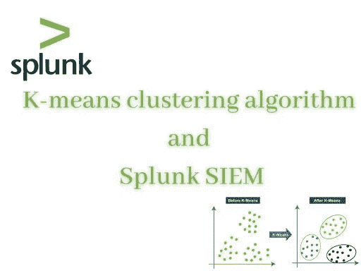
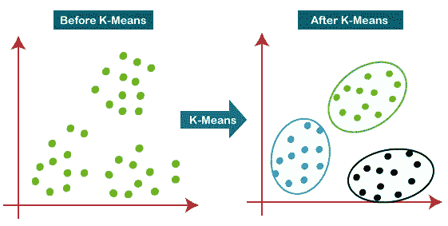
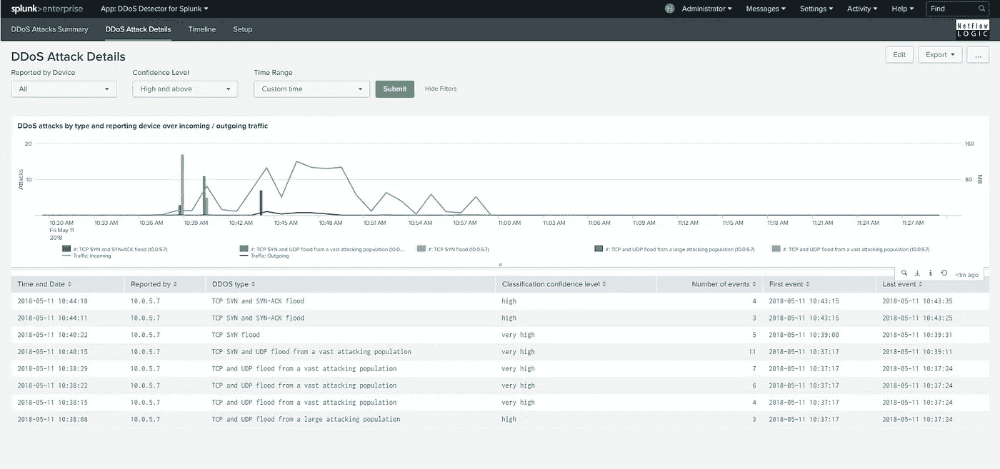

# K-means 聚类算法及其在安全领域的实际应用

> 原文：<https://medium.com/mlearning-ai/k-means-clustering-algorithm-and-its-real-use-cases-in-security-domain-99bd4e498852?source=collection_archive---------7----------------------->

> **K-均值聚类**

**K-means 聚类**是在**无监督机器学习**中使用的**算法**，用于**将相似的数据点**分组在一起(分成 K 个聚类或组)并发现潜在的模式，以便仅使用输入特征而不参考已知结果从数据集进行推断。

对于 k-means 算法，我们定义了一个数 *k* ，指的是我们在数据集中需要的聚类数。

这是一个基于**质心的算法，**其中每个聚类与一个质心相关联。

> **K-means 聚类算法的一个真实使用案例是安全域，在 SIEM 工具中，如 Splunk:**

**什么是 SIEM？**

**SIEM** 代表**安全信息和事件管理。** SIEM **软件提供对应用程序和网络硬件生成的安全警报**的实时分析，以使用全球收集的情报来检测和分析高级威胁。

SIEM 是如何工作的？

***SIEM 收集数据并按类别*** 进行分类，例如:恶意软件活动以及失败和成功登录。当 SIEM 通过网络安全监控发现威胁时，它会生成警报，并根据预先确定的规则定义威胁级别。

***例如，有人试图在 10 分钟内登录一个帐户 10 次是可以的，而在 10 分钟内登录 100 次可能会被标记为攻击企图*** 。通过这种方式，它可以检测威胁并创建安全警报。

**SPLUNK**

**Splunk** 是一款 SIEM 软件，允许用户实时跟踪、扫描、分析和可视化由各种流程生成的半结构化数据和日志。

示例:

**拒绝服务(DOS)攻击:**

拒绝服务(DoS)攻击是一种**攻击，意在关闭服务器**，通过**使服务器流量泛滥，使客户端无法访问服务器。**

可以通过观察 web 服务器的 ***实时访问日志来跟踪 DOS 攻击。***

如果使用访问日志观察到服务器一次又一次从同一个 IP 地址 ***收到太多请求*** ，这意味着这不是一个人，而是一台机器在一次又一次地向我们的服务器发送请求，以便用流量淹没服务器。

因此，我们可以使用 Splunk 等工具，通过观察请求的模式来跟踪 DOS 攻击。

 [## Mlearning.ai 提交建议

### 如何成为 Mlearning.ai 上的作家

medium.com](/mlearning-ai/mlearning-ai-submission-suggestions-b51e2b130bfb)