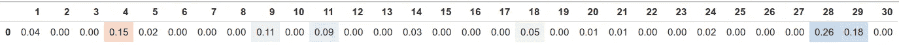
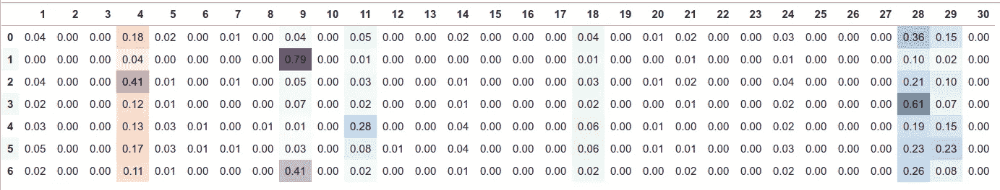
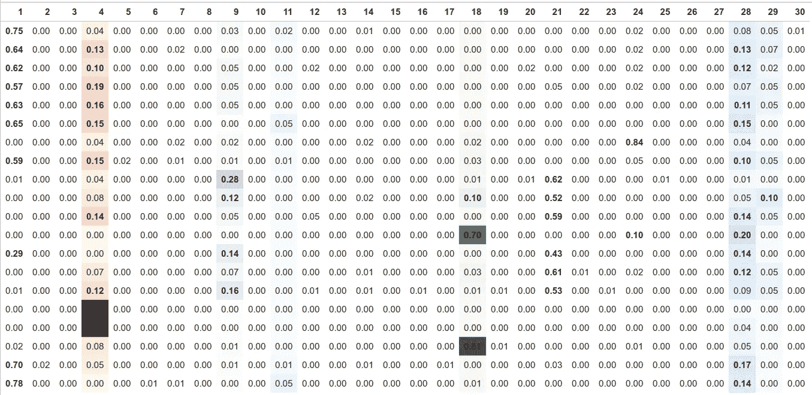

# 用于投票分析的 k-均值聚类

> 原文：<https://medium.com/mlearning-ai/k-means-clustering-for-vote-analysis-90ba60e54a41?source=collection_archive---------4----------------------->

2021 年 4 月 4 日，我们在保加利亚举行了选举，选出新一届议会。本文将尝试对结果应用 K-means 聚类，并对计算聚类的含义进行推理。

我认为特定地区的结果是政治观点的混合体。认为所有地区都根据全国平均水平投票得出最终结果是幼稚的。在另一个极端，我觉得难以置信的是，所有部门投票都是独一无二的。通过应用聚类方法，比如 k-means，我们将能够**识别常见模式**并推理它们的含义。

聚类结果会给我们总体趋势，但是**检查离群值**也是很有趣的——即使距离最近的聚类也很远的部分是什么情况？这些可能是选民欺诈的例子，也可能是政治舞台上出现了新的参与者。

# 数据

这些数据可以从中央选举委员会的网站上免费获得:【https://results.cik.bg/pi2021/csv.html】T4经过一些轻微的修改，我们形成了一个数据集，其中每行是一个投票区，每列代表参加选举的 30 个政党的总票数。
为了忽略在每个部分投票的选民的相对数量，我们通过 L1 规范进行标准化。通过这种方式，我们将对每个选区中投票给某个政党的选民的百分比进行建模。在某种程度上，每个部分代表一个概率分布。使用聚类，我们感兴趣的是发现哪些组的部分具有相似的概率分布，因此以相似的方式投票。

附注:在中央选举委员会提供的数据中，对于每个部分和每个政党，我们得到三个数字:给定政党的总票数、用纸给出的票数和用机器给出的票数。在其中的 50 个案例中，这些数字并不一致。请看[这里](https://drive.google.com/file/d/1iLTuEFwvYq18gYr0PLvHKCn48rSO6c8U/view?usp=sharing)哪些是有问题的条目。

# 简而言之，k-均值聚类

1.  初始化聚类中心
2.  直到收敛:
    a)将每个点分配到最近的聚类中心
    b)重新计算聚类中心，作为当前步骤中分配到的所有点的平均值

由此产生的聚类中心可以被解释为它们各自聚类的代表，我们可以推断它们的重要性。

# 应用

30 个政党参加了选举。全国范围的结果如下所示。最终当选的政党编号如下(也突出显示):
4。BSP
9。DPS
11。DB
18。ISMV
28。GERB
29。独立电视新闻公司

Actual results from the vote

指定 7 个聚类，我们得到以下聚类中心。请注意，大多数聚类中心与全国平均水平相差甚远。在接下来的部分中，我们将简要评论每个聚类中心，以及我们如何解释它们。

有关每个集群的详细参与情况，请查看随附的[活页夹演示](https://mybinder.org/v2/gh/mboyanov/vote-analysis/HEAD?urlpath=voila%2Frender%2FClusterVotes.ipynb)。

Cluster centers for the 7 clusters

请注意，每个集群都有不同数量的属于它的部分。事实上，分布如下:

1.  第 5 组— 4816
2.  集群 0-2647
3.  第 4 组— 1416
4.  集群 1-1104
5.  第 6 组— 1049
6.  第三组-984
7.  第 2 组—925

我们按照大小递减的顺序来分析一下。

## 第 5 组

该集群拥有最多的部分，也最接近国家平均水平。最显著的例外是，在这些部分中，GERB 和驱虫蚊帐的结果是并列的，并且不存在对 DPS 的支持。

## 群集 0

在这一组中，GERB 以 36%的选票明显获胜，而抗议的政党总共获得 15+5+4 ~ 24%的选票。

## 第 4 组

在第四组中，民主的保加利亚以 28%的得票率领先——比全国平均水平高出 3 倍。检查哪些部分是最好的代表，哪些部分离这种心态最远，这很有趣。

## 群组 1

第一组显示了巨大的政治分歧。在这些地区，79%的选票投给了 DPS！

## 第 6 组

这个集群是另一个例子，我们看到 DPS 赢得了 41%的选票，GERB 以 26%紧随其后。

## 第 3 组

第 3 组代表 GERB 的核心部分。任何声称 GERB 将永远离开的人，都应该和这些人好好谈谈。

## 群组 2

第 2 类代表 BSP 的核心部分，占 41%，几乎是全国结果的 3 倍。

## 集群 Slavi 在哪里？

有时候思考缺少什么会有所帮助。在这种情况下，我们没有看到 ITN 是明显赢家的独特集群。相反，我们得到第 5 组，他们与 GERB 打成平手。人们可以说，ITN 正在得到所有集群的某种程度的支持，并有可能在下次选举中大幅增加支持。

# 解读异常值

既然我们已经确定了主要趋势，我们可以把注意力集中在异常值上。哪些部分离它们最近的集群最远？这些将是偏离常规的部分。

Vote distribution for the outliers — the sections that are furthest apart even from their closest cluster center

正如我们所看到的，在大多数情况下，离群值投票给了最终没有进入议会的政党——VMRO(1)，保加利亚共和党(21)或 VOLQ/NFSB(24)——或者 BSP(4)或 ITN(18)的分数异常高。如果我们指定了更大数量的集群，我们可能会为这些较小的玩家获得相应的集群。

## 摘要

我们应用 K-means 来发现投票分布中的共同模式。我们确定了 7 个具有相当不同特征的集群，代表不同党派或主要冲突的骨干。

此外，我们探索了远离他们最近的中心的离群值，我们发现他们代表了没有代表的政党——没有进入议会的政党。

## 链接

[Voila Demo](https://mybinder.org/v2/gh/mboyanov/vote-analysis/HEAD?urlpath=voila%2Frender%2FClusterVotes.ipynb) (似乎载入缓慢)
[Github](https://github.com/mboyanov/vote-analysis)
[Binder](https://mybinder.org/v2/gh/mboyanov/vote-analysis/HEAD)