# 使用肘方法的 k-均值聚类

> 原文：<https://medium.com/mlearning-ai/k-means-clustering-using-elbow-method-208b23c78150?source=collection_archive---------0----------------------->

K-means 是一种无监督算法，因为它没有预测变量

它只会在数据中寻找模式

它会将每个数据点随机分配给一些集群

然后，它将移动每个集群的质心

这个过程将继续，直到数据中的聚类变化不能再减少为止

聚类变化被计算为数据点和它们各自的聚类质心之间的欧几里德距离之和

我们将使用 scikit learn 创建虹膜数据

数据集包含 150 个条目，具有 1 个因变量和 4 个 o/p 特征(只是为了比较结果)

使用肘方法和惯性，惯性是样本到它们最近的聚类中心的平方距离的总和，我们将试图找到分割观察值所需的最优聚类数。

**数据来源:**

【https://www.kaggle.com/uciml/iris】链接:[T5](https://www.kaggle.com/uciml/iris)

**数据的属性:**

它有 150 个条目，包括 1 个从属列和 4 个特征列

**如何运行此应用程序:**

在本地机器上安装 Anaconda

为项目创建一个虚拟环境，以确保版本更新不会影响我们当前正在进行的项目。

打开 Anaconda 提示符:

创建虚拟环境:**conda create-n env name python = 3.8**

既然我们名为“envname”的虚拟环境已经创建

为了激活环境: **conda activate envname**

转到项目目录并安装所需的库:

**康达安装 pip**

**pip install-r requirements . txt**

这个 requirements.txt 包含:

朱庇特==1.0.0

**lxml==4.4.1**

**matplotlib==3.1.1**

**熊猫==0.25.2**

**枕头==6.2.1**

**scikit-learn==0.21.3**

**seaborn==0.9.0**

我们可以编辑。txt 文件到新的库及其最新版本&自动运行它们来安装这些库

最后，在命令行调用“jupyter notebook”来启动 Jupyter IDE，我们在那里构建模型

**IDE 内部:**

导入虹膜数据集

使用 Matplotlib 和 Seaborn 可视化数据以理解模式

使用惯性和肘方法找到最佳 K 值

创建一个可以对我们的数据中的观察结果进行聚类的模型

比较结果。

**库和包的概念证明(POC):**

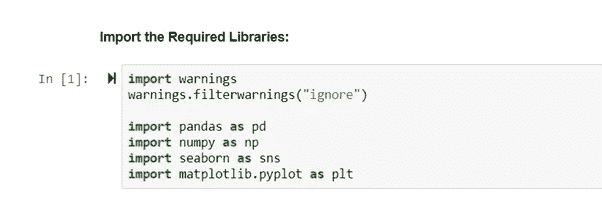

**虹膜数据的概念验证:**

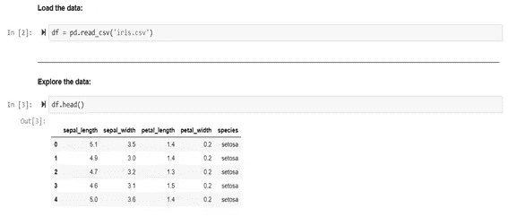

EDA:

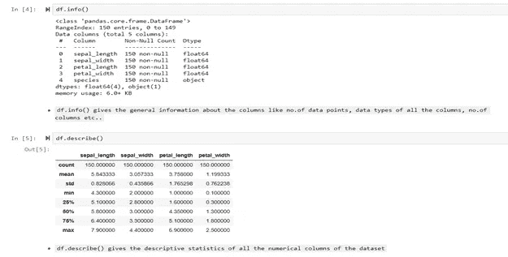

**用于可视化的概念验证:**

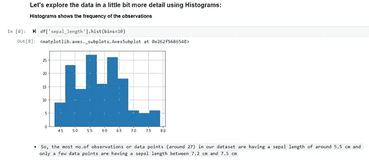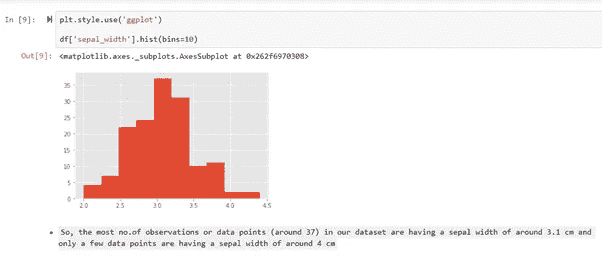

距离图:

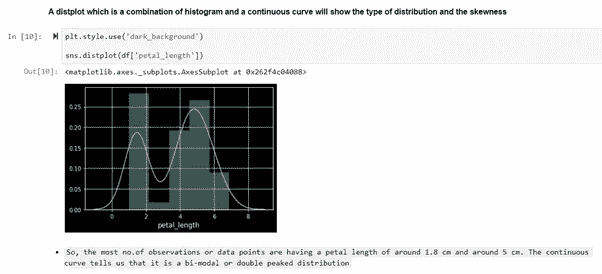

箱线图:

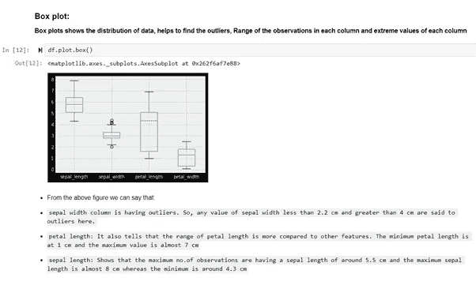

**模型构建的概念验证:**

为集群 2 构建模型。

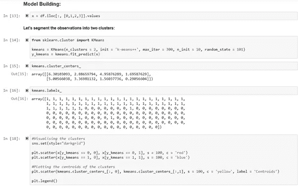

用质心绘制簇。

为集群 4 构建模型。

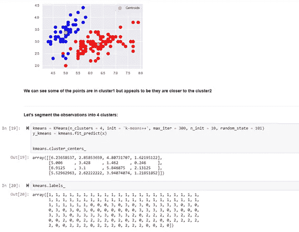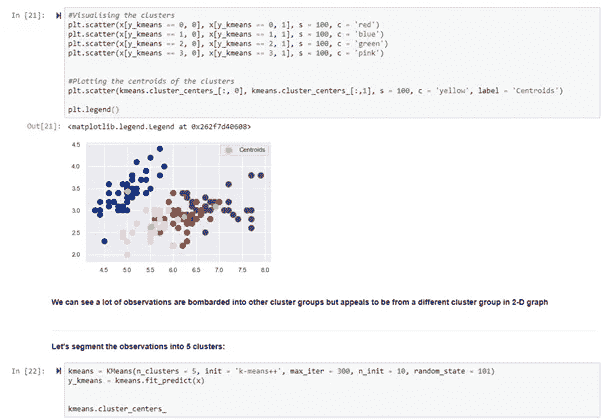

为集群 5 构建模型。

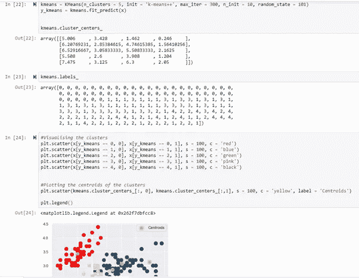

**现在让我们使用惯性的概念，惯性是样本到它们最近的聚类中心的距离的平方之和。**

**如果 K 的值很大，那么一个簇内的点数将会更少，因此惯性将会更小**

**现在我们将在 Iris 数据集上实现“肘方法”。肘方法允许我们选择分类的最佳聚类数。**

**虽然我们已经知道答案是 3，因为鸢尾花有 3 个独特的类别**

# 弯头方法:

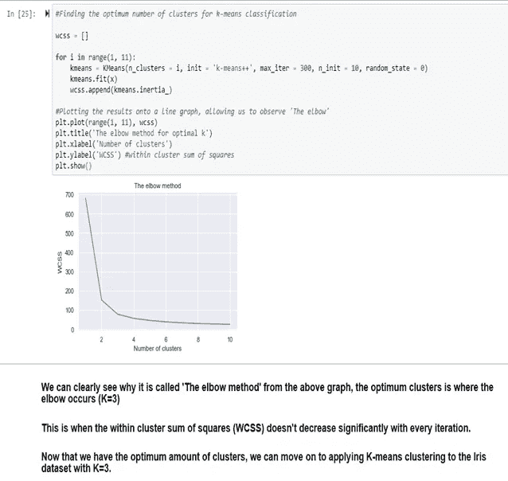

现在我们已经知道聚类值为 3，因此，让我们应用值为 3 的模型。此外，还要验证它的分类和标签。

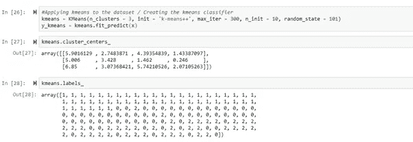

我们现在可以用质心来绘制不同值的散点图。

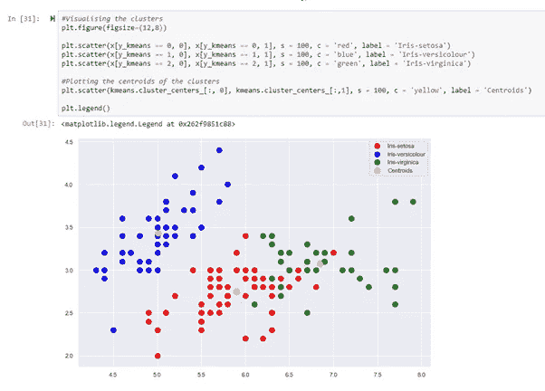

**当我们输入更高的 K 值时，我们可以获得绝对分割，但是如果每个聚类中的点非常少，那么真实数据的变化将会很大，导致数据过度简化**

**因此，在 K=3 的情况下，我们获得了最佳失真/惯性，利用该最佳失真/惯性，我们可以将数据分割成 3 个不同的聚类，并且分割误差最小**

**参考资料:scikit-learn，Matplotlib。**