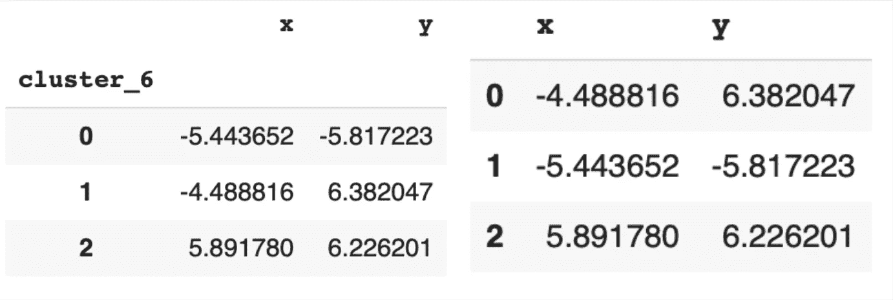
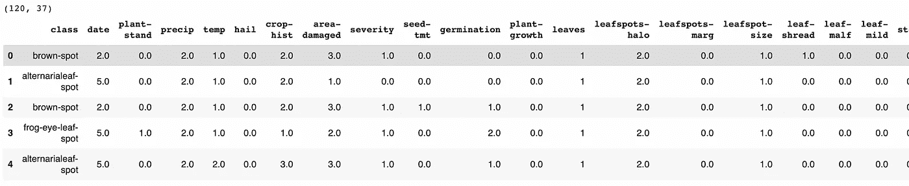
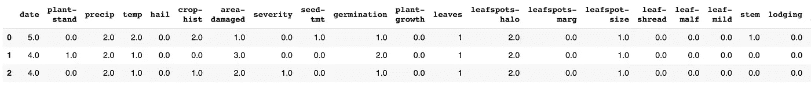
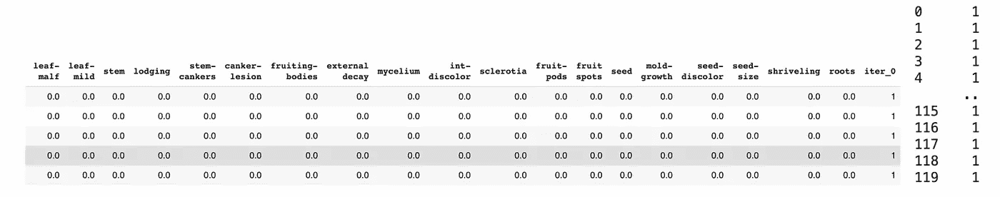
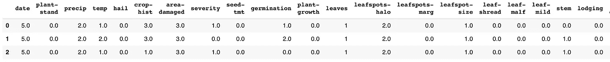
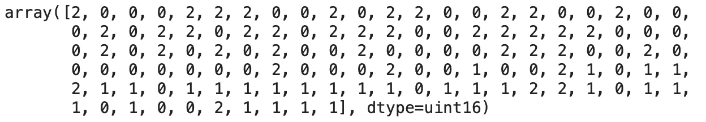

# K-均值到 K-模式

> 原文：<https://medium.com/mlearning-ai/k-means-to-k-modes-f7af5f1a3aa0?source=collection_archive---------3----------------------->


[Polina Tankilevitch](https://www.pexels.com/@polina-tankilevitch/)

蔡寨村坐落在中国山区的河两岸。这个村子以生产豆腐而闻名。以前，专业人员会仔细检查作物，决定它们是否适合做豆腐。然而，随着一个新成立的合作社的运行，该村每天加工大约 100 公斤大豆。这意味着每天早上要仔细检查近 80 万颗种子。没有一个最努力工作的团队能够每天检查这么多的大豆。

在这种情况下，机器学习非常方便。使用无监督学习聚类算法，我们将检查相对较小的一批大豆，并定义不健康作物的群体。为此，我们将使用 K-Modes 聚类算法。为了更好地解释 K-模式，我将首先提到 K-均值，它是 K-模式的前身。

# 什么是 K 均值，为什么它不是分类数据集的一个选项？

1.  K-Means 是一种无监督聚类算法，它使用欧几里德距离(来自几何类)来测量两个向量(也称为数据点)之间的差异。这种类型的测量在彼此没有任何明确关系的分类对象的空间中是没有意义的。
2.  K-Means 通过改变聚类的均值来最小化成本函数，或者简单地说，它使用原始聚类中所有对象的均值作为中心数据点，并基于该均值更新聚类。想象一下，在四月、五月和六月之间找到一个平均值。

# k-表示循序渐进

```
**# generate some artificial numerical data for classification** from sklearn.datasets import make_blobs
points, center = make_blobs(n_samples=100, centers=3, n_features=2)**# create a dataframe** df = pd.DataFrame(dict(x=points[:,0], y=points[:, 1], label=center))
```

这是我得到的。

现在，为了实验清楚起见，我必须删除集群标签。

**步骤一:**生成随机点作为每个聚类初始中心点。这里我们有三个

```
**# drop labels**
points = df.drop('label', axis=1)**# generate initial centroids**
centroids = points.sample(3)
centroids = centroids.reset_index(drop=True)
```

**第二步:**对于数据集中的每个点，计算到每个中心点的距离。将每个变量分配到其最近的中心点。

下面是一个很小的函数:

```
def get_nearest_centroid(df, centroids, iter):
*'''
For each point in the dataset calculates
nearest cluster
'''***# make a copy of the data-frame**
df_new = pd.DataFrame(df[['x', 'y']])**# find distances**
distances = distance.cdist(df, centroids, 'euclidean')**# find nearest centroid**
nearest_centroid = np.argmin(distances, axis=1)**# create a new column with updated centroids**
df_new['cluster_'+iter] = nearest_centroidreturn df_new
```

**第三步:**用新形成的集群取代旧的中心。这是一个更新中心的函数

```
def get_centroids(df, column_header):
*'''
Averages clusters by mean to get
updated centroids
'''***# group by cluster to find a mean**
new_centroids = df.groupby(column_header).mean()return new_centroids
```

**第四步:**迭代直到集群不再更新

```
**# write a for i loop to calculate same centroids in less code**
pass_i = get_nearest_centroid(points, centroids, str(0))
centroids_i = get_centroids(pass_i, 'cluster_'+str(0))for i in range(1, 10):
  pass_before_i = pass_i.copy()
  centroids_before_i = centroids_i.copy()
  pass_i = get_nearest_centroid(points, centroids_i, str(i))
  centroids_i = get_centroids(pass_i, 'cluster_'+str(i))
    if pass_before_i['cluster_'+str(i - 1)].equals(pass_i['cluster_'+str(i)]) and           centroids_before_i.equals(centroids_i):
    break
```

使用 *sklearn* 库，你可以用更少的代码获得同样的结果。

```
**# load k-means algorithm**
from sklearn.cluster import KMeans**# instantiate** 
kmeans = KMeans(n_clusters=3)**# fit**
kmeans.fit(points)**# retrieve labels and center points**
labels = kmeans.labels_
cluster_centers = kmeans.cluster_centers_
cluster_centers=pd.DataFrame(cluster_centers, columns=[['x', 'y']])
```



Clusters calculated by hand and clusters calculated using sklearn

所以，现在，我已经解释了 K-Means 算法背后的数学，我可以更深入地研究 K-Modes。

# 为什么 K-Modes 适用于分类特征？

1.  K-Modes 使用两个向量变量之间的差异数来定义它们有多接近。
2.  K-Modes 用模式代替聚类的均值。
3.  K-Modes 使用基于频率的方法来寻找集群的模式。

[来自 UCI 的著名大豆数据集](https://archive.ics.uci.edu/ml/datasets/Soybean+(Large))完全符合我改进大豆选择过程的目标。

我加载了数据集，并删除了所有的未知数(空值)。我最终得到了三个主要的集群，每个集群由 40 个变量和 12 个较小的变量组成。和 K-Means 的例子一样，我决定只坚持三个主要的聚类，所以我放弃了其他的。我还对数据集进行了重新采样，以便所有聚类均匀分布。为了便于翻译，我给每堂课都分配了一个数字。

```
**# filter the dataset to only include three main clusters**
filters = list(df_large['class'].value_counts()[:3].index)
df = df_large[df_large['class'].isin(filters)].copy()**# assign a number to each class**
df['class_num'] = df['class'].replace({'brown-spot':0, 'alternarialeaf-spot':1, 'frog-eye-leaf-spot':2})**# resample dataset**
df = df.sample(120)
df = df.reset_index(drop=True)
print(df.shape)
df.head()
```



Resampled Soybean (Large) Data Set

我将无法支持带有可视化绘图的代码，因为数据集有 3 个以上的特征，但逻辑几乎是相同的。

**第一步:**删除包含集群标签的列，设置初始模式

```
**# generate initial modes**
clusters = df_new.sample(3)
clusters = clusters.reset_index(drop=True)
clusters
```



**第二步:**对于数据集中的每个点，计算它与每个模式之间的差异数。将三种模式中的一种分配给数据集中的每个变量。

```
def get_nearest_cluster(df, clusters, iter):
'''
For each column in the dataframe calculates
nearest cluster
'''
**# make a copy of initial dataframe, drop iteration column if there**
df_new = df[df.columns.drop(list(df.filter(regex='iter')))].copy()**# create a list of differences**
df_diffs = []**# iterate through rows and clusters**
for index, row in df_new.iterrows():
  cluster_differences = []
    for index_c, cluster in clusters.iterrows():
**# count number of differences**
    diff = np.array(cluster) - np.array(row)
    non_zero_diffs = np.count_nonzero(diff)
    cluster_differences.append(non_zero_diffs)
  df_diffs.append(cluster_differences)**# find a minimum difference and add it to the dataset**
df_new['iter_'+iter] = np.argmin(df_diffs, axis=1)
return df_new
```



第三步:更新模式

```
def new_modes(df, column_header):
*'''
Udates modes of the clusters based on
prior clusters and given datapoints
'''*
**# iterate clusters**
modes = []
for i in df[column_header].unique():
**# cluster modes**
  modes_i = []
  df_sub = df[df[column_header] == i]
**# iterate columns**
  for col in df_sub:
    mode = df_sub[col].value_counts().index[0]
    modes_i.append(mode)
  modes.append(modes_i)**# turn into a dataframe**
modes = pd.DataFrame(modes, columns=df.columns)
modes = modes.drop(column_header, axis=1)
return modes
```



**第四步:**迭代直到集群不再更新

```
pass_i = get_nearest_cluster(df_new, initial_centroids, '0')
centroids_i = new_modes(pass_i, 'iter_0')for i in range(1, 100):
**# make a copy to compare to** pass_before_i = pass_i.copy()
  centroids_before_i = centroids_i.copy()
**# calculate new clusters and centroids** pass_i = get_nearest_cluster(pass_before_i, centroids_before_i, str(i))
  centroids_i = new_modes(pass_i, 'iter_'+str(i))
  if centroids_i.equals(centroids_before_i):
    print(f'It tool {i+1} iterations to find clusters')
    break
```


同样，你可以用更少的代码用 **kmodes** 库获得同样的结果。

```
from kmodes.kmodes import KModesk = KModes(n_jobs = -1,n_clusters=3,init='Huang', random_state = 0)
clusters = k.fit_predict(df_new)
```



最后要提到的一点是，当您手动计算 k 模式时，同一数据集的准确度分数可能会随时间而变化。发生这种情况是因为每个集群可能有多种模式，除非对算法进行编码，否则无法控制选择哪种算法。

我希望这篇文章能帮助你更好地理解 K-Means 和 K-Modes。祝你的数据集群好运！

完整代码可在[这里](https://github.com/sugarfreecode/DS-Unit-1-Sprint-3-Data-Storytelling/blob/master/k_means_to_k_modes.ipynb)获得。

文章是根据 z .黄。[*对具有分类值的大型数据集进行聚类的 k-Means 算法的扩展*](https://cse.hkust.edu.hk/~qyang/Teaching/537/Papers/huang98extensions.pdf) (1998)。数据挖掘和知识发现。2(3): 283–304

在[卫报](https://www.theguardian.com/artanddesign/2021/mar/24/chinas-rural-revolution-architects-rescuing-villages-oblivion-tofu-rice-wine-lotus-tea)上阅读关于[中国蔡寨村一个新成立的村合作社](https://www.archdaily.com/943412/tofu-factory-dna)

[](/mlearning-ai/mlearning-ai-submission-suggestions-b51e2b130bfb) [## Mlearning.ai 提交建议

### 如何成为 Mlearning.ai 上的作家

medium.com](/mlearning-ai/mlearning-ai-submission-suggestions-b51e2b130bfb)