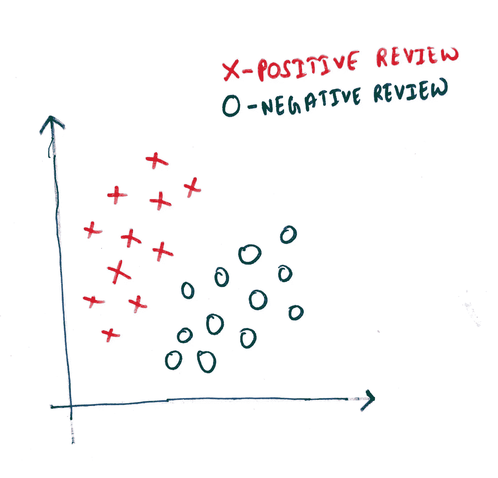
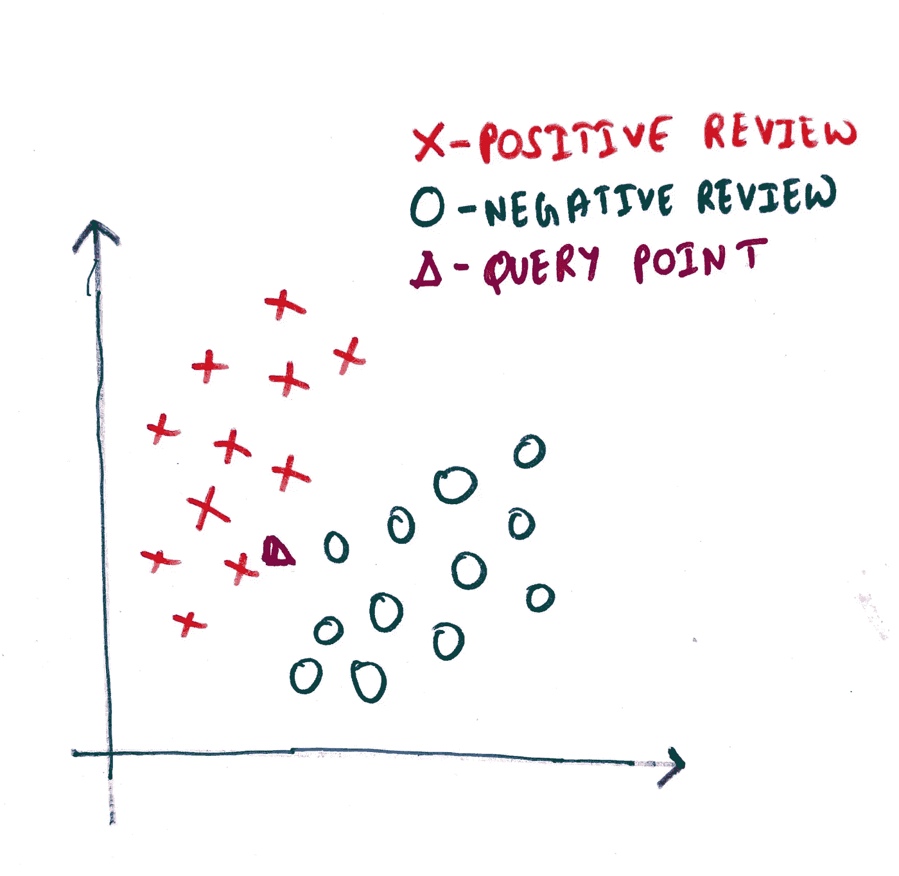
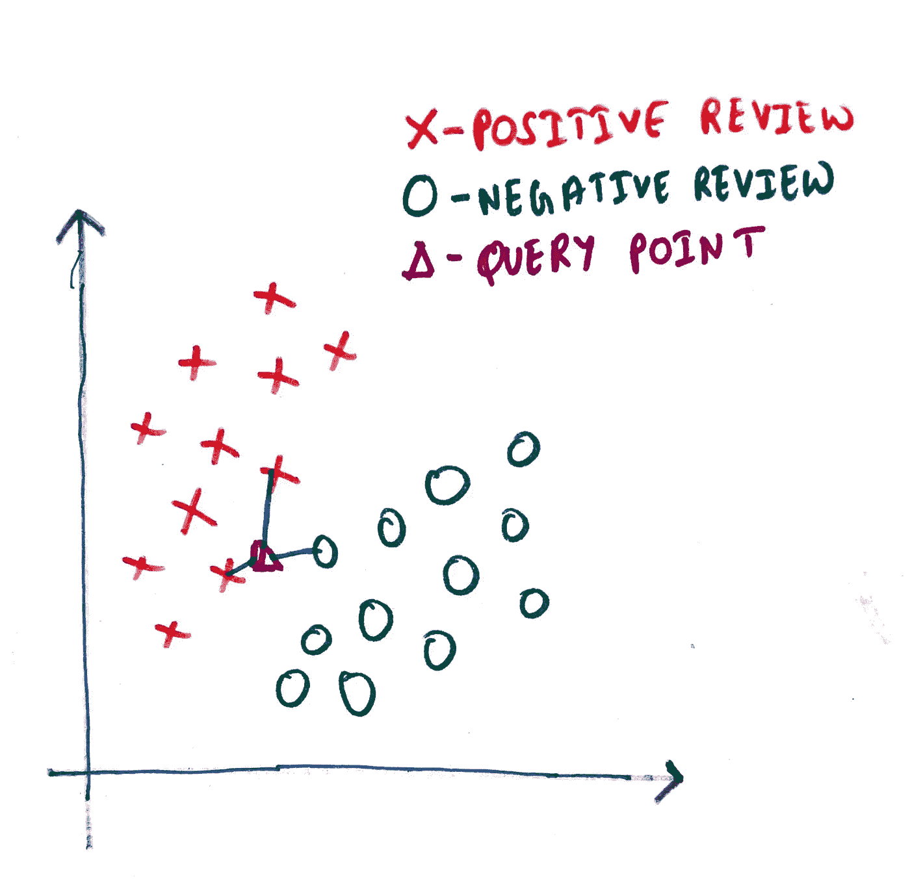

# k-最近邻

> 原文：<https://medium.com/mlearning-ai/k-nearest-neighbor-6d15a2b06772?source=collection_archive---------1----------------------->

监督机器学习


> **简介**

k-最近邻算法是一种监督机器学习算法，可用于分类[和回归](/@vaibhavvishal1244/classification-vs-regression-38dd9d81d60a)。我们先来了解一下这个算法是如何工作的。它是最简单的机器学习算法之一，我们可以将其总结为三个步骤:

**第一步:最近邻:**在你的数据集中找到 K 个离测试点“最近”的点(假设是‘y’)

**第二步:**假设我们使用 3-NN，这意味着 k = 3。在第一步中，我们为测试点 y 找到了三个最近的邻居。假设这三个最近的邻居是 x1，x2，x3。在步骤 2 中，我们需要从给定的数据集中找出这三个点的类别标签，假设是 y1，y2，y3。

**第三步:多数投票:**在这一步中，我们将对 y1、y2 和 y3 进行多数投票。具有最高投票的类别标签将被指定为给定查询或测试点 y 的类别标签

现在我们通过一个例子来理解算法。

> **示例**

假设我们有一个 Flipkart 移动评论的数据集。给定这个数据集，我们手中的任务是预测新的看不见的评论是正面评论还是负面评论。

**步骤 1:** 加载数据集。加载我们的数据集后，看起来像这样(图 1)。



Fig 1: Review dataset

**步骤 2:** 我们有一个查询点，我们想预测它的标签。(图二)



Fig 2: Query point with review dataset

**第三步:**计算查询点与其最近的 3 个邻居之间的距离。(为简单起见，我们取 k=3)。



Fig 3: Distance from query point to 3 nearest neighbor

**步骤 4:多数投票:**从图 3 中可以看出，我们有 2 个最近邻作为正面评价，1 个最近邻作为负面评价。因为我们有更多正面的最近评论，所以我们将该查询点推断为正面评论。

> **代码示例**

```
*# Import necessary modules*
**from** **sklearn.neighbors** **import** KNeighborsClassifier
**from** **sklearn.model_selection** **import** train_test_split
**from** **sklearn.datasets** **import** load_iris

*# Loading data*
iris = load_iris()

*# Create feature and target arrays*
X = iris.data
y = iris.target

*# Split the dataset into train and test*
X_train, X_test, y_train, y_test = train_test_split(
    X, y, test_size = 0.2, random_state=42)

*#appling KNN with K=3*
knn = KNeighborsClassifier(n_neighbors=3)

knn.fit(X_train, y_train)

*# Calculatng the accuracy*
print(knn.score(X_test, y_test))
```

这是一个简单的 KNN 算法代码示例。

感谢阅读！

[](/mlearning-ai/mlearning-ai-submission-suggestions-b51e2b130bfb) [## Mlearning.ai 提交建议

### 如何成为 Mlearning.ai 上的作家

medium.com](/mlearning-ai/mlearning-ai-submission-suggestions-b51e2b130bfb)