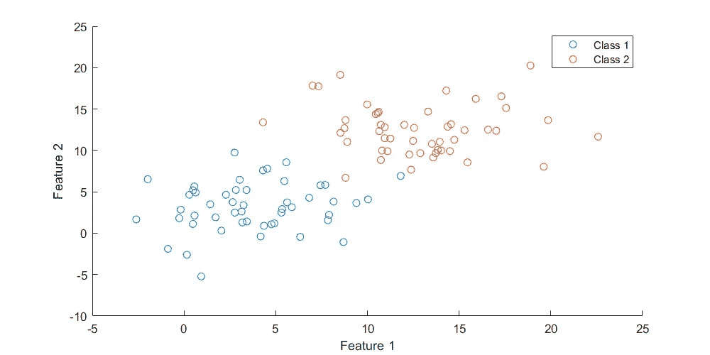
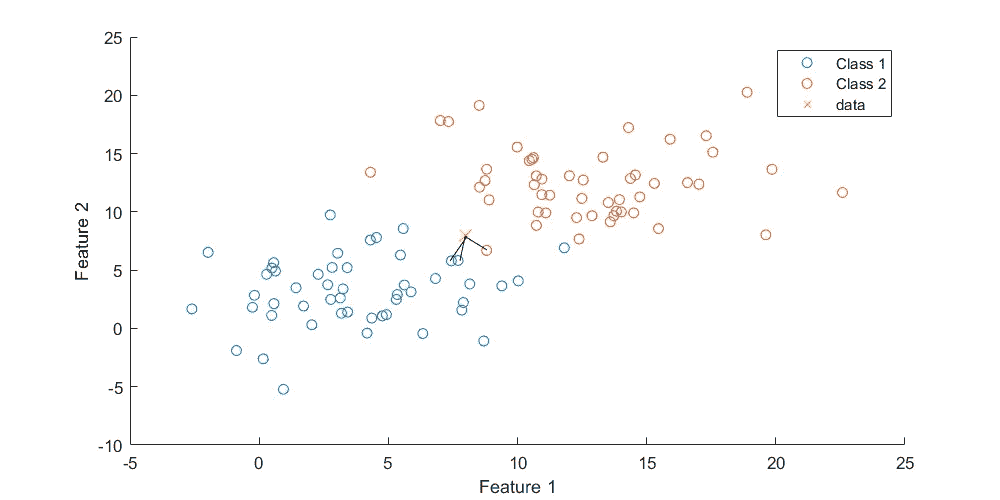
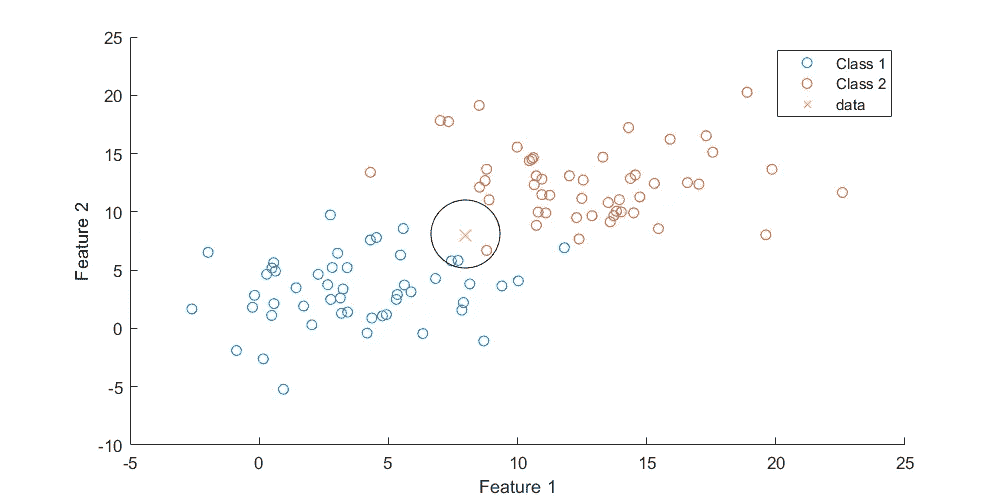
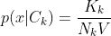
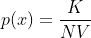
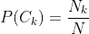
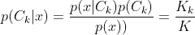

# k 近邻(KNN)解释，有例子！

> 原文：<https://medium.com/mlearning-ai/k-nearest-neighbor-knn-explained-with-examples-c32825fc9c43?source=collection_archive---------0----------------------->

你好，欢迎来到我的第一个关于灵媒的故事！

今天，我将解释 K-最近邻算法是如何工作的，以及它如何用于分类。我们将触及理论、偏差/方差权衡以及实施和一个非常简单的例子。


The strong relation of neighbourhood reveals your true identity.

## K 近邻理论(KNN)

k-最近邻是一种非参数算法，这意味着该算法不需要或假设关于分布的先验信息。这意味着 KNN 只依赖数据，更准确地说，是训练数据。下图中可以看到一个例子:



一般来说，算法非常简单。当模型遇到未标记的数据点时，它测量到 K 个最近邻居的距离，从而测量名称，然后未标记的数据点将被分类为属于 K 个最近邻居中具有最多训练实例的类。请参见下图中的插图:



这里黄色的 X 是一个未标记的数据点，K = 3。最显著的类是类 1，因此数据点被分类为类 1。

您可能已经猜到，K 是算法的超参数，它指定了未标记数据点将与之比较的邻居(训练实例)的数量。设置 K=1 会将算法减少到最近邻(NN)，从而选择最近数据点的类别作为未标记数据点的标签。

除了邻居的数量，K 控制模型的偏差/方差权衡。一般来说，你对低偏差和低方差感兴趣，但这几乎是不可能的。因此，要么选择一个具有高偏差的模型，然后拟合该模型以提供低方差，要么反之亦然。高偏差倾向于丢失数据集中的重要模式，而高方差倾向于过度拟合训练数据。

换句话说，设置 K = 1，往往会使训练集的复杂结构过拟合，数据中的噪声会产生很大影响，但设置 K 太高，会使模型无法在数据中找到相关模式。K 的最佳值可以通过在一组预定义的 K 值上进行简单的网格搜索来找到。

## 结果的概率计算

通常情况下，KNN 算法不用于概率估计，但是，有可能估计一个给定分类的密度和后验概率。

让我们假设，我们在未标记的数据点创建一个球体，并且我们扩展该球体直到它正好包含 K 个邻居(训练实例)。请参见下图:



In this case K = 3.

设 V 是球体的体积，K_k 是属于类别 K 的点的数量，N_k 是训练数据中类别 K 的点的总数，N 是训练点的总数。那么可能性可以计算为:



证据或边缘化可以计算为:



并且所有类别(在这种情况下，类别 1 和类别 2)的先验概率可以计算如下:



既然计算了先验概率、似然性和证据，我们可以通过组合上述等式来计算数据点属于某一类的后验概率:



正如我们所看到的，后验概率可以通过属于给定类别的点与先前确定的 K 值的比率来导出。分类时，通常选择后验概率最高的类作为感兴趣的类。

## 使用 Scikit-Learn 实现 KNN

使用 Python 的 Scikit-Learn 库实现 KNN 非常简单。

```
**from** **sklearn.neighbors** **import** KNeighborsClassifierX_train = ...    # Training data in format (n_instances, n_features)
y_train = ...    # Training labels (n_instances, )
k = 3
model = KNeighborsClassifier(n_neighbors=k)
model.fit(X_train, y_train)
```

[](https://scikit-learn.org/stable/modules/generated/sklearn.neighbors.KNeighborsClassifier.html) [## sk learn . neighbors . kneighborsclassifier-scikit-learn 0 . 24 . 1 文档

### 实现 k-最近邻投票的分类器。了解更多信息。参数 n_neighborsint，默认值=5…

scikit-learn.org](https://scikit-learn.org/stable/modules/generated/sklearn.neighbors.KNeighborsClassifier.html) 

这就是现在的全部内容，我会很快带着更多关于机器学习的文章回来。我希望这篇文章有助于理解作为一种算法的 KNN，并且你准备在你的 ML 管道中使用这种算法。

如有任何意见或建议，请随时与我联系。

感谢您的阅读…

## 来源:

*   模式识别和机器学习，2006，Christopher M. Bishop
*   sci kit-学习